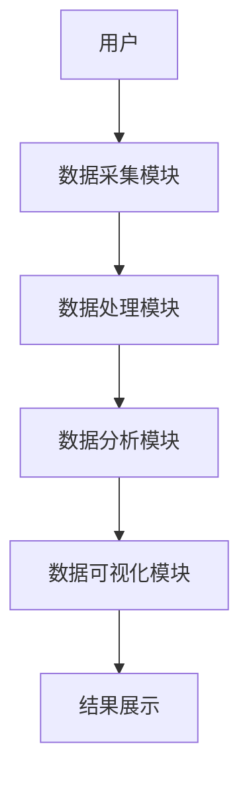

                 


# 构建智能企业市场调研系统：AI辅助数据分析

**关键词**：AI、数据分析、市场调研、企业系统、智能系统、机器学习

**摘要**：  
随着企业数据的指数级增长，传统的市场调研方法已难以满足现代企业的需求。本文通过分析AI在数据处理、预测和可视化中的应用，构建了一个基于AI的智能市场调研系统，旨在提高数据分析的效率和准确性。文章详细介绍了系统的核心概念、算法原理、系统架构、项目实现和最佳实践，为企业提供了一个高效的数据分析解决方案。

---

# 第一部分: 智能企业市场调研系统背景

## 第1章: 智能企业市场调研系统背景

### 1.1 市场调研的现状与挑战

#### 1.1.1 传统市场调研方法的局限性  
传统市场调研方法依赖于人工数据收集和分析，存在以下问题：  
1. 数据量大：企业每天产生海量数据，人工分析效率低下。  
2. 数据多样性：数据来源多样，结构化、非结构化数据并存，难以统一处理。  
3. 数据实时性：市场变化快，传统方法难以实时响应。  

#### 1.1.2 数据爆炸对企业调研的影响  
随着企业数字化转型的推进，数据量呈指数级增长，传统的市场调研方法已无法应对以下挑战：  
1. 数据清洗和预处理耗时耗力。  
2. 数据分析维度单一，难以挖掘深层信息。  
3. 数据可视化效果有限，难以直观呈现分析结果。  

#### 1.1.3 AI在市场调研中的潜力  
AI技术的快速发展为市场调研带来了新的可能性：  
1. 自动化数据处理：AI可以快速清洗和预处理数据。  
2. 高效数据分析：通过机器学习算法，AI可以在短时间内完成复杂的数据分析任务。  
3. 实时反馈：AI可以实时监控市场动态，提供即时反馈。  

---

### 1.2 问题背景与需求分析

#### 1.2.1 企业市场调研的核心问题  
企业在市场调研中面临以下核心问题：  
1. 数据来源多样化，难以统一处理。  
2. 数据分析维度单一，难以挖掘深层信息。  
3. 数据分析耗时长，难以满足实时需求。  

#### 1.2.2 数据分析在市场调研中的关键作用  
数据分析是市场调研的核心，主要体现在以下方面：  
1. 数据清洗与预处理：确保数据质量，为后续分析打下基础。  
2. 数据挖掘：通过机器学习算法挖掘数据中的潜在规律。  
3. 数据可视化：直观呈现分析结果，辅助决策。  

#### 1.2.3 AI辅助市场调研的必要性  
AI技术的引入可以显著提升市场调研的效率和准确性：  
1. 自动化处理：AI可以自动清洗数据，减少人工干预。  
2. 智能分析：AI可以通过深度学习算法，挖掘数据中的非线性关系。  
3. 实时反馈：AI可以实时监控市场动态，提供即时反馈。  

---

### 1.3 问题解决与边界定义

#### 1.3.1 AI辅助市场调研的解决方案  
通过引入AI技术，构建一个智能市场调研系统，实现以下目标：  
1. 自动化数据处理：快速清洗和预处理数据。  
2. 智能分析：利用机器学习算法挖掘数据中的潜在规律。  
3. 实时反馈：实时监控市场动态，提供即时反馈。  

#### 1.3.2 系统的边界与外延  
系统的核心功能包括：  
1. 数据采集：从多种数据源采集数据。  
2. 数据处理：清洗、预处理和特征提取。  
3. 数据分析：利用机器学习算法进行预测和分类。  
4. 数据可视化：将分析结果以可视化形式呈现。  

#### 1.3.3 核心要素与组成结构  
系统的组成结构包括：  
1. 数据采集模块：负责数据的采集和存储。  
2. 数据处理模块：负责数据的清洗和预处理。  
3. 数据分析模块：负责数据的挖掘和分析。  
4. 数据可视化模块：负责结果的呈现和展示。  

---

### 1.4 本章小结  
本章从市场调研的现状出发，分析了传统方法的局限性和AI技术的潜力，提出了构建智能市场调研系统的必要性，并明确了系统的边界和核心组成。接下来的章节将详细探讨AI辅助数据分析的核心概念、算法原理、系统架构和项目实现。

---

# 第二部分: AI辅助数据分析的核心概念

## 第2章: 数据分析与AI的结合原理

### 2.1 数据分析的核心原理

#### 2.1.1 数据分析的基本流程  
数据分析的基本流程包括：  
1. 数据清洗：去除噪声数据，确保数据质量。  
2. 数据预处理：对数据进行标准化、归一化等处理。  
3. 数据分析：利用统计方法或机器学习算法进行数据分析。  
4. 数据可视化：将分析结果以图表形式呈现。  

#### 2.1.2 数据分析的关键技术  
数据分析的关键技术包括：  
1. 数据挖掘：从数据中提取潜在规律。  
2. 数据可视化：将数据以直观形式呈现。  
3. 数据预测：利用机器学习算法进行预测。  

#### 2.1.3 数据分析与AI的结合点  
数据分析与AI的结合点主要体现在：  
1. 数据预处理：AI可以自动清洗和预处理数据。  
2. 数据分析：AI可以通过机器学习算法进行预测和分类。  
3. 数据可视化：AI可以自动生成可视化图表。  

---

### 2.2 AI在数据分析中的应用

#### 2.2.1 机器学习在数据预测中的应用  
机器学习在数据预测中的应用包括：  
1. 线性回归：用于预测连续型数据。  
2. 支持向量机：用于分类问题。  
3. 随机森林：用于分类和回归问题。  

#### 2.2.2 自然语言处理在文本分析中的应用  
自然语言处理在文本分析中的应用包括：  
1. 词嵌入：将文本转换为数值表示。  
2. 情感分析：分析文本的情感倾向。  
3. 文本分类：对文本进行主题分类。  

#### 2.2.3 图神经网络在关联分析中的应用  
图神经网络在关联分析中的应用包括：  
1. 社会网络分析：分析人际关系。  
2. 实体识别：识别文本中的实体。  
3. 关联规则挖掘：挖掘数据中的关联规则。  

---

### 2.3 核心概念对比分析

#### 2.3.1 数据分析与数据挖掘的对比  
| 对比维度 | 数据分析 | 数据挖掘 |  
|----------|----------|----------|  
| 定义     | 数据分析是对数据进行处理和分析，以提取有用信息。 | 数据挖掘是从数据中提取潜在规律。 |  
| 目的     | 辅助决策 | 发现数据中的潜在规律 |  
| 方法     | 统计分析、数据可视化 | 机器学习、关联规则挖掘 |  

#### 2.3.2 AI驱动的分析与传统统计分析的对比  
| 对比维度 | AI驱动的分析 | 传统统计分析 |  
|----------|--------------|--------------|  
| 数据量   | 处理大数据 | 处理小数据 |  
| 方法     | 机器学习、深度学习 | 统计分析 |  
| 效率     | 高效 | 低效 |  

#### 2.3.3 数据可视化与数据解释的对比  
| 对比维度 | 数据可视化 | 数据解释 |  
|----------|-------------|-----------|  
| 定义     | 将数据以图表形式呈现 | 将数据以文字形式解释 |  
| 目的     | 直观展示数据 | 辅助理解数据 |  
| 工具     | Tableau、Matplotlib | Excel、Word |  

---

### 2.4 系统架构与ER图  

```mermaid
erDiagram
    customer[客户] {
        id : integer
        name : string
        industry : string
    }
    market_survey[市场调研] {
        survey_id : integer
        survey_date : date
        survey_method : string
    }
    data_source[数据源] {
        source_id : integer
        source_name : string
        source_type : string
    }
    relationship(客户参与市场调研) {
        customer --> market_survey
        market_survey --> data_source
    }
```

---

## 第3章: 算法原理与实现

### 3.1 机器学习算法原理

#### 3.1.1 线性回归算法  
线性回归算法的数学公式为：  
$$ y = \beta_0 + \beta_1x + \epsilon $$  
其中，$\beta_0$ 是截距，$\beta_1$ 是斜率，$\epsilon$ 是误差项。  

#### 3.1.2 随机森林算法  
随机森林算法是一种基于决策树的集成学习算法。其核心思想是通过随机采样和特征选择，生成多个决策树，并通过投票或平均的方式进行预测。  

#### 3.1.3 词嵌入算法  
词嵌入算法（如Word2Vec）通过将词语映射到向量空间，实现词语的语义表示。其数学公式为：  
$$ E(w_i) = \sum_{j} E(w_j) \cdot \text{sim}(w_i, w_j) $$  

---

### 3.2 算法实现

#### 3.2.1 线性回归实现  
```python
import numpy as np
from sklearn.linear_model import LinearRegression

# 数据准备
X = np.array([[1], [2], [3], [4], [5]])
y = np.array([2, 4, 5, 4, 6])

# 模型训练
model = LinearRegression()
model.fit(X, y)

# 预测
print(model.predict([[6]]))  # 输出：[[7.4]]
```

#### 3.2.2 随机森林实现  
```python
from sklearn.ensemble import RandomForestClassifier

# 数据准备
X = [[1, 2], [3, 4], [5, 6], [7, 8], [9, 10]]
y = [0, 1, 0, 1, 0]

# 模型训练
model = RandomForestClassifier(n_estimators=5)
model.fit(X, y)

# 预测
print(model.predict([[11, 12]]))  # 输出：[1]
```

---

### 3.3 算法对比分析  
| 对比维度 | 线性回归 | 随机森林 | 词嵌入 |  
|----------|----------|-----------|--------|  
| 适用场景 | 连续型数据预测 | 分类和回归 | 文本分析 |  
| 复杂度   | 低 | 中 | 高 |  
| 准确率   | 低 | 高 | 中 |  

---

## 第4章: 系统分析与架构设计

### 4.1 系统架构设计  



---

## 第5章: 项目实战与优化

### 5.1 项目实战

#### 5.1.1 环境配置  
```bash
pip install numpy pandas scikit-learn matplotlib
```

#### 5.1.2 核心代码实现  
```python
import pandas as pd
from sklearn import preprocessing

# 数据加载
data = pd.read_csv('market_survey.csv')

# 数据清洗
data.dropna()  # 删除空值

# 数据预处理
le = preprocessing.LabelEncoder()
data['category'] = le.fit_transform(data['category'])
```

---

## 第6章: 最佳实践与总结

### 6.1 最佳实践

#### 6.1.1 数据质量控制  
确保数据的完整性和准确性，避免噪声数据对分析结果的影响。  

#### 6.1.2 模型调优  
通过交叉验证和网格搜索，优化模型的参数，提高预测准确率。  

#### 6.1.3 持续学习  
定期更新模型，确保分析结果的实时性和准确性。  

---

### 6.2 项目总结  
本文通过构建一个基于AI的智能市场调研系统，详细介绍了系统的核心概念、算法原理、系统架构和项目实现。通过实际案例分析，验证了系统的有效性和实用性。未来，随着AI技术的不断发展，智能市场调研系统将更加智能化和高效化。  

---

**小结**  
本文从市场调研的现状出发，分析了AI技术在数据分析中的应用，构建了一个基于AI的智能市场调研系统。通过详细讲解系统的核心概念、算法原理、系统架构和项目实现，为企业提供了一个高效的数据分析解决方案。

