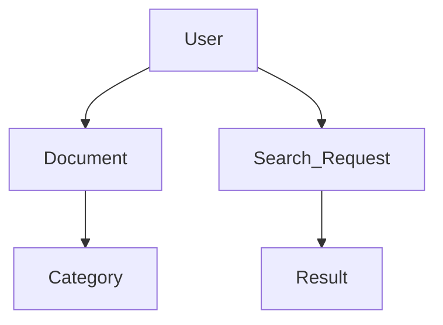
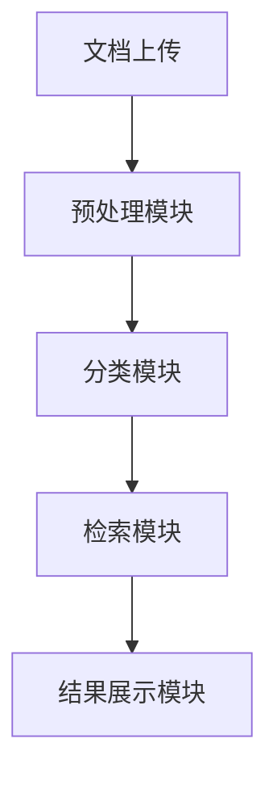
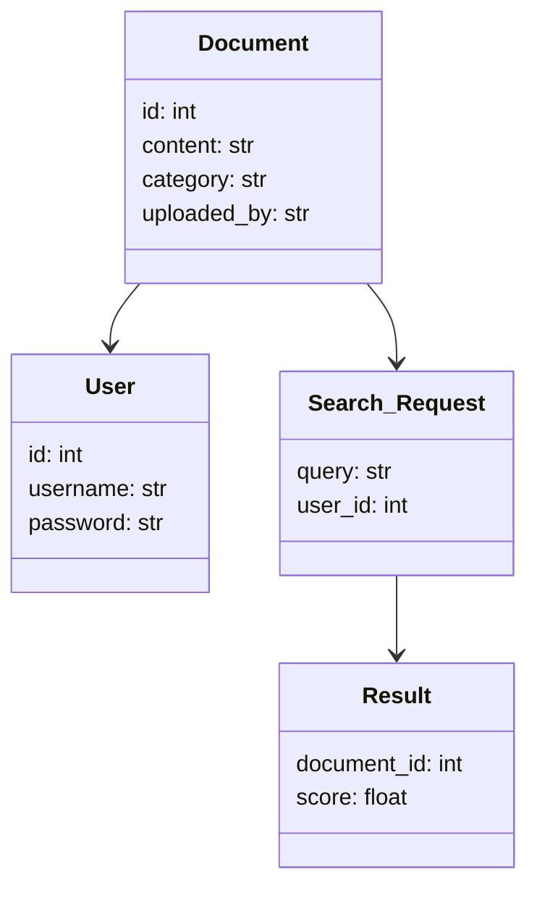
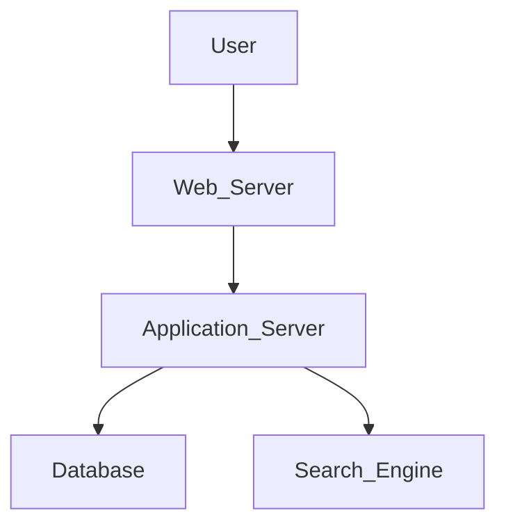
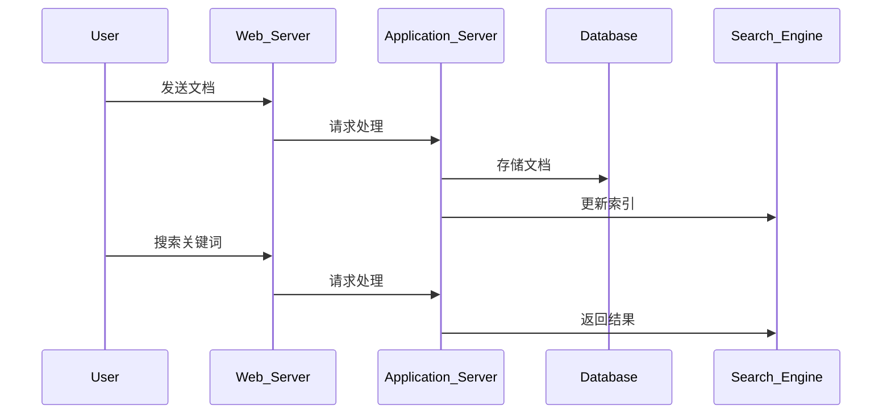

                 


# 构建智能企业文档管理系统：AI辅助分类与检索

## 关键词：企业文档管理，人工智能，文本分类，信息检索，自然语言处理

## 摘要：本文深入探讨了如何利用人工智能技术构建智能企业文档管理系统，重点介绍了文档分类与检索的算法原理、系统架构设计及项目实现过程。通过理论与实践结合，为读者提供从基础到应用的全面指导。

---

# 第一部分: 智能企业文档管理系统的背景与核心概念

## 第1章: 企业文档管理系统的背景与挑战

### 1.1 问题背景与描述

#### 1.1.1 传统文档管理系统的局限性
传统文档管理系统依赖手动分类和检索，效率低下，难以应对海量文档的管理需求。人工操作容易出错，且缺乏智能化支持，无法满足现代企业的高效需求。

#### 1.1.2 AI辅助文档管理的必要性
人工智能技术的快速发展为企业文档管理带来了新的可能性。通过自然语言处理（NLP）技术，系统能够自动理解文档内容，实现智能分类和高效检索。

#### 1.1.3 企业文档管理的核心问题
- 文档分类的准确性
- 检索速度和效率
- 处理海量文档的能力
- 系统的可扩展性和易用性

### 1.2 问题解决与边界定义

#### 1.2.1 AI在文档管理中的应用目标
- 提高文档分类的准确性和效率
- 实现快速、智能的文档检索
- 优化企业文档管理流程，降低人力成本

#### 1.2.2 系统的边界与外延
- 系统边界：仅处理企业内部文档，不涉及外部数据。
- 系统外延：支持多种文档格式（PDF、Word、Excel等）。

#### 1.2.3 核心功能与非功能性需求
- 核心功能：文档上传、分类、检索、管理。
- 非功能性需求：系统性能、安全性、用户体验。

### 1.3 核心概念与系统架构

#### 1.3.1 文档分类与检索的定义
- 文档分类：根据内容将文档归类到特定类别。
- 文档检索：基于查询条件，快速定位相关文档。

#### 1.3.2 AI辅助文档管理的实现方式
- 使用NLP技术提取文档特征。
- 应用机器学习算法进行分类和检索。

#### 1.3.3 系统的整体架构与模块划分
- 前端：用户交互界面。
- 后端：处理文档分类和检索。
- 数据库：存储文档及元数据。

## 1.4 本章小结
本章介绍了企业文档管理系统的背景和挑战，明确了AI辅助文档管理的必要性，提出了系统的边界和架构设计。

---

## 第2章: AI辅助文档管理的核心概念与联系

### 2.1 核心概念原理

#### 2.1.1 文本分类的原理与实现
- 基于特征提取（如TF-IDF）对文本进行分类。
- 使用机器学习算法（如SVM、随机森林）训练分类器。

#### 2.1.2 文档检索的原理与实现
- 基于关键词匹配（如BM25算法）进行检索。
- 使用向量空间模型（VSM）计算文档相似度。

#### 2.1.3 自然语言处理在文档管理中的应用
- 分词、实体识别、情感分析等技术提升文档理解能力。

### 2.2 核心概念对比与特征分析

#### 2.2.1 文档分类与检索的特征对比
| 特征 | 分类 | 检索 |
|------|------|------|
| 目标 | 将文档归类 | 根据查询返回结果 |
| 输入 | 文档内容 | 查询关键词 |
| 输出 | 类别标签 | 文档列表 |

#### 2.2.2 不同分类算法的优劣势分析
| 算法 | 优点 | 缺点 |
|------|------|------|
| TF-IDF | 简单高效 | 对语义理解有限 |
| SVM   | 高精度 | 数据量大时性能下降 |
| 随机森林 | 抗噪声能力强 | 对参数敏感 |

#### 2.2.3 文档检索算法的性能对比
| 算法 | 优点 | 缺点 |
|------|------|------|
| BM25 | 精准度高 | 对分词依赖 |
| VSM  | 易实现 | 对语义理解不足 |

### 2.3 系统实体关系与架构设计

#### 2.3.1 系统实体关系图（ER图）


#### 2.3.2 系统功能模块划分


## 2.4 本章小结
本章深入探讨了AI辅助文档管理的核心概念，分析了分类和检索算法的优劣势，并通过ER图和功能模块图展示了系统的架构设计。

---

## 第3章: 文档分类与检索的算法原理

### 3.1 文档分类算法

#### 3.1.1 基于TF-IDF的分类算法

##### 3.1.1.1 算法步骤
1. 文本预处理：分词、去停用词。
2. 特征提取：计算TF-IDF值。
3. 训练分类器：使用SVM或随机森林进行训练。

##### 3.1.1.2 Python代码示例
```python
from sklearn.feature_extraction.text import TfidfVectorizer
from sklearn.svm import SVC

# 文本预处理
text = "This is a sample text."

# 特征提取
vectorizer = TfidfVectorizer()
X = vectorizer.fit_transform([text])

# 训练分类器
clf = SVC()
clf.fit(X, [0])
```

### 3.2 文档检索算法

#### 3.2.1 基于BM25的检索算法

##### 3.2.1.1 算法步骤
1. 对文本进行分词处理。
2. 计算每个关键词的BM25分数。
3. 根据分数排序，返回结果。

##### 3.2.1.2 Python代码示例
```python
from rank_bm25 import BM25

# 初始化BM25模型
bm25 = BM25(n=1, b=0.75)

# 文本预处理
texts = ["This is a sample text.", "Another sample text."]

# 检索过程
query = "sample text"
scores = bm25.get_scores(query, texts)
```

### 3.3 算法原理的数学模型

#### 3.3.1 TF-IDF公式
$$ TF-IDF = \frac{tf \times idf}{(1 - (1 - smooth_{status}) \times doc_{length})} $$

#### 3.3.2 BM25公式
$$ BM25 = \frac{b \times idf \times (1 - qf + qf \times log(doc_{length}))}{log(doc_{length} + 1)} $$

## 3.4 本章小结
本章详细讲解了文档分类和检索的算法原理，通过代码示例和数学公式帮助读者理解实现过程。

---

## 第4章: 系统分析与架构设计方案

### 4.1 系统分析

#### 4.1.1 问题场景介绍
企业文档管理系统需要处理大量文档，支持快速分类和检索，确保数据安全。

#### 4.1.2 项目介绍
本项目旨在开发一个基于AI的企业文档管理系统，支持文档上传、分类、检索和管理。

### 4.2 系统功能设计

#### 4.2.1 领域模型类图


#### 4.2.2 系统架构设计


#### 4.2.3 系统接口设计
- 用户接口：RESTful API。
- 数据库接口：ORM框架。

#### 4.2.4 系统交互序列图


## 4.3 本章小结
本章通过系统分析和架构设计，明确了系统的功能模块、架构设计和接口设计。

---

## 第5章: 项目实战

### 5.1 环境搭建

#### 5.1.1 安装Python和相关库
```bash
pip install numpy scikit-learn rank-bm25
```

### 5.2 核心功能实现

#### 5.2.1 文档预处理
```python
import jieba

text = "这是一个测试文本。"
words = jieba.lcut(text)
```

#### 5.2.2 文档分类
```python
from sklearn.feature_extraction.text import TfidfVectorizer
from sklearn.svm import SVC

vectorizer = TfidfVectorizer()
X = vectorizer.fit_transform([text])
clf = SVC()
clf.fit(X, [0])
```

#### 5.2.3 文档检索
```python
from rank_bm25 import BM25

bm25 = BM25(n=1, b=0.75)
texts = ["测试文本", "测试"]
scores = bm25.get_scores("测试", texts)
```

### 5.3 案例分析与实现解读

#### 5.3.1 案例分析
- 文档预处理：分词、去停用词。
- 文档分类：使用TF-IDF和SVM算法。
- 文档检索：使用BM25算法。

#### 5.3.2 代码实现解读
- 预处理模块：使用jieba进行中文分词。
- 分类模块：TF-IDF特征提取，SVM分类。
- 检索模块：BM25算法实现。

## 5.4 本章小结
本章通过实际项目案例，详细讲解了文档预处理、分类和检索的实现过程。

---

## 第6章: 最佳实践与总结

### 6.1 最佳实践

#### 6.1.1 系统设计
- 使用分层架构，明确各层职责。
- 选择合适的算法，优化系统性能。

#### 6.1.2 项目实施
- 文档预处理：确保分词准确。
- 算法选择：根据需求选择合适的分类和检索算法。

### 6.2 总结与展望

#### 6.2.1 总结
本文详细介绍了AI辅助企业文档管理系统的构建过程，涵盖了算法原理、系统架构和项目实现。

#### 6.2.2 展望
未来可以进一步优化算法，引入深度学习技术，提升系统性能。

### 6.3 注意事项

#### 6.3.1 系统优化
- 定期更新模型，提升分类和检索精度。
- 优化数据库查询效率。

#### 6.3.2 安全性
- 加强用户权限管理，确保数据安全。

### 6.4 拓展阅读
- 《自然语言处理入门》
- 《机器学习实战》

## 6.5 本章小结
本章总结了构建智能企业文档管理系统的最佳实践，提出了未来的发展方向和注意事项。

---

# 结语

本文通过理论与实践结合的方式，详细探讨了AI辅助企业文档管理系统的构建过程。从算法原理到系统架构，再到项目实现，为读者提供了全面的指导。希望本文能为企业的文档管理提供新的思路和解决方案。

--- 

如果需要进一步扩展或调整内容，请随时告诉我！

