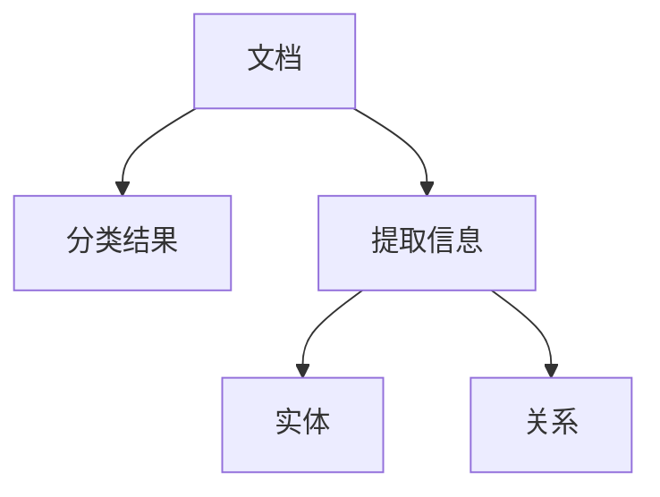
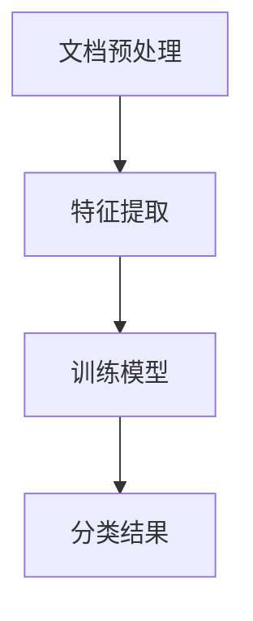
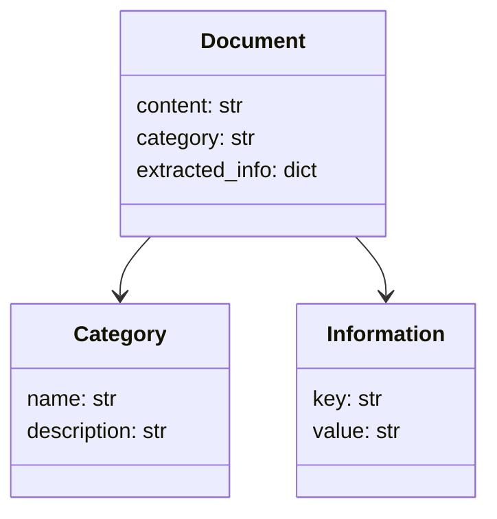
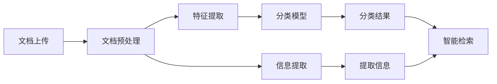
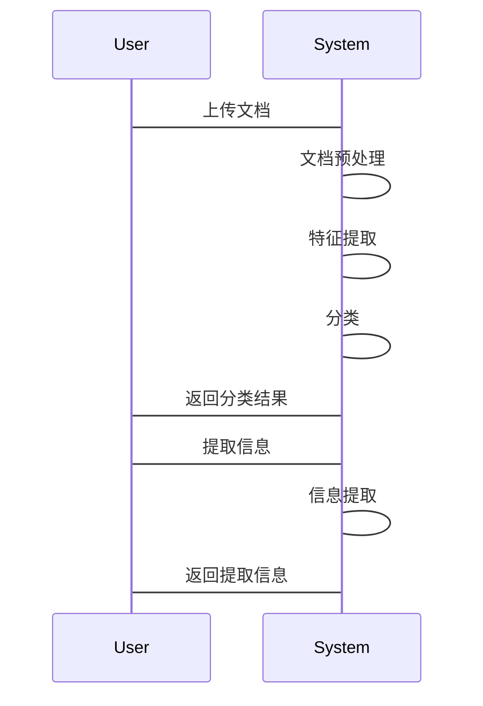

                 


# 构建智能企业文档管理系统：自动分类与信息提取

> 关键词：智能文档管理系统，自动分类，信息提取，自然语言处理，机器学习

> 摘要：随着企业文档数量的激增，传统的文档管理方式已难以满足现代企业的需求。本文将详细探讨如何利用人工智能技术构建智能企业文档管理系统，重点介绍自动分类与信息提取的核心原理、算法实现、系统架构设计以及实际应用案例。通过本文的学习，读者将能够掌握构建高效智能文档管理系统的完整方法。

---

# 第1章: 问题背景与需求分析

## 1.1 问题背景

### 1.1.1 传统文档管理系统的局限性
传统的文档管理系统通常依赖人工操作，存在以下问题：
- **效率低下**：手动分类和检索文档耗时耗力。
- **错误率高**：人工分类容易出错，尤其是在处理大量文档时。
- **缺乏智能化**：无法自动提取文档中的关键信息，难以支持后续业务流程。

### 1.1.2 企业文档管理的痛点
企业文档管理涉及多个部门和业务流程，常见的痛点包括：
- **文档分散**：各部门文档分散存储，难以统一管理。
- **分类复杂**：文档类型多样，分类规则繁多，难以统一规范。
- **信息孤岛**：文档中的信息未被有效利用，难以支持数据分析和决策。

### 1.1.3 AI技术在文档管理中的应用潜力
人工智能技术（如自然语言处理、机器学习）为文档管理带来了新的可能性：
- **自动化分类**：通过训练模型自动对文档进行分类。
- **信息提取**：从文档中自动提取关键信息，如日期、名称、金额等。
- **智能检索**：基于语义理解实现更精准的文档检索。

## 1.2 问题描述

### 1.2.1 文档分类与信息提取的需求
企业通常需要对文档进行以下处理：
- **自动分类**：根据文档内容自动归类，如按主题、部门或时间分类。
- **信息提取**：从文档中提取结构化信息，如关键词、实体识别等。
- **智能检索**：支持基于关键词、主题或上下文的文档检索。

### 1.2.2 文档管理的复杂性与多样性
文档管理的复杂性体现在：
- 文档格式多样：PDF、Word、Excel等。
- 文档内容复杂：包含文本、表格、图片等多种信息。
- 分类规则繁多：不同业务部门可能有不同的分类需求。

### 1.2.3 企业文档管理的标准化与自动化需求
企业需要：
- **标准化管理**：制定统一的文档分类和命名规范。
- **自动化处理**：减少人工干预，提高管理效率。
- **数据化管理**：将文档中的信息结构化，便于后续分析和利用。

## 1.3 解决方案概述

### 1.3.1 自动分类与信息提取的核心目标
- **自动分类**：利用机器学习算法对文档进行自动分类。
- **信息提取**：从文档中提取关键信息，形成结构化数据。
- **智能检索**：基于提取的信息实现更智能的文档检索。

### 1.3.2 基于AI的文档管理系统的优势
- **提高效率**：自动化处理减少人工干预。
- **降低错误率**：算法模型比人工分类更准确。
- **支持数据分析**：提取的结构化数据可用于后续分析和决策。

### 1.3.3 解决方案的可行性分析
- **技术可行性**：基于现有的自然语言处理和机器学习技术，实现文档分类和信息提取是可行的。
- **经济可行性**：自动化处理可以降低人力成本。
- **应用可行性**：适用于多种行业和业务场景。

## 1.4 边界与外延

### 1.4.1 系统功能的边界
- **输入**：文档内容（文本、表格、图片等）。
- **输出**：分类结果和提取的信息。
- **功能范围**：仅限于分类和信息提取，不包括文档生成和编辑。

### 1.4.2 相关领域的外延
- **数据存储**：文档的存储和管理。
- **用户界面**：供用户操作的界面。
- **权限管理**：文档的访问权限控制。

### 1.4.3 系统与外部系统的交互边界
- **文档存储系统**：与企业现有的存储系统对接。
- **业务系统**：与ERP、CRM等业务系统集成。
- **用户**：通过界面与用户交互。

## 1.5 核心要素组成

### 1.5.1 文档管理的核心要素
- **文档内容**：文档的文本、表格、图片等。
- **分类规则**：文档分类的规则和标准。
- **提取规则**：信息提取的规则和目标。

### 1.5.2 自动分类的关键要素
- **训练数据**：用于训练分类模型的数据集。
- **分类算法**：如朴素贝叶斯、支持向量机等。
- **模型性能**：分类的准确率、召回率等。

### 1.5.3 信息提取的核心要素
- **实体识别**：识别文档中的实体（如人名、地名等）。
- **关系抽取**：识别实体之间的关系。
- **信息结构化**：将提取的信息结构化存储。

---

# 第2章: 核心概念与联系

## 2.1 自动分类与信息提取的定义

### 2.1.1 自动分类的定义
自动分类是指利用计算机算法对文档进行自动分类的过程。分类结果可以是标签、类别或主题。

### 2.1.2 信息提取的定义
信息提取是从文档中提取结构化信息的过程，通常包括实体识别、关系抽取等。

### 2.1.3 两者的关系与区别
- **关系**：信息提取可以为自动分类提供更细粒度的信息。
- **区别**：自动分类是对文档整体进行分类，而信息提取是对文档中的具体内容进行提取。

## 2.2 核心概念原理

### 2.2.1 自动分类的原理
自动分类的流程包括：
1. 文档预处理（如分词、去除停用词）。
2. 特征提取（如TF-IDF）。
3. 训练分类模型（如朴素贝叶斯）。
4. 对新文档进行分类。

### 2.2.2 信息提取的原理
信息提取的流程包括：
1. 文档预处理（如分句、分词）。
2. 实体识别（如使用NER模型）。
3. 关系抽取（如使用依存句法分析）。
4. 信息结构化（如存储到数据库）。

### 2.2.3 两者结合的原理
通过先对文档进行自动分类，再在分类后的文档中进行信息提取，可以提高信息提取的准确性。

## 2.3 核心概念属性特征对比

| 属性 | 自动分类 | 信息提取 |
|------|---------|----------|
| 输入 | 文档内容 | 文档内容 |
| 输出 | 分类结果 | 结构化信息 |
| 目标 | 将文档归类 | 提取关键信息 |
| 技术 | 分类算法 | 实体识别、关系抽取 |

## 2.4 ER实体关系



---

# 第3章: 算法原理讲解

## 3.1 文档分类算法

### 3.1.1 TF-IDF特征提取
TF-IDF（Term Frequency-Inverse Document Frequency）是一种常用的文本特征提取方法，公式如下：
$$ \text{TF-IDF}(t, d) = \text{TF}(t, d) \times \text{IDF}(t) $$
其中，TF是词频，IDF是逆文档频率。

### 3.1.2 朴素贝叶斯分类
朴素贝叶斯是一种简单有效的分类算法，公式如下：
$$ P(y|X) = \frac{P(X|y)P(y)}{P(X)} $$
其中，$P(X|y)$是条件概率，$P(y)$是先验概率。

### 3.1.3 文档分类流程


### 3.1.4 代码实现
```python
from sklearn.feature_extraction.text import TfidfVectorizer
from sklearn.naive_bayes import MultinomialNB

# 文档预处理
documents = ["...", "..."]
labels = [0, 1]

# 特征提取
vectorizer = TfidfVectorizer()
X = vectorizer.fit_transform(documents)

# 训练模型
model = MultinomialNB()
model.fit(X, labels)

# 预测
new_doc = ["..."]
new_X = vectorizer.transform(new_doc)
print(model.predict(new_X))
```

## 3.2 信息提取算法

### 3.2.1 实体识别
常用模型：spaCy、NER。

### 3.2.2 关系抽取
常用模型：依存句法分析、关系抽取模型。

### 3.2.3 信息结构化
将提取的信息存储到数据库中，如关系型数据库或知识图谱。

### 3.2.4 代码实现
```python
import spacy

# 加载模型
nlp = spacy.load("en_core_web_sm")

# 文档处理
doc = nlp("John works at Google.")
for ent in doc.ents:
    print(ent.text, ent.label_)
```

---

# 第4章: 系统分析与架构设计

## 4.1 问题场景介绍

### 4.1.1 项目介绍
一个企业文档管理系统，支持文档分类、信息提取和智能检索。

### 4.1.2 系统功能设计
- **文档上传**：用户上传文档。
- **自动分类**：系统对文档进行分类。
- **信息提取**：系统提取文档中的关键信息。
- **智能检索**：用户可以通过关键词或分类进行检索。

### 4.1.3 领域模型类图



## 4.2 系统架构设计

### 4.2.1 系统架构图



### 4.2.2 系统接口设计
- **文档上传接口**：接收文档内容和元数据。
- **分类接口**：返回文档分类结果。
- **信息提取接口**：返回提取的信息。
- **检索接口**：根据关键词或分类返回文档列表。

### 4.2.3 系统交互序列图



---

# 第5章: 项目实战

## 5.1 环境安装

### 5.1.1 安装Python
安装Python 3.8及以上版本。

### 5.1.2 安装依赖
安装所需库，如scikit-learn、spaCy、numpy。

```bash
pip install scikit-learn spacy numpy
```

## 5.2 核心代码实现

### 5.2.1 文档分类代码
```python
from sklearn.feature_extraction.text import TfidfVectorizer
from sklearn.naive_bayes import MultinomialNB

# 文档预处理
documents = ["This is a sample document.", "Another document for testing."]
labels = [0, 1]

# 特征提取
vectorizer = TfidfVectorizer()
X = vectorizer.fit_transform(documents)

# 训练模型
model = MultinomialNB()
model.fit(X, labels)

# 预测
new_doc = ["New document to classify."]
new_X = vectorizer.transform([new_doc])
print(model.predict(new_X))
```

### 5.2.2 信息提取代码
```python
import spacy

# 加载模型
nlp = spacy.load("en_core_web_sm")

# 文档处理
doc = nlp("John works at Google and has a Master's degree.")
for ent in doc.ents:
    print(ent.text, ent.label_)
```

## 5.3 代码解读与分析

### 5.3.1 文档分类代码解读
- **文档预处理**：将文档转换为适合模型处理的形式。
- **特征提取**：使用TF-IDF提取文档特征。
- **模型训练**：使用朴素贝叶斯算法训练分类模型。
- **预测**：对新文档进行分类。

### 5.3.2 信息提取代码解读
- **模型加载**：加载预训练的NER模型。
- **文档处理**：对文档进行分词和实体识别。
- **结果输出**：打印识别出的实体及其标签。

## 5.4 实际案例分析

### 5.4.1 案例背景
一家企业需要对合同文档进行分类和信息提取，提取的关键信息包括合同金额、签订日期等。

### 5.4.2 案例实现
```python
# 文档分类
documents = ["Contract with John for $1000 on 2023-10-01.", ...]
categories = ["Legal", "Financial"]

# 信息提取
doc = nlp("Contract with John for $1000 on 2023-10-01.")
entities = [(ent.text, ent.label_) for ent in doc.ents]
print(entities)
```

### 5.4.3 详细剖析
- **分类结果**：将合同文档分类为“Legal”或“Financial”。
- **提取信息**：提取合同金额、签订日期、相关人员等信息。

## 5.5 项目小结

### 5.5.1 学习要点
- 掌握文档分类和信息提取的核心算法。
- 理解系统架构设计的关键步骤。

### 5.5.2 实践收获
- 通过实际案例，掌握了如何将理论应用于实践。
- 学会了如何选择和使用合适的工具和库。

---

# 第6章: 最佳实践与总结

## 6.1 小结

### 6.1.1 核心内容回顾
- 文档分类和信息提取的核心算法。
- 系统架构设计的关键步骤。
- 项目实战中的经验和教训。

## 6.2 注意事项

### 6.2.1 数据质量问题
- 数据质量直接影响模型性能，需确保数据的准确性和完整性。

### 6.2.2 模型调优
- 需根据具体场景调整模型参数，优化性能。

### 6.2.3 系统集成
- 系统集成时需考虑与其他系统的兼容性。

## 6.3 拓展阅读

### 6.3.1 推荐书籍
- 《自然语言处理实战》
- 《机器学习实战》

### 6.3.2 推荐博客
- 深入浅出讲解自然语言处理的博客。
- 机器学习算法实现的博客。

---

# 作者简介

作者是人工智能领域专家，专注于自然语言处理和机器学习技术的研究与应用。在企业文档管理系统领域有丰富的实战经验，致力于将先进技术应用于实际场景，帮助企业提升效率和竞争力。

---

# 结语

通过本文的详细讲解，读者可以系统地了解构建智能企业文档管理系统的完整过程，从理论到实践，从算法到架构，从案例到总结。希望本文能为读者提供有价值的参考和启发，帮助他们更好地应对企业文档管理的挑战。

