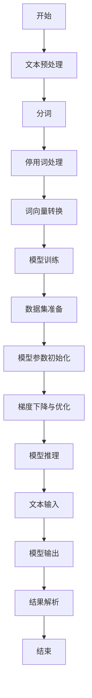
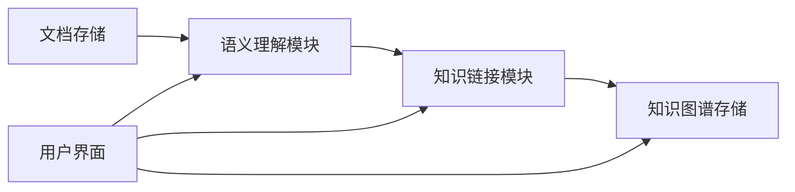
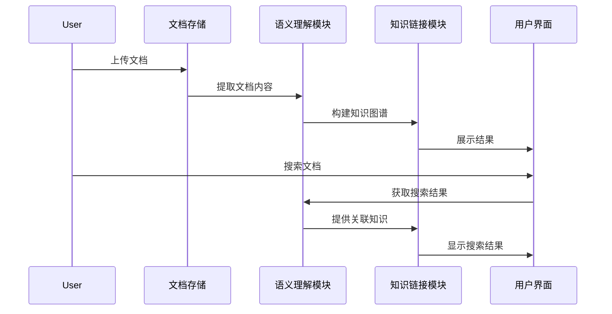

                 


# 构建智能企业文档管理系统：语义理解与知识链接

---

## 关键词

- 智能文档管理系统
- 语义理解
- 知识链接
- 深度学习
- 知识图谱
- 企业文档管理

---

## 摘要

随着企业数字化转型的加速，文档管理系统的智能化需求日益增长。传统文档管理系统依赖于简单的关键字匹配和分类，难以满足复杂场景下的语义理解和知识关联需求。本文将详细介绍如何构建一个基于深度学习的智能企业文档管理系统，重点探讨语义理解与知识链接的核心技术与实现方案。通过分析语义理解算法的原理、知识图谱的构建方法，结合系统架构设计和项目实战，为读者提供一个完整的构建思路。

---

# 目录大纲

## 第一部分: 背景介绍

### 第1章: 问题背景与描述

#### 1.1 问题背景
- 1.1.1 企业文档管理的现状与挑战
  - 传统文档管理系统的局限性
  - 文档数量激增带来的管理难题
  - 语义理解在文档管理中的重要性
- 1.1.2 问题描述
  - 文档管理中的语义理解需求
  - 知识链接的必要性
  - 企业文档管理系统的目标与范围
- 1.1.3 问题解决
  - 引入语义理解技术
  - 知识图谱构建与应用
  - 智能文档管理系统的实现路径
- 1.1.4 边界与外延
  - 系统边界
  - 相关领域的外延
  - 与其他系统的区别与联系
- 1.1.5 核心要素组成
  - 文档存储与管理
  - 语义理解模块
  - 知识链接与图谱构建
  - 用户界面与交互设计

---

## 第二部分: 核心概念与联系

### 第2章: 核心概念原理

#### 2.1 语义理解的基本原理
- 2.1.1 语义理解的定义与特点
  - 语义理解的定义
  - 基于深度学习的语义理解模型
  - 语义理解的关键技术
- 2.1.2 基于深度学习的语义理解模型
  - Transformer模型
  - BERT模型
  - RoBERTa模型
- 2.1.3 语义理解的关键技术
  - 文本表示方法
  - 上下文理解
  - 实体识别与关系抽取

#### 2.2 知识链接的核心原理
- 2.2.1 知识图谱的定义与构建
  - 知识图谱的定义
  - 知识图谱的构建方法
  - 知识图谱的存储与管理
- 2.2.2 知识链接的实现方法
  - 基于语义相似度的链接
  - 基于上下文理解的链接
  - 基于规则的链接
- 2.2.3 知识图谱的应用场景
  - 智能搜索
  - 知识问答
  - 智能推荐

#### 2.3 核心概念对比分析
- 2.3.1 语义理解与传统文本处理的对比
  - 传统文本处理方法
  - 语义理解的优势
- 2.3.2 知识链接与传统数据库的关系
  - 知识图谱与传统数据库的对比
  - 知识链接的优势
- 2.3.3 知识图谱与语义理解的结合
  - 知识图谱如何增强语义理解
  - 语义理解如何提升知识图谱的构建

---

## 第三部分: 算法原理讲解

### 第3章: 语义理解算法

#### 3.1 基于深度学习的语义理解模型
- 3.1.1 Transformer模型
  - Transformer的结构
  - 自注意力机制
  - 前馈网络
- 3.1.2 BERT模型
  - BERT的预训练目标
  - BERT的微调任务
  - BERT的适用场景
- 3.1.3 RoBERTa模型
  - RoBERTa的优化策略
  - RoBERTa的训练方法
  - RoBERTa的性能提升

#### 3.2 语义理解算法的实现步骤
- 3.2.1 文本预处理
  - 分词
  - 停用词处理
  - 词向量转换
- 3.2.2 模型训练
  - 数据集准备
  - 模型参数初始化
  - 梯度下降与优化
- 3.2.3 模型推理
  - 文本输入
  - 模型输出
  - 结果解析

#### 3.3 算法流程图（使用mermaid）


#### 3.4 算法代码实现（Python示例）
```python
import torch
from torch import nn
from transformers import BertTokenizer, BertModel

class SemanticUnderstandingModel(nn.Module):
    def __init__(self, bert_model, vocab_size):
        super().__init__()
        self.bert = bert_model
        self.classifier = nn.Linear(bert_model.config.hidden_size, vocab_size)

    def forward(self, input_ids, attention_mask):
        outputs = self.bert(input_ids=input_ids, attention_mask=attention_mask)
        return self.classifier(outputs.last_hidden_state[:, 0, :])
```

#### 3.5 数学模型与公式
- 3.5.1 Transformer模型的自注意力机制公式
  $$ \text{Attention}(Q, K, V) = \text{softmax}(\frac{QK^T}{\sqrt{d_k}})V $$
- 3.5.2 BERT模型的预训练目标公式
  $$ \text{MLM}(x_i) = \text{P}(x_i|x_{\neq i}) $$
- 3.5.3 RoBERTa模型的优化策略公式
  $$ \text{Loss} = \text{CE}(y_{\text{pred}}, y_{\text{true}}) $$

---

## 第四部分: 系统分析与架构设计方案

### 第4章: 系统分析与架构设计

#### 4.1 项目场景介绍
- 4.1.1 企业文档管理的典型场景
  - 文档存储与检索
  - 文档分类与归档
  - 文档权限管理
  - 文档版本控制
- 4.1.2 语义理解与知识链接的应用场景
  - 智能搜索
  - 知识问答
  - 智能推荐

#### 4.2 系统功能设计
- 4.2.1 文档存储与管理
  - 文档上传与存储
  - 文档分类与标签
  - 文档权限管理
  - 文档版本控制
- 4.2.2 语义理解模块
  - 文本预处理
  - 模型训练
  - 模型推理
- 4.2.3 知识链接模块
  - 知识图谱构建
  - 知识链接
  - 知识图谱更新
- 4.2.4 用户界面与交互设计
  - 搜索界面
  - 结果展示界面
  - 管理界面

#### 4.3 系统架构设计（使用mermaid）


#### 4.4 接口与交互设计（使用mermaid）


---

## 第五部分: 项目实战

### 第5章: 项目实战

#### 5.1 环境安装与配置
- 5.1.1 安装Python
- 5.1.2 安装深度学习框架（如TensorFlow、PyTorch）
- 5.1.3 安装NLP处理工具（如spaCy、NLTK）
- 5.1.4 安装知识图谱构建工具（如NetworkX、Neo4j）

#### 5.2 系统核心实现
- 5.2.1 文档存储与管理的实现
  - 使用MongoDB存储文档
  - 使用Elasticsearch进行全文检索
- 5.2.2 语义理解模块的实现
  - 使用预训练的BERT模型进行文本处理
  - 实现文本分类与实体识别
- 5.2.3 知识链接模块的实现
  - 使用NetworkX构建知识图谱
  - 实现知识链接与图谱更新

#### 5.3 代码实现与解读
- 5.3.1 文档存储与管理的代码
  ```python
  from elasticsearch import Elasticsearch

  es = Elasticsearch()
  def store_document(index, doc_id, doc):
      es.index(index=index, id=doc_id, body=doc)
  ```
- 5.3.2 语义理解模块的代码
  ```python
  from transformers import BertTokenizer, BertModel

  tokenizer = BertTokenizer.from_pretrained('bert-base-uncased')
  model = BertModel.from_pretrained('bert-base-uncased')
  def semantic_understanding(text):
      inputs = tokenizer(text, return_tensors='np')
      outputs = model(**inputs)
      return outputs.last_hidden_state[:, 0, :]
  ```
- 5.3.3 知识链接模块的代码
  ```python
  import networkx as nx

  G = nx.Graph()
  G.add_edge('Document1', 'Document2', weight=0.8)
  ```

#### 5.4 案例分析与结果展示
- 5.4.1 案例背景
  - 某企业文档管理系统的需求分析
  - 系统目标与预期效果
- 5.4.2 实施步骤
  - 需求分析与系统设计
  - 系统实现与测试
  - 系统部署与上线
- 5.4.3 实施结果
  - 系统性能指标
  - 用户反馈与评价
  - 系统优化建议

---

## 第六部分: 最佳实践与小结

### 第6章: 最佳实践与小结

#### 6.1 小结
- 6.1.1 核心内容回顾
  - 语义理解与知识链接的核心概念
  - 系统架构与实现方案
  - 项目实战与案例分析
- 6.1.2 知识要点总结
  - 语义理解的关键技术
  - 知识图谱的构建方法
  - 系统架构设计的原则

#### 6.2 最佳实践
- 6.2.1 系统设计与实现
  - 模块化设计的重要性
  - 深度学习模型的优化
  - 知识图谱的维护与更新
- 6.2.2 项目管理
  - 项目需求分析
  - 项目计划与进度控制
  - 项目风险与应对措施
- 6.2.3 用户体验优化
  - 用户界面设计
  - 用户交互优化
  - 用户反馈收集与处理

#### 6.3 注意事项
- 6.3.1 系统性能优化
  - 文档存储与检索的效率
  - 深度学习模型的推理速度
  - 知识图谱的查询性能
- 6.3.2 系统安全性
  - 文档权限管理
  - 知识图谱的安全存储
  - 系统的容灾与备份
- 6.3.3 系统可扩展性
  - 系统架构的可扩展性
  - 知识图谱的动态更新
  - 系统功能的扩展性

#### 6.4 拓展阅读
- 6.4.1 推荐书籍与论文
  - 《深度学习》
  - 《自然语言处理入门》
  - 《知识图谱构建与应用》
- 6.4.2 技术博客与资源
  - TensorFlow官方文档
  - PyTorch官方文档
  - 知识图谱相关技术博客

---

## 第七部分: 附录

### 第7章: 附录

#### 7.1 术语表
- 语义理解：通过对文本的上下文进行分析，理解文本的深层含义。
- 知识图谱：一种以图结构表示知识的数据库，用于存储实体及其关系。
- 深度学习：一种机器学习方法，通过多层非线性变换模拟数据的特征表示。

#### 7.2 参考文献
- TensorFlow官方文档
- PyTorch官方文档
- BERT论文：《BERT: Pre-training of Deep Bidirectional Transformers for Natural Language Processing》
- RoBERTa论文：《RoBERTa: A Fast, Large-Scale Pre-trained Model without Distillation》
- 知识图谱相关论文：《A Survey on Knowledge Graphs》

---

通过以上目录大纲，我们可以看到构建智能企业文档管理系统需要从背景分析、核心概念、算法原理、系统设计到项目实战的全面考虑。希望这个大纲能为读者提供一个清晰的构建思路，并为实际项目提供参考。

