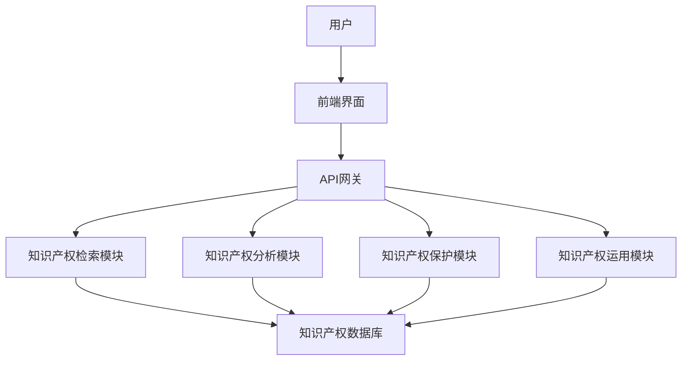
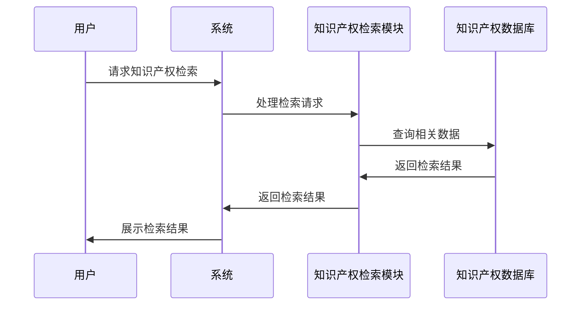

                 


# 构建智能企业知识产权运营平台：AI辅助决策

> **关键词**：人工智能、知识产权、知识图谱、机器学习、自然语言处理、决策支持系统

> **摘要**：本文深入探讨了构建智能企业知识产权运营平台的技术与方法，重点分析了AI在知识产权管理中的应用，包括知识图谱构建、自然语言处理、机器学习算法及其在知识产权检索、分析与保护中的具体应用。通过系统架构设计、项目实战和最佳实践，展示了如何利用AI技术提升企业知识产权管理的效率与决策能力。

---

## 第一部分: 背景介绍与核心概念

## 第1章: 智能企业知识产权运营平台概述

### 1.1 什么是智能企业知识产权运营平台

#### 1.1.1 知识产权的基本概念
知识产权（Intellectual Property，简称IP）是指依法保护的创造性成果，包括专利权、商标权、著作权、外观设计权等。知识产权的核心价值在于其法律保护下的独占性、收益性和排他性。

#### 1.1.2 智能企业知识产权运营平台的定义
智能企业知识产权运营平台（AI-Driven IP Management Platform）是一种基于人工智能技术的企业级平台，旨在通过自动化、智能化的方式管理和优化企业的知识产权资产，包括知识产权的生成、检索、分析、保护和运用。

#### 1.1.3 平台的核心目标与价值
- **核心目标**：提升企业知识产权管理效率，降低管理成本，优化知识产权布局，最大化知识产权价值。
- **价值**：
  - 提供实时、精准的知识产权分析与监控。
  - 支持数据驱动的决策，优化知识产权战略。
  - 实现跨领域的知识整合与协同。

### 1.2 AI辅助决策在知识产权管理中的作用

#### 1.2.1 人工智能与知识产权管理的结合点
- **知识产权检索**：利用自然语言处理（NLP）技术快速定位相关专利、文献。
- **知识产权分析**：通过机器学习算法预测知识产权风险、评估知识产权价值。
- **知识产权保护**：利用AI监控侵权行为，自动生成维权建议。

#### 1.2.2 AI在知识产权检索、分析与保护中的应用
- **知识产权检索**：基于NLP技术，实现多语言、多领域的专利检索与对比。
- **知识产权分析**：利用知识图谱技术，构建知识产权关联网络，发现潜在的技术趋势。
- **知识产权保护**：通过实时监控和AI预警，降低知识产权侵权风险。

#### 1.2.3 数据驱动的知识产权决策优势
- **数据整合**：将分散的知识产权数据整合到统一平台，便于分析。
- **深度分析**：利用大数据技术进行跨领域的知识产权分析，发现潜在机会与风险。
- **实时监控**：通过实时数据流，监控知识产权动态，提供及时的决策支持。

---

## 第2章: 企业知识产权管理的现状与挑战

### 2.1 传统知识产权管理方式的局限性

#### 2.1.1 人工处理的低效性
- 传统知识产权管理依赖人工操作，效率低下，特别是在专利检索、分析和监控方面。
- 数据分散在不同的系统中，难以实现统一管理。

#### 2.1.2 数据分散与信息孤岛问题
- 企业的知识产权数据分布在不同的部门或系统中，缺乏统一的数据平台。
- 数据孤岛导致信息无法共享，影响知识产权管理的效率。

#### 2.1.3 知识产权风险的难以预测性
- 传统管理方式难以预测知识产权风险，特别是在全球化背景下，跨法域的知识产权风险更加复杂。

### 2.2 企业知识产权管理中的主要挑战

#### 2.2.1 数据收集与整合的困难
- 知识产权数据来源多样，包括专利数据库、商标数据库、版权数据库等，数据格式和结构差异大，整合难度大。
- 数据清洗和预处理工作量大，需要投入大量资源。

#### 2.2.2 知识产权分析的深度不足
- 传统分析方法基于简单的统计分析，难以发现深层次的技术趋势和竞争态势。
- 缺乏智能化的分析工具，无法支持复杂的决策需求。

#### 2.2.3 全球化背景下的跨法域问题
- 不同国家和地区的知识产权法律体系差异大，跨法域的知识产权管理复杂。
- 全球专利布局需要考虑不同地区的法律差异，增加了管理难度。

### 2.3 AI技术如何解决这些挑战

#### 2.3.1 自然语言处理在专利检索中的应用
- 基于NLP技术，实现多语言、多领域的专利检索与对比。
- 支持语义理解，提高专利检索的准确性和效率。

#### 2.3.2 机器学习在知识产权风险预测中的作用
- 利用机器学习算法，分析历史数据，预测知识产权风险。
- 基于知识图谱技术，发现潜在的技术冲突和法律风险。

#### 2.3.3 数据挖掘在知识产权布局优化中的价值
- 通过数据挖掘技术，分析专利布局的合理性，优化专利申请策略。
- 基于历史数据，预测技术趋势，制定前瞻性的知识产权战略。

---

## 第3章: 知识产权管理中的关键概念与属性

### 3.1 知识产权的核心要素

#### 3.1.1 知识产权的生命周期
- **申请阶段**：专利申请、商标注册、版权登记。
- **维护阶段**：专利年费缴纳、商标续展、版权保护。
- **运用阶段**：技术授权、知识产权质押融资。

#### 3.1.2 知识产权的法律保护
- **专利权**：技术方案的法律保护。
- **商标权**：企业标识的法律保护。
- **版权**：作品的法律保护。

#### 3.1.3 知识产权的商业应用
- **技术授权**：通过授权他人使用技术获得收益。
- **知识产权质押**：利用知识产权作为质押物获得融资。
- **知识产权交易**：买卖知识产权资产。

### 3.2 AI辅助决策的关键技术

#### 3.2.1 自然语言处理（NLP）在知识产权文本分析中的应用
- **文本抽取**：从专利文献中提取技术关键词、发明人、申请日期等信息。
- **文本匹配**：基于NLP技术，实现专利文献的相似度计算，支持精准检索。
- **语义理解**：基于NLP技术，理解专利文献的技术内容，支持智能分类。

#### 3.2.2 机器学习在知识产权风险预测中的应用
- **分类算法**：用于识别潜在的技术冲突和法律风险。
- **聚类算法**：用于发现技术领域的竞争态势。
- **时间序列分析**：用于预测知识产权的生命周期和价值变化。

#### 3.2.3 数据挖掘在知识产权布局优化中的作用
- **关联规则挖掘**：发现不同技术领域的关联性，优化专利布局。
- **异常检测**：识别潜在的知识产权风险，如侵权风险。
- **预测建模**：基于历史数据，预测未来的技术发展趋势。

---

## 第4章: 知识产权管理系统的实体关系与架构

### 4.1 实体关系分析

#### 4.1.1 用户与知识产权的关系
- **用户类型**：企业用户、研发人员、法务人员。
- **用户需求**：知识产权检索、分析、保护、运用。

#### 4.1.2 知识产权与数据源的关系
- **数据来源**：专利数据库、商标数据库、版权数据库。
- **数据类型**：文本数据、结构化数据、非结构化数据。

#### 4.1.3 知识产权与系统功能的关系
- **功能模块**：知识产权检索、知识产权分析、知识产权保护、知识产权运用。

### 4.2 知识产权管理系统的实体关系图

```mermaid
erDiagram
    actor 用户
    actor 系统
    actor 数据源
    actor 第三方服务
    database 知识产权数据库
    database 用户数据库
    component 知识产权检索模块
    component 知识产权分析模块
    component 知识产权保护模块
    component 知识产权运用模块
    用户 --> 知识产权检索模块
    用户 --> 知识产权分析模块
    用户 --> 知识产权保护模块
    用户 --> 知识产权运用模块
    知识产权检索模块 --> 知识产权数据库
    知识产权分析模块 --> 知识产权数据库
    知识产权保护模块 --> 知识产权数据库
    知识产权运用模块 --> 知识产权数据库
    知识产权数据库 --> 数据源
    用户 --> 用户数据库
    用户数据库 --> 系统
    第三方服务 --> 系统
```

---

## 第5章: 知识产权管理系统的核心算法与实现

### 5.1 知识产权检索中的文本匹配算法

#### 5.1.1 基于余弦相似度的文本匹配
- **算法原理**：计算两段文本的余弦相似度，相似度越高，匹配程度越高。
- **公式**：$$\text{余弦相似度} = \frac{\vec{A} \cdot \vec{B}}{|\vec{A}| |\vec{B}|}$$

#### 5.1.2 基于BM25的文本检索算法
- **BM25公式**：$$\text{BM25} = \frac{\text{log}(df \cdot (k + 1) + k)}{df + k}$$
- **实现代码**：
```python
import math

def bm25_score(query, doc, k=1.5, b=0.75):
    # 预处理：分词、去停用词
    # 假设已经完成了分词和去停用词
    # 计算df（文档中出现的次数）
    df = doc.count(query)
    # 计算平均文档长度
    avg_length = 100  # 假设平均文档长度为100
    # 计算BM25分数
    score = math.log(df * (k + 1) + k) / (df + k)
    return score
```

### 5.2 知识产权分析中的聚类算法

#### 5.2.1 基于K-means的聚类算法
- **算法原理**：将专利数据分成K个簇，使得簇内距离最小。
- **实现代码**：
```python
from sklearn.cluster import KMeans

# 假设已经完成了特征提取和数据预处理
# 特征矩阵X
X = [...]  # 形状：(n_samples, n_features)
# 初始化K-means模型
kmeans = KMeans(n_clusters=5, random_state=42)
# 拟合模型
kmeans.fit(X)
# 获取聚类结果
clusters = kmeans.labels_
```

#### 5.2.2 基于层次聚类的知识产权分析
- **算法原理**：通过构建层次化的树状结构，发现专利之间的关联性。
- **实现代码**：
```python
from sklearn.cluster import AgglomerativeClustering

# 初始化层次聚类模型
ac = AgglomerativeClustering(n_clusters=3, affinity='cosine', linkage='complete')
# 拟合模型
ac.fit(X)
# 获取聚类结果
clusters = ac.labels_
```

---

## 第6章: 系统分析与架构设计方案

### 6.1 问题场景介绍

#### 6.1.1 知识产权检索与分析的需求
- 企业需要快速检索相关专利，分析技术趋势。
- 研发人员需要了解竞争对手的技术布局。

#### 6.1.2 知识产权保护与运用的需求
- 企业需要实时监控知识产权侵权风险。
- 法务人员需要快速获取法律依据。

### 6.2 系统功能设计

#### 6.2.1 功能模块划分
- **知识产权检索模块**：支持多语言、多领域的专利检索。
- **知识产权分析模块**：提供技术趋势分析、竞争态势分析。
- **知识产权保护模块**：实现侵权监控、风险预警。
- **知识产权运用模块**：支持技术授权、知识产权交易。

#### 6.2.2 功能模块的交互流程
- **用户登录**：用户登录系统，选择所需功能模块。
- **数据输入**：用户输入检索关键词或上传数据。
- **数据处理**：系统对输入数据进行处理，生成分析结果。
- **结果展示**：系统将分析结果以可视化形式展示给用户。

### 6.3 系统架构设计

#### 6.3.1 系统架构图


#### 6.3.2 系统接口设计
- **API接口**：
  - `/api/search`：知识产权检索接口。
  - `/api/analyze`：知识产权分析接口。
  - `/api/protect`：知识产权保护接口。
  - `/api/apply`：知识产权运用接口。

### 6.4 系统交互流程图



---

## 第7章: 项目实战

### 7.1 环境安装与配置

#### 7.1.1 安装Python环境
- 安装Python 3.8以上版本。
- 安装Jupyter Notebook或其他开发工具。

#### 7.1.2 安装必要的Python库
```bash
pip install numpy
pip install pandas
pip install scikit-learn
pip install jieba
pip install spacy
```

### 7.2 系统核心实现

#### 7.2.1 知识产权检索模块的实现

```python
import jieba

def text_segmentation(text):
    # 使用jieba进行分词
    words = jieba.lcut(text)
    return words
```

#### 7.2.2 知识产权分析模块的实现

```python
from sklearn.feature_extraction.text import TfidfVectorizer

def text_vectorization(texts):
    vectorizer = TfidfVectorizer()
    X = vectorizer.fit_transform(texts)
    return X
```

#### 7.2.3 知识产权保护模块的实现

```python
import requests

def check_infringement(patent_id):
    # 调用第三方API进行侵权检查
    url = f"https://api.example.com/infringement/{patent_id}"
    response = requests.get(url)
    return response.json()
```

### 7.3 实际案例分析与详细解读

#### 7.3.1 案例背景
某科技公司希望优化其专利布局，降低侵权风险。

#### 7.3.2 数据收集
- 收集公司过去5年的专利申请数据。
- 收集竞争对手的专利数据。

#### 7.3.3 数据分析
- 使用NLP技术进行专利文本分析。
- 使用聚类算法发现技术趋势。

#### 7.3.4 结果展示
- 生成技术趋势报告。
- 提供侵权风险预警。

---

## 第8章: 最佳实践与小结

### 8.1 最佳实践

#### 8.1.1 数据质量管理
- 确保数据的准确性和完整性。
- 定期更新和维护数据。

#### 8.1.2 模型优化
- 定期重新训练模型，提高预测精度。
- 引入新的算法和技术，优化系统性能。

### 8.2 小结
通过构建智能企业知识产权运营平台，企业可以实现知识产权管理的智能化和高效化。AI技术的应用不仅提高了知识产权管理的效率，还为企业提供了数据驱动的决策支持。

### 8.3 注意事项

- 数据隐私和安全问题需要高度重视。
- 系统的可扩展性和可维护性需要在设计阶段充分考虑。
- 模型的可解释性需要在实际应用中不断优化。

### 8.4 拓展阅读
- 《人工智能与知识产权》
- 《机器学习在知识产权管理中的应用》
- 《自然语言处理与知识图谱构建》

---

通过本文的详细讲解，读者可以全面了解构建智能企业知识产权运营平台的技术与方法，并能够实际操作，将AI技术应用到企业的知识产权管理中，提升企业的核心竞争力。

