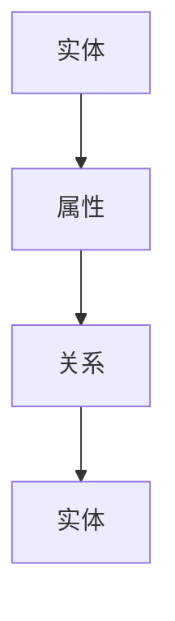
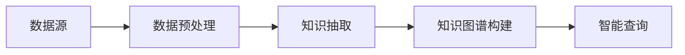
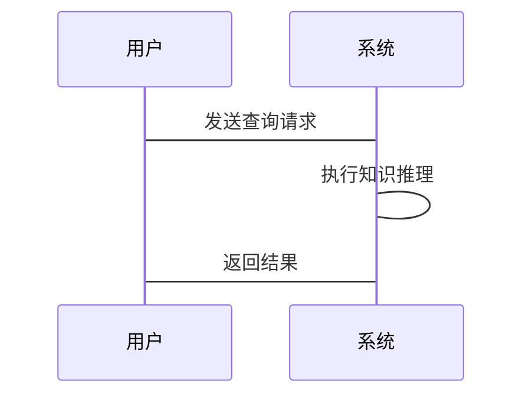

                 


# 构建智能企业知识图谱：深化领域理解与应用

> 关键词：知识图谱、企业应用、领域理解、智能构建、技术实现  
> 摘要：知识图谱作为一种强大的数据组织和关联技术，在企业信息化和智能化转型中发挥着越来越重要的作用。本文从知识图谱的核心概念出发，详细探讨了企业知识图谱的构建方法、关键算法原理、系统架构设计以及实际应用场景，旨在帮助企业更好地理解和应用知识图谱技术，实现数据驱动的智能决策。

---

## 第一部分：知识图谱构建与企业应用背景

### 第1章：知识图谱的基本概念与企业构建背景

#### 1.1 知识图谱的核心概念
知识图谱是一种以图结构形式表示知识的技术，通过实体、关系和属性的关联，构建语义丰富的知识网络。它不同于传统的数据库，能够更好地处理复杂的数据关系和语义信息。

#### 1.2 企业构建知识图谱的背景
在企业信息化和数字化转型的背景下，数据孤岛和信息碎片化问题日益突出。知识图谱通过统一和整合企业内外部数据，为企业提供了更高效的数据管理和智能应用能力。

#### 1.3 知识图谱的技术基础
知识图谱依赖于图论、语义网络和本体论等技术基础，结合自然语言处理（NLP）和数据挖掘，能够从非结构化数据中提取知识并建立关联。

---

### 第2章：知识图谱的核心概念与联系

#### 2.1 知识图谱的核心概念原理
知识图谱由实体、关系和属性三部分构成。实体是现实世界中的具体对象，关系描述实体之间的关联，属性则用于进一步描述实体的特征。

#### 2.2 核心概念的属性特征对比
| 概念 | 属性 | 特征 |
|------|------|------|
| 实体 | 类型 | 人、组织、产品等 |
| 关系 | 方向 | 单向、双向、对称 |
| 属性 | 类型 | 字符串、数值、时间等 |

#### 2.3 ER实体关系图架构


---

### 第3章：知识图谱的构建算法原理

#### 3.1 表示学习算法
表示学习是知识图谱构建的重要技术，通过将实体和关系映射到低维向量空间，便于后续的推理和计算。

##### 3.1.1 Word2Vec算法
Word2Vec通过将词语映射为向量，捕捉词语之间的语义关系。在知识图谱中，可以用于实体嵌入的计算。
$$\text{Word2Vec}(w_i) = \text{sum}(w_j \text{ for } j \text{ in context}(w_i))$$

##### 3.1.2 知识图谱中的应用
通过Word2Vec，可以将实体和关系映射为向量，构建知识图谱的向量表示，用于后续的相似性计算和推理。

#### 3.2 知识抽取算法
知识抽取是从文本中提取实体、关系和属性的技术，常用基于规则和深度学习的方法。

##### 3.2.1 基于规则的实体识别
通过预定义的规则和模式匹配，从文本中提取实体。
$$\text{实体识别规则} = \text{正则表达式匹配}$$

##### 3.2.2 基于深度学习的实体识别
使用CRF或LSTM等模型，从文本中提取实体及其关系。
$$\text{CRF}(x) = \text{argmax}_y \sum_{i=1}^n \lambda_i y_i$$

---

## 第4章：系统分析与架构设计

### 4.1 项目背景与目标
本项目旨在构建一个企业知识图谱，整合企业内外部数据，支持智能查询和决策。

### 4.2 系统功能设计
系统功能包括数据采集、知识抽取、图谱构建和智能查询模块。

### 4.3 系统架构设计


### 4.4 系统接口设计
系统提供RESTful API接口，支持数据输入和查询请求。

### 4.5 系统交互设计


---

## 第5章：项目实战

### 5.1 环境安装
安装必要的依赖：
```bash
pip install numpy pandas networkx
```

### 5.2 核心代码实现
知识抽取和图谱构建的示例代码：
```python
import networkx as nx

def build_knowledge_graph(data):
    G = nx.Graph()
    for entity in data['entities']:
        G.add_node(entity)
    for relation in data['relations']:
        G.add_edge(relation['head'], relation['tail'])
    return G
```

### 5.3 案例分析
以企业产品关系为例，构建知识图谱并进行推理。

### 5.4 项目总结
通过本项目，我们掌握了知识图谱的构建方法，并验证了其在企业中的实际应用价值。

---

## 第6章：最佳实践与扩展阅读

### 6.1 小结
知识图谱在企业中的应用前景广阔，能够显著提升数据管理和决策效率。

### 6.2 注意事项
- 数据质量和完整性直接影响图谱的准确性。
- 知识抽取和推理算法需要不断优化。

### 6.3 拓展阅读
推荐阅读《知识图谱实战》和《图神经网络入门》等书籍。

---

通过以上步骤，我们系统地介绍了知识图谱的构建方法和应用场景，帮助企业更好地理解和应用这一技术。

