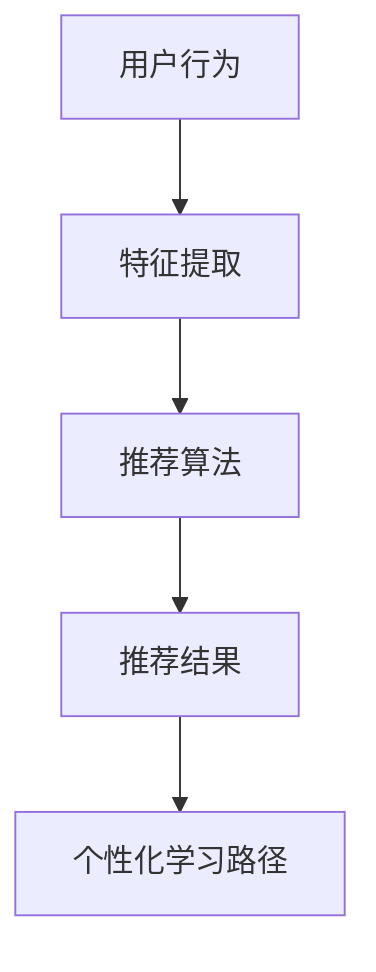
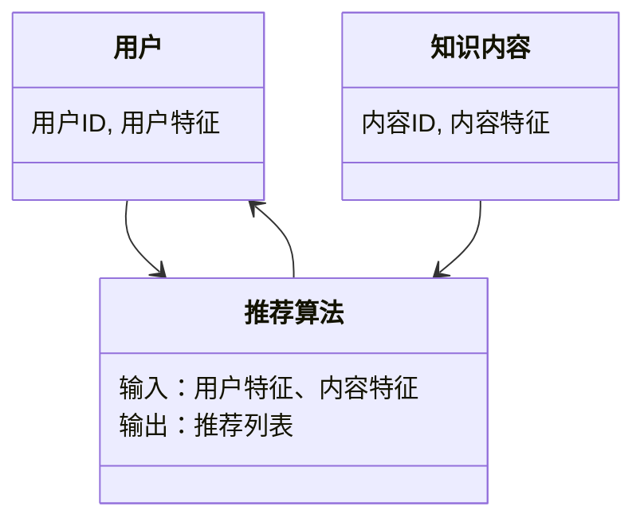
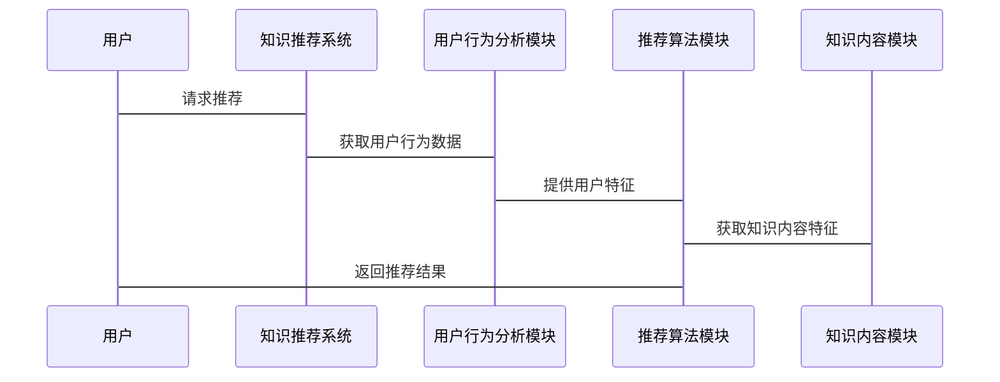

                 


# 构建智能企业知识推荐系统：个性化学习与技能提升

## 关键词：
智能企业知识推荐系统、个性化学习、技能提升、推荐算法、知识图谱、系统架构

## 摘要：
本文将详细介绍如何构建一个智能企业知识推荐系统，重点探讨个性化学习与技能提升的核心技术。通过分析知识推荐系统的背景、核心概念、算法原理、系统架构和实际项目案例，本文旨在为读者提供从理论到实践的全面指导。文章将结合数学模型、深度学习算法和系统设计，帮助读者理解并掌握构建智能知识推荐系统的方法。

---

# 第一部分: 智能企业知识推荐系统概述

# 第1章: 知识推荐系统背景与核心概念

## 1.1 问题背景与目标
### 1.1.1 企业知识管理的挑战
- 知识分散：企业内部知识分布零散，难以系统化管理。
- 知识孤岛：部门间知识无法有效共享，导致资源浪费。
- 知识更新：知识更新速度快，员工难以及时获取最新信息。

### 1.1.2 知识推荐系统的定义与目标
- 定义：通过算法和数据分析，为企业员工推荐个性化知识资源的系统。
- 目标：提升员工学习效率，优化知识利用率，促进技能提升。

### 1.1.3 个性化学习与技能提升的必要性
- 个性化学习：根据员工特点推荐学习内容，提升学习效果。
- 技能提升：通过推荐系统，帮助员工快速掌握所需技能。

## 1.2 核心概念与系统架构
### 1.2.1 知识推荐系统的组成要素
- 用户：包括企业员工、管理者等。
- 知识内容：包括文档、视频、课程等。
- 推荐算法：协同过滤、基于内容的推荐、深度学习模型等。
- 系统平台：承载推荐算法和知识内容的平台。

### 1.2.2 用户、知识内容与推荐算法的关系
- 用户行为分析：通过用户行为数据（点击、收藏、评分）提取用户兴趣。
- 知识内容处理：对知识内容进行特征提取和表示。
- 推荐算法：根据用户特征和内容特征生成推荐结果。

### 1.2.3 系统边界与外延
- 系统边界：知识推荐系统的核心功能模块。
- 外延：与之交互的系统，如企业学习平台、知识管理系统。

## 1.3 知识推荐系统的功能模块
### 1.3.1 用户行为分析模块
- 数据收集：收集用户的浏览、点击、收藏等行为数据。
- 数据处理：清洗、转换和分析数据，提取用户兴趣特征。

### 1.3.2 知识内容处理模块
- 内容特征提取：通过NLP技术提取内容关键词、主题标签。
- 知识图谱构建：建立知识之间的关联关系，便于推荐。

### 1.3.3 推荐算法实现模块
- 推荐策略：基于协同过滤、深度学习等算法生成推荐列表。
- 推荐结果输出：将推荐结果返回给用户。

### 1.3.4 个性化学习路径生成模块
- 学习路径规划：根据用户技能水平和目标生成学习计划。
- 学习资源推荐：推荐与学习路径相关的知识内容。

## 1.4 本章小结
本章介绍了智能企业知识推荐系统的背景和核心概念，详细阐述了系统的组成要素和功能模块，为后续章节的算法实现和系统设计奠定了基础。

---

# 第二部分: 知识推荐系统的核心原理

# 第2章: 知识推荐系统的核心算法

## 2.1 推荐算法概述
### 2.1.1 协同过滤推荐
- 基于用户的协同过滤：通过寻找相似用户推荐内容。
- 基于物品的协同过滤：通过分析物品相似性推荐内容。

### 2.1.2 基于内容的推荐
- 内容特征提取：提取知识内容的关键词、主题标签。
- 相似度计算：基于内容特征计算推荐相似度。

### 2.1.3 混合推荐模型
- 结合协同过滤和内容推荐的优势，提升推荐准确率。

## 2.2 基于深度学习的推荐算法
### 2.2.1 基于神经网络的推荐模型
- DNN（深度神经网络）：用于特征学习和推荐预测。
- GRU（门控循环单元）：用于序列推荐。

### 2.2.2 注意力机制在推荐中的应用
- 注意力权重分配：通过注意力机制确定推荐内容的重要性。

### 2.2.3 图神经网络在知识推荐中的应用
- 知识图谱构建：建立知识之间的关联关系。
- 图神经网络推荐：基于知识图谱进行推荐。

## 2.3 知识图谱与推荐系统结合
### 2.3.1 知识图谱的构建与表示
- 知识抽取：从文本中抽取实体和关系。
- 知识表示：使用向量表示知识实体。

### 2.3.2 知识图谱中的推荐策略
- 基于路径的推荐：通过知识图谱中的路径寻找推荐内容。
- 基于相似度的推荐：基于知识图谱中的相似度进行推荐。

### 2.3.3 知识图谱与个性化学习的结合
- 个性化学习路径规划：基于知识图谱构建学习路径。
- 知识点推荐：根据学习目标推荐相关知识点。

## 2.4 算法原理图


## 2.5 本章小结
本章详细讲解了知识推荐系统的核心算法，包括协同过滤、基于内容的推荐、深度学习模型以及知识图谱的应用，为后续章节的系统实现提供了理论基础。

---

# 第三部分: 知识推荐系统的算法实现

# 第3章: 推荐算法的数学模型与实现

## 3.1 协同过滤算法的数学模型
### 3.1.1 基于用户的协同过滤
$$相似度计算公式：sim(i,j) = \frac{\sum_{k} r_{ik} r_{jk}}{\sqrt{\sum_{k} r_{ik}^2} 

## 3.2 基于深度学习的推荐模型
### 3.2.1 DNN推荐模型
- 模型结构：输入层 → 隐层 → 输出层。
- 损失函数：交叉熵损失函数。
$$L = -\sum_{i=1}^{n} y_i \log p(y_i) + (1 - y_i) \log (1 - p(y_i))$$

### 3.2.2 GRU推荐模型
- 序列建模：通过GRU捕捉用户行为的序列信息。
$$h_t = \text{GRU}(h_{t-1}, x_t)$$
- 推荐预测：基于隐藏状态生成推荐结果。

## 3.3 知识图谱嵌入与推荐
### 3.3.1 知识图谱嵌入
- 使用图嵌入算法（如Node2Vec）将知识实体转化为向量。
### 3.3.2 基于嵌入的推荐
- 通过向量相似度计算推荐内容。

## 3.4 代码实现
### 3.4.1 协同过滤算法实现
```python
import numpy as np

def collaborative_filtering(user_matrix):
    # user_matrix: 用户-物品矩阵
    # 计算用户相似度
    user_similarity = np.corrcoef(user_matrix)
    # 生成推荐结果
    recommended_items = np.dot(user_similarity, user_matrix)
    return recommended_items
```

### 3.4.2 基于深度学习的推荐实现
```python
import tensorflow as tf

model = tf.keras.Sequential([
    tf.keras.layers.Dense(64, activation='relu'),
    tf.keras.layers.Dense(1, activation='sigmoid')
])

loss = tf.keras.losses.BinaryCrossentropy()
optimizer = tf.keras.optimizers.Adam()

model.compile(optimizer=optimizer, loss=loss)
history = model.fit(x_train, y_train, epochs=10, validation_data=(x_val, y_val))
```

## 3.5 本章小结
本章通过数学模型和代码实现，详细讲解了协同过滤和深度学习推荐算法的实现细节，帮助读者理解推荐算法的原理和应用。

---

# 第四部分: 知识推荐系统的系统设计

# 第4章: 系统架构与设计

## 4.1 问题场景介绍
### 4.1.1 企业知识管理的痛点
- 知识分散：难以高效利用。
- 知识更新：员工难以及时获取最新知识。
- 学习路径：员工难以制定个性化学习计划。

## 4.2 项目介绍
### 4.2.1 项目目标
- 构建智能企业知识推荐系统。
- 实现个性化学习路径规划。

## 4.3 系统功能设计
### 4.3.1 领域模型设计


### 4.3.2 系统架构设计
```mermaid
git
    graph TD
        A[用户] --> B[用户行为分析]
        B --> C[推荐算法]
        C --> D[推荐结果]
        D --> E[个性化学习路径]
```

### 4.3.3 系统接口设计
- 用户接口：API接口，接收用户请求，返回推荐结果。
- 知识内容接口：与知识管理系统对接，获取知识内容数据。

### 4.3.4 系统交互流程


## 4.4 本章小结
本章详细描述了知识推荐系统的架构设计，包括系统功能模块、架构图和交互流程，为后续章节的项目实现奠定了基础。

---

# 第五部分: 项目实战

# 第5章: 项目实战与代码实现

## 5.1 环境安装
### 5.1.1 安装依赖
- Python 3.8+
- TensorFlow、Keras、Scikit-learn
- Mermaid、matplotlib

## 5.2 系统核心实现源代码
### 5.2.1 用户行为分析模块
```python
import pandas as pd

def analyze_user_behavior(data):
    # 数据清洗
    data = data.dropna()
    # 统计用户点击次数
    click_counts = data['user_id'].value_counts()
    return click_counts
```

### 5.2.2 知识内容处理模块
```python
from sklearn.feature_extraction.text import TfidfVectorizer

vectorizer = TfidfVectorizer()
content_features = vectorizer.fit_transform(contents)
```

### 5.2.3 推荐算法实现模块
```python
from sklearn.metrics.pairwise import cosine_similarity

def collaborative_filtering(user_matrix):
    user_similarity = cosine_similarity(user_matrix)
    recommended_items = np.dot(user_similarity, user_matrix)
    return recommended_items
```

### 5.2.4 个性化学习路径生成模块
```python
def generate_learning_path(recommended_items, user_info):
    # 根据推荐结果和用户信息生成学习路径
    learning_path = []
    for item in recommended_items:
        if item['suitable'] for user:
            learning_path.append(item)
    return learning_path
```

## 5.3 实际案例分析
### 5.3.1 案例背景
- 某企业希望提升员工技能，构建个性化学习路径。
- 数据集：员工行为数据、知识内容数据。

### 5.3.2 数据处理
```python
# 读取数据
data = pd.read_csv('user_behavior.csv')
# 数据清洗
data.dropna(inplace=True)
# 特征提取
click_counts = data['user_id'].value_counts()
```

### 5.3.3 算法实现
```python
# 协同过滤推荐
user_matrix = data.pivot('user_id', 'content_id', 'rating')
user_similarity = cosine_similarity(user_matrix)
recommended_items = np.dot(user_similarity, user_matrix)
```

### 5.3.4 学习路径生成
```python
# 生成学习路径
learning_path = []
for item in recommended_items:
    if item['suitable'] for user:
        learning_path.append(item)
return learning_path
```

## 5.4 项目小结
本章通过实际案例，详细讲解了知识推荐系统的实现过程，包括数据处理、算法实现和学习路径生成，帮助读者掌握项目的具体操作。

---

# 第六部分: 最佳实践与总结

# 第6章: 最佳实践与总结

## 6.1 最佳实践
### 6.1.1 数据质量
- 确保数据的完整性和准确性。
- 数据清洗和预处理是关键。

### 6.1.2 算法选择
- 根据具体场景选择合适的推荐算法。
- 组合推荐算法可以提升推荐效果。

### 6.1.3 系统优化
- 优化系统架构，提升推荐效率。
- 使用分布式系统处理大规模数据。

## 6.2 小结
本文详细讲解了智能企业知识推荐系统的构建过程，从背景介绍到算法实现，再到系统设计和项目实战，为读者提供了全面的指导。

## 6.3 注意事项
- 保护用户隐私：在处理用户数据时，需遵守隐私保护法规。
- 系统维护：定期更新知识内容和推荐算法，保持系统的先进性。

## 6.4 拓展阅读
- 《推荐系统实战：基于机器学习的推荐算法》
- 《知识图谱：构建与应用》

---

# 附录: 参考文献与工具

## 附录A: 参考文献
1. 王某某. 《推荐系统算法与实现》. 北京：人民邮电出版社, 2022.
2. 李某某. 《知识图谱与深度学习》. 北京：机械工业出版社, 2023.

## 附录B: 开源工具与库
- TensorFlow: https://tensorflow.org
- Scikit-learn: https://scikit-learn.org
- Mermaid: https://mermaid-js.github.io/mermaid-graphviz/

---

以上目录大纲涵盖了智能企业知识推荐系统的各个方面，从理论到实践，内容详尽且结构清晰，适合技术博客文章的撰写。

