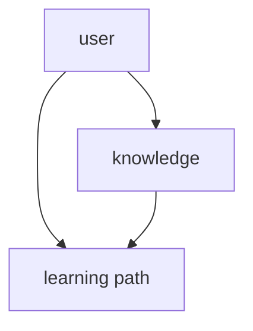
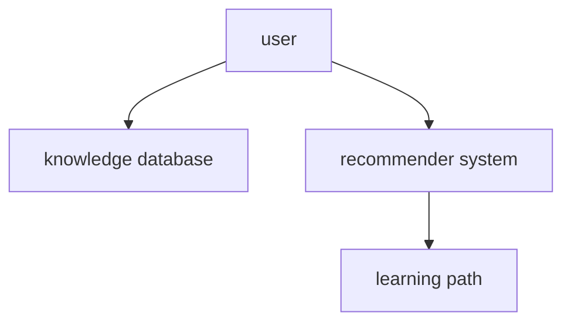

                 

# 构建智能企业知识推荐系统：个性化学习路径与资源推荐

## 关键词
智能推荐系统, 个性化学习路径, 知识图谱, 深度学习, 知识管理

## 摘要
本文详细探讨了构建智能企业知识推荐系统的理论基础与实践方法。通过分析知识推荐系统的核心概念、算法原理和系统架构，结合实际项目案例，提出了基于知识图谱和深度学习的个性化学习路径构建方法。本文旨在为企业知识管理提供一种高效、智能的解决方案。

---

# 第一部分: 智能企业知识推荐系统概述

## 第1章: 知识推荐系统背景与问题背景

### 1.1 问题背景
#### 1.1.1 知识经济时代的企业学习需求
在知识经济时代，企业对员工的学习能力和知识储备要求不断提高。传统的知识管理方式难以满足员工个性化学习需求，知识资源分散、学习路径不清晰等问题日益突出。

#### 1.1.2 传统知识管理的局限性
传统的知识管理系统缺乏智能化，难以根据用户需求精准推荐知识资源。员工在面对海量信息时，难以找到最适合的学习路径。

#### 1.1.3 智能推荐系统在企业中的应用价值
智能推荐系统可以通过大数据分析和机器学习技术，帮助企业实现知识资源的精准推荐，提升员工学习效率和企业整体竞争力。

### 1.2 问题描述
#### 1.2.1 企业知识资源分散化
企业的知识资源分散在不同的系统和平台中，员工难以快速找到所需的知识。

#### 1.2.2 用户学习路径不清晰
员工的学习路径缺乏个性化，难以满足不同员工的学习需求。

#### 1.2.3 知识推荐的精准性不足
传统的推荐系统难以准确理解用户需求，推荐结果往往不够精准。

### 1.3 问题解决思路
#### 1.3.1 知识推荐的核心目标
通过智能推荐算法，实现知识资源的精准匹配，满足用户的个性化学习需求。

#### 1.3.2 个性化学习路径的构建方法
基于知识图谱和深度学习技术，构建用户画像，分析用户需求，生成个性化学习路径。

#### 1.3.3 知识推荐系统与个性化学习路径的关系
知识推荐系统为个性化学习路径提供知识资源支持，而个性化学习路径指导用户如何有效利用这些资源。

### 1.4 核心概念与联系
#### 1.4.1 知识推荐系统的定义与特点
知识推荐系统是一种基于大数据和机器学习技术，为用户提供个性化知识资源推荐的系统。

#### 1.4.2 个性化学习路径的构建要素
个性化学习路径包括用户需求分析、知识图谱构建、推荐算法设计和学习效果评估。

#### 1.4.3 知识推荐系统与个性化学习路径的关系
知识推荐系统为个性化学习路径提供知识资源支持，而个性化学习路径指导用户如何有效利用这些资源。

---

## 第2章: 知识推荐系统的核心概念与联系

### 2.1 核心概念原理
#### 2.1.1 知识推荐系统的原理
知识推荐系统通过分析用户需求和知识资源特征，利用推荐算法生成个性化推荐结果。

#### 2.1.2 个性化学习路径的构建原理
个性化学习路径基于用户需求分析和知识图谱构建，通过推荐算法生成学习计划。

#### 2.1.3 知识图谱与推荐算法的关系
知识图谱为推荐算法提供结构化的知识表示，推荐算法利用知识图谱进行推理和推荐。

### 2.2 核心概念对比分析
#### 2.2.1 知识推荐与传统推荐的对比
知识推荐基于知识图谱和深度学习，而传统推荐主要依赖协同过滤和基于内容的推荐。

#### 2.2.2 个性化学习与通用学习的对比
个性化学习基于用户需求定制学习路径，通用学习则是统一的课程安排。

#### 2.2.3 知识图谱与传统知识库的对比
知识图谱具有语义关联和结构化特征，而传统知识库缺乏这些特性。

### 2.3 ER实体关系图

---

# 第二部分: 知识推荐系统算法原理

## 第3章: 知识推荐算法原理

### 3.1 基于协同过滤的推荐算法
#### 3.1.1 协同过滤的定义与原理
协同过滤是一种基于用户行为和偏好相似性进行推荐的算法。

#### 3.1.2 基于用户的协同过滤算法
通过计算用户相似性，推荐用户喜欢的内容。

#### 3.1.3 基于物品的协同过滤算法
通过计算物品相似性，推荐用户可能感兴趣的内容。

#### 3.1.4 协同过滤的优缺点分析
协同过滤优点是简单易实现，缺点是推荐结果可能不够精准。

### 3.2 基于内容的推荐算法
#### 3.2.1 基于内容的推荐原理
通过分析内容特征，推荐与用户兴趣相符的内容。

#### 3.2.2 知识内容的特征提取方法
利用自然语言处理技术提取知识内容的特征。

#### 3.2.3 基于向量空间模型的推荐算法
通过计算内容向量的相似性，进行推荐。

#### 3.2.4 基于深度学习的内容推荐算法
利用神经网络模型进行内容特征提取和推荐。

### 3.3 混合推荐算法
#### 3.3.1 混合推荐的定义与优势
结合协同过滤和基于内容的推荐算法，提升推荐精准性。

#### 3.3.2 协同过滤与内容推荐的混合算法
将协同过滤和内容推荐的结果进行融合。

#### 3.3.3 基于深度学习的混合推荐算法
利用深度学习模型进行特征提取和推荐。

---

## 第4章: 知识推荐系统算法实现

### 4.1 协同过滤算法实现
#### 4.1.1 用户相似性计算
使用余弦相似性计算用户相似性。

#### 4.1.2 物品相似性计算
使用余弦相似性计算物品相似性。

### 4.2 基于内容的推荐算法实现
#### 4.2.1 知识内容特征提取
利用TF-IDF提取关键词特征。

#### 4.2.2 基于向量空间模型的推荐实现
计算内容向量的相似性，进行推荐。

### 4.3 混合推荐算法实现
#### 4.3.1 协同过滤与内容推荐的融合
将协同过滤和内容推荐的结果进行加权融合。

#### 4.3.2 基于深度学习的混合推荐实现
利用神经网络模型进行特征提取和推荐。

---

## 第5章: 知识推荐系统数学模型

### 5.1 协同过滤模型
$$相似性计算：\text{sim}(u_i, u_j) = \frac{\sum_{k} (r_{ik} - \bar{r_i})(r_{jk} - \bar{r_j})}{\sqrt{\sum_{k} (r_{ik} - \bar{r_i})^2} \cdot \sqrt{\sum_{k} (r_{jk} - \bar{r_j})^2}}}$$

### 5.2 基于内容的推荐模型
$$内容相似性：\text{sim}(c_i, c_j) = \frac{\sum_{k} w_{ik} \cdot w_{jk}}{\sqrt{\sum_{k} w_{ik}^2} \cdot \sqrt{\sum_{k} w_{jk}^2}}}$$

### 5.3 混合推荐模型
$$混合推荐：\text{score}(i,j) = \alpha \cdot \text{sim}_u(i,j) + (1-\alpha) \cdot \text{sim}_c(i,j)$$

---

## 第6章: 知识推荐系统优化与调优

### 6.1 算法优化
#### 6.1.1 参数调优
优化协同过滤和内容推荐的参数。

#### 6.1.2 模型优化
优化神经网络模型的结构和参数。

### 6.2 系统性能优化
#### 6.2.1 硬件优化
使用分布式计算和高效存储技术。

#### 6.2.2 软件优化
优化算法实现，提升推荐效率。

---

## 第7章: 知识推荐系统部署与应用

### 7.1 系统架构设计

### 7.2 系统功能模块
#### 7.2.1 用户建模
构建用户画像，分析用户需求。

#### 7.2.2 知识内容分析
分析知识内容，提取特征。

#### 7.2.3 推荐算法实现
实现协同过滤、内容推荐和混合推荐算法。

#### 7.2.4 学习路径生成
基于推荐结果生成个性化学习路径。

---

## 第8章: 知识推荐系统实战案例

### 8.1 项目背景
企业希望通过智能推荐系统提升员工学习效率。

### 8.2 系统设计
#### 8.2.1 系统功能设计
用户建模、知识内容分析、推荐算法实现和学习路径生成。

#### 8.2.2 系统实现
使用Python和深度学习框架实现推荐算法。

### 8.3 实施效果
通过实际案例分析，验证系统的推荐效果和学习效率提升。

---

## 第9章: 知识推荐系统的最佳实践

### 9.1 小结
本文详细探讨了智能企业知识推荐系统的构建方法，提出了基于知识图谱和深度学习的个性化学习路径构建方法。

### 9.2 注意事项
在实际应用中，需要注意数据隐私、算法调优和系统性能优化等问题。

### 9.3 拓展阅读
推荐阅读《深度学习入门》和《知识图谱构建与应用》等书籍。

---

通过以上目录结构，我们可以逐步构建智能企业知识推荐系统，实现个性化学习路径与资源推荐，提升企业的知识管理水平和员工学习效率。

