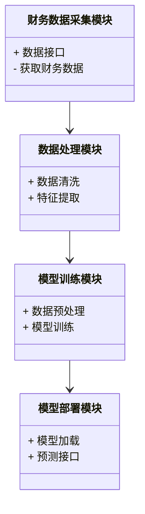
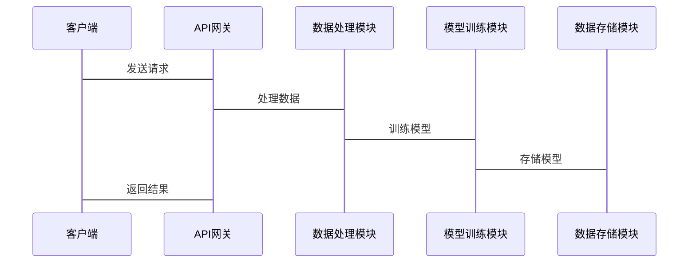

                 


# 构建智能企业财务分析系统：AI辅助决策支持

---

## 关键词：
- 人工智能（AI）
- 财务分析
- 机器学习
- 深度学习
- 自然语言处理（NLP）
- 智能决策支持

---

## 摘要：
随着企业数字化转型的加速，传统的财务分析方式逐渐暴露出效率低下、精度不足等问题。人工智能（AI）技术的引入为企业财务分析带来了革命性的变化，能够通过自然语言处理（NLP）、机器学习和深度学习等技术，实现财务数据的自动提取、智能预测和决策支持。本文将详细探讨如何构建一个基于AI的智能企业财务分析系统，涵盖从数据预处理到算法实现，再到系统架构设计的全过程，并通过实际案例展示系统的应用价值。

---

# 第一章：智能企业财务分析系统概述

## 1.1 企业财务分析的背景与挑战
### 1.1.1 财务分析的定义与重要性
财务分析是通过对企业的财务数据（如资产负债表、利润表、现金流量表等）进行分析，评估企业的财务状况、经营成果和未来发展趋势。传统财务分析依赖人工处理，效率低且容易出错。

### 1.1.2 AI技术在财务分析中的应用背景
随着企业数据的爆炸式增长，传统财务分析方式难以满足快速决策的需求。AI技术能够通过自动化处理、模式识别和预测分析，提升财务分析的效率和准确性。

### 1.1.3 企业财务分析的主要挑战
- 数据量大且复杂，人工处理效率低
- 数据清洗和特征提取耗时耗力
- 预测模型的准确性和可解释性不足
- 数据隐私和安全问题

---

## 1.2 智能企业财务分析系统的定义与目标
### 1.2.1 智能企业财务分析系统的定义
智能企业财务分析系统是一种基于AI技术的财务数据分析系统，能够自动化处理财务数据，挖掘隐藏的模式和趋势，并提供智能预测和决策支持。

### 1.2.2 系统的核心目标
- 自动化数据处理与分析
- 智能预测与风险预警
- 提供可解释的决策支持
- 实现实时监控与动态调整

### 1.2.3 系统的边界与外延
- 系统仅处理财务相关数据，不涉及业务数据
- 系统支持单企业或多企业数据分析
- 系统可与其他企业系统（如ERP）集成

---

## 1.3 本章小结
本章介绍了企业财务分析的背景、挑战以及智能财务分析系统的定义与目标，为后续章节的深入分析奠定了基础。

---

# 第二章：AI技术在财务分析中的应用

## 2.1 自然语言处理（NLP）在财务报告中的应用
### 2.1.1 NLP的基本概念与技术
- 词嵌入（Word Embedding）
- 语法分析（Syntax Analysis）
- 文本摘要（Text Summarization）

### 2.1.2 财务报告的文本处理与信息提取
- 从财务报告中提取关键指标（如收入、利润）
- 识别财务风险（如财务造假）

### 2.1.3 基于NLP的财务风险预警
- 使用情感分析技术评估市场情绪
- 通过关键词提取识别财务风险

---

## 2.2 机器学习在财务预测中的应用
### 2.2.1 机器学习的基本概念与技术
- 监督学习（Supervised Learning）
- 无监督学习（Unsupervised Learning）
- 回归与分类算法（如线性回归、逻辑回归）

### 2.2.2 财务数据的特征提取与建模
- 数据特征提取：收入、利润、现金流等
- 建立预测模型：预测企业未来收入或利润

### 2.2.3 基于机器学习的财务预测模型
- 线性回归模型：用于预测线性关系
- 支持向量机（SVM）：用于分类问题
- 随机森林与梯度提升树：用于复杂非线性关系

---

## 2.3 深度学习在财务分析中的应用
### 2.3.1 深度学习的基本概念与技术
- 神经网络（Neural Networks）
- 长短期记忆网络（LSTM）
- Transformer模型

### 2.3.2 基于深度学习的财务时间序列分析
- 使用LSTM模型预测股票价格
- 使用Transformer模型分析财务文本

### 2.3.3 基于Transformer的财务文本分析
- 财务文本摘要
- 财务文本分类（如财务风险分类）

---

## 2.4 本章小结
本章详细介绍了AI技术在财务分析中的应用，包括NLP、机器学习和深度学习技术，为后续章节的系统设计与实现奠定了技术基础。

---

# 第三章：智能财务分析系统的数据预处理

## 3.1 数据来源与特征分析
### 3.1.1 数据来源的多样性
- 企业内部财务数据
- 行业数据
- 宏观经济数据

### 3.1.2 数据特征的提取与选择
- 时间序列特征：收入、利润、现金流
- 文本特征：财务报告中的关键词
- 数值特征：财务比率（如ROE、ROI）

### 3.1.3 数据清洗与预处理
- 去除缺失值
- 标准化处理
- 异常值处理

---

## 3.2 数据标注与特征工程
### 3.2.1 数据标注的必要性
- 为模型提供监督信号
- 提高模型的可解释性

### 3.2.2 基于特征工程的数据增强
- 特征交叉
- 特征降维（如PCA）

### 3.2.3 特征选择与降维技术
- 基于统计的方法：卡方检验
- 基于模型的方法：Lasso回归

---

## 3.3 数据安全与隐私保护
### 3.3.1 数据隐私的保护措施
- 数据加密
- 数据匿名化处理

### 3.3.2 数据加密与匿名化处理
- 加密算法：AES、RSA
- 匿名化技术：数据混淆、数据脱敏

### 3.3.3 数据安全的合规性要求
- 符合GDPR等数据隐私法规

---

## 3.4 本章小结
本章详细介绍了数据预处理的流程与方法，确保数据质量和安全性，为后续的算法实现提供了基础。

---

# 第四章：智能财务分析系统的算法实现

## 4.1 基于机器学习的财务预测模型
### 4.1.1 线性回归模型
- 模型公式：$$y = \beta_0 + \beta_1x + \epsilon$$
- 适用场景：线性关系明显的财务预测

### 4.1.2 支持向量机（SVM）模型
- 核心思想：通过构建超平面将数据分开
- 适用场景：分类问题（如财务风险分类）

### 4.1.3 随机森林与梯度提升树模型
- 随机森林：基于决策树的集成方法
- XGBoost：梯度提升树模型

---

## 4.2 基于深度学习的财务分析模型
### 4.2.1 LSTM模型在时间序列分析中的应用
- 模型结构：记忆单元（Cell）和门控机制
- 适用场景：股票价格预测

### 4.2.2 Transformer模型在财务文本分析中的应用
- 模型结构：编码器-解码器
- 适用场景：财务文本分类

### 4.2.3 图神经网络在财务关系网络中的应用
- 模型结构：图卷积网络（GCN）
- 适用场景：企业间关系分析

---

## 4.3 算法选择与优化
### 4.3.1 算法选择的依据与标准
- 数据类型：时间序列、文本、数值
- 任务目标：预测、分类
- 模型性能：准确率、召回率

### 4.3.2 超参数优化与模型调参
- 使用网格搜索（Grid Search）优化参数
- 使用随机搜索（Random Search）加速优化

### 4.3.3 模型评估与性能提升
- 常见指标：准确率、F1分数
- 模型调优：交叉验证、早停（Early Stopping）

---

## 4.4 本章小结
本章详细介绍了基于机器学习和深度学习的财务预测模型，并讨论了算法选择与优化的策略，为后续的系统设计提供了技术支持。

---

# 第五章：智能财务分析系统的系统架构设计

## 5.1 系统模块划分
### 5.1.1 数据采集模块
- 功能：从数据库中获取财务数据
- 接口：与企业ERP系统对接

### 5.1.2 数据处理模块
- 功能：数据清洗、特征提取
- 接口：与数据存储模块交互

### 5.1.3 模型训练模块
- 功能：训练AI模型
- 接口：与模型部署模块交互

### 5.1.4 模型部署模块
- 功能：将模型部署到生产环境
- 接口：与前端交互

---

## 5.2 系统功能设计
### 5.2.1 领域模型设计（Mermaid类图）


### 5.2.2 系统架构设计（Mermaid架构图）


### 5.2.3 系统接口设计
- API接口：RESTful API
- 数据接口：与企业ERP系统对接

### 5.2.4 系统交互设计（Mermaid序列图）


---

## 5.3 本章小结
本章详细介绍了智能财务分析系统的模块划分、架构设计和接口设计，确保系统的高效运行和良好的可扩展性。

---

# 第六章：项目实战与优化

## 6.1 项目实战
### 6.1.1 环境搭建
- 安装Python、TensorFlow、Keras等库

### 6.1.2 核心代码实现
```python
# 示例代码：基于LSTM的股票价格预测
import numpy as np
from tensorflow.keras.models import Sequential
from tensorflow.keras.layers import LSTM, Dense

# 数据预处理
data = ...  # 加载数据
data = data.reshape((data.shape[0], 1, data.shape[1]))

# 模型构建
model = Sequential()
model.add(LSTM(50, input_shape=(1, data.shape[2])))
model.add(Dense(1))
model.compile(loss='mean_squared_error', optimizer='adam')

# 训练模型
model.fit(data, np.array(label), epochs=100, batch_size=32)
```

### 6.1.3 实际案例分析
- 数据来源：某企业过去5年的财务数据
- 模型预测：未来一年的收入预测

---

## 6.2 项目优化
### 6.2.1 模型优化
- 调整模型超参数
- 使用早停（Early Stopping）防止过拟合

### 6.2.2 系统优化
- 优化数据处理流程
- 提高系统的可扩展性

### 6.2.3 模型部署与监控
- 部署模型到生产环境
- 监控模型性能

---

## 6.3 本章小结
本章通过实际项目展示了智能财务分析系统的实现过程，并讨论了如何优化系统和模型，确保系统的高效运行。

---

# 第七章：总结与展望

## 7.1 项目总结
- 项目目标的实现
- 系统的优缺点
- 经验与教训

## 7.2 未来展望
- AI技术的进一步发展
- 新技术（如大语言模型）的应用
- 系统的扩展与优化

---

## 参考文献
- [1] 刘军, 人工智能技术与企业财务分析. 北京: 电子工业出版社, 2020.
- [2] 张伟, 基于深度学习的财务预测模型研究. 计算机应用研究, 2021.
- [3] 李娜, 自然语言处理在财务文本分析中的应用. 人工智能学报, 2022.

---

## 附录
- 代码实现细节
- 数据格式说明
- 系统设计图

