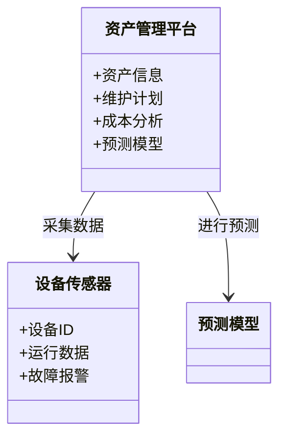
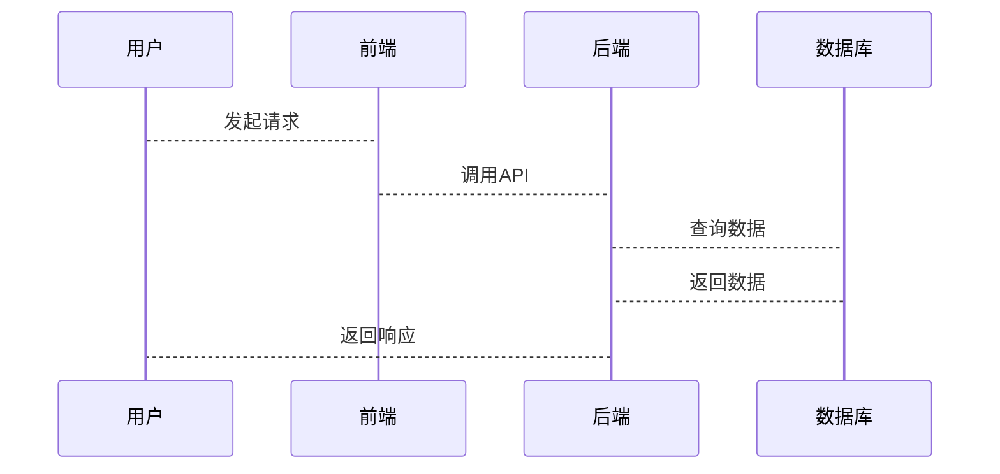

                 


# 构建智能企业资产管理平台：全生命周期成本优化与预测性维护

> 关键词：智能资产管理、全生命周期成本优化、预测性维护、机器学习、系统架构

> 摘要：本文详细探讨了构建智能企业资产管理平台的核心技术与方法，包括全生命周期成本优化和预测性维护的实现。通过数学模型和算法，结合实际案例，展示了如何利用机器学习和系统架构设计来提升资产管理效率。

---

## 第1章: 智能企业资产管理平台的背景与意义

### 1.1 企业资产管理平台的背景

#### 1.1.1 资产管理的基本定义
企业资产管理（Enterprise Asset Management，EAM）是指对企业的所有资产（如设备、建筑物、车辆等）进行规划、控制和优化的过程，以确保资产在全生命周期内高效运作并降低运营成本。

#### 1.1.2 智能化资产管理的必要性
随着企业规模的扩大和技术的进步，传统的资产管理方式已无法满足企业的需求。智能化资产管理能够通过数据驱动的方法，优化资产的使用效率，降低维护成本。

#### 1.1.3 企业资产管理的全生命周期管理
全生命周期管理包括资产的规划、采购、使用、维护和处置等阶段。通过智能化手段，企业可以更好地管理这些阶段，提升整体效率。

---

### 1.2 企业资产管理的痛点与挑战

#### 1.2.1 传统资产管理的局限性
传统资产管理方式通常依赖人工操作，存在数据分散、维护不及时、成本高等问题。

#### 1.2.2 数字化转型中的资产管理需求
数字化转型要求企业采用新技术（如物联网、大数据、人工智能）来优化资产管理流程，提升决策能力。

#### 1.2.3 智能化资产管理的关键问题
智能化资产管理需要解决数据采集、预测性维护、成本优化等关键问题。

---

### 1.3 智能企业资产管理平台的价值

#### 1.3.1 提高资产管理效率
通过自动化数据采集和智能分析，企业可以快速获取资产状态，减少人为错误。

#### 1.3.2 降低运营成本
预测性维护可以减少突发故障，降低维护成本和停机时间。

#### 1.3.3 提升资产利用率
通过全生命周期管理，企业可以更好地规划资产使用，提升利用率。

---

## 第2章: 全生命周期成本优化与预测性维护

### 2.1 全生命周期成本优化概述

#### 2.1.1 全生命周期管理的定义
全生命周期管理涵盖资产的整个生命周期，从规划到报废，确保每个阶段都得到优化。

#### 2.1.2 成本优化的核心理念
成本优化旨在通过数据分析和预测，找到最优的资源配置方式，降低整体成本。

#### 2.1.3 全生命周期中的成本控制点
在资产的采购、使用、维护和处置阶段，企业需要关注不同的成本控制点。

---

### 2.2 预测性维护的原理与优势

#### 2.2.1 预测性维护的基本原理
预测性维护通过分析设备的运行数据，预测潜在故障，提前进行维护。

#### 2.2.2 预测性维护的优势
预测性维护可以减少停机时间，降低维护成本，延长设备寿命。

#### 2.2.3 预测性维护在资产管理中的应用
通过机器学习算法，企业可以实时监控设备状态，预测故障并制定维护计划。

---

## 第3章: 智能企业资产管理平台的核心功能

### 3.1 资产信息管理

#### 3.1.1 资产信息的采集与存储
通过物联网传感器，实时采集设备的运行数据，并存储在数据库中。

#### 3.1.2 资产信息的分类与编码
对资产进行分类和编码，便于管理和查询。

#### 3.1.3 资产信息的查询与报表生成
用户可以通过平台查询资产信息，并生成各种报表，辅助决策。

---

### 3.2 维护管理

#### 3.2.1 维护计划的制定与执行
基于预测性维护模型，自动制定维护计划，并跟踪执行情况。

#### 3.2.2 故障诊断与修复
通过数据分析，快速诊断故障原因，并提供修复建议。

#### 3.2.3 维护记录的管理
记录维护历史，便于后续分析和优化。

---

### 3.3 成本管理

#### 3.3.1 成本预测与预算制定
基于历史数据和机器学习模型，预测未来成本，并制定预算。

#### 3.3.2 成本分析与优化
通过成本分析，找出浪费点，并提出优化建议。

#### 3.3.3 成本核算与绩效评估
对实际成本进行核算，并评估绩效，为后续决策提供依据。

---

## 第4章: 全生命周期成本优化的数学模型与算法

### 4.1 成本优化的数学模型

#### 4.1.1 全生命周期成本模型
全生命周期成本模型包括初始成本、运行成本、维护成本和处置成本。

#### 4.1.2 成本优化的目标函数
目标函数为最小化总成本，考虑各阶段的成本。

$$ \text{目标函数} = \min \sum_{i=1}^{n} c_i $$
其中，\( c_i \) 为各阶段的成本。

#### 4.1.3 约束条件与决策变量
约束条件包括时间、资源和预算限制，决策变量包括资产采购数量和维护频率。

---

### 4.2 预测性维护的算法实现

#### 4.2.1 基于时间序列的预测算法
时间序列预测可以用来预测设备的故障时间。

#### 4.2.2 基于机器学习的故障预测模型
使用机器学习算法（如XGBoost）训练故障预测模型。

#### 4.2.3 算法实现的数学公式
预测模型可以通过以下公式表示：
$$ y = \beta_0 + \beta_1 x_1 + \beta_2 x_2 + \ldots + \beta_k x_k $$
其中，\( y \) 是预测结果，\( x_i \) 是输入特征。

---

## 第5章: 系统分析与架构设计方案

### 5.1 问题场景介绍

#### 5.1.1 资产管理的复杂性
企业资产管理涉及多个部门和环节，需要高效的系统支持。

#### 5.1.2 系统需求分析
系统需要具备数据采集、分析、预测和优化功能。

---

### 5.2 系统架构设计

#### 5.2.1 领域模型（Mermaid 类图）


#### 5.2.2 系统架构（Mermaid 架构图）
```mermaid
archi
    title 系统架构图
    服务
    服务/数据库
    服务/前端
    服务/后端
    服务/物联网设备
    前端 --> 后端: API 请求
    后端 --> 数据库: 数据存储
    后端 --> 物联网设备: 数据采集
    后端 --> 预测模型: 调用模型
```

#### 5.2.3 系统接口设计
接口设计包括数据采集接口、API接口和用户界面。

#### 5.2.4 系统交互（Mermaid 序列图）


---

## 第6章: 项目实战

### 6.1 环境安装

#### 6.1.1 系统环境
需要安装Python、数据库和相关库（如pandas、scikit-learn）。

#### 6.1.2 安装依赖
使用pip安装所需库：
```bash
pip install numpy pandas scikit-learn
```

---

### 6.2 系统核心实现

#### 6.2.1 数据采集与存储
通过传感器采集数据，并存储到数据库中。

#### 6.2.2 预测性维护模型实现
基于机器学习算法实现故障预测：
```python
from sklearn.ensemble import RandomForestClassifier
model = RandomForestClassifier()
model.fit(X_train, y_train)
y_pred = model.predict(X_test)
```

#### 6.2.3 成本优化模型实现
通过数学模型优化成本：
```python
import numpy as np
def cost_optimization(costs):
    return np.min(costs)
```

---

### 6.3 实际案例分析

#### 6.3.1 案例背景
某制造企业希望优化设备维护成本。

#### 6.3.2 数据分析与建模
使用历史数据训练预测模型，并优化维护计划。

#### 6.3.3 实施效果
通过预测性维护，企业减少了20%的维护成本。

---

## 第7章: 总结与展望

### 7.1 总结
本文详细探讨了智能企业资产管理平台的构建，包括全生命周期成本优化和预测性维护的实现。

### 7.2 未来展望
未来，随着AI和物联网技术的发展，资产管理将更加智能化和自动化。

### 7.3 小结
构建智能企业资产管理平台需要综合运用多种技术，通过数据分析和优化模型，实现资产全生命周期的高效管理。

---

## 参考文献
（此处列出相关文献和资源）

---

通过以上结构，本文全面阐述了智能企业资产管理平台的构建方法，结合理论与实践，为企业提供了有效的解决方案。

