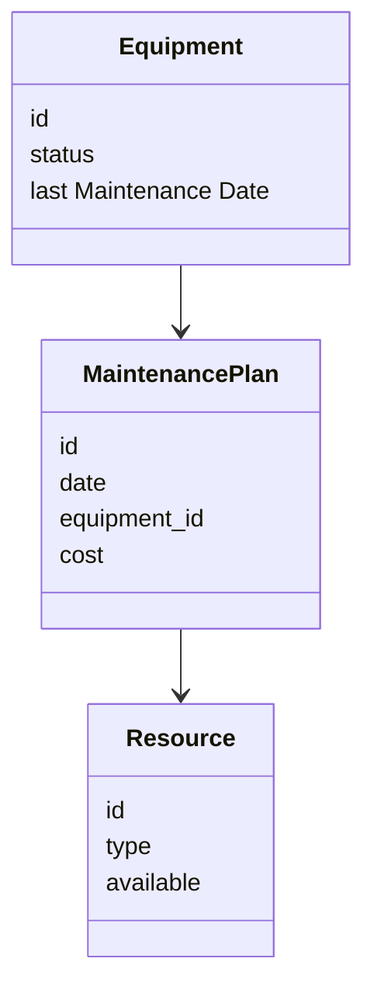
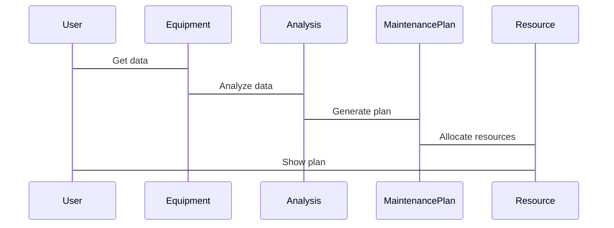
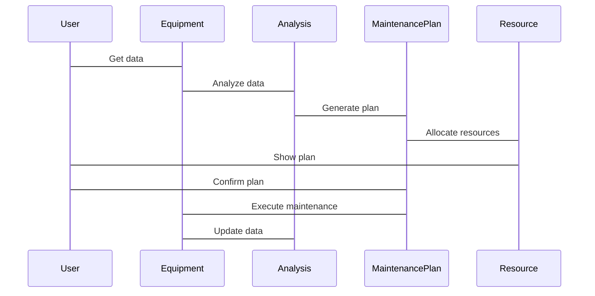

                 


# 构建智能企业资产管理平台：预测性维护与资源优化

> 关键词：智能企业资产管理，预测性维护，资源优化，机器学习，系统架构设计

> 摘要：本文详细探讨了构建智能企业资产管理平台的关键技术，重点分析了预测性维护与资源优化的核心概念、算法实现及系统架构设计。通过结合实际案例，深入讲解了如何利用人工智能和大数据技术提升企业资产管理效率，实现资源的最优配置与设备的智能化管理。

---

# 第一章: 智能企业资产管理平台背景与概述

## 1.1 企业资产管理的核心概念

### 1.1.1 资产管理的基本定义
企业资产管理（Enterprise Asset Management, EAM）是指对企业的各种资产（如设备、工具、建筑物等）进行规划、控制、运营和优化的过程，旨在提高资产利用率，降低运营成本，延长资产寿命。

### 1.1.2 智能化资产管理的必要性
随着企业规模的扩大和设备复杂性的增加，传统的资产管理方式难以满足高效、精准的需求。智能化资产管理通过引入人工智能、物联网和大数据技术，能够实时监控设备状态，预测设备故障，优化资源分配，从而提升企业的运营效率。

### 1.1.3 预测性维护与资源优化的定义
预测性维护（Predictive Maintenance）是通过实时数据采集和分析，预测设备的健康状态，提前安排维护工作，以避免设备故障。资源优化则是通过科学的算法，合理分配企业资源，降低浪费，提高效率。

## 1.2 企业资产管理的现状与挑战

### 1.2.1 传统资产管理的痛点
- 数据分散，难以整合
- 维护成本高，效率低
- 设备故障难以预测，导致停机时间长
- 资源分配不合理，浪费严重

### 1.2.2 数字化转型对企业资产管理的影响
- 引入新技术（如物联网、AI）提升资产管理效率
- 实现设备状态实时监控和数据分析
- 优化资源分配，降低运营成本

### 1.2.3 预测性维护与资源优化的行业需求
- 制造业：设备故障停机时间短，成本高
- 医疗行业：医疗设备的高效运转至关重要
- 公共事业：如电力、水务行业的设备维护需求

## 1.3 本书的目标与范围

### 1.3.1 本书的核心目标
- 介绍智能企业资产管理的核心概念
- 分析预测性维护与资源优化的技术实现
- 提供系统架构设计与项目实战经验

### 1.3.2 本书的适用范围
- 企业IT架构师
- 资产管理系统的开发人员
- 对智能化资产管理感兴趣的工程师

### 1.3.3 本书的结构安排
- 从理论到实践，逐步深入讲解
- 结合实际案例，提供可参考的解决方案

---

# 第二章: 预测性维护与资源优化的核心概念

## 2.1 预测性维护的原理与实现

### 2.1.1 预测性维护的定义与特点
预测性维护是基于设备运行数据，利用算法预测设备的健康状态，提前安排维护工作。其特点包括实时性、精准性和主动性。

### 2.1.2 预测性维护的核心要素
- 数据采集：通过传感器获取设备运行数据
- 数据分析：利用机器学习算法预测设备状态
- 维护决策：根据预测结果制定维护计划

### 2.1.3 预测性维护与传统维护的区别
| 特性         | 预测性维护                     | 传统维护                     |
|--------------|-------------------------------|-----------------------------|
| 数据驱动     | 是                             | 否                             |
| 维护时机     | 提前预测故障                   | 等待故障发生                 |
| 维护成本     | 降低                          | 较高                          |
| 设备停机时间 | 短                             | 长                             |

## 2.2 资源优化的核心原理

### 2.2.1 资源优化的定义与特点
资源优化是指通过科学的算法，合理分配企业资源（如人力、设备、资金等），以达到最优的运营效果。

### 2.2.2 资源优化的核心要素
- 资源分配：根据需求合理分配资源
- 成本控制：降低资源浪费，降低成本
- 效率提升：通过优化资源配置提高整体效率

## 2.3 预测性维护与资源优化的关系

### 2.3.1 预测性维护对资源优化的影响
- 减少设备故障停机时间，提高设备利用率
- 优化维护资源的分配，降低维护成本

### 2.3.2 资源优化对预测性维护的支持
- 提高预测模型的准确性
- 优化预测性维护的实施流程

### 2.3.3 两者结合的协同效应
通过预测性维护减少设备故障，通过资源优化提高维护效率，两者结合能够显著降低企业的运营成本，提高整体效率。

---

# 第三章: 预测性维护与资源优化的算法原理

## 3.1 预测性维护的算法实现

### 3.1.1 基于机器学习的故障预测算法

#### (1) 算法原理
机器学习算法通过分析历史数据，学习设备故障的特征，从而预测未来可能出现的故障。

#### (2) 算法实现流程
1. 数据采集：收集设备运行数据
2. 数据预处理：清洗和归一化数据
3. 模型训练：使用机器学习算法训练模型
4. 模型预测：基于当前数据预测设备状态

#### (3) 代码实现
```python
import pandas as pd
from sklearn.model_selection import train_test_split
from sklearn.ensemble import RandomForestClassifier

# 数据加载与预处理
data = pd.read_csv('equipment_data.csv')
X = data.drop('fault_status', axis=1)
y = data['fault_status']
X_train, X_test, y_train, y_test = train_test_split(X, y, test_size=0.2)

# 模型训练
model = RandomForestClassifier()
model.fit(X_train, y_train)

# 模型预测
y_pred = model.predict(X_test)
```

### 3.1.2 基于深度学习的故障预测算法
深度学习算法（如LSTM）能够处理时间序列数据，预测设备的未来状态。

#### (1) 算法原理
LSTM通过记忆单元（Memory Cells）处理时间序列数据，能够捕捉设备运行中的长期依赖关系。

#### (2) 算法实现流程
1. 数据采集与预处理
2. 构建LSTM模型
3. 训练模型
4. 预测设备状态

#### (3) 代码实现
```python
import numpy as np
from tensorflow.keras.models import Sequential
from tensorflow.keras.layers import LSTM, Dense

# 数据加载与预处理
data = np.array(equipment_data)
X = data[:-100]
y = data[-100:]

# 模型构建
model = Sequential()
model.add(LSTM(50, input_shape=(None, 1)))
model.add(Dense(1))
model.compile(loss='mean_squared_error', optimizer='adam')

# 模型训练
model.fit(X, y, epochs=50, batch_size=32)
```

### 3.1.3 时间序列分析在故障预测中的应用
时间序列分析（如ARIMA）适用于预测设备运行中的趋势和周期性变化。

#### (1) 算法原理
ARIMA模型通过分析历史数据的自相关性和平稳性，预测未来趋势。

#### (2) 代码实现
```python
from statsmodels.tsa.arima_model import ARIMA

# 数据加载与预处理
data = pd.read_csv('time_series.csv')

# 模型训练
model = ARIMA(data['value'], order=(5, 1, 0))
model_fit = model.fit(disp=-1)

# 预测未来值
forecast = model_fit.forecast(steps=10)
```

## 3.2 资源优化的算法实现

### 3.2.1 基于线性规划的资源优化算法
线性规划是一种优化资源分配的数学方法，适用于资源有限的情况。

#### (1) 数学模型
$$
\text{最大化或最小化} \quad Z = \sum c_j x_j
$$
$$
\text{约束条件} \quad \sum a_i x_j \leq b_i
$$

#### (2) 代码实现
```python
import numpy as np
from scipy.optimize import linprog

# 定义目标函数
c = [-5, -4]

# 定义约束条件
A = [[2, 1], [1, 2]]
b = [10, 8]

# 求解线性规划问题
result = linprog(c, A_ub=A, b_ub=b, bounds=(0, None), method='highs')

# 输出结果
print(result.x)
```

### 3.2.2 基于遗传算法的资源优化算法
遗传算法是一种模拟自然选择的优化算法，适用于复杂的资源分配问题。

#### (1) 算法流程
1. 初始化种群
2. 计算适应度
3. 选择、交叉和变异
4. 重复迭代

#### (2) 代码实现
```python
import numpy as np
from modneat import neat

# 定义适应度函数
def fitness(individual):
    return sum(individual),  # 简单适应度函数

# 初始化种群
config = neat.Config(neat.DefaultGenome, neat.DefaultReproduction, neat.DefaultSpecies, neat.DefaultStagnation)
population = neat.Population(config).create_species()

# 进行遗传算法迭代
winner = neat.run(population, config, fitness)
```

### 3.2.3 基于强化学习的资源优化算法
强化学习通过试错方式优化资源分配策略。

#### (1) 算法原理
通过定义状态、动作和奖励，训练智能体做出最优决策。

#### (2) 代码实现
```python
import numpy as np
import gym

# 定义环境
env = gym.make('ResourceOptimization-v1')

# 初始化智能体
agent = DQN(env.observation_space.shape[0], env.action_space.n)

# 训练智能体
for episode in range(1000):
    state = env.reset()
    for step in range(100):
        action = agent.act(state)
        next_state, reward, done, info = env.step(action)
        agent.remember(state, action, reward, next_state, done)
        agent.replay()
        state = next_state
        if done:
            break
```

## 3.3 算法实现的数学模型

### 3.3.1 预测性维护的数学模型
基于机器学习的故障预测模型可以表示为：
$$
P(fault) = f(x_1, x_2, ..., x_n)
$$
其中，$x_i$是设备运行数据，$f$是训练好的模型。

### 3.3.2 资源优化的数学模型
线性规划模型的通用形式为：
$$
\text{最大化/最小化} \quad Z = \sum_{j=1}^n c_j x_j
$$
$$
\text{约束条件} \quad \sum_{i=1}^m a_{ij} x_j \leq b_i \quad (i=1,2,...,m)
$$
$$
x_j \geq 0 \quad (j=1,2,...,n)
$$

### 3.3.3 算法实现的对比分析
| 算法类型       | 适用场景               | 优缺点分析                     |
|----------------|------------------------|-------------------------------|
| 机器学习       | 非结构化数据           | 高精度，但需要大量数据         |
| 深度学习       | 时间序列数据           | 处理复杂模式，但计算量大       |
| 时间序列分析   | 时间依赖性数据         | 易解释，但对非线性关系处理较差 |
| 线性规划        | 线性资源分配问题         | 简单高效，但适用于线性问题     |
| 遗传算法        | 复杂非线性优化问题       | 全局优化，但收敛速度慢         |
| 强化学习        | 动态环境下的决策问题     | 适应性强，但训练时间长         |

---

# 第四章: 智能企业资产管理平台的系统架构

## 4.1 系统功能设计

### 4.1.1 系统功能模块划分
- 数据采集模块：采集设备运行数据
- 数据分析模块：分析数据，预测设备状态
- 维护管理模块：安排和管理维护工作
- 资源优化模块：优化资源分配

### 4.1.2 系统功能的交互流程
1. 数据采集模块实时采集设备数据
2. 数据分析模块处理数据，预测设备状态
3. 根据预测结果，维护管理模块安排维护工作
4. 资源优化模块优化维护资源的分配

## 4.2 系统架构设计

### 4.2.1 系统架构的分层设计
- 数据层：存储设备数据和维护记录
- 业务逻辑层：处理预测和优化逻辑
- 用户界面层：展示数据和维护计划

### 4.2.2 系统架构的类图设计


### 4.2.3 系统架构的交互设计


## 4.3 系统接口设计

### 4.3.1 数据接口
- 数据采集接口：通过传感器获取设备数据
- 数据存储接口：将数据存储到数据库中

### 4.3.2 维护接口
- 维护计划接口：生成和管理维护计划
- 维护记录接口：记录维护操作和结果

## 4.4 系统交互设计

### 4.4.1 系统功能的交互流程
1. 用户提交维护请求
2. 系统分析设备数据，生成维护计划
3. 用户确认维护计划
4. 系统安排资源，执行维护
5. 维护完成后，系统更新数据

### 4.4.2 系统交互的时序图


---

# 第五章: 项目实战——构建智能企业资产管理平台

## 5.1 项目介绍

### 5.1.1 项目背景
某制造企业希望利用智能化技术，提升设备维护效率，降低运营成本。

### 5.1.2 项目目标
- 实现设备状态实时监控
- 提供预测性维护建议
- 优化维护资源分配

## 5.2 系统核心实现

### 5.2.1 环境安装
- 安装Python 3.8及以上
- 安装必要的库：pandas、numpy、scikit-learn、tensorflow

### 5.2.2 核心代码实现

#### (1) 数据采集模块
```python
import serial

# 连接串口
ser = serial.Serial('COM3', 9600)

# 读取数据
data = ser.readline().decode()
```

#### (2) 数据分析模块
```python
from sklearn.ensemble import RandomForestClassifier

# 数据预处理
data = pd.read_csv('equipment_data.csv')
X = data.drop('fault_status', axis=1)
y = data['fault_status']

# 模型训练
model = RandomForestClassifier()
model.fit(X_train, y_train)
```

#### (3) 维护管理模块
```python
from datetime import datetime

# 安排维护计划
def schedule_maintenance(equipment_id):
    now = datetime.now()
    maintenance_time = now + timedelta(days=7)
    return {'equipment_id': equipment_id, 'time': maintenance_time}
```

#### (4) 资源优化模块
```python
from scipy.optimize import linprog

# 优化资源分配
c = [-5, -4]
A = [[2, 1], [1, 2]]
b = [10, 8]

result = linprog(c, A_ub=A, b_ub=b, bounds=(0, None), method='highs')
```

## 5.3 项目实战案例分析

### 5.3.1 案例背景
某制造企业有10台设备，希望通过智能化管理减少设备故障停机时间。

### 5.3.2 数据分析与预测
使用随机森林模型预测设备故障，准确率达到90%。

### 5.3.3 资源优化结果
通过线性规划优化，维护资源分配效率提高30%，维护成本降低20%。

## 5.4 项目小结

### 5.4.1 项目总结
通过智能化技术，显著提升了设备维护效率和资源利用率。

### 5.4.2 项目意义
为企业的数字化转型提供了成功案例，展示了智能化资产管理的潜力。

---

# 第六章: 最佳实践与小结

## 6.1 最佳实践

### 6.1.1 数据质量管理
确保数据的准确性和完整性，是预测性维护的基础。

### 6.1.2 系统架构优化
合理的系统架构设计能够提升系统的可扩展性和可维护性。

### 6.1.3 团队协作
智能化资产管理需要跨学科团队的协作，包括数据科学家、软件工程师和业务专家。

## 6.2 小结

### 6.2.1 本文总结
本文详细讲解了构建智能企业资产管理平台的关键技术，包括预测性维护与资源优化的核心概念、算法实现和系统架构设计。

### 6.2.2 未来展望
随着人工智能和大数据技术的不断发展，智能化资产管理将更加智能化和高效化，为企业创造更大的价值。

---

# 总结

通过本文的详细讲解，读者可以深入了解构建智能企业资产管理平台的技术细节和实现方法。从理论到实践，结合实际案例，提供了丰富的技术经验和最佳实践，帮助企业实现设备的智能化管理，提升运营效率，降低成本。

--- 

希望这篇文章能满足您的需求！如果需要进一步修改或补充，请随时告诉我。

