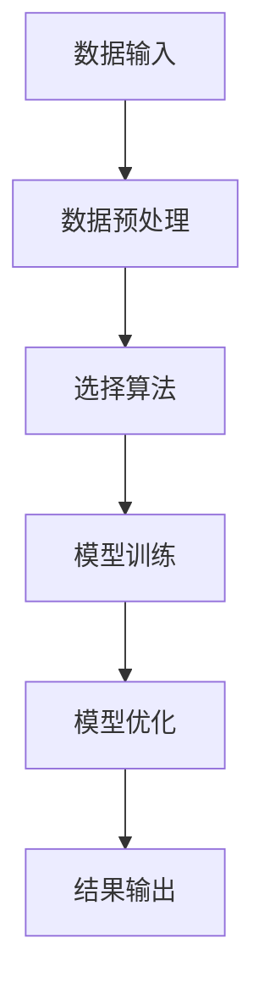
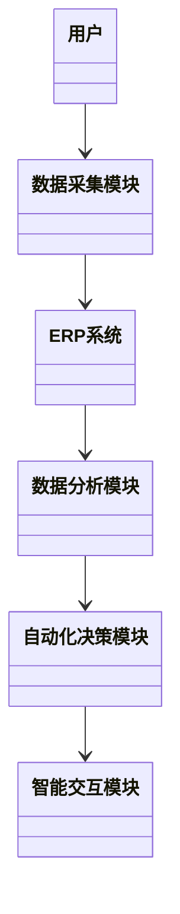

                 


# 构建智能企业资源规划(ERP)系统：AI深度集成与优化

> **关键词**：ERP系统，人工智能，深度集成，优化算法，系统架构，机器学习，数据分析  
>
> **摘要**：本文详细探讨了如何将人工智能技术深度集成到企业资源规划（ERP）系统中，以实现系统的智能化和优化。通过分析ERP系统的各个模块，结合AI技术的核心算法，本文提出了基于机器学习和深度学习的优化方案，并通过实际案例展示了AI在ERP系统中的应用效果。最后，本文总结了AI深度集成ERP系统的最佳实践和未来发展方向。

---

# 第1章: 背景介绍与核心概念

## 1.1 企业资源规划(ERP)系统的基本概念

### 1.1.1 ERP系统的定义与核心功能
企业资源规划（ERP）系统是一种集成了企业各个业务模块（如生产、供应链、财务、人力资源等）的信息化管理系统。其核心功能包括：

- **数据集成**：将企业各业务部门的数据整合到统一的平台中。
- **流程优化**：通过自动化流程减少人工干预，提高效率。
- **决策支持**：基于数据分析提供决策支持。

### 1.1.2 ERP系统的发展历程
ERP系统的发展经历了多个阶段：
1. **传统ERP阶段**：以数据录入和报表生成为主。
2. **集成化ERP阶段**：实现了业务模块的集成。
3. **智能化ERP阶段**：引入AI技术，实现智能化决策。

### 1.1.3 智能ERP系统的概念与特点
智能ERP系统通过AI技术（如机器学习、自然语言处理）实现数据的深度分析和智能决策。其特点包括：
- 数据驱动：基于实时数据进行分析和预测。
- 自动化：自动化处理业务流程。
- 智能决策：通过AI算法提供最优决策建议。

## 1.2 AI技术与ERP系统的结合

### 1.2.1 AI技术的基本概念
人工智能（AI）是指计算机系统模拟人类智能的能力，包括学习、推理、感知和语言理解等。

### 1.2.2 AI在ERP系统中的应用背景
随着企业数据的爆炸式增长，传统ERP系统在数据分析和决策支持方面的能力显得不足。AI技术的引入为ERP系统的优化提供了新的可能性。

### 1.2.3 AI深度集成ERP系统的必要性
通过AI技术，ERP系统可以实现以下功能：
- **预测分析**：预测销售、库存和供应链的需求。
- **自动化决策**：基于数据自动优化业务流程。
- **智能交互**：通过自然语言处理与用户进行交互。

---

# 第2章: 智能ERP系统的核心概念

## 2.1 ERP系统的核心模块

### 2.1.1 生产管理模块
- 负责生产计划、资源分配和生产监控。
- 数据包括生产订单、原材料库存、设备状态等。

### 2.1.2 供应链管理模块
- 负责采购、物流和库存管理。
- 数据包括供应商信息、采购订单、物流状态等。

### 2.1.3 财务管理模块
- 负责财务报表、预算管理和资金流动。
- 数据包括收入、支出、利润等。

### 2.1.4 人力资源管理模块
- 负责员工招聘、考勤和绩效管理。
- 数据包括员工信息、考勤记录、绩效数据等。

## 2.2 AI技术在ERP系统中的应用模块

### 2.2.1 数据分析与预测模块
- 使用机器学习算法对ERP系统中的数据进行分析和预测。
- 数据包括销售预测、库存需求预测等。

### 2.2.2 自动化决策模块
- 基于AI算法优化业务流程。
- 例如，自动调整生产计划以满足市场需求。

### 2.2.3 智能交互模块
- 使用自然语言处理技术与用户交互。
- 用户可以通过语音或文本输入查询数据或下达指令。

## 2.3 ERP系统与AI技术的实体关系图

```mermaid
er
actor: 用户
system: 智能ERP系统
module1: 数据采集模块
module2: 数据分析模块
module3: 自动化决策模块
module4: 智能交互模块

actor --> module1
module1 --> system
system --> module2
module2 --> module3
module3 --> module4
```

---

# 第3章: AI驱动的ERP系统算法原理

## 3.1 机器学习在ERP中的应用

### 3.1.1 机器学习的基本原理
机器学习是一种基于数据的模式识别技术，通过训练模型来预测或分类数据。

### 3.1.2 常见机器学习算法简介
- **线性回归**：用于预测连续型数据。
- **决策树**：用于分类和回归。
- **随机森林**：基于决策树的集成算法。
- **支持向量机（SVM）**：用于分类和回归。

### 3.1.3 机器学习在ERP中的应用场景
- **销售预测**：基于历史销售数据预测未来的销售量。
- **库存管理**：基于销售预测和生产计划优化库存。

## 3.2 基于深度学习的ERP优化算法

### 3.2.1 深度学习的基本原理
深度学习是一种基于人工神经网络的机器学习技术，能够处理复杂的数据模式。

### 3.2.2 基于LSTM的序列预测算法
- **LSTM（长短期记忆网络）**：用于时间序列数据的预测。
- 应用场景：销售预测、库存需求预测。

### 3.2.3 基于BERT的文本处理算法
- **BERT（双向端到端训练的深度注意网络）**：用于自然语言处理。
- 应用场景：智能交互模块的文本理解。

## 3.3 算法实现与优化

### 3.3.1 算法实现流程图



### 3.3.2 Python实现代码示例

```python
import numpy as np
from sklearn.model_selection import train_test_split

# 示例数据
X = np.random.rand(100, 10)  # 100个样本，10个特征
y = np.random.rand(100, 1)   # 目标变量

# 数据划分
X_train, X_test, y_train, y_test = train_test_split(X, y, test_size=0.2)

# 选择算法（线性回归）
from sklearn.linear_model import LinearRegression
model = LinearRegression()

# 模型训练
model.fit(X_train, y_train)

# 模型预测
y_pred = model.predict(X_test)

# 输出结果
print("预测值：", y_pred)
print("真实值：", y_test)
```

### 3.3.3 算法的数学模型和公式

- **线性回归模型**：  
  $$ y = \beta_0 + \beta_1 x_1 + \beta_2 x_2 + \dots + \beta_n x_n $$  
  其中，$\beta$ 是模型参数，$x$ 是输入特征。

- **LSTM网络结构**：  
  LSTM通过门控机制（遗忘门、输入门、输出门）处理时间序列数据，公式如下：  
  遗忘门：  
  $$ f_t = \sigma(W_f a_t + U_f h_{t-1} + b_f) $$  
  输入门：  
  $$ i_t = \sigma(W_i a_t + U_i h_{t-1} + b_i) $$  
  输出门：  
  $$ o_t = \sigma(W_o a_t + U_o h_{t-1} + b_o) $$  
  单元状态：  
  $$ s_t = f_t \cdot s_{t-1} + i_t \cdot \tilde{c}_t $$  
  隐藏层输出：  
  $$ h_t = o_t \cdot s_t $$  

---

# 第4章: 系统分析与架构设计方案

## 4.1 项目背景与目标
本项目旨在通过AI技术优化传统ERP系统的数据分析和决策支持功能，提升企业的运营效率。

## 4.2 系统功能设计

### 4.2.1 领域模型设计


### 4.2.2 系统架构设计


### 4.2.3 系统接口与交互设计
```mermaid
sequenceDiagram
    actor 用户
    system 智能ERP系统

    用户->系统: 查询销售数据
    系统->系统: 数据采集模块获取数据
    系统->系统: 数据分析模块进行分析
    系统->用户: 返回分析结果
```

---

# 第5章: 项目实战与案例分析

## 5.1 环境安装与配置

### 5.1.1 安装Python环境
- 使用Anaconda安装Python 3.8以上版本。

### 5.1.2 安装依赖库
```bash
pip install numpy scikit-learn transformers
```

## 5.2 系统核心实现代码

### 5.2.1 数据采集模块
```python
import pandas as pd

def collect_data():
    data = pd.DataFrame({
        '日期': ['2023-10-01', '2023-10-02', '2023-10-03'],
        '销售量': [100, 150, 200]
    })
    return data

data = collect_data()
print(data)
```

### 5.2.2 数据分析模块
```python
from sklearn.linear_model import LinearRegression

def train_model(X, y):
    model = LinearRegression()
    model.fit(X, y)
    return model

X = np.array([[100], [150], [200]])  # 特征
y = np.array([200, 300, 400])        # 目标
model = train_model(X, y)
print("模型训练完成，系数为：", model.coef_)
```

## 5.3 实际案例分析

### 5.3.1 案例背景
某制造企业希望优化其销售预测功能。

### 5.3.2 数据分析与建模
```python
import pandas as pd
from sklearn.model_selection import train_test_split

data = pd.DataFrame({
    '日期': ['2023-10-01', '2023-10-02', '2023-10-03'],
    '销售量': [100, 150, 200]
})

X = pd.get_dummies(data['日期'])
y = data['销售量']

X_train, X_test, y_train, y_test = train_test_split(X, y, test_size=0.2)

model = LinearRegression()
model.fit(X_train, y_train)
y_pred = model.predict(X_test)

print("预测销售量：", y_pred)
print("真实销售量：", y_test)
```

### 5.3.3 结果分析与优化
通过模型预测，企业可以提前规划生产和库存，减少库存积压和资金占用。

## 5.4 项目小结
通过AI技术的深度集成，企业可以显著提升ERP系统的数据分析和决策能力，实现更高效的业务运营。

---

# 第6章: 最佳实践与未来展望

## 6.1 最佳实践

### 6.1.1 小贴士
- 数据是AI的核心，确保数据的准确性和完整性。
- 在实际应用中，建议先从局部优化开始，再逐步扩展到全局优化。

### 6.1.2 注意事项
- 确保数据隐私和安全。
- 在AI模型上线前，进行充分的测试和验证。

## 6.2 未来展望
随着AI技术的不断进步，未来的智能ERP系统将更加智能化和自动化。例如：
- **自适应优化**：系统可以根据实时数据自动调整业务流程。
- **多模态交互**：支持语音、图像等多种交互方式。
- **边缘计算**：通过边缘计算实现低延迟的实时分析。

---

# 附录: 资源与工具推荐

## 1. Python库推荐
- **NumPy**：数值计算库。
- **Pandas**：数据分析库。
- **Scikit-learn**：机器学习库。
- **Transformers**：自然语言处理库。

## 2. 开发工具推荐
- **Jupyter Notebook**：交互式编程环境。
- **PyCharm**：Python IDE。
- **Docker**：容器化部署工具。

---

通过本文的详细讲解，我们可以看到，AI技术的深度集成正在为ERP系统带来前所未有的变革。未来，随着技术的进一步发展，智能ERP系统将在企业数字化转型中发挥更大的作用。

