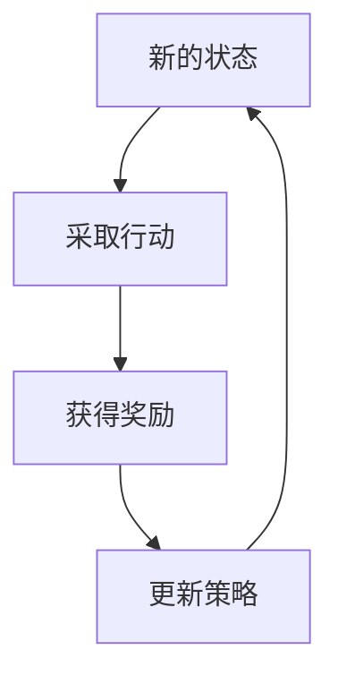
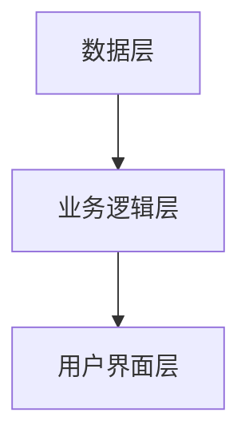
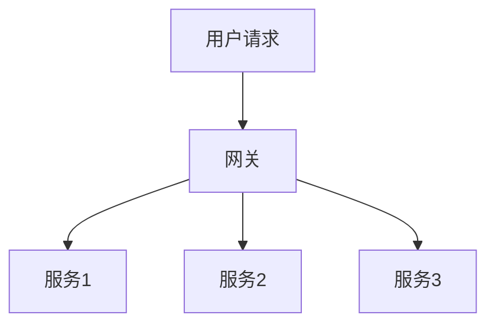

                 


# 构建智能企业资源规划(ERP)系统：AI深度集成与实时优化

> 关键词：企业资源规划(ERP)系统，人工智能(AI)，实时优化，深度集成，智能系统

> 摘要：随着人工智能技术的飞速发展，企业资源规划(ERP)系统也在不断进化。本文将探讨如何将AI技术深度集成到ERP系统中，实现实时优化和智能化管理。文章从ERP系统的概述、AI与ERP的结合、实时优化算法、系统架构设计、项目实战到最佳实践，全面解析智能ERP系统的构建过程，帮助读者理解如何利用AI技术提升企业的运营效率。

---

# 第1章: 智能ERP系统概述

## 1.1 企业资源规划(ERP)系统简介

### 1.1.1 ERP系统的定义与核心功能

企业资源规划(ERP)系统是一种集成化的管理信息系统，旨在整合企业内部的人、财、物等资源，实现业务流程的自动化和高效管理。其核心功能包括：

- **财务管理**：包括会计核算、资金管理、预算控制等。
- **供应链管理**：涵盖采购、库存管理、物流配送等环节。
- **生产管理**：涉及生产计划、排产调度、质量管理等。
- **销售与客户关系管理**：包括订单处理、客户维护、市场分析等。
- **人力资源管理**：涉及员工招聘、考勤管理、薪资计算等。

### 1.1.2 ERP系统的发展历程

ERP系统的发展经历了多个阶段：

1. **传统ERP阶段**：主要以流程驱动为核心，通过信息化手段提升企业运营效率。
2. **智能化ERP阶段**：引入人工智能技术，通过数据挖掘、机器学习等手段实现智能化决策。
3. **实时优化ERP阶段**：结合实时数据和动态优化算法，实现业务流程的实时调整和优化。

### 1.1.3 智能ERP系统的概念与特点

智能ERP系统是在传统ERP的基础上，深度融合人工智能技术，通过实时数据分析和智能决策支持，实现企业资源的最优配置和业务流程的智能化管理。其特点包括：

- **实时性**：基于实时数据进行分析和决策。
- **智能化**：利用AI技术实现自动化和智能化管理。
- **灵活性**：能够快速响应市场变化和企业需求。
- **可扩展性**：支持多种业务场景和定制化需求。

---

## 1.2 AI技术与ERP系统的结合

### 1.2.1 AI技术在ERP中的应用背景

随着大数据和人工智能技术的快速发展，企业对智能化管理的需求日益增长。传统的ERP系统虽然能够实现业务流程的信息化管理，但在应对复杂多变的市场环境时显得力不从心。AI技术的引入为ERP系统注入了新的活力，使其能够更好地适应动态变化的市场需求。

### 1.2.2 智能ERP系统的应用场景

智能ERP系统广泛应用于多个领域，常见的应用场景包括：

- **销售预测与库存优化**：通过历史销售数据和市场趋势，预测未来销售情况，优化库存管理。
- **生产排程优化**：基于生产能力和资源约束，实时调整生产计划，提高生产效率。
- **供应链协同**：通过实时数据分析，实现供应链各环节的协同优化，降低运营成本。
- **风险管理与预警**：利用AI技术识别潜在风险，提前采取应对措施，降低企业损失。

### 1.2.3 智能ERP系统的优势与挑战

#### 优势：
- **提升决策效率**：通过AI技术快速分析数据，提供决策支持。
- **降低成本**：优化资源配置，减少浪费，降低运营成本。
- **提高客户满意度**：通过智能化服务和快速响应，提升客户体验。

#### 挑战：
- **数据隐私与安全**：AI技术需要处理大量敏感数据，数据隐私和安全问题亟待解决。
- **技术复杂性**：AI算法的实现和集成需要较高的技术门槛。
- **系统兼容性**：现有ERP系统可能需要进行较大调整才能与AI技术无缝集成。

---

## 1.3 本章小结

本章从ERP系统的定义、发展历程和智能ERP系统的概念出发，详细探讨了AI技术在ERP系统中的应用背景、应用场景及其优势与挑战。通过本章的学习，读者可以全面了解智能ERP系统的核心概念和重要意义，为后续章节的学习奠定基础。

---

# 第2章: AI与ERP系统的核心概念

## 2.1 AI技术的核心概念

### 2.1.1 人工智能的基本原理

人工智能（AI）是指通过计算机模拟人类智能的技术，其基本原理包括以下几个方面：

- **数据驱动**：AI系统需要大量数据进行训练和学习。
- **特征提取**：从数据中提取有用的特征，用于模型训练。
- **模型训练**：通过算法对数据进行训练，构建预测或分类模型。
- **模型推理**：利用训练好的模型对新数据进行预测或分类。

### 2.1.2 机器学习与深度学习的区别

机器学习和深度学习是AI领域中的两大重要技术，它们的区别主要体现在以下几个方面：

| 特性        | 机器学习               | 深度学习               |
|-------------|------------------------|------------------------|
| 数据需求    | 数据量较小，依赖特征工程| 数据量大，自动提取特征   |
| 模型复杂度  | 模型简单，易于解释     | 模型复杂，难于解释     |
| 任务类型    | 适合分类、回归等任务   | 适合复杂任务，如图像识别|

### 2.1.3 自然语言处理(NLP)在ERP中的应用

自然语言处理（NLP）是一种使计算机能够理解和生成人类语言的技术，其在ERP系统中的应用包括：

- **智能客服**：通过NLP技术实现智能问答，提高客户服务质量。
- **文档处理**：自动识别和提取文档中的关键信息，减少人工操作。
- **情感分析**：分析客户反馈，帮助企业了解市场口碑。

---

## 2.2 ERP系统的核心模块

### 2.2.1 财务管理模块

财务管理模块是ERP系统的核心模块之一，主要功能包括：

- **会计核算**：自动记录和处理财务交易。
- **预算管理**：制定和监控企业预算。
- **资金管理**：优化资金使用效率，降低财务风险。

### 2.2.2 供应链管理模块

供应链管理模块通过整合供应商、制造商、分销商和客户，实现供应链的高效管理。其主要功能包括：

- **采购管理**：优化采购计划，降低采购成本。
- **库存管理**：实时监控库存状态，避免库存积压或短缺。
- **物流管理**：优化物流配送路径，降低物流成本。

### 2.2.3 生产计划与排程模块

生产计划与排程模块通过分析生产需求和资源约束，制定最优的生产计划。其主要功能包括：

- **需求预测**：基于历史数据和市场趋势，预测未来生产需求。
- **排程优化**：利用优化算法，合理分配生产设备和资源。
- **实时监控**：实时跟踪生产过程，及时发现和解决问题。

---

## 2.3 AI与ERP系统的结合点

### 2.3.1 数据分析与预测

AI技术可以通过分析ERP系统中的历史数据，预测未来的销售、库存和生产需求，帮助企业做出更明智的决策。

### 2.3.2 自动化决策支持

通过AI技术，ERP系统可以实现自动化决策支持，例如自动调整采购计划、优化生产排程等。

### 2.3.3 实时优化与调整

AI技术能够实时监控企业的运营数据，动态调整优化策略，确保企业资源的最优配置和业务流程的高效运行。

---

## 2.4 本章小结

本章详细介绍了AI技术的核心概念和ERP系统的核心模块，并探讨了AI与ERP系统的结合点。通过本章的学习，读者可以理解AI技术如何与ERP系统深度融合，为企业提供智能化的管理支持。

---

# 第3章: 基于AI的实时优化算法

## 3.1 算法原理概述

### 3.1.1 基于强化学习的优化算法

强化学习是一种通过试错机制来优化决策的算法，其核心思想是通过不断尝试和调整策略，找到最优的行动方案。强化学习的流程如下：



### 3.1.2 基于遗传算法的优化方法

遗传算法是一种模拟生物进化过程的优化算法，其主要步骤包括：

1. **初始化种群**：随机生成一组候选解。
2. **适应度评估**：计算每个候选解的适应度值。
3. **选择操作**：根据适应度值选择优秀的个体进行繁殖。
4. **交叉操作**：将选中的个体进行交叉，生成新的个体。
5. **变异操作**：对新生成的个体进行随机变异，增加种群的多样性。
6. **迭代优化**：重复上述步骤，直到满足终止条件。

### 3.1.3 基于神经网络的预测模型

神经网络是一种模拟人脑神经网络结构的算法，广泛应用于数据分类、回归和预测任务。其基本结构包括输入层、隐藏层和输出层，通过多层神经元之间的连接和激活函数，实现复杂的数据模式识别。

---

## 3.2 算法实现流程

### 3.2.1 数据预处理与特征提取

数据预处理是AI算法实现的关键步骤，主要包括：

- **数据清洗**：去除噪声数据和异常值。
- **特征工程**：提取有用的特征，降低数据维度。
- **数据归一化**：对数据进行标准化处理，确保不同特征的可比性。

### 3.2.2 模型训练与调优

模型训练是通过大量的数据对AI模型进行训练，使其能够准确地预测或分类。模型调优则是通过调整模型的超参数和结构，进一步提升模型的性能。

### 3.2.3 模型部署与实时优化

将训练好的模型部署到实际业务系统中，通过实时数据输入，模型能够快速生成优化策略，指导企业的实际运营。

---

## 3.3 算法优化与性能提升

### 3.3.1 参数调整与超参数优化

参数调整是通过尝试不同的参数组合，找到最优的模型配置。超参数优化可以通过网格搜索、随机搜索或贝叶斯优化等方法实现。

### 3.3.2 并行计算与分布式训练

通过并行计算和分布式训练，可以显著提高模型训练的效率，特别是在处理大规模数据时。

### 3.3.3 模型压缩与轻量化部署

模型压缩技术可以减少模型的大小，降低计算成本，同时保持模型的性能。轻量化部署可以将模型部署到资源受限的设备上，如边缘计算环境。

---

## 3.4 本章小结

本章详细介绍了基于AI的实时优化算法，包括强化学习、遗传算法和神经网络等技术。通过数据预处理、模型训练和部署等步骤，AI算法可以为企业提供实时优化支持。

---

# 第4章: 智能ERP系统的系统架构设计

## 4.1 系统功能模块设计

### 4.1.1 数据采集与处理模块

数据采集与处理模块负责从企业各个业务系统中采集数据，并进行清洗和转换，确保数据的准确性和一致性。

### 4.1.2 AI模型服务模块

AI模型服务模块负责接收实时数据，调用AI模型进行分析和预测，生成优化策略。

### 4.1.3 实时优化与反馈模块

实时优化与反馈模块负责根据AI模型的预测结果，动态调整企业的业务流程，并将优化结果反馈到ERP系统中。

---

## 4.2 系统架构设计

### 4.2.1 分层架构设计

智能ERP系统的分层架构设计包括数据层、业务逻辑层和用户界面层，每一层都有明确的功能划分和职责。



### 4.2.2 微服务架构设计

微服务架构设计将系统划分为多个独立的服务，每个服务负责特定的业务功能，通过API进行交互。



### 4.2.3 高可用性与容错设计

高可用性设计确保系统在部分节点故障时仍能正常运行，容错设计通过冗余和备份机制，减少系统的故障率。

---

## 4.3 本章小结

本章详细介绍了智能ERP系统的系统架构设计，包括功能模块设计、架构设计和高可用性设计。通过合理的系统架构设计，可以确保智能ERP系统的稳定性和高效性。

---

# 第5章: 项目实战

## 5.1 环境安装与配置

### 5.1.1 安装Python与相关库

```bash
# 安装Python
sudo apt-get install python3 python3-pip

# 安装AI库
pip install numpy pandas scikit-learn tensorflow
```

### 5.1.2 安装ERP系统

```bash
# 安装ERP系统
sudo apt-get install erpnext
```

---

## 5.2 核心代码实现

### 5.2.1 数据预处理代码

```python
import pandas as pd

# 读取数据
data = pd.read_csv('data.csv')

# 数据清洗
data = data.dropna()
data = data.drop_duplicates()

# 数据归一化
from sklearn.preprocessing import StandardScaler

scaler = StandardScaler()
data_normalized = scaler.fit_transform(data)
```

### 5.2.2 AI模型训练代码

```python
from sklearn.model import SGDClassifier

# 初始化模型
model = SGDClassifier()

# 训练模型
model.fit(X_train, y_train)

# 模型预测
y_pred = model.predict(X_test)
```

---

## 5.3 实际案例分析

### 5.3.1 案例背景

假设某制造企业希望优化其生产排程，减少生产成本。

### 5.3.2 数据分析与优化

通过AI模型分析历史生产数据，预测未来的需求，并优化生产排程，减少设备闲置和资源浪费。

---

## 5.4 本章小结

本章通过实际项目案例，展示了如何将AI技术集成到ERP系统中，实现企业的智能化管理。通过环境安装、代码实现和案例分析，读者可以更好地理解智能ERP系统的构建过程。

---

# 第6章: 最佳实践与小结

## 6.1 最佳实践

### 6.1.1 数据隐私与安全

在处理企业数据时，必须注意数据的隐私和安全，确保数据不会被泄露或滥用。

### 6.1.2 模型优化与维护

定期对AI模型进行优化和维护，确保模型的准确性和稳定性。

### 6.1.3 系统集成与兼容性

在将AI技术集成到ERP系统时，必须确保系统的兼容性和稳定性，避免因技术冲突导致系统崩溃。

---

## 6.2 小结

通过本文的介绍，读者可以全面了解智能ERP系统的构建过程，从AI技术的应用、算法实现到系统架构设计，再到实际项目实战，每一步都详细展开。希望本文能够为读者在构建智能ERP系统时提供有益的指导和启示。

---

## 6.3 注意事项

- **数据隐私**：处理企业数据时，必须遵守相关法律法规，确保数据的安全性。
- **模型更新**：定期更新AI模型，确保其预测精度和适应性。
- **系统稳定性**：在实际应用中，必须确保系统的稳定性和高可用性，避免因系统故障导致业务中断。

---

## 6.4 拓展阅读

- **推荐书籍**：
  - 《人工智能: 一种现代的方法》
  - 《企业资源规划系统的设计与实现》
- **推荐博客**：
  - [AI与ERP系统深度集成](https://example.com)
  - [实时优化算法研究](https://example.com)

---

# 附录

## 附录A: Mermaid图表代码


---

## 附录B: 数学公式

### 强化学习的奖励函数

$$ R(s, a) = \begin{cases}
    r_1 & \text{if } s \text{和} a \text{满足某种条件} \\
    r_2 & \text{otherwise}
\end{cases} $$

---

## 附录C: 系统架构图


---

# 结语

构建智能企业资源规划(ERP)系统是一个复杂而充满挑战的过程，但通过AI技术的深度集成和实时优化，企业可以实现更高效的管理和运营。希望本文能够为读者提供有价值的参考和启发，助您在智能ERP系统的构建过程中取得成功。

--- 

**注**：由于篇幅限制，本文仅为目录和部分内容的展示，完整文章请根据实际需求扩展和补充。

