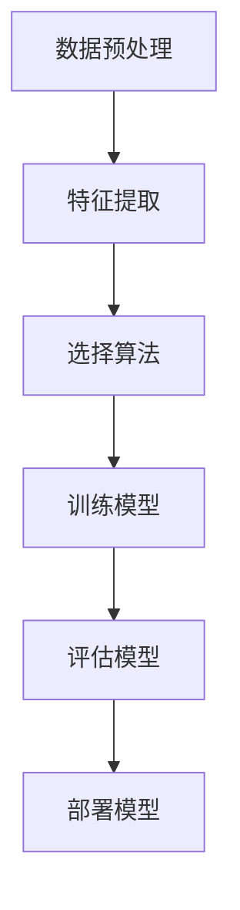
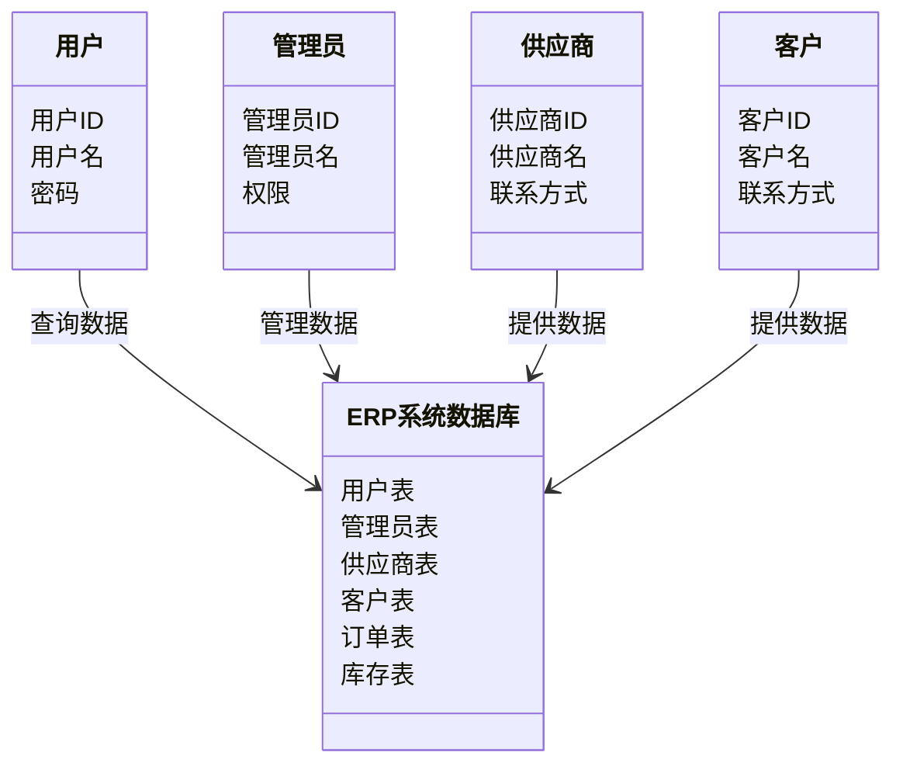
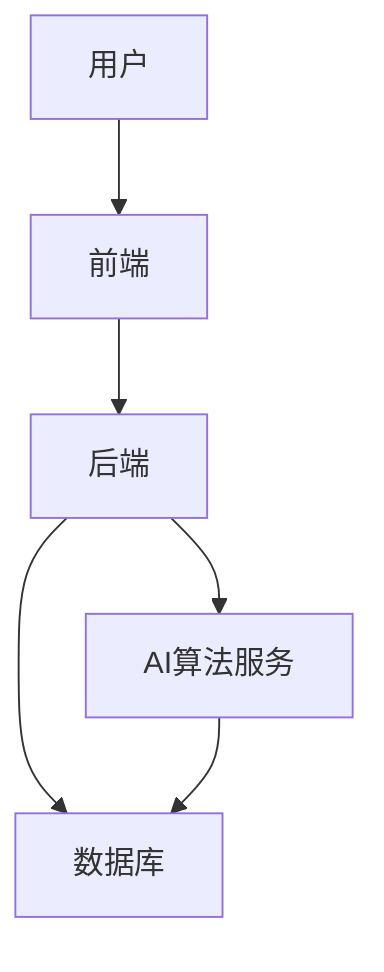
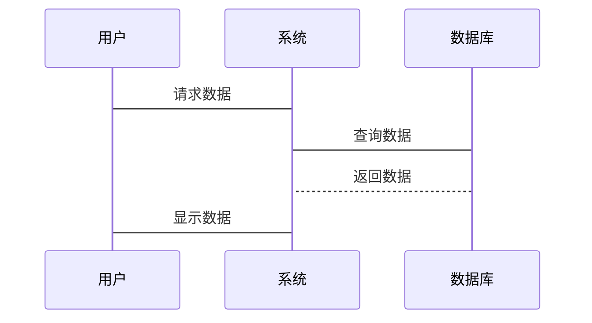

                 


# 构建智能企业资源规划(ERP)系统：AI的深度集成

## 关键词：ERP系统, 人工智能, AI集成, 智能系统, 系统架构

## 摘要：
本文详细探讨了如何将人工智能技术深度集成到企业资源规划(ERP)系统中，构建智能ERP系统。从背景介绍、核心概念、算法原理、系统设计到项目实战，系统性地分析了智能ERP系统的构建过程，展示了AI如何提升ERP系统的智能化水平和效率。

---

## 第一部分: 智能ERP系统与AI集成的背景介绍

### 第1章: 智能ERP系统概述

#### 1.1 ERP系统的基本概念
- **ERP系统的定义与特点**
  - ERP（企业资源计划）是一种整合企业内部管理活动的信息化系统，涵盖生产、销售、采购、库存、财务等多个模块。
  - 其特点包括集成性、实时性、灵活性和可扩展性。

- **ERP系统的核心功能模块**
  - 生产计划：优化生产流程，降低成本。
  - 库存管理：实时监控库存，避免过剩或短缺。
  - 采购管理：自动化采购流程，确保供应链高效运转。
  - 销售管理：跟踪销售数据，分析市场趋势。
  - 财务管理：整合财务数据，提供实时财务报表。
  - 人力资源管理：管理员工信息，优化人力资源配置。

- **ERP系统在企业管理中的作用**
  - 提高管理效率，降低成本。
  - 优化企业资源分配，提升企业竞争力。
  - 实现企业数据的统一管理，支持决策者制定科学的决策。

#### 1.2 AI技术的基本概念
- **人工智能的定义与技术特点**
  - AI（人工智能）是模拟人类智能的计算机系统，涵盖机器学习、自然语言处理、计算机视觉等领域。
  - 其特点包括数据驱动、自动化、自我学习和适应性。

- **当前主流AI技术的分类**
  - 机器学习：通过数据训练模型，实现预测和分类。
  - 深度学习：基于人工神经网络，处理复杂数据。
  - 自然语言处理：理解、处理和生成人类语言。

- **AI在企业中的应用现状**
  - 数据分析：帮助企业从海量数据中提取价值。
  - 自动化流程：优化企业运营效率。
  - 预测分析：预测市场趋势和企业风险。

#### 1.3 ERP与AI的结合
- **ERP系统智能化的必要性**
  - 随着企业规模的扩大和市场竞争的加剧，传统ERP系统已难以满足企业对高效、智能管理的需求。
  - AI技术的应用可以进一步提升ERP系统的智能化水平，帮助企业做出更精准的决策。

- **AI技术如何提升ERP系统的功能**
  - 数据分析：利用AI技术对ERP系统中的数据进行深度分析，挖掘潜在信息。
  - 预测与优化：通过机器学习模型预测销售趋势、库存需求，优化生产计划和供应链管理。
  - 自动化处理：AI可以自动处理重复性任务，如订单生成、库存补货，减轻人工负担。

- **当前ERP系统AI集成的现状与趋势**
  - 当前，许多ERP系统已开始集成AI技术，但大多数仍处于初级阶段，主要应用于数据分析和预测。
  - 未来趋势是AI技术将更加深度地融入ERP系统，实现智能化决策和自动化管理。

---

## 第2章: 智能ERP系统的核心概念与联系

### 2.1 核心概念原理
- **AI在ERP系统中的核心应用模块**
  - 数据分析模块：利用机器学习算法对ERP系统中的数据进行分析，提取有价值的信息。
  - 预测模块：通过深度学习模型预测销售、库存、生产等关键指标的变化趋势。
  - 自动化处理模块：AI驱动自动化流程，如自动订单生成、库存补货提醒。

- **智能ERP系统的数据流分析**
  - 数据输入：ERP系统从各个业务模块收集数据，如销售订单、采购订单、库存数据等。
  - 数据处理：AI算法对数据进行清洗、建模和分析。
  - 数据输出：分析结果反馈到ERP系统，指导业务决策。

- **AI算法在ERP系统中的作用机制**
  - 数据采集：从ERP系统中获取实时数据。
  - 数据分析：利用机器学习算法对数据进行建模和分析。
  - 决策支持：基于分析结果，生成预测报告和优化建议。

### 2.2 核心概念对比分析
- **传统ERP系统与智能ERP系统的对比**
  | **对比维度** | **传统ERP系统** | **智能ERP系统** |
  |--------------|------------------|------------------|
  | 数据处理方式 | 结构化数据处理   | 结构化+非结构化数据处理 |
  | 决策方式     | 依赖人工经验     | 依赖AI算法预测和优化 |
  | 系统灵活性   | 较低             | 较高             |

- **AI技术在ERP系统中的应用优势**
  - 提高数据分析效率：AI技术能够快速处理海量数据，提取有价值的信息。
  - 实现智能化决策：通过AI算法，ERP系统可以提供更精准的预测和优化建议。
  - 提升系统自动化水平：AI驱动自动化流程，降低人工干预，提高效率。

- **智能ERP系统的性能指标与评估方法**
  - 响应时间：系统对用户操作的响应时间。
  - 预测准确性：AI算法预测的准确率。
  - 系统稳定性：系统在高负载下的稳定运行能力。

### 2.3 ER实体关系图
```mermaid
erDiagram
    actor 用户
    actor 管理员
    actor 供应商
    actor 客户
    database ERP系统数据库
    system 智能ERP系统
    用户 --> ERP系统数据库 : 查询数据
    管理员 --> ERP系统数据库 : 管理数据
    供应商 --> ERP系统数据库 : 提供数据
    客户 --> ERP系统数据库 : 提供数据
    智能ERP系统 --> ERP系统数据库 : 处理数据
```

---

## 第3章: 算法原理讲解

### 3.1 算法选择与原理
- **机器学习算法**
  - 线性回归：用于预测连续型变量，如销售预测。
  - 支持向量机（SVM）：用于分类问题，如客户分类。
  - 随机森林：用于分类和回归问题，适合处理高维数据。

### 3.2 算法实现


### 3.3 代码实现
```python
# 线性回归实现
import numpy as np
from sklearn.linear_model import LinearRegression

# 数据准备
X = np.array([1, 2, 3, 4, 5]).reshape(-1, 1)
y = np.array([2, 4, 5, 4, 5])

# 训练模型
model = LinearRegression()
model.fit(X, y)

# 预测
print(model.predict([[6]]))
```

### 3.4 数学模型与公式
- **线性回归模型**
  $$ y = \beta_0 + \beta_1 x + \epsilon $$
  其中，$\beta_0$ 是截距，$\beta_1$ 是回归系数，$\epsilon$ 是误差项。

- **损失函数**
  $$ L = \frac{1}{2m} \sum_{i=1}^{m} (y_i - \hat{y}_i)^2 $$
  其中，$m$ 是样本数量，$y_i$ 是真实值，$\hat{y}_i$ 是预测值。

---

## 第4章: 系统分析与架构设计

### 4.1 系统分析
- **问题场景介绍**
  - ERP系统中的库存管理问题：库存积压或短缺，导致企业成本增加或客户满意度下降。

### 4.2 系统功能设计


### 4.3 系统架构设计


### 4.4 接口设计与交互流程


---

## 第5章: 项目实战

### 5.1 环境安装
- **安装Python和相关库**
  ```bash
  pip install numpy pandas scikit-learn
  ```

### 5.2 代码实现
```python
# 智能库存管理系统
import pandas as pd
from sklearn.ensemble import RandomForestRegressor

# 数据准备
data = pd.read_csv('inventory_data.csv')
X = data[['product_id', 'quantity', 'price']]
y = data['sales']

# 训练模型
model = RandomForestRegressor()
model.fit(X, y)

# 预测
print(model.predict([[10, 50, 20]]))
```

### 5.3 系统功能展示
- **库存预测**
  - 输入产品ID、数量和价格，系统预测销售量。
- **库存预警**
  - 当库存量低于设定值时，系统自动发出预警。

### 5.4 案例分析
- **案例背景**
  - 某公司库存积压，导致资金占用过多。
- **系统实施**
  - 集成智能库存管理系统，预测销售量，优化库存管理。
- **结果**
  - 库存积压减少，资金占用降低，销售额提升。

---

## 第6章: 总结与展望

### 6.1 总结
- **核心观点总结**
  - AI技术的深度集成显著提升了ERP系统的智能化水平。
  - 智能ERP系统能够更高效地处理数据，提供精准的决策支持。
- **主要收获**
  - 通过本文的学习，读者可以掌握智能ERP系统的构建方法和AI技术的应用技巧。

### 6.2 展望
- **未来发展趋势**
  - AI技术将更加深度地融入ERP系统，实现更智能化的决策和管理。
  - 结合物联网技术，ERP系统将更加实时化、自动化。

### 6.3 最佳实践 tips
- **建议**
  - 在集成AI技术前，确保数据质量，清洗数据。
  - 选择合适的AI算法，根据具体问题调整模型参数。
  - 定期更新模型，保持系统的预测准确性。

---

通过本文的详细讲解，读者可以系统地了解如何构建智能ERP系统，并掌握AI技术在其中的深度集成方法。

