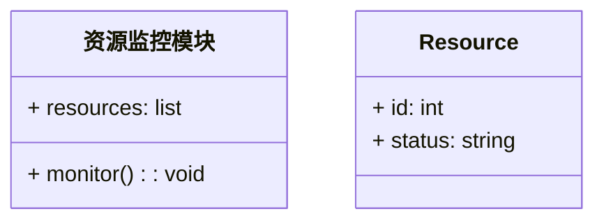
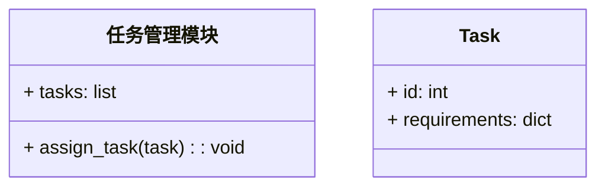
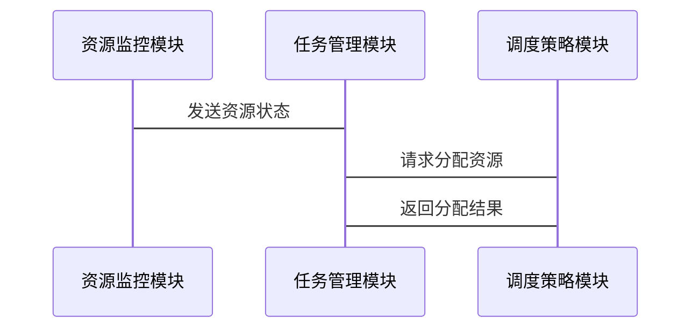

                 


# 构建智能企业资源调度系统：AI优化资源分配

## 关键词：企业资源调度，AI优化，资源分配，强化学习，遗传算法，系统架构

## 摘要：随着企业规模的不断扩大和资源管理复杂性的增加，传统的资源调度方法逐渐暴露出效率低下、资源浪费等问题。本文将探讨如何利用人工智能技术优化资源分配，构建智能企业资源调度系统。通过分析资源调度的核心问题，介绍基于强化学习、遗传算法等AI技术的优化方法，并结合系统架构设计、项目实战案例，深入剖析如何实现高效、智能的资源调度，为企业资源管理提供新的思路。

---

# 第1章: 问题背景与资源调度系统介绍

## 1.1 问题背景

### 1.1.1 企业资源调度的核心问题
企业在生产和运营过程中，常常需要对有限的资源（如设备、人员、资金、时间等）进行合理分配，以满足不同的任务需求。然而，资源调度问题往往面临以下挑战：
- **资源有限性**：企业资源通常是有限的，如何在多个需求之间进行最优分配是关键。
- **任务多样性**：任务的类型、优先级和需求各不相同，增加了调度的复杂性。
- **动态变化**：外部环境和内部需求的变化可能导致资源分配方案需要频繁调整。

### 1.1.2 资源调度的定义
资源调度系统是指通过算法和模型，对企业的资源进行规划、分配和监控，以确保资源的高效利用和任务的按时完成。

### 1.1.3 AI技术在资源调度中的应用潜力
人工智能技术，尤其是强化学习、遗传算法和机器学习，为资源调度问题提供了新的解决方案。AI能够通过数据驱动的方式，找到最优的资源分配策略，从而提高效率和降低成本。

## 1.2 智能资源调度系统定义

### 1.2.1 系统定义与核心目标
智能资源调度系统是一种基于AI技术的自动化资源管理工具，其核心目标是通过优化算法，实现资源的高效分配和动态调整。

### 1.2.2 系统的主要功能模块
- **资源监控模块**：实时监控资源的使用情况和状态。
- **任务管理模块**：接收和处理任务需求，包括任务类型、优先级和截止时间。
- **调度策略模块**：根据当前资源和任务情况，生成最优的资源分配方案。

### 1.2.3 系统的边界与外延
系统的边界包括企业内部的资源和任务，外延则涉及与外部供应商、客户之间的资源协调。

## 1.3 资源调度系统的核心要素

### 1.3.1 资源类型与属性
- **资源类型**：设备、人员、资金、时间等。
- **资源属性**：可用性、优先级、成本、性能等。

### 1.3.2 任务需求与优先级
- **任务需求**：任务类型、所需资源、时间约束等。
- **优先级**：任务的重要性和紧急程度。

### 1.3.3 调度策略与优化目标
- **调度策略**：基于规则的调度、基于AI的调度。
- **优化目标**：最小化成本、最大化效率、满足时间约束等。

## 1.4 本章小结
本章介绍了企业资源调度的核心问题、定义和系统架构，为后续的AI优化方法奠定了基础。

---

# 第2章: AI优化资源分配的理论基础

## 2.1 强化学习在资源调度中的应用

### 2.1.1 强化学习的基本原理
强化学习是一种通过试错方式优化决策的算法。智能体通过与环境交互，学习最优策略以最大化累积奖励。

### 2.1.2 状态空间与动作空间的定义
- **状态空间**：表示环境的状态，例如当前资源使用情况。
- **动作空间**：表示智能体可以执行的动作，例如分配资源给某个任务。

### 2.1.3 奖励机制的设计
奖励机制是强化学习的核心。合理的奖励设计能够引导智能体学习最优策略。

## 2.2 资源分配的数学模型

### 2.2.1 线性规划与整数规划模型
线性规划（Linear Programming, LP）和整数规划（Integer Programming, IP）是资源分配问题的常用数学模型。

#### 示例：
$$
\text{目标函数：} \quad \min \sum_{i} c_i x_i
$$
$$
\text{约束条件：} \quad \sum_{i} a_i x_i \leq b
$$
其中，\(x_i\) 是决策变量，\(c_i\) 是成本系数，\(a_i\) 是资源消耗系数，\(b\) 是资源上限。

### 2.2.2 调度问题的数学表达
调度问题通常可以表示为一个优化问题，目标是在满足约束条件下最大化或最小化某个目标函数。

### 2.2.3 多目标优化的权重分配
多目标优化问题需要在多个目标之间找到平衡点。权重分配是实现这一目标的重要手段。

## 2.3 资源分配的核心算法

### 2.3.1 基于强化学习的调度算法
强化学习算法通过与环境的交互，逐步优化资源分配策略。例如，使用Q-learning算法进行资源分配。

#### 示例代码：
```python
import numpy as np

# 状态空间和动作空间
state_space = [0, 1, 2]
action_space = [0, 1, 2]

# Q表初始化
Q = np.zeros((3, 3))

# 学习率和折扣因子
alpha = 0.1
gamma = 0.9

# 强化学习过程
for episode in range(100):
    state = 0
    while True:
        action = np.argmax(Q[state])
        next_state = ...  # 根据动作更新状态
        reward = ...  # 计算奖励
        Q[state][action] = Q[state][action] * (1 - alpha) + alpha * (reward + gamma * np.max(Q[next_state]))
```

### 2.3.2 基于遗传算法的优化策略
遗传算法是一种模拟自然选择过程的优化算法，适用于复杂的资源分配问题。

#### 示例代码：
```python
import numpy as np

# 初始化种群
population = np.random.rand(pop_size, num_genes)

# 适应度函数
def fitness(individual):
    return np.sum(individual)

# 选择、交叉和变异操作
selected = selection(population)
new_population = crossover(selected)
new_population = mutate(new_population)
```

### 2.3.3 基于贪心算法的近似解
贪心算法是一种简单有效的优化方法，适用于某些特定的资源分配问题。

#### 示例代码：
```python
def greedy_algorithm(tasks, resources):
    tasks.sort(key=lambda x: x['priority'])
    allocation = {}
    for task in tasks:
        resource = select_resource(task, resources)
        allocate_resource(task, resource)
```

## 2.4 本章小结
本章介绍了强化学习、遗传算法和贪心算法的基本原理，并通过代码示例展示了它们在资源分配中的应用。

---

# 第3章: 系统架构设计方案

## 3.1 系统功能模块设计

### 3.1.1 资源监控模块
资源监控模块负责实时监控企业资源的使用情况。

#### 类图展示


### 3.1.2 任务管理模块
任务管理模块负责接收和处理任务需求。

#### 类图展示


### 3.1.3 调度策略模块
调度策略模块根据当前资源和任务情况，生成最优的资源分配方案。

#### 类图展示


## 3.2 系统架构设计

### 3.2.1 分层架构设计
系统架构采用分层设计，包括数据层、业务逻辑层和表现层。

#### 架构图展示


### 3.2.2 微服务架构实现
系统采用微服务架构，每个功能模块独立部署，便于扩展和维护。

#### 架构图展示
```mermaid
serviceDiagram
    service1 --> service2
    service2 --> service3
```

### 3.2.3 数据流与控制流设计
数据流和控制流是系统设计的重要部分，确保各个模块之间的高效协同。

#### 交互图展示


## 3.3 接口设计与交互流程

### 3.3.1 接口设计
系统设计了RESTful API接口，供其他模块调用。

#### 接口示例：
```http
POST /api/resources/allocate
{
    "tasks": [...],
    "constraints": {...}
}
```

### 3.3.2 交互流程
交互流程包括资源监控、任务接收、调度策略生成和资源分配。

#### 流程图展示


## 3.4 本章小结
本章详细设计了智能资源调度系统的架构，包括功能模块、系统架构和交互流程。

---

# 第4章: 项目实战

## 4.1 环境安装

### 4.1.1 安装Python环境
使用Anaconda或virtualenv安装Python环境，并安装必要的库（如numpy、pandas、scikit-learn等）。

#### 示例代码：
```bash
pip install numpy pandas scikit-learn
```

### 4.1.2 安装算法库
安装强化学习和遗传算法库，例如TensorFlow、Keras和DEAP。

#### 示例代码：
```bash
pip install tensorflow keras-deep learning
pip install DEAP
```

## 4.2 系统核心实现

### 4.2.1 强化学习调度算法实现
实现基于强化学习的资源调度算法。

#### 示例代码：
```python
import numpy as np
import gym

# 自定义环境
class ResourceDispatchEnv(gym.Env):
    def __init__(self):
        self.state = 0
        self.action_space = gym.spaces.Discrete(3)
        self.observation_space = gym.spaces.Discrete(3)

    def step(self, action):
        # 更新状态和奖励
        pass

    def reset(self):
        # 初始化环境
        return 0

# 强化学习训练
env = ResourceDispatchEnv()
model = DQN(env)
model.train()
```

### 4.2.2 调度策略模块实现
实现资源分配的核心算法，如遗传算法。

#### 示例代码：
```python
from deap import base, creator, tools

# 定义适应度函数
creator.create("FitnessMax", base.Fitness, weights=(1.0,))

# 定义个体
creator.create("Individual", list, fitness=creator.FitnessMax())

# 工具箱
toolbox = tools.Toolbox()
toolbox.register("attr_float", np.random.random)
toolbox.register("individual", creator.Individual, n=3)
toolbox.register("population", list, creator.Individual)
```

## 4.3 功能解读与分析

### 4.3.1 功能模块实现
详细解读各个功能模块的实现方式，包括资源监控、任务管理、调度策略模块。

### 4.3.2 算法实现细节
分析强化学习和遗传算法的具体实现，包括网络结构、奖励机制和适应度函数。

## 4.4 实际案例分析

### 4.4.1 案例背景
介绍一个实际的企业资源调度案例，例如制造企业的设备调度问题。

### 4.4.2 数据准备
准备所需的数据，包括任务需求、资源可用性等。

### 4.4.3 实施过程
详细描述资源调度系统的实施过程，包括数据输入、算法运行和结果输出。

### 4.4.4 结果分析
分析算法输出的结果，比较传统方法和AI优化方法的优劣。

## 4.5 项目小结
总结项目实施的经验和教训，提出改进建议。

---

# 第5章: 系统优化与高级主题

## 5.1 系统优化策略

### 5.1.1 多目标优化
在资源分配中，通常需要考虑多个目标，如成本最低、效率最高、时间最短等。

#### 示例代码：
```python
import numpy as np

# 多目标优化
def multi_objective_optimization(tasks, resources):
    pass
```

### 5.1.2 分布式调度
对于大规模的企业，分布式调度是一种有效的优化策略。

#### 示例代码：
```python
import multiprocessing

# 分布式调度
def distribute_dispatch(tasks, resources):
    pass
```

## 5.2 实时反馈与动态调整

### 5.2.1 实时监控机制
系统需要实时监控资源使用情况，动态调整调度策略。

### 5.2.2 基于反馈的优化
根据实时反馈信息，优化资源分配策略。

---

# 第6章: 总结与展望

## 6.1 总结

### 6.1.1 本章内容回顾
总结本文的主要内容，包括问题背景、AI优化方法、系统架构和项目实战。

### 6.1.2 核心观点总结
强调AI在资源调度中的重要作用，总结AI优化资源分配的优势和局限性。

## 6.2 展望

### 6.2.1 未来研究方向
提出未来的研究方向，如更高效的算法、更智能的系统架构等。

### 6.2.2 技术发展趋势
预测资源调度系统的发展趋势，如与物联网、区块链等技术的结合。

---

# 第7章: 最佳实践与注意事项

## 7.1 最佳实践

### 7.1.1 系统设计原则
包括模块化设计、可扩展性、可维护性等。

### 7.1.2 开发注意事项
包括数据处理、算法选择、性能优化等。

## 7.2 注意事项

### 7.2.1 数据质量问题
强调数据质量和数据清洗的重要性。

### 7.2.2 算法选择策略
根据具体问题选择合适的算法。

## 7.3 拓展阅读

### 7.3.1 推荐书籍
推荐一些与资源调度和AI优化相关的书籍。

### 7.3.2 技术博客与论文
推荐一些相关的技术博客和学术论文。

---

# 附录: 代码示例

## 附录A: 强化学习调度算法代码

```python
import numpy as np
import gym

class ResourceDispatchEnv(gym.Env):
    def __init__(self):
        self.state = 0
        self.action_space = gym.spaces.Discrete(3)
        self.observation_space = gym.spaces.Discrete(3)
    
    def step(self, action):
        # 更新状态和奖励
        pass
    
    def reset(self):
        return 0

model = DQN(ResourceDispatchEnv())
model.train()
```

## 附录B: 遗传算法实现代码

```python
from deap import base, creator, tools

creator.create("FitnessMax", base.Fitness, weights=(1.0,))
creator.create("Individual", list, fitness=creator.FitnessMax())

toolbox = tools.Toolbox()
toolbox.register("attr_float", np.random.random)
toolbox.register("individual", creator.Individual, n=3)
toolbox.register("population", list, creator.Individual)
```

---

# 结语

构建智能企业资源调度系统是一项复杂的工程，需要结合AI技术、系统架构设计和实际应用案例。通过本文的探讨，读者可以深入了解AI优化资源分配的核心思想和实现方法，为企业资源管理提供新的思路和解决方案。

