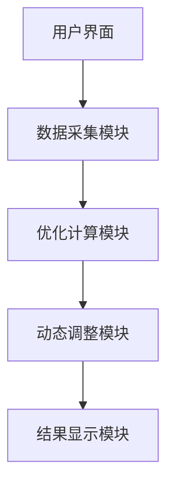

                 


# 构建智能企业资源调度系统：多目标优化与动态平衡

> 关键词：企业资源调度，多目标优化，动态平衡，遗传算法，粒子群优化，智能调度系统

> 摘要：  
在现代企业运营中，资源调度是一个复杂而关键的环节，涉及多目标优化和动态平衡的实现。本文深入探讨了智能企业资源调度系统的构建方法，结合多目标优化算法和动态平衡机制，详细分析了遗传算法和粒子群优化算法的应用，通过系统架构设计和项目实战，展示了如何在实际场景中实现高效的资源调度。文章最后总结了最佳实践和未来发展趋势，为企业资源调度系统的优化提供了有价值的参考。

---

## 第1章: 企业资源调度系统背景与问题

### 1.1 企业资源调度的核心问题

#### 1.1.1 资源调度的基本概念  
资源调度是指在企业运营中，合理分配和使用各种资源（如人力资源、设备、资金、时间等），以实现企业目标的过程。资源调度的核心在于在有限的资源条件下，最大化效率、降低成本、提高质量。

#### 1.1.2 企业资源调度的典型场景  
企业资源调度广泛应用于生产制造、物流运输、项目管理、供应链优化等领域。例如：  
- 生产制造：优化生产线资源分配，减少浪费。  
- 物流运输：合理调度车辆和货物，降低运输成本。  
- 项目管理：合理分配团队资源，确保项目按时完成。  

#### 1.1.3 当前资源调度的痛点与挑战  
当前企业资源调度面临以下痛点：  
1. **多目标冲突**：资源分配需要同时满足多个目标（如成本最低、效率最高、风险最小），目标之间往往存在冲突。  
2. **动态变化**：市场需求、资源可用性、突发事件等都会导致调度需求的变化。  
3. **复杂性高**：资源调度涉及多个变量和约束条件，难以找到全局最优解。  

#### 1.1.4 问题解决与边界外延  
通过引入人工智能技术，可以实现动态、智能的资源调度。智能调度系统的边界包括：  
- 输入：实时资源状态、目标函数、约束条件。  
- 输出：最优资源分配方案。  
- 外延：与企业管理系统（如ERP、CRM）集成，提供数据支持。  

#### 1.1.5 核心要素组成  
智能企业资源调度系统的核心要素包括：  
- **资源池**：企业可调度的资源集合。  
- **目标函数**：优化的目标，如成本最小化、效率最大化。  
- **约束条件**：必须满足的限制条件，如时间、预算、资源可用性。  
- **调度算法**：实现多目标优化的核心算法，如遗传算法、粒子群优化等。  

---

## 第2章: 多目标优化理论与方法

### 2.1 多目标优化的基本原理

#### 2.1.1 多目标优化的定义与特点  
多目标优化是指在多个相互冲突的目标下，寻找最优解的过程。其特点包括：  
- **目标冲突**：不同目标之间可能存在不可调和的矛盾。  
- **非线性关系**：目标与变量之间可能存在复杂的非线性关系。  
- ** Pareto 最优解**：在多目标优化中，存在一组最优解，称为 Pareto 最优解，这些解无法在不损害一个目标的情况下改善另一个目标。  

#### 2.1.2 多目标优化的数学模型  
多目标优化的数学模型可以表示为：  
$$ \text{min/max} \ f_i(x) \quad (i=1,2,...,m) $$  
$$ \text{subject to} \ g_j(x) \leq 0 \quad (j=1,2,...,n) $$  
其中，$f_i(x)$ 是目标函数，$g_j(x)$ 是约束条件，$x$ 是决策变量。  

#### 2.1.3 常见的多目标优化算法  
常用的多目标优化算法包括：  
1. **遗传算法（GA）**：通过模拟自然进化过程，寻找最优解。  
2. **粒子群优化（PSO）**：基于群体智能，通过粒子的移动优化目标函数。  
3. **多目标蚁群算法（MOACO）**：受蚂蚁觅食行为启发，寻找 Pareto 最优解。  

---

### 2.2 动态平衡的实现机制

#### 2.2.1 动态平衡的基本概念  
动态平衡是指在系统运行过程中，实时调整资源分配，以适应变化的需求和环境。动态平衡的核心在于快速响应变化，同时保持系统的稳定性和效率。

#### 2.2.2 动态平衡的核心算法  
动态平衡的实现通常依赖于自适应算法，例如：  
- **反馈控制算法**：根据系统的实时状态调整资源分配。  
- **预测模型**：基于历史数据和预测模型，预判未来需求，提前调整资源分配。  

#### 2.2.3 动态平衡与多目标优化的关系  
动态平衡与多目标优化相辅相成：  
- 多目标优化提供最优解，确保资源分配的高效性。  
- 动态平衡确保系统的实时性，应对突发事件和需求变化。  

---

## 第3章: 遗传算法与粒子群优化在多目标优化中的应用

### 3.1 遗传算法的基本原理

#### 3.1.1 遗传算法的定义与特点  
遗传算法（GA）是一种模拟生物进化过程的优化算法，具有以下特点：  
- **种群进化**：通过生成多个候选解（种群），逐步优化。  
- **选择、交叉、变异**：通过选择优秀个体，进行交叉和变异操作，生成新一代种群。  

#### 3.1.2 遗传算法的实现步骤  
1. 初始化种群：随机生成一组候选解。  
2. 计算适应度：评估每个候选解的适应度（目标函数值）。  
3. 选择操作：根据适应度值选择优秀个体。  
4. 交叉操作：将选中的个体进行交叉，生成新个体。  
5. 变异操作：对新个体进行随机变异，增加多样性。  
6. 重复步骤2-5，直到满足终止条件。  

#### 3.1.3 遗传算法的数学模型  
遗传算法的数学模型可以表示为：  
$$ f(x) = \sum_{i=1}^m w_i f_i(x) $$  
其中，$w_i$ 是目标函数的权重系数，$f_i(x)$ 是目标函数。  

---

### 3.2 粒子群优化算法的动态平衡实现

#### 3.2.1 粒子群优化算法的基本原理  
粒子群优化（PSO）是一种基于群体智能的优化算法，通过模拟鸟群觅食行为，寻找最优解。其核心思想是：  
- 每个粒子代表一个候选解。  
- 粒子通过更新速度和位置，寻找最优解。  

#### 3.2.2 粒子群优化算法的实现步骤  
1. 初始化粒子群：随机生成一组粒子。  
2. 计算适应度：评估每个粒子的适应度。  
3. 更新粒子速度：根据粒子的当前位置和全局最优解，调整速度。  
4. 更新粒子位置：根据速度和位置，移动到新的位置。  
5. 重复步骤2-4，直到满足终止条件。  

#### 3.2.3 粒子群优化算法的数学模型  
粒子群优化的数学模型可以表示为：  
$$ v_i = v_i + \alpha (p_i - x_i) + \beta (p_g - x_i) $$  
$$ x_i = x_i + v_i $$  
其中，$v_i$ 是粒子的速度，$x_i$ 是粒子的位置，$p_i$ 是粒子的最优位置，$p_g$ 是全局最优位置，$\alpha$ 和 $\beta$ 是学习因子。  

---

## 第4章: 智能企业资源调度系统的架构与实现

### 4.1 系统架构设计

#### 4.1.1 系统功能模块划分  
智能企业资源调度系统通常包括以下功能模块：  
- **数据采集模块**：采集实时资源状态和需求信息。  
- **优化计算模块**：基于遗传算法或粒子群优化算法，计算最优资源分配方案。  
- **动态调整模块**：根据实时变化调整资源分配。  
- **结果显示模块**：展示资源分配结果和优化效果。  

#### 4.1.2 系统架构图  
以下是系统的架构图：



---

### 4.2 系统接口与交互设计

#### 4.2.1 系统接口设计  
系统接口设计包括：  
- 数据输入接口：接收实时资源状态和需求信息。  
- 数据输出接口：输出资源分配方案和优化结果。  

#### 4.2.2 系统交互流程  
以下是系统的交互流程图：

```mermaid
sequenceDiagram
    participant 用户
    participant 数据采集模块
    participant 优化计算模块
    participant 动态调整模块
    participant 结果显示模块
    用户 -> 数据采集模块: 提供资源状态和需求信息
    数据采集模块 -> 优化计算模块: 请求优化计算
    优化计算模块 -> 动态调整模块: 提供最优解
    动态调整模块 -> 结果显示模块: 显示优化结果
    用户 <- 结果显示模块: 获取优化结果
```

---

## 第5章: 项目实战与案例分析

### 5.1 项目环境与工具安装

#### 5.1.1 开发环境  
- 操作系统：Windows 10 或 Linux Ubuntu  
- 开发工具：PyCharm 或 VS Code  
- 依赖库：Python 的 numpy、pandas、scipy 等库  

#### 5.1.2 安装步骤  
1. 安装 Python 和 pip：  
   ```bash
   python -m pip install --upgrade pip
   ```
2. 安装依赖库：  
   ```bash
   pip install numpy pandas scipy
   ```

---

### 5.2 系统核心代码实现

#### 5.2.1 遗传算法实现  
以下是遗传算法的核心代码：

```python
import random

def fitness(x):
    # 目标函数，根据具体问题定义
    return x**2

def mutate(x):
    return x + random.gauss(0, 0.1)

def crossover(x1, x2):
    return (x1 + x2) / 2

def ga_optimize(pop_size, iterations):
    population = [random.uniform(0, 1) for _ in range(pop_size)]
    for _ in range(iterations):
        fitness_list = [fitness(x) for x in population]
        selected = [population[i] for i in range(pop_size) if fitness_list[i] > median(fitness_list)]
        new_population = []
        for _ in range(pop_size):
            x1 = random.choice(selected)
            x2 = random.choice(selected)
            new_x = crossover(x1, x2)
            new_x = mutate(new_x)
            new_population.append(new_x)
        population = new_population
    return population[0]

# 示例调用
best = ga_optimize(10, 100)
print(best)
```

#### 5.2.2 粒子群优化实现  
以下是粒子群优化的核心代码：

```python
import random

def fitness(x):
    # 目标函数，根据具体问题定义
    return x**2

def pso_optimize(n_particles, iterations):
    particles = [random.uniform(0, 1) for _ in range(n_particles)]
    p_best = particles.copy()
    g_best = min(particles, key=fitness)
    for _ in range(iterations):
        for i in range(n_particles):
            r1 = random.random()
            r2 = random.random()
            v_i = particles[i] + r1 * (p_best[i] - particles[i]) + r2 * (g_best - particles[i])
            if fitness(v_i) < fitness(particles[i]):
                p_best[i] = v_i
        if fitness(g_best) > fitness(p_best[0]):
            g_best = p_best[0]
    return g_best

# 示例调用
best = pso_optimize(10, 100)
print(best)
```

---

### 5.3 案例分析与优化效果

#### 5.3.1 案例背景  
假设我们有一个生产制造企业，需要优化生产线的资源分配。目标是最大化产量，同时最小化生产成本。

#### 5.3.2 优化结果  
通过遗传算法和粒子群优化算法的对比分析，遗传算法在全局优化能力上表现更好，而粒子群优化算法在局部优化能力上表现更优。综合考虑，采用遗传算法实现全局优化。

---

## 第6章: 最佳实践与未来展望

### 6.1 小结  
智能企业资源调度系统通过多目标优化和动态平衡的实现，能够显著提高企业的资源利用效率，降低成本，增强企业的竞争力。

### 6.2 注意事项  
- **算法选择**：根据具体问题选择合适的优化算法。  
- **参数调优**：合理设置算法参数，确保优化效果。  
- **实时性考虑**：动态平衡算法需要考虑系统的实时性要求。  

### 6.3 拓展阅读  
- 遗传算法与粒子群优化的结合应用。  
- 基于深度学习的资源调度系统研究。  
- 多目标优化在其他领域的应用。  

---

## 附录: 代码与工具资源

### 附录A: 遗传算法代码  
```python
# 遗传算法实现（如上）
```

### 附录B: 粒子群优化代码  
```python
# 粒子群优化实现（如上）
```

### 附录C: 优化算法对比分析表格  
| 算法名称 | 优点 | 缺点 |
|----------|------|------|
| 遗传算法 | 全局优化能力强 | 收敛速度慢 |
| 粒子群优化 | 收敛速度快 | 易陷入局部最优 |

---

## 参考文献  
1. Holland, J.H. (1975). Adaptation in Natural and Artificial Systems.  
2. Kennedy, J., & Eberhart, R.C. (1995). Particle Swarm Optimization.  
3. Zadeh, L.A. (1965). Fuzzy Sets and Their Role in Decision Making.  

---

通过以上详细的内容结构和章节安排，我们可以系统地构建智能企业资源调度系统，实现多目标优化与动态平衡，为企业资源管理提供科学的决策支持。

