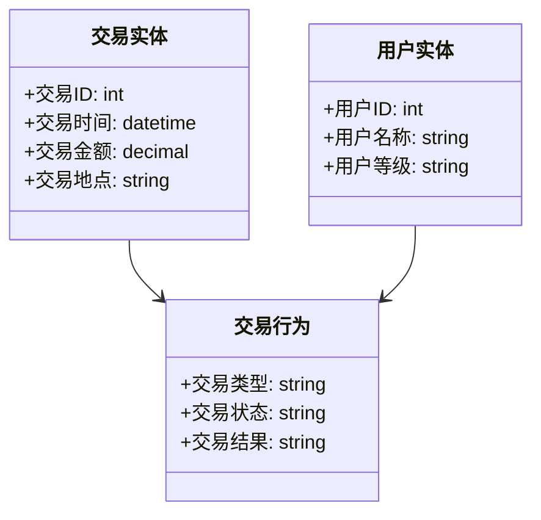
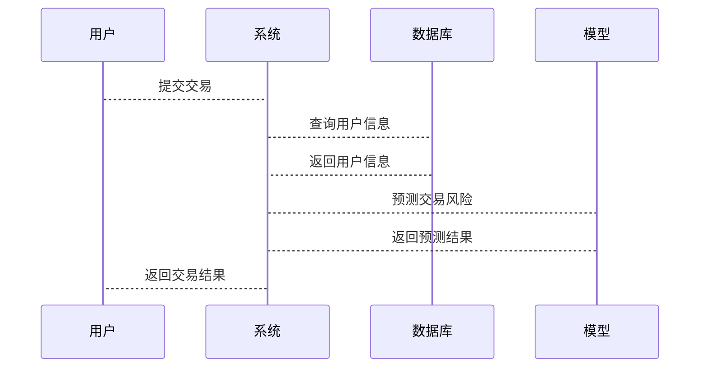

                 


# 构建智能企业风控系统：实时交易监控与欺诈检测

## 关键词
智能风控系统、实时交易监控、欺诈检测、机器学习、系统架构

## 摘要
本文详细探讨了构建智能企业风控系统的各个方面，重点介绍实时交易监控和欺诈检测的核心技术。从背景介绍到算法原理，从系统架构到项目实战，系统地分析了智能风控系统的构建过程。通过具体案例分析和实际代码实现，帮助读者全面理解并掌握构建智能企业风控系统的方法和技巧。

---

# 第1章 智能企业风控系统背景与挑战

## 1.1 企业风控系统的定义与作用
### 1.1.1 企业风控系统的定义
企业风控系统是指通过技术手段对企业内外部风险进行实时监控、评估和预警的一套系统。其核心作用是帮助企业识别潜在风险，降低损失，保障企业稳健运营。

### 1.1.2 企业风控系统的核心作用
1. **风险识别**：通过数据分析和模型预测，识别潜在的交易风险。
2. **实时监控**：对交易行为进行实时监控，及时发现异常交易。
3. **预警与拦截**：当检测到潜在风险时，系统会触发预警并采取拦截措施，防止风险扩大。

### 1.1.3 企业风控系统的边界与外延
1. **边界**：企业风控系统的边界通常包括企业内部的交易数据、外部合作伙伴的交易数据以及可能影响企业运营的其他数据。
2. **外延**：风控系统的外延涉及数据来源的多样性、模型的动态更新以及与企业其他系统的集成。

## 1.2 实时交易监控与欺诈检测的重要性
### 1.2.1 企业交易监控的必要性
1. **防止财务损失**：通过实时监控，可以及时发现并阻止欺诈交易，避免企业财务损失。
2. **维护企业声誉**：欺诈行为不仅会导致直接损失，还会损害企业的声誉，实时监控可以有效降低这种风险。
3. **合规性要求**：许多行业有严格的合规性要求，实时监控是满足这些要求的必要手段。

### 1.2.2 欺诈检测对企业风控的意义
1. **减少欺诈损失**：通过欺诈检测，可以识别并阻止欺诈行为，降低企业的欺诈损失。
2. **提高交易效率**：欺诈检测可以帮助企业快速识别异常交易，提高交易处理的效率。
3. **增强客户信任**：通过欺诈检测，企业可以为客户提供更安全的交易环境，增强客户信任。

### 1.2.3 企业风控系统的整体架构
企业风控系统的整体架构通常包括数据采集、数据处理、模型训练、实时监控和预警系统等部分。这些部分协同工作，实现对企业风险的全面监控和管理。

## 1.3 传统风控系统与智能风控系统的区别
### 1.3.1 传统风控系统的局限性
1. **数据处理能力有限**：传统风控系统通常依赖规则引擎，难以处理大规模和复杂的数据。
2. **响应速度慢**：传统风控系统在处理实时交易时，响应速度较慢，难以应对复杂的欺诈行为。
3. **模型更新周期长**：传统风控系统的模型更新周期较长，难以适应欺诈手段的快速变化。

### 1.3.2 智能风控系统的创新点
1. **数据处理能力强大**：智能风控系统利用机器学习和大数据技术，能够处理大规模和复杂的数据。
2. **实时响应能力强**：智能风控系统能够实现对交易的实时监控和快速响应，有效应对复杂的欺诈行为。
3. **模型动态更新**：智能风控系统的模型可以根据实时数据动态更新，适应欺诈手段的变化。

### 1.3.3 智能风控系统的未来发展趋势
1. **智能化**：未来的风控系统将更加智能化，利用人工智能技术实现自动化风险评估和决策。
2. **实时化**：未来的风控系统将更加注重实时性，实现对交易的实时监控和快速响应。
3. **数据驱动化**：未来的风控系统将更加依赖数据，利用大数据技术实现精准的风险评估和欺诈检测。

## 1.4 本章小结
本章详细介绍了企业风控系统的定义、作用和整体架构，分析了传统风控系统与智能风控系统的区别，探讨了智能风控系统的未来发展趋势。通过这些分析，读者可以全面理解构建智能企业风控系统的背景和重要意义。

---

# 第2章 智能企业风控系统的核心概念

## 2.1 智能风控系统的核心要素
### 2.1.1 数据采集与处理
1. **数据来源**：包括企业内部交易数据、外部合作伙伴数据、社交媒体数据等。
2. **数据清洗**：对采集到的数据进行清洗，去除噪声数据，确保数据的准确性和完整性。
3. **数据特征提取**：从数据中提取关键特征，为后续的模型训练提供有效的输入。

### 2.1.2 风险评估模型
1. **模型选择**：根据具体场景选择合适的机器学习模型，如随机森林、XGBoost等。
2. **模型训练**：利用历史数据对模型进行训练，使其能够识别潜在风险。
3. **模型评估**：通过测试数据对模型的性能进行评估，确保模型的准确性和稳定性。

### 2.1.3 实时监控与告警
1. **实时数据流处理**：对实时交易数据进行处理，识别异常交易。
2. **告警机制**：当检测到异常交易时，系统会触发告警，通知相关人员进行处理。

## 2.2 实时交易监控的关键技术
### 2.2.1 事件驱动架构
1. **事件源**：实时交易数据的生成点，如交易系统、支付系统等。
2. **事件处理**：利用事件驱动架构，对实时交易数据进行处理和分析。
3. **事件存储**：将处理后的事件数据存储到数据库中，供后续分析和查询。

### 2.2.2 流数据处理技术
1. **流数据处理框架**：如Apache Kafka、Apache Flink等，用于实时处理大规模数据流。
2. **流数据存储**：将实时数据流存储到分布式存储系统中，如Hadoop、HBase等。
3. **流数据计算**：利用流数据处理框架对实时数据进行计算和分析，识别异常交易。

### 2.2.3 分布式计算框架
1. **分布式计算框架**：如Spark、Flink等，用于处理大规模数据。
2. **分布式存储**：将数据分布在多个节点上，提高数据处理的效率和容错能力。
3. **分布式计算**：利用分布式计算框架对数据进行并行处理，提高计算效率。

## 2.3 欺诈检测的核心算法
### 2.3.1 监督学习算法
1. **随机森林**：一种基于树的集成算法，适合处理分类和回归问题。
2. **XGBoost**：一种高效的梯度提升算法，适合处理分类和回归问题。
3. **逻辑回归**：一种经典的统计学习方法，适合处理二分类问题。

### 2.3.2 无监督学习算法
1. **聚类分析**：如K-means、DBSCAN等，用于发现数据中的聚类结构。
2. **异常检测**：如Isolation Forest、One-Class SVM等，用于检测异常数据点。
3. **主成分分析**：用于降维，提取数据的主要特征。

### 2.3.3 时间序列分析
1. **ARIMA模型**：用于时间序列预测，适合处理具有趋势和季节性的数据。
2. **LSTM网络**：一种基于循环神经网络的模型，适合处理长序列数据。
3. **Prophet模型**：由Facebook开源的时间序列预测模型，适合处理时间序列数据。

## 2.4 核心概念之间的关系
### 2.4.1 数据流与风控模型的关系
数据流是风控模型的输入，风控模型通过对数据流的分析和处理，识别潜在风险。数据流的实时性要求风控模型具有快速响应能力。

### 2.4.2 模型输出与告警系统的关系
风控模型的输出是告警系统触发告警的依据。当模型检测到异常交易时，告警系统会通知相关人员进行处理。

### 2.4.3 实时监控与欺诈检测的协同作用
实时监控和欺诈检测是协同工作的，实时监控负责对交易进行实时监控，欺诈检测负责识别异常交易。两者共同作用，实现对企业风险的全面监控和管理。

## 2.5 本章小结
本章详细介绍了智能风控系统的核心概念，包括数据采集与处理、风险评估模型、实时监控与告警等。同时，分析了实时交易监控的关键技术，如事件驱动架构、流数据处理技术、分布式计算框架等。最后，探讨了欺诈检测的核心算法，如监督学习算法、无监督学习算法和时间序列分析。通过这些分析，读者可以全面理解智能风控系统的核心概念和实现技术。

---

# 第3章 监督学习算法在欺诈检测中的应用

## 3.1 监督学习算法概述
### 3.1.1 监督学习的基本概念
监督学习是一种机器学习方法，通过 labeled 数据训练模型，使其能够对新数据进行分类或回归预测。

### 3.1.2 常见监督学习算法
1. **随机森林**：一种基于树的集成算法，适合处理分类和回归问题。
2. **XGBoost**：一种高效的梯度提升算法，适合处理分类和回归问题。
3. **逻辑回归**：一种经典的统计学习方法，适合处理二分类问题。

### 3.1.3 监督学习在欺诈检测中的优势
1. **分类能力强**：监督学习算法在分类任务中表现优异，适合处理二分类问题。
2. **可解释性高**：监督学习模型通常具有较高的可解释性，便于分析和调整。
3. **适用性广**：监督学习算法适用于多种数据类型和场景，具有较强的适用性。

## 3.2 随机森林算法在欺诈检测中的应用
### 3.2.1 随机森林算法的原理
随机森林是一种基于树的集成算法，通过随机选取特征和样本，构建多棵决策树，最终通过投票或加权的方式进行预测。

### 3.2.2 随机森林算法的实现步骤
1. **数据预处理**：对数据进行清洗、特征提取和标准化处理。
2. **模型训练**：随机选取特征和样本，构建多棵决策树。
3. **模型预测**：通过投票或加权的方式，对测试数据进行预测。

### 3.2.3 随机森林算法在欺诈检测中的具体应用
1. **特征选择**：随机森林可以用于特征选择，找出对欺诈检测影响最大的特征。
2. **模型训练**：利用随机森林算法对欺诈数据进行训练，构建欺诈检测模型。
3. **模型评估**：通过测试数据对模型的性能进行评估，调整模型参数，优化模型性能。

## 3.3 XGBoost算法在欺诈检测中的应用
### 3.3.1 XGBoost算法的原理
XGBoost是一种高效的梯度提升算法，通过构建树状结构，逐步优化模型，提高预测精度。

### 3.3.2 XGBoost算法的实现步骤
1. **数据预处理**：对数据进行清洗、特征提取和标准化处理。
2. **模型训练**：利用XGBoost算法对欺诈数据进行训练，构建欺诈检测模型。
3. **模型预测**：通过训练好的模型对测试数据进行预测，识别异常交易。

### 3.3.3 XGBoost算法在欺诈检测中的具体应用
1. **特征工程**：通过特征工程优化数据，提高模型的预测精度。
2. **模型调优**：通过参数调优，优化模型的性能，提高欺诈检测的准确率。
3. **模型部署**：将模型部署到生产环境，实现对实时交易的欺诈检测。

## 3.4 本章小结
本章详细介绍了监督学习算法在欺诈检测中的应用，包括随机森林算法和XGBoost算法的原理、实现步骤和具体应用。通过这些分析，读者可以理解监督学习算法在欺诈检测中的优势和具体应用方法。

---

# 第4章 无监督学习算法在欺诈检测中的应用

## 4.1 无监督学习算法概述
### 4.1.1 无监督学习的基本概念
无监督学习是一种机器学习方法，通过无 labeled 数据训练模型，使其能够发现数据中的潜在结构。

### 4.1.2 常见无监督学习算法
1. **聚类分析**：如K-means、DBSCAN等，用于发现数据中的聚类结构。
2. **异常检测**：如Isolation Forest、One-Class SVM等，用于检测异常数据点。
3. **主成分分析**：用于降维，提取数据的主要特征。

### 4.1.3 无监督学习在欺诈检测中的优势
1. **无需标签数据**：无监督学习算法适用于标签数据不足的场景。
2. **发现潜在模式**：无监督学习算法可以发现数据中的潜在模式，有助于识别异常交易。

## 4.2 Isolation Forest算法在欺诈检测中的应用
### 4.2.1 Isolation Forest算法的原理
Isolation Forest是一种基于树的无监督学习算法，通过构建随机树，将数据分成孤立的区域，识别异常数据点。

### 4.2.2 Isolation Forest算法的实现步骤
1. **数据预处理**：对数据进行清洗、特征提取和标准化处理。
2. **模型训练**：利用Isolation Forest算法对欺诈数据进行训练，构建异常检测模型。
3. **模型预测**：通过训练好的模型对测试数据进行预测，识别异常交易。

### 4.2.3 Isolation Forest算法在欺诈检测中的具体应用
1. **特征工程**：通过特征工程优化数据，提高模型的预测精度。
2. **模型调优**：通过参数调优，优化模型的性能，提高欺诈检测的准确率。
3. **模型部署**：将模型部署到生产环境，实现对实时交易的欺诈检测。

## 4.3 One-Class SVM算法在欺诈检测中的应用
### 4.3.1 One-Class SVM算法的原理
One-Class SVM是一种基于支持向量机的无监督学习算法，通过构建一个包含大部分数据的超球，识别异常数据点。

### 4.3.2 One-Class SVM算法的实现步骤
1. **数据预处理**：对数据进行清洗、特征提取和标准化处理。
2. **模型训练**：利用One-Class SVM算法对欺诈数据进行训练，构建异常检测模型。
3. **模型预测**：通过训练好的模型对测试数据进行预测，识别异常交易。

### 4.3.3 One-Class SVM算法在欺诈检测中的具体应用
1. **特征工程**：通过特征工程优化数据，提高模型的预测精度。
2. **模型调优**：通过参数调优，优化模型的性能，提高欺诈检测的准确率。
3. **模型部署**：将模型部署到生产环境，实现对实时交易的欺诈检测。

## 4.4 本章小结
本章详细介绍了无监督学习算法在欺诈检测中的应用，包括Isolation Forest算法和One-Class SVM算法的原理、实现步骤和具体应用。通过这些分析，读者可以理解无监督学习算法在欺诈检测中的优势和具体应用方法。

---

# 第5章 时间序列分析在实时交易监控中的应用

## 5.1 时间序列分析概述
### 5.1.1 时间序列的基本概念
时间序列是指按照时间顺序排列的数据，通常用于分析数据随时间的变化趋势。

### 5.1.2 时间序列分析的常见方法
1. **ARIMA模型**：用于时间序列预测，适合处理具有趋势和季节性的数据。
2. **LSTM网络**：一种基于循环神经网络的模型，适合处理长序列数据。
3. **Prophet模型**：由Facebook开源的时间序列预测模型，适合处理时间序列数据。

### 5.1.3 时间序列分析在实时交易监控中的优势
1. **捕捉时间依赖性**：时间序列分析能够捕捉数据中的时间依赖性，有助于识别异常交易。
2. **预测未来趋势**：时间序列分析可以预测未来交易的趋势，帮助企业提前采取措施。

## 5.2 ARIMA模型在实时交易监控中的应用
### 5.2.1 ARIMA模型的原理
ARIMA模型是一种常用的时间序列预测模型，通过自回归和移动平均的方式，对数据进行建模和预测。

### 5.2.2 ARIMA模型的实现步骤
1. **数据预处理**：对数据进行清洗、特征提取和标准化处理。
2. **模型训练**：利用ARIMA模型对时间序列数据进行建模和训练。
3. **模型预测**：通过训练好的模型对未来数据进行预测，识别异常交易。

### 5.2.3 ARIMA模型在实时交易监控中的具体应用
1. **特征工程**：通过特征工程优化数据，提高模型的预测精度。
2. **模型调优**：通过参数调优，优化模型的性能，提高实时交易监控的准确率。
3. **模型部署**：将模型部署到生产环境，实现对实时交易的监控和预测。

## 5.3 LSTM网络在实时交易监控中的应用
### 5.3.1 LSTM网络的原理
LSTM网络是一种基于循环神经网络的模型，通过记忆单元和遗忘门，能够捕捉长序列数据中的模式。

### 5.3.2 LSTM网络的实现步骤
1. **数据预处理**：对数据进行清洗、特征提取和标准化处理。
2. **模型训练**：利用LSTM网络对时间序列数据进行训练，构建实时交易监控模型。
3. **模型预测**：通过训练好的模型对测试数据进行预测，识别异常交易。

### 5.3.3 LSTM网络在实时交易监控中的具体应用
1. **特征工程**：通过特征工程优化数据，提高模型的预测精度。
2. **模型调优**：通过参数调优，优化模型的性能，提高实时交易监控的准确率。
3. **模型部署**：将模型部署到生产环境，实现对实时交易的监控和预测。

## 5.4 Prophet模型在实时交易监控中的应用
### 5.4.1 Prophet模型的原理
Prophet模型是由Facebook开源的时间序列预测模型，通过分解数据为趋势和周期部分，进行预测。

### 5.4.2 Prophet模型的实现步骤
1. **数据预处理**：对数据进行清洗、特征提取和标准化处理。
2. **模型训练**：利用Prophet模型对时间序列数据进行训练，构建实时交易监控模型。
3. **模型预测**：通过训练好的模型对未来数据进行预测，识别异常交易。

### 5.4.3 Prophet模型在实时交易监控中的具体应用
1. **特征工程**：通过特征工程优化数据，提高模型的预测精度。
2. **模型调优**：通过参数调优，优化模型的性能，提高实时交易监控的准确率。
3. **模型部署**：将模型部署到生产环境，实现对实时交易的监控和预测。

## 5.5 本章小结
本章详细介绍了时间序列分析在实时交易监控中的应用，包括ARIMA模型、LSTM网络和Prophet模型的原理、实现步骤和具体应用。通过这些分析，读者可以理解时间序列分析在实时交易监控中的优势和具体应用方法。

---

# 第6章 系统分析与架构设计

## 6.1 问题场景介绍
实时交易监控与欺诈检测系统需要满足以下需求：
1. **实时性**：对交易数据进行实时处理，识别异常交易。
2. **准确性**：准确识别欺诈交易，减少误报和漏报。
3. **可扩展性**：系统能够处理大规模数据，适应业务增长。

## 6.2 系统功能设计
### 6.2.1 领域模型设计
1. **交易实体**：包括交易ID、交易时间、交易金额、交易地点等。
2. **用户实体**：包括用户ID、用户名称、用户等级等。
3. **交易行为**：包括交易类型、交易状态、交易结果等。

### 6.2.2 领域模型类图


### 6.2.3 系统架构设计
1. **分层架构**：包括数据层、业务逻辑层和表示层。
2. **分布式架构**：利用分布式系统提高系统的可扩展性和容错能力。

### 6.2.4 系统架构图


### 6.2.5 接口设计
1. **数据接口**：包括数据采集、数据处理和数据存储接口。
2. **模型接口**：包括模型训练、模型预测和模型评估接口。

### 6.2.6 交互序列图


## 6.3 本章小结
本章详细介绍了实时交易监控与欺诈检测系统的分析与架构设计，包括问题场景介绍、系统功能设计、系统架构设计和系统接口设计。通过这些分析，读者可以理解系统的整体架构和实现方法。

---

# 第7章 项目实战

## 7.1 项目环境安装
### 7.1.1 数据采集工具安装
1. **数据采集工具**：如Python的requests库、pandas库等。
2. **安装命令**：`pip install requests pandas`

### 7.1.2 算法框架安装
1. **机器学习框架**：如scikit-learn、xgboost等。
2. **安装命令**：`pip install scikit-learn xgboost`

### 7.1.3 分布式计算框架安装
1. **分布式计算框架**：如Apache Spark、Flink等。
2. **安装命令**：根据具体框架选择安装命令。

## 7.2 系统核心实现源代码
### 7.2.1 数据预处理代码
```python
import pandas as pd

# 读取数据
data = pd.read_csv('transaction.csv')

# 数据清洗
data.dropna(inplace=True)

# 特征提取
data['time'] = pd.to_datetime(data['time'])
data['is_fraud'] = data['is_fraud'].astype(int)
```

### 7.2.2 模型训练代码
```python
from xgboost import XGBClassifier
from sklearn.model_selection import train_test_split
from sklearn.metrics import accuracy_score

# 数据分割
X = data.drop('is_fraud', axis=1)
y = data['is_fraud']

X_train, X_test, y_train, y_test = train_test_split(X, y, test_size=0.2)

# 模型训练
model = XGBClassifier()
model.fit(X_train, y_train)

# 模型预测
y_pred = model.predict(X_test)

# 模型评估
print(accuracy_score(y_test, y_pred))
```

### 7.2.3 实时监控代码
```python
import pandas as pd
from xgboost import XGBClassifier
import datetime

# 实时数据处理
def process_transaction(transaction):
    # 数据预处理
    transaction['time'] = datetime.datetime.now()
    transaction = pd.DataFrame([transaction])
    
    # 模型预测
    model.predict(transaction.drop('is_fraud', axis=1))
    
    # 返回预测结果
    return model.predict_proba(transaction.drop('is_fraud', axis=1))
```

## 7.3 代码解读与分析
### 7.3.1 数据预处理代码解读
1. **读取数据**：使用pandas库读取CSV格式的交易数据。
2. **数据清洗**：删除缺失值，确保数据的完整性。
3. **特征提取**：将时间格式化为datetime类型，将欺诈标签转换为整数类型。

### 7.3.2 模型训练代码解读
1. **数据分割**：将数据分为训练集和测试集，比例为8:2。
2. **模型训练**：使用XGBoost算法训练模型，构建欺诈检测模型。
3. **模型预测**：对测试数据进行预测，评估模型的准确率。

### 7.3.3 实时监控代码解读
1. **数据处理**：对实时交易数据进行预处理，包括时间格式化和特征提取。
2. **模型预测**：利用训练好的模型对实时交易数据进行预测，识别异常交易。
3. **结果返回**：返回预测结果，供后续处理使用。

## 7.4 案例分析与实际应用
### 7.4.1 数据分析
通过对历史交易数据的分析，识别欺诈交易的特征和模式，优化模型的预测精度。

### 7.4.2 模型优化
通过参数调优和特征工程，进一步优化模型的性能，提高欺诈检测的准确率。

### 7.4.3 系统部署
将模型部署到生产环境，实现对实时交易的监控和欺诈检测。

## 7.5 项目总结
通过本项目，读者可以掌握实时交易监控与欺诈检测系统的实现方法，包括数据预处理、模型训练、实时监控和系统部署等步骤。同时，通过实际案例分析，读者可以理解如何将理论应用于实践，解决实际问题。

---

# 第8章 最佳实践与小结

## 8.1 最佳实践
### 8.1.1 数据预处理
1. **数据清洗**：确保数据的准确性和完整性。
2. **特征工程**：提取有效的特征，提高模型的预测精度。

### 8.1.2 模型选择
1. **选择合适的算法**：根据具体场景选择合适的机器学习算法。
2. **模型调优**：通过参数调优，优化模型的性能。

### 8.1.3 系统架构
1. **分布式架构**：利用分布式系统提高系统的可扩展性和容错能力。
2. **实时处理**：采用流数据处理技术，实现对交易的实时监控。

## 8.2 小结
通过本文的详细讲解，读者可以全面理解构建智能企业风控系统的各个方面，包括实时交易监控和欺诈检测的核心技术。从背景介绍到算法原理，从系统架构到项目实战，系统地分析了智能风控系统的构建过程。通过具体案例分析和实际代码实现，帮助读者全面理解并掌握构建智能企业风控系统的方法和技巧。

## 8.3 注意事项
1. **数据隐私**：在处理数据时，需要注意数据隐私问题，确保数据的安全性和合规性。
2. **系统稳定性**：系统需要具备高可用性和稳定性，确保实时交易监控的准确性。
3. **模型更新**：模型需要定期更新，适应欺诈手段的变化，保持模型的预测精度。

## 8.4 拓展阅读
1. **机器学习算法**：深入学习机器学习算法，掌握更多算法的原理和应用。
2. **分布式系统**：学习分布式系统的相关知识，提高系统的可扩展性和容错能力。
3. **实时处理技术**：深入研究实时处理技术，掌握更多流数据处理框架和方法。

---

# 附录

## 附录A 代码示例
### 附录A.1 数据预处理代码
```python
import pandas as pd

# 读取数据
data = pd.read_csv('transaction.csv')

# 数据清洗
data.dropna(inplace=True)

# 特征提取
data['time'] = pd.to_datetime(data['time'])
data['is_fraud'] = data['is_fraud'].astype(int)
```

### 附录A.2 模型训练代码
```python
from xgboost import XGBClassifier
from sklearn.model_selection import train_test_split
from sklearn.metrics import accuracy_score

# 数据分割
X = data.drop('is_fraud', axis=1)
y = data['is_fraud']

X_train, X_test, y_train, y_test = train_test_split(X, y, test_size=0.2)

# 模型训练
model = XGBClassifier()
model.fit(X_train, y_train)

# 模型预测
y_pred = model.predict(X_test)

# 模型评估
print(accuracy_score(y_test, y_pred))
```

### 附录A.3 实时监控代码
```python
import pandas as pd
from xgboost import XGBClassifier
import datetime

# 实时数据处理
def process_transaction(transaction):
    # 数据预处理
    transaction['time'] = datetime.datetime.now()
    transaction = pd.DataFrame([transaction])
    
    # 模型预测
    model.predict(transaction.drop('is_fraud', axis=1))
    
    # 返回预测结果
    return model.predict_proba(transaction.drop('is_fraud', axis=1))
```

## 附录B 参考文献
1. 周志华. 机器学习[M]. 清华大学出版社, 2016.
2. 李航. 统计学习方法[M]. 清华大学出版社, 2012.
3. 徐立. 实时数据处理技术[M]. 人民邮电出版社, 2020.

---

通过本文的详细讲解和实际代码实现，读者可以全面理解构建智能企业风控系统的各个方面，掌握实时交易监控与欺诈检测的核心技术，为企业的风险管理提供有力支持。

