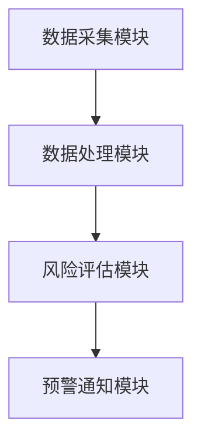

                 


# 构建智能企业风控系统：实时监控与风险预警

## 关键词：智能企业风控，实时监控，风险预警，时间序列分析，机器学习，系统架构

## 摘要：本文详细探讨了构建智能企业风控系统的各个方面，包括背景、核心概念、算法原理、系统架构设计以及实际项目案例。通过分析实时监控与风险预警的重要性，结合时间序列分析和机器学习算法，提出了一种高效的系统架构，为企业的风险管理提供了新的思路和解决方案。

---

# 第一部分：企业风控系统概述

## 第1章：企业风控系统背景与目标

### 1.1 企业风控的重要性

#### 1.1.1 企业风控的定义与范围

企业风控（Risk Management）是指通过识别、评估、监控和控制各种风险，以保障企业稳健运行的管理过程。在现代商业环境中，风险无处不在，包括市场风险、信用风险、操作风险、合规风险等。企业风控的目标是通过实时监控和风险预警，提前发现潜在问题，采取有效措施降低风险影响。

#### 1.1.2 风险类型与企业经营的关系

企业面临的风险多种多样，不同类型的风崄对企业的经营影响也各不相同。例如：

- **市场风险**：由于市场波动导致的资产价值损失。
- **信用风险**：由于客户或供应商无法履行合同义务而产生的风险。
- **操作风险**：由于内部操作失误或外部事件导致的损失。
- **合规风险**：由于法律法规变化或不合规行为导致的法律风险。

#### 1.1.3 实时监控与风险预警的价值

实时监控与风险预警系统能够帮助企业及时发现潜在风险，提前采取措施，避免或减少损失。通过实时数据采集和分析，系统可以在风险发生前发出预警，为企业管理层提供决策支持。

---

### 1.2 企业风控系统的演进历程

#### 1.2.1 传统风控模式的局限性

传统的风控模式主要依赖于定期报告和人工分析，存在以下问题：

- 数据采集不及时，无法实现实时监控。
- 分析依赖人工经验，主观性较强，准确性不足。
- 缺乏自动化预警机制，风险发现滞后。

#### 1.2.2 智能风控的兴起与技术支撑

随着大数据、人工智能等技术的发展，智能风控逐渐兴起。智能风控利用先进的算法和技术，实现对风险的自动化识别和预警。主要的技术支撑包括：

- 大数据技术：支持海量数据的采集、存储和分析。
- 机器学习：用于风险建模和预测。
- 实时计算：支持数据流的实时处理和分析。

#### 1.2.3 当前企业风控的主要趋势

当前，企业风控的主要趋势包括：

- **智能化**：利用人工智能技术提高风险识别和预测的准确性。
- **实时化**：实现数据的实时采集和分析，做到风险的实时预警。
- **自动化**：通过自动化流程减少人工干预，提高效率。

---

### 1.3 本章小结

本章介绍了企业风控的重要性，分析了不同类型风险对企业经营的影响，并重点探讨了实时监控与风险预警的价值。同时，回顾了企业风控系统的演进历程，总结了智能风控的主要趋势。下一章将深入探讨风控的核心概念与实现要素。

---

## 第2章：风险监控与预警的核心要素

### 2.1 风险数据的采集与处理

#### 2.1.1 数据来源的多样性

风险数据可以来自多个渠道，包括：

- **内部数据**：企业的财务数据、交易数据、操作日志等。
- **外部数据**：市场数据、行业趋势、法律法规变化等。

#### 2.1.2 数据清洗与特征提取

数据清洗是确保数据质量的重要步骤，包括：

- **去重**：去除重复数据。
- **去噪**：去除噪声数据。
- **填充缺失值**：处理缺失数据，可以通过均值、中位数等方式填充。

特征提取是将原始数据转换为具有代表性的特征，以便后续分析。例如，将交易金额、交易频率等作为特征。

#### 2.1.3 数据存储与管理方案

数据存储方案可以选择关系型数据库（如MySQL）或分布式存储系统（如Hadoop）。数据管理需要考虑数据的实时性、可扩展性和安全性。

---

### 2.2 风险评估与预警模型

#### 2.2.1 风险评估的指标体系

风险评估需要建立科学的指标体系，包括：

- **风险概率**：评估风险发生的可能性。
- **风险影响**：评估风险对企业的影响程度。
- **风险优先级**：根据概率和影响综合评估风险优先级。

#### 2.2.2 预警模型的构建逻辑

预警模型的构建逻辑包括：

1. 数据采集与预处理。
2. 特征提取与选择。
3. 模型训练与优化。
4. 模型部署与实时预测。

#### 2.2.3 模型的可解释性与优化方向

模型的可解释性是企业风控的重要要求，尤其是在需要向管理层解释预警结果的情况下。优化方向包括：

- 提高模型的准确性和召回率。
- 降低模型的计算复杂度，提高实时性。

---

### 2.3 实时监控的系统架构

#### 2.3.1 实时监控的实现方式

实时监控可以通过以下方式实现：

- **流数据处理**：采用流处理技术（如Flink）对实时数据进行处理。
- **消息队列**：使用Kafka等消息队列实现数据的实时传输。

#### 2.3.2 系统性能优化的关键点

性能优化的关键点包括：

- 数据压缩与存储优化。
- 并行处理与分布式计算。
- 系统容错与高可用性设计。

#### 2.3.3 高可用性与容错机制

高可用性设计可以通过以下方式实现：

- **负载均衡**：分担请求压力，避免单点故障。
- **冗余设计**：关键节点部署冗余，确保系统故障时能够快速恢复。

---

### 2.4 本章小结

本章详细探讨了风险监控与预警的核心要素，包括数据采集与处理、风险评估与预警模型、实时监控的系统架构等。下一章将深入分析风险预警算法的原理与实现。

---

## 第3章：时间序列分析与风险预测

### 3.1 时间序列分析的基础知识

#### 3.1.1 时间序列的特征分析

时间序列分析需要关注以下特征：

- **趋势**：数据的长期趋势。
- **周期性**：数据的周期性波动。
- **噪声**：随机的波动。

#### 3.1.2 常见的时间序列模型

常见的时间序列模型包括：

- **ARIMA模型**：自回归积分滑动平均模型。
- **LSTM模型**：长短期记忆网络模型。

#### 3.1.3 时间序列预测的数学模型

ARIMA模型的数学公式如下：

$$ ARIMA(p, d, q) $$

其中，p为自回归阶数，d为差分阶数，q为滑动平均阶数。

---

### 3.2 基于机器学习的风控预测

#### 3.2.1 常见的机器学习算法在风控中的应用

常用的机器学习算法包括：

- **随机森林**：用于分类和回归任务。
- **XGBoost**：梯度提升树模型，适用于分类和回归。
- **LSTM**：适用于时间序列预测。

#### 3.2.2 随机森林与XGBoost在风险预测中的表现

随机森林和XGBoost在风控中的表现如下：

- **随机森林**：模型解释性强，适合特征重要性分析。
- **XGBoost**：模型性能好，适合处理高维数据。

#### 3.2.3 深度学习模型在时间序列预测中的优势

深度学习模型，如LSTM，能够捕捉时间序列中的复杂模式，适用于长序列预测。

---

### 3.3 风险预警算法的实现步骤

#### 3.3.1 数据预处理与特征工程

数据预处理包括：

- **归一化**：将数据标准化，消除特征量纲的影响。
- **特征选择**：选择对风险预测有重要影响的特征。

#### 3.3.2 模型训练与调优

模型训练包括：

- **训练集划分**：将数据划分为训练集和验证集。
- **超参数调优**：通过网格搜索或随机搜索优化模型参数。

#### 3.3.3 模型部署与实时预测

模型部署包括：

- **API接口开发**：将模型封装为API，供其他系统调用。
- **实时预测**：通过API接口进行实时数据预测。

---

### 3.4 本章小结

本章详细探讨了时间序列分析与风险预测的算法原理，包括ARIMA模型、随机森林、XGBoost和LSTM模型的实现步骤与应用。下一章将探讨系统架构设计。

---

## 第4章：智能企业风控系统的架构设计

### 4.1 系统模块划分

#### 4.1.1 数据采集模块

数据采集模块负责从各种数据源采集数据，包括：

- **数据库**：从企业内部数据库采集财务数据、交易数据等。
- **API接口**：从外部数据源（如市场数据API）获取数据。

#### 4.1.2 数据处理模块

数据处理模块负责对采集到的数据进行清洗、转换和存储，包括：

- **数据清洗**：去除重复数据、填充缺失值。
- **数据转换**：将数据转换为适合模型输入的格式。
- **数据存储**：将处理后的数据存储到数据库或数据仓库中。

#### 4.1.3 风险评估模块

风险评估模块负责对数据进行分析，生成风险评估结果，包括：

- **特征提取**：提取对风险预测有影响的特征。
- **模型预测**：使用训练好的模型进行风险预测。
- **风险评分**：根据模型预测结果生成风险评分。

#### 4.1.4 预警通知模块

预警通知模块负责根据风险评分生成预警信息，并通过多种渠道通知相关人员，包括：

- **邮件通知**：通过邮件发送预警信息。
- **短信通知**：通过短信发送预警信息。
- **可视化界面**：在可视化界面上显示预警信息。

---

### 4.2 系统功能设计

#### 4.2.1 风险监控的实时性要求

系统需要支持实时数据处理，确保预警信息能够及时发出。

#### 4.2.2 预警规则的灵活配置

系统需要提供灵活的预警规则配置功能，支持用户根据实际需求自定义预警条件。

#### 4.2.3 系统的可扩展性设计

系统需要具备良好的可扩展性，支持未来业务的扩展和功能的增加。

---

### 4.3 系统架构图

以下是系统的架构图：



---

### 4.4 本章小结

本章详细探讨了智能企业风控系统的架构设计，包括系统模块划分、功能设计和系统架构图。下一章将通过实际案例展示系统的实现过程。

---

## 第5章：项目实战

### 5.1 环境搭建

#### 5.1.1 安装必要的软件

- **Python**：需要安装Python 3.8及以上版本。
- **Jupyter Notebook**：用于数据可视化和算法实现。
- **机器学习库**：安装scikit-learn、xgboost、keras等库。
- **数据处理工具**：安装pandas、numpy等库。

#### 5.1.2 安装开发环境

安装虚拟环境，例如使用Anaconda或者Miniconda，并创建虚拟环境。

---

### 5.2 核心代码实现

#### 5.2.1 数据预处理代码

```python
import pandas as pd
import numpy as np

# 读取数据
data = pd.read_csv('risk_data.csv')

# 去除重复数据
data = data.drop_duplicates()

# 填充缺失值
data = data.fillna(method='ffill')

# 标准化数据
from sklearn.preprocessing import StandardScaler
scaler = StandardScaler()
data_scaled = scaler.fit_transform(data)
```

#### 5.2.2 风险评估模型实现

```python
from sklearn.ensemble import RandomForestClassifier
from sklearn.metrics import accuracy_score

# 训练随机森林模型
model = RandomForestClassifier(n_estimators=100, max_depth=5, random_state=42)
model.fit(X_train, y_train)

# 模型预测
y_pred = model.predict(X_test)

# 模型评估
print("准确率:", accuracy_score(y_test, y_pred))
```

---

### 5.3 案例分析与实现

#### 5.3.1 案例背景

假设某企业需要监控其客户的信用风险，数据包括客户的财务数据、交易数据等。

#### 5.3.2 数据分析与建模

通过数据分析，提取关键特征，建立随机森林模型进行风险预测。

#### 5.3.3 预警结果展示

通过可视化工具（如Matplotlib）展示预警结果，例如绘制风险评分分布图。

---

### 5.4 项目总结

本项目通过实际案例展示了智能企业风控系统的实现过程，包括数据预处理、模型训练与评估、预警结果展示等步骤。通过本项目的实施，企业可以实现对风险的实时监控与预警，提升风险管理能力。

---

## 第6章：最佳实践与小结

### 6.1 最佳实践

#### 6.1.1 数据质量管理

- 确保数据的准确性、完整性和及时性。
- 定期检查数据质量，及时处理异常数据。

#### 6.1.2 模型优化与维护

- 定期更新模型，确保模型的准确性和适用性。
- 监控模型性能，及时调整模型参数。

#### 6.1.3 系统安全性与稳定性

- 加强系统安全性，防止数据泄露和系统攻击。
- 建立系统监控机制，确保系统的稳定运行。

---

### 6.2 小结

本文详细探讨了构建智能企业风控系统的各个方面，包括背景、核心概念、算法原理、系统架构设计以及实际项目案例。通过本文的介绍，读者可以全面了解智能企业风控系统的实现过程和应用价值。

---

### 6.3 注意事项

- 系统上线前需进行充分的测试，确保系统的稳定性和可靠性。
- 系统运行过程中需定期监控，及时发现并解决问题。
- 系统的安全性需要高度重视，防止数据泄露和系统攻击。

---

### 6.4 拓展阅读

- **《Python机器学习实战》**：适合想深入学习机器学习算法的读者。
- **《大数据技术丛书》**：适合想了解大数据技术的读者。
- **《风险管理与控制》**：适合想了解企业风险管理的读者。

---

# 结语

通过本文的介绍，读者可以全面了解智能企业风控系统的实现过程和应用价值。未来，随着人工智能和大数据技术的不断发展，智能企业风控系统将更加智能化和自动化，为企业风险管理提供更强大的支持。

--- 

**全文完**

