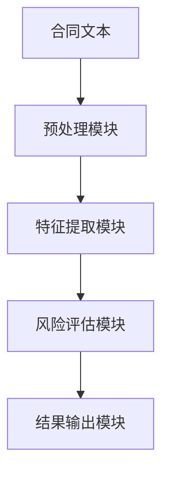
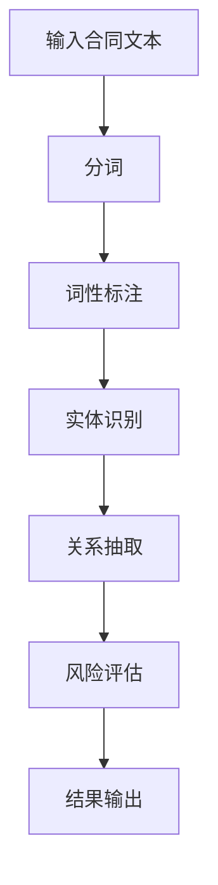
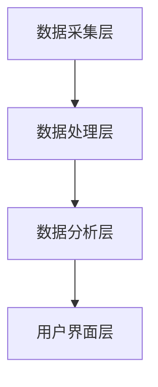
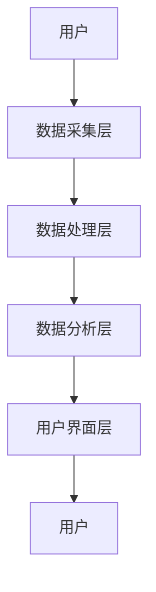

                 


# 构建智能合同分析系统：AI辅助法律风险管理

## 关键词：
智能合同分析系统，AI，法律风险管理，自然语言处理，机器学习，法律实体识别

## 摘要：
本文详细探讨了构建智能合同分析系统的各个方面，结合AI技术在法律风险管理中的应用。文章从背景介绍开始，分析了传统合同管理的痛点，引出了AI在法律领域的潜力，详细讲解了智能合同分析系统的概念与目标。接着，文章深入分析了核心概念与系统原理，包括自然语言处理和法律实体识别的原理及流程。在算法实现部分，结合Python代码和数学公式，详细阐述了合同分析模型的构建过程。系统架构设计部分展示了系统的整体结构和接口设计。项目实战部分通过实际案例分析，指导读者如何安装环境并实现系统功能。最后，总结了项目经验，提供了注意事项和拓展阅读方向，帮助读者进一步深入学习。

---

# 第一部分: 智能合同分析系统概述

## 第1章: 背景与问题背景

### 1.1 智能合同分析系统的背景介绍

#### 1.1.1 传统合同管理的痛点与挑战
在传统的合同管理中，企业面临诸多痛点。合同数量庞大，内容复杂，人工审查效率低，且容易出错。合同条款的理解和识别需要大量法律专业知识，人工处理不仅耗时，且容易遗漏重要风险点。此外，合同的分类、检索和统计分析也十分困难，难以满足现代企业的高效管理需求。

#### 1.1.2 AI技术在法律领域的应用潜力
随着AI技术的飞速发展，其在法律领域的应用逐渐崭露头角。自然语言处理（NLP）技术可以用于合同文本的自动分析，机器学习（ML）则可以帮助识别合同中的风险点。通过AI技术，合同管理可以实现自动化、智能化，极大地提高了效率和准确性。

#### 1.1.3 智能合同分析系统的概念与目标
智能合同分析系统是一种基于AI技术的法律辅助工具，旨在通过自动化处理合同文本，提取关键信息，识别法律风险，辅助企业做出决策。其目标是帮助企业降低法律风险，提高合同管理效率，实现智能化、精准化的合同管理。

### 1.2 问题背景与问题描述

#### 1.2.1 合同管理中的常见问题
- 合同文本量大，人工审查耗时且成本高。
- 合同条款复杂，容易遗漏关键风险点。
- 合同分类和检索效率低下，难以快速定位所需信息。

#### 1.2.2 传统合同分析的局限性
- 人工审查主观性强，容易受到个人经验和知识的限制。
- 缺乏统一的标准和方法，导致分析结果不一致。
- 无法快速处理大量合同，难以应对紧急需求。

#### 1.2.3 问题解决的必要性与可行性
- 必要性：随着企业规模扩大，合同数量激增，传统方法难以应对。
- 可行性：AI技术的发展为合同自动化分析提供了技术支撑，特别是在自然语言处理和机器学习领域。

### 1.3 问题解决与边界定义

#### 1.3.1 智能合同分析系统的解决方案
通过AI技术实现合同文本的自动分析，包括合同分类、信息抽取、风险评估等功能，辅助法律专业人士快速识别潜在风险。

#### 1.3.2 系统的边界与外延
- 边界：系统仅处理合同文本，不涉及合同的签署和执行过程。
- 外延：系统可扩展至其他法律文档分析，如法律判决书、法规文件等。

#### 1.3.3 核心功能与辅助功能的界定
- 核心功能：合同文本分析、信息抽取、风险评估。
- 辅助功能：合同分类、自动提醒、数据统计。

### 1.4 核心概念与组成结构

#### 1.4.1 智能合同分析系统的组成要素
- 数据输入：合同文本。
- 数据处理：预处理、特征提取。
- 模型训练：NLP模型、机器学习模型。
- 结果输出：风险评估报告、可视化界面。

#### 1.4.2 核心概念的属性对比

| 概念       | 属性             | 描述                                   |
|------------|------------------|--------------------------------------|
| 合同文本   | 文本内容         | 包含合同条款、条款编号、签署日期等   |
| 法律术语    | 专业性           | 术语具有特定的法律意义和解释         |
| 风险评估    | 评估指标         | 包括合规性、潜在纠纷点、责任划分等   |

#### 1.4.3 系统架构的实体关系图


---

## 第2章: 核心概念与系统原理

### 2.1 智能合同分析系统的原理

#### 2.1.1 自然语言处理在合同分析中的应用
自然语言处理（NLP）技术用于合同文本的理解和分析，包括分词、词性标注、实体识别和关系抽取等步骤。通过NLP，系统可以提取合同中的关键信息，如合同金额、履行期限等。

#### 2.1.2 法律实体识别的原理与流程
法律实体识别（NER）是通过训练模型识别合同文本中的法律实体，如公司名称、合同编号、签署地点等。流程包括数据标注、特征提取、模型训练和结果验证。

#### 2.1.3 机器学习在合同风险评估中的作用
机器学习（ML）用于风险评估，通过训练分类模型识别合同中的风险点。模型可以基于合同条款的相似性，预测潜在的法律纠纷。

### 2.2 核心概念的属性特征对比

| 概念       | 输入类型   | 输出类型   | 描述                                   |
|------------|------------|------------|--------------------------------------|
| 合同文本   | 文本数据    | 关键信息    | 提取合同中的重要条款和信息           |
| 法律术语    | 文本数据    | 术语标签    | 识别合同中的法律术语                 |
| 风险评估    | 文本数据 + 预处理特征 | 风险等级     | 评估合同中的法律风险               |

### 2.3 系统实体关系图


---

## 第3章: 算法原理与实现

### 3.1 算法原理概述

#### 3.1.1 基于深度学习的合同分析模型
深度学习模型，如BERT，用于合同文本的语义理解。通过预训练模型，系统可以自动提取合同中的关键信息。

#### 3.1.2 常见的NLP算法及其应用
- 分词算法：如jieba，用于将合同文本分割成词语。
- 词性标注：如NLTK，用于识别词语的词性。
- 实体识别：如CRF，用于识别合同中的法律实体。

#### 3.1.3 法律实体识别的CRF模型
条件随机场（CRF）用于序列标注，可以有效地识别合同文本中的法律实体。

### 3.2 算法流程图


### 3.3 算法实现代码

#### 3.3.1 合同分析模型的Python实现
```python
import tensorflow as tf
from tensorflow.keras import layers

# 定义模型
model = tf.keras.Sequential()
model.add(layers.Embedding(input_dim=10000, output_dim=100))
model.add(layers.LSTM(64))
model.add(layers.Dense(1, activation='sigmoid'))
model.compile(optimizer='adam', loss='binary_crossentropy', metrics=['accuracy'])

# 训练模型
model.fit(x_train, y_train, epochs=10, batch_size=32)
```

#### 3.3.2 法律实体识别的CRF模型
```python
import numpy as np
from sklearn import crflearn

# 定义CRF模型
model = crflearn.CRF()
model.fit(X_train, y_train)

# 预测实体
y_pred = model.predict(X_test)
```

---

## 第4章: 系统分析与架构设计

### 4.1 系统分析

#### 4.1.1 项目背景
系统旨在为企业提供智能化的合同分析服务，提高合同管理效率，降低法律风险。

#### 4.1.2 系统功能设计
- 数据输入与预处理
- 文本分析与信息抽取
- 风险评估与报告生成
- 可视化界面展示

#### 4.1.3 系统架构设计
- 数据采集层：接收合同文本并进行预处理。
- 数据处理层：包括分词、词性标注和实体识别。
- 数据分析层：进行关系抽取和风险评估。
- 用户界面层：展示分析结果。

### 4.2 系统架构图


### 4.3 系统接口设计

#### 4.3.1 接口描述
- 输入接口：接收合同文本。
- 输出接口：返回风险评估报告。

#### 4.3.2 系统交互流程图


---

## 第5章: 项目实战

### 5.1 环境安装

#### 5.1.1 安装Python和必要的库
```bash
pip install python python-keras tensorflow scikit-learn
```

#### 5.1.2 安装NLP工具
```bash
pip install jieba nltk
```

### 5.2 系统核心实现

#### 5.2.1 核心代码实现
```python
# 数据预处理
def preprocess(text):
    # 分词
    words = jieba.lcut(text)
    # 词性标注
    pos = nltk.pos_tag(words)
    return pos

# 实体识别
def entity_recognition(pos):
    crf_model = crflearn.CRF()
    crf_model.fit(X_train, y_train)
    return crf_model.predict(pos)
```

#### 5.2.2 算法应用
```python
# 风险评估
def risk_assessment(entities):
    # 训练好的模型
    model = load_model('contract_model.h5')
    # 预测风险
    risk = model.predict(entities)
    return risk
```

### 5.3 案例分析

#### 5.3.1 实际案例
分析一份典型合同，展示系统如何提取关键信息并评估风险。

#### 5.3.2 详细解读
通过实际案例，详细讲解系统的处理流程和结果输出。

### 5.4 项目小结
项目实现了智能合同分析系统的功能，验证了AI技术在法律风险管理中的应用潜力。

---

## 第6章: 最佳实践

### 6.1 小结
智能合同分析系统通过AI技术实现了合同管理的智能化，提高了效率和准确性。

### 6.2 注意事项
- 数据质量对系统性能影响重大，需确保数据标注的准确性。
- 系统模型需要定期更新，以适应法律法规的变化。

### 6.3 拓展阅读
- 自然语言处理领域的最新研究。
- 机器学习在法律领域的其他应用。

---

通过本文的详细讲解，读者可以全面了解智能合同分析系统的构建过程和AI技术在法律风险管理中的应用。希望本文能为相关领域的研究和实践提供有价值的参考。

