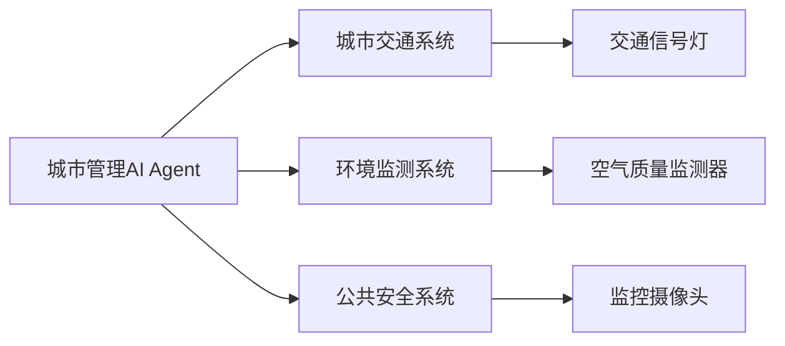
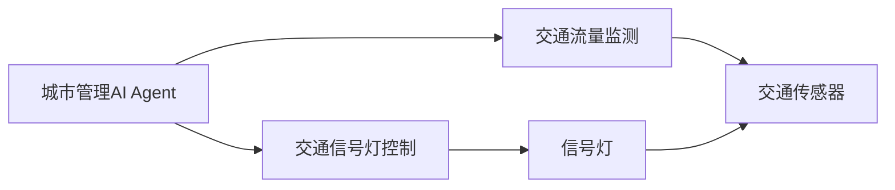
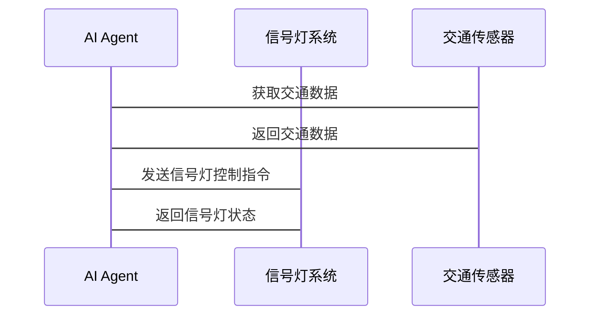

                 


# 构建智能城市管理AI Agent系统

> 关键词：AI Agent, 智慧城市, 算法原理, 系统架构, 项目实战

> 摘要：随着城市化进程的加快，城市管理面临着越来越复杂的挑战。AI Agent作为一种智能实体，能够通过感知、决策和执行来解决城市管理中的诸多问题。本文将详细介绍AI Agent在城市管理中的应用，从基本概念到算法实现，从系统架构到项目实战，全面解析构建智能城市管理AI Agent系统的各个方面。

---

# 第一部分: 智慧城市与AI Agent系统背景

## 第1章: AI Agent与城市管理概述

### 1.1 AI Agent的基本概念

#### 1.1.1 什么是AI Agent
AI Agent（人工智能代理）是一种智能实体，能够感知环境、做出决策并执行动作。它可以自主地解决问题，无需人工干预。AI Agent的核心在于其智能性，能够根据环境信息调整行为以达到目标。

#### 1.1.2 AI Agent的核心特征
1. **自主性**：AI Agent能够自主决策和行动，无需外部干预。
2. **反应性**：能够实时感知环境并做出反应。
3. **目标导向**：通过设定目标来指导行为和决策。
4. **学习能力**：能够通过经验改进性能。

#### 1.1.3 AI Agent与传统自动化的区别
| 特征       | AI Agent                 | 传统自动化         |
|------------|--------------------------|-------------------|
| 决策能力   | 强大，基于环境反馈       | 有限，基于预设规则 |
| 学习能力   | 具备，能够优化行为        | 无                |
| 灵活性     | 高，适应复杂环境变化      | 低，适应性有限     |

### 1.2 智慧城市的发展背景

#### 1.2.1 城市管理的痛点与挑战
- **交通拥堵**：城市交通流量大，道路资源有限，导致拥堵问题。
- **环境污染**：工业化和城市化导致空气、水、土壤污染加剧。
- **公共安全**：城市人口密集，面临火灾、盗窃、恐怖袭击等安全威胁。

#### 1.2.2 智慧城市的定义与目标
智慧城市建设的目标是通过智能化手段优化资源配置，提升城市管理效率，改善居民生活质量。其核心在于利用大数据、人工智能、物联网等技术实现城市各系统的协同工作。

#### 1.2.3 AI Agent在城市管理中的作用
AI Agent能够实时感知城市环境，分析数据，做出最优决策，并通过执行机构实现目标。例如，在交通管理中，AI Agent可以实时调整信号灯配时，优化交通流量。

### 1.3 AI Agent在城市管理中的应用

#### 1.3.1 智能交通管理
AI Agent可以实时监控交通流量，预测拥堵情况，并动态调整交通信号灯配时，优化道路资源利用。

#### 1.3.2 环境监测与污染控制
通过部署环境传感器，AI Agent可以实时监测空气质量、水质等指标，及时发现污染源并采取措施进行控制。

#### 1.3.3 公共安全与应急响应
在公共安全领域，AI Agent可以实时分析监控视频，识别异常行为，提前预警潜在的安全威胁，并协调应急资源进行快速响应。

---

## 第2章: AI Agent的核心概念与联系

### 2.1 AI Agent的原理

#### 2.1.1 感知模块
AI Agent通过传感器或其他信息源获取环境数据。例如，在智能交通系统中，AI Agent通过交通摄像头、雷达等设备获取实时交通数据。

#### 2.1.2 决策模块
决策模块是AI Agent的核心，负责根据感知到的信息做出决策。常用的决策方法包括基于规则的决策、基于模型的决策和基于学习的决策。

#### 2.1.3 执行模块
执行模块负责将决策结果转化为实际动作。例如，在交通管理中，AI Agent通过调整信号灯状态来执行决策。

### 2.2 AI Agent的特征对比

| 特征       | 反应式AI Agent | 规划式AI Agent | 集中式AI Agent | 分布式AI Agent |
|------------|----------------|----------------|----------------|----------------|
| 行为方式   | 基于当前感知做出反应 | 基于目标规划行为 | 依赖中央控制系统 | 各节点独立决策 |
| 适用场景   | 实时反应式任务 | 需要复杂规划任务 | 需要集中控制的场景 | 分布式协作场景 |
| 优缺点     | 响应速度快，但缺乏长远规划 | 行为可控，但计算资源消耗大 | 系统稳定性高，但灵活性差 | 灵活性高，但协调难度大 |

### 2.3 AI Agent的实体关系图



---

## 第3章: AI Agent的算法原理

### 3.1 基于强化学习的AI Agent算法

#### 3.1.1 强化学习的基本原理
强化学习是一种通过试错方法来优化决策模型的算法。AI Agent通过与环境交互，获得奖励或惩罚，从而学习最优策略。

#### 3.1.2 Q-learning算法
Q-learning是一种常用的强化学习算法，其核心思想是通过更新Q值表来优化决策。Q值表记录了在每个状态下采取每个动作后的期望奖励。


#### 3.1.3 Q-learning算法实现
以下是Q-learning算法的Python实现示例：

```python
import numpy as np

class AI_Agent:
    def __init__(self, state_space_size, action_space_size, learning_rate=0.1, gamma=0.99):
        self.state_space_size = state_space_size
        self.action_space_size = action_space_size
        self.learning_rate = learning_rate
        self.gamma = gamma
        self.q_table = np.zeros((state_space_size, action_space_size))
    
    def take_action(self, state):
        return np.argmax(self.q_table[state, :])
    
    def learn(self, state, action, reward, next_state):
        target = reward + self.gamma * np.max(self.q_table[next_state, :])
        self.q_table[state, action] += self.learning_rate * (target - self.q_table[state, action])
```

#### 3.1.4 算法数学模型
Q-learning算法的数学模型如下：

$$ Q(s, a) = Q(s, a) + \alpha \cdot (r + \gamma \cdot \max Q(s', a') - Q(s, a)) $$

其中：
- \( Q(s, a) \) 表示当前状态下采取动作 \( a \) 的Q值。
- \( \alpha \) 是学习率。
- \( r \) 是奖励。
- \( \gamma \) 是折扣因子。
- \( s' \) 是下一个状态。
- \( a' \) 是下一个动作。

---

## 第4章: 系统分析与架构设计

### 4.1 问题场景介绍
在智能交通管理中，AI Agent需要实时监控交通流量，调整信号灯配时，以减少拥堵和提高通行效率。

### 4.2 系统功能设计
系统功能包括：
1. 实时数据采集：通过传感器获取交通流量、车速等数据。
2. 数据分析：利用AI算法分析数据，预测交通趋势。
3. 决策与控制：根据分析结果调整信号灯配时。
4. 反馈与优化：根据执行结果优化算法。

### 4.3 系统架构设计



### 4.4 系统接口设计
系统接口包括：
1. 数据采集接口：与交通传感器通信。
2. 控制接口：与信号灯系统通信。
3. 用户接口：供管理人员查看实时数据和系统状态。

### 4.5 系统交互设计



---

## 第5章: 项目实战

### 5.1 环境安装
需要安装以下工具和库：
- Python 3.8+
- NumPy
- Matplotlib
- Scikit-learn

### 5.2 系统核心实现源代码
以下是AI Agent在交通信号灯控制中的实现示例：

```python
import numpy as np

class TrafficAgent:
    def __init__(self, num_states, num_actions, learning_rate=0.1, gamma=0.99):
        self.num_states = num_states
        self.num_actions = num_actions
        self.learning_rate = learning_rate
        self.gamma = gamma
        self.q_table = np.zeros((num_states, num_actions))
    
    def get_action(self, state):
        return np.argmax(self.q_table[state, :])
    
    def update_q_table(self, state, action, reward, next_state):
        target = reward + self.gamma * np.max(self.q_table[next_state, :])
        self.q_table[state, action] += self.learning_rate * (target - self.q_table[state, action])
```

### 5.3 代码应用解读与分析
上述代码实现了一个简单的Q-learning算法，用于交通信号灯控制。AI Agent通过与交通传感器交互，获取交通数据，调整信号灯配时，以优化交通流量。

### 5.4 实际案例分析
假设我们有一个两车道的交叉路口，AI Agent需要根据交通流量调整信号灯配时。通过训练，AI Agent能够根据实时交通情况，动态调整信号灯周期，减少拥堵和等待时间。

### 5.5 项目小结
通过该项目，我们展示了AI Agent在城市管理中的应用潜力。通过实时数据采集、智能决策和执行控制，AI Agent能够显著提高城市管理效率。

---

## 第6章: 最佳实践

### 6.1 小结
本文详细介绍了AI Agent在城市管理中的应用，从基本概念到算法实现，从系统架构到项目实战，全面解析了构建智能城市管理AI Agent系统的关键环节。

### 6.2 注意事项
1. 在实际应用中，需要考虑系统的实时性和可靠性。
2. 数据隐私和安全问题需要高度重视。
3. 系统的可扩展性和可维护性也需要充分考虑。

### 6.3 拓展阅读
1. 《强化学习入门》
2. 《分布式系统设计与实现》
3. 《智能交通系统》

---

通过本文的学习，读者可以深入了解AI Agent在城市管理中的应用，并掌握构建智能城市管理AI Agent系统的相关技术和方法。希望本文对读者在智慧城市建设中有所帮助。

