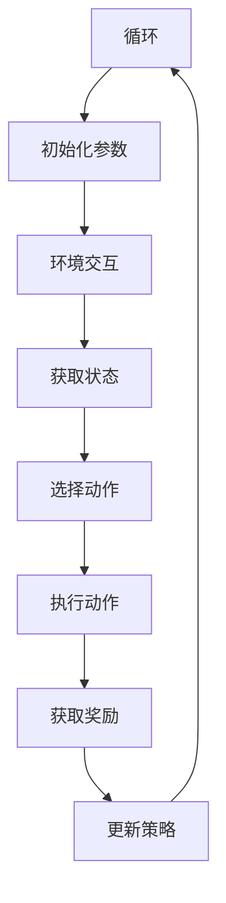
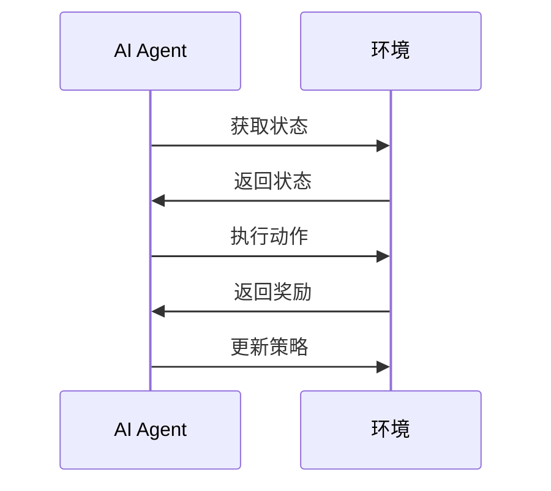

                 


# 构建自主学习型AI Agent

## 关键词：
- 自主学习型AI Agent
- 强化学习
- 自适应学习
- 系统架构
- 项目实战

## 摘要：
构建自主学习型AI Agent是一项具有挑战性的任务，旨在使AI系统能够通过与环境交互和自我调整来实现目标。本文将从背景介绍、核心概念、算法实现、系统架构设计到项目实战，逐步深入探讨如何构建这样一个AI Agent。通过详细分析自主学习机制、强化学习算法、系统架构设计及实际案例，本文将为读者提供构建自主学习型AI Agent的全面指导。

---

## 第一部分：背景介绍

### 第1章：自主学习型AI Agent概述

#### 1.1 问题背景与挑战
- **AI Agent的基本概念**
  - AI Agent是具有感知环境和执行动作能力的智能体，能够根据输入做出决策。
  - 传统AI Agent依赖于预定义的规则和数据，难以应对动态变化的环境。
- **自主学习的需求与动机**
  - 动态环境中的适应性需求：现实世界中的环境复杂多变，AI Agent需要具备自我调整的能力。
  - 复杂任务的处理需求：某些任务（如游戏AI、自动驾驶）需要AI Agent能够自主决策。
- **当前AI Agent的局限性**
  - 传统AI Agent依赖于大量预训练数据，难以在未知环境中自主学习。
  - 缺乏灵活性，难以应对任务目标的变化。

#### 1.2 问题描述与目标
- **问题核心**
  - 构建一个能够通过与环境交互，逐步优化自身行为的AI Agent。
- **目标设定**
  - 实现AI Agent的自主学习能力，使其能够在未知环境中完成特定任务。
  - 研究和设计自主学习的算法和机制。
- **边界与外延**
  - 自主学习的范围：定义AI Agent的学习能力边界，明确其与外部系统的交互方式。
  - 外延：自主学习型AI Agent在不同领域（如教育、医疗、金融）中的应用。

#### 1.3 自主学习型AI Agent的定义与特点
- **核心概念**
  - 自主学习：AI Agent通过与环境的交互，逐步优化自身行为，以实现特定目标。
  - 强化学习：基于奖励机制的自适应学习方式。
- **与其他AI类型的区别**
  | 类型          | 描述                                                                 |
  |---------------|----------------------------------------------------------------------|
  | 传统AI Agent  | 基于规则和预训练数据进行决策，缺乏自主调整能力。                   |
  | 自主学习型AI Agent | 能够通过与环境交互，自主调整行为以实现目标。                     |
  | 无监督学习     | 无明确目标，主要发现数据中的模式。                                  |
  | 监督学习       | 基于标注数据进行学习，目标明确但缺乏自适应性。                     |
- **关键属性对比表**
  | 属性           | 传统AI Agent | 自主学习型AI Agent |
  |----------------|--------------|--------------------|
  | 决策方式       | 预定义规则   | 动态调整策略        |
  | 环境适应性     | 有限         | 高                  |
  | 学习能力       | 无           | 强                  |

---

## 第二部分：核心概念与原理

### 第2章：自主学习机制

#### 2.1 强化学习与自适应学习
- **强化学习的基本原理**
  - 强化学习（Reinforcement Learning, RL）：通过试错机制，AI Agent在环境中通过不断尝试动作，获得奖励或惩罚，逐步优化策略。
  - 核心要素：
    - 状态（State）：环境的当前情况。
    - 动作（Action）：AI Agent采取的行为。
    - 奖励（Reward）：环境对AI Agent行为的反馈。
    - 策略（Policy）：决定AI Agent在给定状态下采取的动作的概率分布。
  - 与监督学习和无监督学习的区别：
    | 方向         | 监督学习       | 无监督学习       | 强化学习         |
    |--------------|---------------|------------------|------------------|
    | 数据类型     | 标签数据       | 未标签数据       | 状态、动作、奖励 |
    | 目标         | 分类/回归     | 发现数据结构     | 最大化累积奖励   |
- **自适应学习的策略调整**
  - 自适应学习：根据环境反馈动态调整策略，以提高任务完成效率。
  - 策略调整方法：
    - 贪婪策略：优先选择当前最优动作。
    - 探索策略：随机选择动作以探索新状态。
  - 常见算法：
    - Q-Learning：基于值函数的强化学习算法。
    - Deep Q-Networks（DQN）：使用深度神经网络近似Q值函数。

#### 2.2 自适应学习算法
- **基于强化学习的自适应算法**
  - 算法步骤分解：
    1. 初始化参数：定义状态空间、动作空间、奖励函数。
    2. 环境交互：AI Agent与环境互动，获取状态、执行动作。
    3. 奖励反馈：根据动作和状态，环境返回奖励。
    4. 策略更新：根据奖励更新Q值函数或策略函数。
    5. 循环迭代：重复上述步骤，直到达到目标或收敛。
  - 实例分析：
    - 游戏AI：通过试错学习掌握游戏规则，最终击败对手。
- **自适应学习的数学模型**
  - 状态空间：S = {s₁, s₂, ..., sₙ}，每个状态s表示环境的某个情况。
  - 动作空间：A = {a₁, a₂, ..., aₘ}，每个动作a表示AI Agent的某个行为。
  - 奖励函数：R: S×A → ℝ，定义每个状态-动作对的奖励值。
  - Q值函数：Q: S×A → ℝ，定义每个状态-动作对的期望累积奖励。
  - 动态规划方程：
    $$ Q(s, a) = r + γ \cdot \max_{a'} Q(s', a') $$
    其中，r是当前动作的奖励，γ是折扣因子，s'是下一状态。

---

## 第三部分：算法实现与数学模型

### 第3章：强化学习算法实现

#### 3.1 算法流程图


#### 3.2 Python实现代码
```python
import numpy as np

class AI-Agent:
    def __init__(self, state_space, action_space):
        self.state_space = state_space
        self.action_space = action_space
        self.q_table = np.zeros((state_space, action_space))
        self.learning_rate = 0.1
        self.discount_factor = 0.9

    def choose_action(self, state):
        if np.random.random() < 0.1:  # 探索
            return np.random.randint(self.action_space)
        else:  # 利用
            return np.argmax(self.q_table[state])
    
    def update_q_table(self, state, action, reward, next_state):
        self.q_table[state, action] = self.q_table[state, action] * (1 - self.learning_rate) + self.learning_rate * (reward + self.discount_factor * np.max(self.q_table[next_state]))
```

#### 3.3 算法原理的数学模型
- **Q值更新公式**：
  $$ Q(s, a) = Q(s, a) \cdot (1 - \alpha) + \alpha \cdot (r + \gamma \cdot \max_{a'} Q(s', a')) $$
  其中，α是学习率，γ是折扣因子。
- **策略函数**：
  $$ \pi(a|s) = \frac{1}{1 + e^{-Q(s,a)}} $$
  其中，Q(s,a)是状态s下动作a的Q值。

---

## 第四部分：系统分析与架构设计

### 第4章：系统架构设计

#### 4.1 系统架构图
```mermaid
graph TD
    Agent --> [环境] 
    Agent --> [奖励函数]
    Agent --> [Q值函数]
    环境 --> [状态]
    状态 --> Agent
    Agent --> 动作
    动作 --> 环境
    环境 --> 奖励
    奖励 --> Agent
    Agent --> 更新策略
```

#### 4.2 交互流程图


---

## 第五部分：项目实战

### 第5章：构建自主学习型AI Agent

#### 5.1 环境安装与配置
- 安装Python和相关库（如numpy、matplotlib）。
- 定义环境接口，如游戏界面或模拟器。

#### 5.2 核心代码实现
```python
def main():
    import gym
    env = gym.make('CartPole-v0')
    agent = AI-Agent(env.observation_space.shape[0], env.action_space.n)
    for episode in range(1000):
        state = env.reset()
        total_reward = 0
        while True:
            action = agent.choose_action(state)
            next_state, reward, done, _ = env.step(action)
            agent.update_q_table(state, action, reward, next_state)
            total_reward += reward
            state = next_state
            if done:
                break
        print(f"Episode {episode}, Total Reward: {total_reward}")

if __name__ == "__main__":
    main()
```

#### 5.3 案例分析与优化
- **案例分析**：
  - 使用CartPole-v0环境测试AI Agent的学习能力。
  - 记录每一步的奖励值和Q值的变化。
- **优化建议**：
  - 调整学习率和折扣因子，以提高学习效率。
  - 引入经验回放机制，减少策略的贪婪性。

---

## 第六部分：高级主题与扩展

### 第6章：多智能体协作与伦理问题

#### 6.1 多智能体协作
- **多智能体系统**：多个AI Agent协同工作，共同完成复杂任务。
- **协作机制**：通过通信和共享信息，优化整体行为。

#### 6.2 自主学习的伦理与安全
- **伦理问题**：
  - 自主决策可能导致不可预测的行为，引发伦理争议。
  - 数据偏见可能导致不公平的结果。
- **安全问题**：
  - 恶意攻击可能干扰AI Agent的学习过程。
  - 数据泄露和隐私问题。

---

## 总结
构建自主学习型AI Agent是一项复杂而富有挑战性的任务，需要结合强化学习算法、系统架构设计和实际项目经验。通过本文的详细讲解，读者可以系统地掌握构建自主学习型AI Agent的核心概念、算法实现和实际应用。未来，随着技术的发展，自主学习型AI Agent将在更多领域展现出其强大的潜力。

---

**注意事项**：
- 在实际应用中，需注意算法的收敛速度和稳定性。
- 伦理和安全问题是构建自主学习型AI Agent时不可忽视的重要方面。
- 建议结合具体应用场景，对算法进行针对性优化。

**Tips**：
- 使用可视化工具（如TensorBoard）监控训练过程。
- 定期测试和评估AI Agent的性能，及时调整参数。

**拓展阅读**：
- 《强化学习：理论与算法》
- 《自适应控制与学习系统》
- 《多智能体协作与博弈论》

