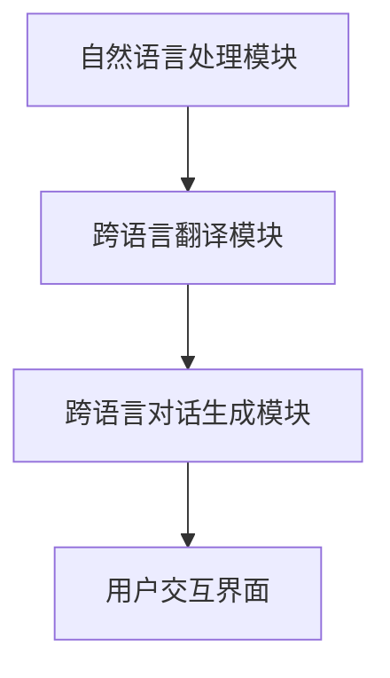
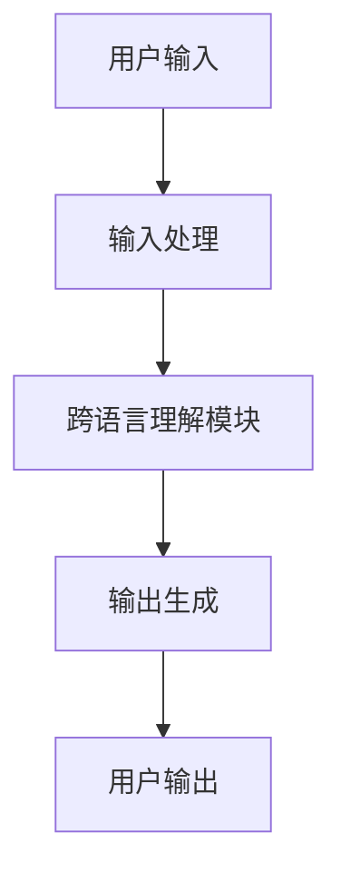

                 


```markdown
# 构建跨语言理解的AI Agent系统

> 关键词：跨语言理解，AI Agent，自然语言处理，机器翻译，对话系统

> 摘要：本文详细探讨了构建跨语言理解的AI Agent系统的各个方面，包括核心概念、算法原理、系统架构设计以及项目实战。文章从背景介绍出发，逐步深入分析，结合丰富的图表和代码示例，帮助读者全面理解跨语言理解在AI Agent中的应用和实现。

---

## 第1章 背景介绍

### 1.1 跨语言理解的背景与问题背景
#### 1.1.1 语言障碍与跨语言理解的需求
语言障碍是人类交流中的主要障碍之一，尤其是在全球化背景下，跨语言交流的需求日益增加。AI Agent作为人机交互的桥梁，需要能够理解并处理多种语言，以满足不同用户的需求。

#### 1.1.2 当前AI Agent系统的局限性
传统的AI Agent系统通常只能处理单一语言，无法应对跨语言场景。这种局限性限制了其在国际环境中的应用，例如跨国公司、多语言客服系统等。

#### 1.1.3 跨语言理解在AI Agent中的重要性
跨语言理解能够使AI Agent在多语言环境中提供服务，提高用户体验，同时降低人工翻译成本。它是构建智能、高效的AI Agent系统的关键技术。

### 1.2 跨语言理解的定义与问题描述
#### 1.2.1 跨语言理解的定义
跨语言理解是指AI系统能够理解并处理多种语言之间的转换和信息传递，包括翻译、对话生成等任务。

#### 1.2.2 跨语言理解的核心问题
- 不同语言之间的语义差异
- 多语言模型的训练数据稀缺性
- 跨语言理解的实时性要求

#### 1.2.3 跨语言理解的边界与外延
- 边界：专注于语言之间的转换和理解，不涉及图像或视频等其他模态。
- 外延：扩展至多模态理解和跨文化对话。

### 1.3 跨语言理解与AI Agent的结合
#### 1.3.1 AI Agent的基本概念
AI Agent是一种智能实体，能够感知环境并执行任务，通常通过自然语言处理技术与用户交互。

#### 1.3.2 跨语言理解在AI Agent中的应用
- 多语言客服系统
- 跨语言信息检索
- 跨语言对话系统

#### 1.3.3 跨语言理解对AI Agent性能的提升
- 提高用户体验
- 扩大应用范围
- 增强系统智能性

---

## 第2章 跨语言理解的核心概念与联系

### 2.1 跨语言理解的核心概念
#### 2.1.1 跨语言理解的关键技术
- 机器翻译
- 对话生成
- 跨语言检索

#### 2.1.2 跨语言理解的主要方法
- 统计机器翻译
- 神经机器翻译
- 跨语言预训练模型

#### 2.1.3 跨语言理解的评价指标
- 翻译准确率
- 对话流畅度
- 用户满意度

### 2.2 跨语言理解与AI Agent的关系
#### 2.2.1 跨语言理解如何增强AI Agent的功能
通过支持多语言交互，AI Agent能够服务更多用户群体，提升其适用性和智能化水平。

#### 2.2.2 AI Agent如何支持跨语言交互
- 支持多语言输入
- 提供多语言输出
- 实现跨语言对话理解

#### 2.2.3 跨语言理解对AI Agent架构的影响
- 增加语言处理模块
- 引入跨语言模型
- 优化系统交互流程

### 2.3 跨语言理解的核心要素
#### 2.3.1 自然语言处理技术
- 分词
- 语法分析
- 语义理解

#### 2.3.2 跨语言翻译模型
- 神经网络翻译模型
- 对齐模型
- 增量式翻译

#### 2.3.3 跨语言对话系统
- 对话上下文管理
- 跨语言对话生成
- 用户意图识别

---

## 第3章 跨语言理解的核心原理与算法

### 3.1 跨语言理解的算法原理
#### 3.1.1 基于神经网络的跨语言模型
- 神经网络结构：编码器-解码器
- 注意力机制：位置无关注意力
- 模型训练：端到端训练

#### 3.1.2 跨语言注意力机制
- 注意力机制的作用：捕捉源语言和目标语言之间的关联
- 实现方式：使用预训练的跨语言词向量

#### 3.1.3 跨语言迁移学习
- 迁移学习：利用一种语言的预训练模型，迁移到其他语言
- 跨语言适应：通过微调模型参数，适应目标语言的特点

### 3.2 跨语言理解的数学模型
#### 3.2.1 编码器-解码器结构
$$
\text{编码器: } E(x) \rightarrow z
$$
$$
\text{解码器: } D(z) \rightarrow y
$$

#### 3.2.2 跨语言注意力机制公式
$$
\alpha_{i} = \text{softmax}(w \cdot \text{exp}(a_i))
$$

#### 3.2.3 跨语言模型的训练目标函数
$$
\mathcal{L} = -\sum_{i=1}^{n} \log p(y_i|x_i)
$$

### 3.3 跨语言理解的算法实现
#### 3.3.1 基于Transformer的跨语言模型
- Transformer架构：编码器和解码器堆叠
- 多头注意力机制：并行处理多个注意力头
- 前馈网络：非线性变换

#### 3.3.2 跨语言翻译的训练流程
1. 数据预处理：清洗和对齐
2. 模型训练：使用预训练数据
3. 模型调优：微调目标语言数据

#### 3.3.3 跨语言对话系统的实现步骤
1. 收集多语言对话数据
2. 构建跨语言对话模型
3. 集成到AI Agent系统中

---

## 第4章 跨语言理解的系统架构与设计

### 4.1 跨语言理解系统的整体架构
#### 4.1.1 系统功能模块
- 自然语言处理模块
- 跨语言翻译模块
- 跨语言对话生成模块

#### 4.1.2 系统架构图


#### 4.1.3 系统功能设计
- 用户输入：多语言支持
- 系统处理：跨语言理解
- 用户输出：多语言响应

### 4.2 跨语言理解的系统架构设计
#### 4.2.1 系统架构设计


#### 4.2.2 系统接口设计
- 输入接口：支持多种语言的文本输入
- 输出接口：提供多种语言的文本输出

#### 4.2.3 系统交互流程
1. 用户输入多语言文本
2. 系统进行跨语言理解
3. 系统生成多语言响应
4. 用户收到多语言反馈

---

## 第5章 跨语言理解的项目实战

### 5.1 环境安装与配置
- 安装Python
- 安装深度学习框架（如TensorFlow、PyTorch）
- 安装NLP库（如spaCy、transformers）

### 5.2 系统核心实现源代码
#### 5.2.1 跨语言翻译模型代码
```python
from transformers import MarianMT
model = MarianMT.from_pretrained('opus-mt-en-zh')
translated = model.translate(text)
```

#### 5.2.2 跨语言对话生成代码
```python
def generate_response(input_text):
    # 输入处理
    # 跨语言理解
    # 对话生成
    return response
```

### 5.3 实际案例分析与实现解读
#### 5.3.1 案例分析
- 输入语言：中文
- 输出语言：英文
- 对话内容：问候语

#### 5.3.2 代码实现解读
- 数据预处理：文本清洗和对齐
- 模型训练：使用预训练数据
- 模型调优：微调目标语言数据

### 5.4 项目总结与优化建议
- 项目总结：实现了一个基本的跨语言理解AI Agent系统
- 优化建议：引入更先进的模型，优化系统性能

---

## 第6章 最佳实践、小结与拓展阅读

### 6.1 最佳实践
- 使用预训练模型
- 结合领域知识优化
- 定期更新模型

### 6.2 小结
跨语言理解是构建智能AI Agent系统的重要技术，通过结合自然语言处理和深度学习，可以实现高效的多语言交互。

### 6.3 注意事项
- 数据质量：确保训练数据的多样性和质量
- 模型选择：选择适合任务的模型
- 性能优化：提升系统的响应速度和准确性

### 6.4 拓展阅读
- 推荐书籍：《神经机器翻译》
- 推荐论文：《Attention Is All You Need》
- 推荐工具：Hugging Face Transformers

---

## 结语
构建跨语言理解的AI Agent系统是一个复杂而有趣的过程，需要结合理论与实践，不断优化和创新。通过本文的指导，读者可以逐步掌握相关技术，开发出高效、智能的AI Agent系统。
```

