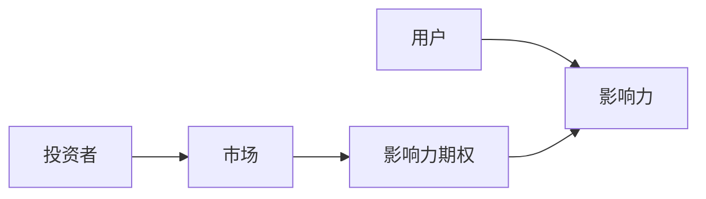
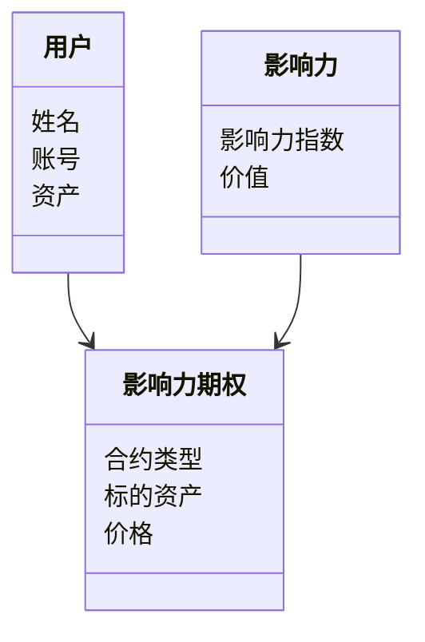
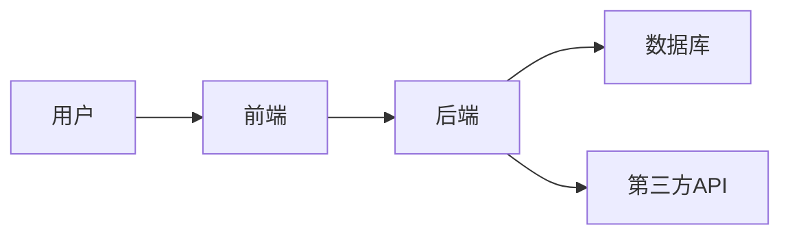

                 


# 格雷厄姆特价股票理论在数字社会影响力期权中的新应用

> 关键词：格雷厄姆投资理论、数字社会、影响力期权、量化模型、数学公式、系统架构设计

> 摘要：本文深入探讨了格雷厄姆特价股票理论在数字社会中的新应用，特别是其在影响力期权领域的独特价值。通过结合数字社会的经济特征与影响力期权的数学模型，文章提出了新的量化方法和系统架构设计，为投资者提供了基于格雷厄姆理论的全新视角。

---

# 第一部分: 格雷厄姆特价股票理论基础

## 第1章: 格雷厄姆特价股票理论概述

### 1.1 格雷厄姆投资理论的起源与发展

#### 1.1.1 格雷厄姆的生平与投资理念
本杰明·格雷厄姆（Benjamin Graham）是20世纪最伟大的投资理论家之一，他被誉为“价值投资之父”。他的投资理念的核心是寻找被市场低估的股票，即“特价股票”。格雷厄姆在《证券分析》一书中提出了许多经典的理论，例如“安全边际”和“内在价值”等。

#### 1.1.2 特价股票的定义与核心思想
特价股票是指市场价格低于其内在价值的股票。格雷厄姆认为，内在价值是衡量一个企业价值的客观标准，可以通过对企业财务状况的分析来估算。投资者应该寻找市场价格远低于内在价值的股票，因为这种股票具有较高的安全边际。

#### 1.1.3 格雷厄姆理论在传统投资中的应用
格雷厄姆的理论在传统投资中得到了广泛应用，尤其是在价值投资领域。许多著名的投资者，如沃伦·巴菲特（Warren Buffett），都深受格雷厄姆思想的影响。格雷厄姆的选股标准，例如低市盈率、低市净率和高股息率等，仍然是价值投资者的重要参考。

---

## 第2章: 格雷厄姆特价股票的核心要素与模型

### 2.1 格雷厄姆选股标准

#### 2.1.1 低市盈率与市净率的定义
市盈率（P/E Ratio）是股票价格与每股收益的比率，用于衡量股票的估值。格雷厄姆认为，市盈率过高的股票往往被市场高估，因此应该避免投资。市净率（P/B Ratio）是股票价格与每股净资产的比率，用于衡量股票相对于其资产价值的估值。格雷厄姆认为，市净率过高的股票也可能是被高估的。

#### 2.1.2 高股息率的计算与意义
股息率是每股股息与股票价格的比率，用于衡量股票的投资回报。格雷厄姆认为，高股息率的股票通常具有较高的安全边际，因为它们能够为投资者提供稳定的现金流。

#### 2.1.3 财务健康状况的评估指标
格雷厄姆认为，财务健康状况是衡量一个企业价值的重要标准。他提出了一系列财务指标，例如净利润率、资产负债率和现金流等，用于评估企业的财务健康状况。

### 2.2 格雷厄姆投资模型的数学表达

#### 2.2.1 市盈率与市净率的公式推导
市盈率（P/E）的公式为：
$$ P/E = \frac{股票价格}{每股收益} $$

市净率（P/B）的公式为：
$$ P/B = \frac{股票价格}{每股净资产} $$

#### 2.2.2 格雷厄姆安全边际的计算方法
安全边际是指市场价格与内在价值之间的差额。格雷厄姆认为，投资者应该寻找市场价格远低于内在价值的股票。安全边际的计算公式为：
$$ 安全边际 = 内在价值 - 市场价格 $$

#### 2.2.3 投资价值的评估公式
格雷厄姆提出了内在价值的计算公式，用于评估股票的真正价值。内在价值的计算公式为：
$$ 内在价值 = \frac{预期收益}{折现率} $$

---

## 第3章: 格雷厄姆理论在数字社会中的适应性

### 3.1 数字社会的经济特征与投资环境

#### 3.1.1 数字经济的定义与特点
数字经济是指以数字技术为核心驱动力的经济形态。数字社会的经济特征包括数据化、网络化和智能化等。

#### 3.1.2 数字社会中的投资机会与风险
数字社会为投资者提供了许多新的投资机会，例如科技公司、电子商务和金融科技等。然而，数字社会也存在许多风险，例如技术风险、市场风险和政策风险等。

#### 3.1.3 格雷厄姆理论的局限性与改进方向
格雷厄姆理论主要适用于传统投资环境，但在数字社会中，许多新的因素，例如数据资产、数字平台和网络效应等，需要重新考虑。

### 3.2 数字社会中的影响力期权

#### 3.2.1 影响力期权的定义与分类
影响力期权是指以数字社会中的影响力为标的资产的期权。影响力期权可以分为个人影响力期权和机构影响力期权。

#### 3.2.2 影响力期权与传统期权的对比
影响力期权与传统期权的主要区别在于标的资产。传统期权的标的资产通常是金融资产，而影响力期权的标的资产是影响力。

#### 3.2.3 影响力期权的定价模型
影响力期权的定价模型与传统期权类似，但需要考虑影响力的价值评估问题。影响力的价值可以通过影响力指数来衡量。

---

## 第4章: 格雷厄姆理论与影响力期权的核心概念

### 4.1 核心概念的原理分析

#### 4.1.1 格雷厄姆理论的核心原理
格雷厄姆理论的核心原理包括价值评估、安全边际和长期投资等。

#### 4.1.2 影响力期权的数学模型
影响力期权的数学模型需要考虑影响力的价值、时间和波动性等因素。

#### 4.1.3 核心概念的对比分析
通过对比分析，我们可以发现格雷厄姆理论与影响力期权的核心概念在许多方面具有相似性，例如价值评估和风险控制。

### 4.2 核心概念的属性特征对比

#### 4.2.1 影响力与传统股票的对比表格
以下是一个对比表格：

| 属性 | 影响力 | 传统股票 |
|------|--------|----------|
| 标的资产 | 影响力 | 股票     |
| 价值评估 | 影响力指数 | 股票价格 |
| 风险 | 市场波动 | 公司风险 |

#### 4.2.2 核心概念的ER实体关系图



---

## 第5章: 核心概念的系统架构设计

### 5.1 核心概念的系统分析

#### 5.1.1 问题场景介绍
数字社会中的影响力期权投资需要考虑许多因素，例如影响力价值评估、市场波动性和投资风险等。

#### 5.1.2 项目介绍
本文将设计一个基于格雷厄姆理论的影响力期权投资系统，用于帮助投资者更好地进行投资决策。

### 5.2 系统功能设计

#### 5.2.1 领域模型
以下是一个领域模型：



### 5.3 系统架构设计

#### 5.3.1 系统架构图



---

## 第6章: 项目实战

### 6.1 环境安装
需要安装Python和相关库，例如Pandas、NumPy和Matplotlib等。

### 6.2 核心代码实现

```python
import pandas as pd
import numpy as np
import matplotlib.pyplot as plt

# 示例数据
data = {'股票': ['A', 'B', 'C'], '价格': [10, 20, 30], '收益': [5, 10, 15]}
df = pd.DataFrame(data)

# 计算市盈率
df['市盈率'] = df['价格'] / df['收益']

print(df)
```

### 6.3 实际案例分析

#### 6.3.1 案例背景
假设我们有一个科技公司，其股票价格为50元，每股收益为5元。市盈率为10。

#### 6.3.2 案例分析
根据格雷厄姆理论，市盈率过高的股票可能被市场高估。因此，我们建议投资者谨慎投资。

---

## 第7章: 总结

### 7.1 最佳实践 tips
- 格雷厄姆理论在数字社会中的应用需要结合新的经济特征和投资环境。
- 影响力期权的定价模型需要考虑影响力的价值评估问题。

### 7.2 小结
本文深入探讨了格雷厄姆特价股票理论在数字社会影响力期权中的新应用，提出了新的量化方法和系统架构设计。

### 7.3 注意事项
- 投资者需要充分考虑市场风险和政策风险。
- 格雷厄姆理论的应用需要结合实际情况，避免机械套用。

### 7.4 拓展阅读
- 《证券分析》——本杰明·格雷厄姆
- 《影响力：社会 persuasion 的心理学》——罗伯特·西奥迪尼

---

以上是《格雷厄姆特价股票理论在数字社会影响力期权中的新应用》的技术博客文章大纲。根据需要，可以进一步扩展每个部分的内容，特别是加入具体的数学公式、图表和代码实现。

