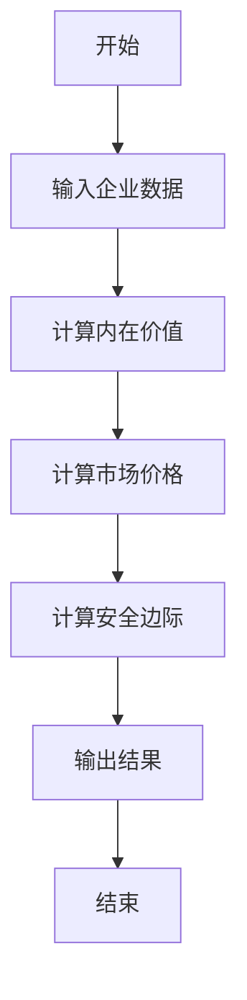
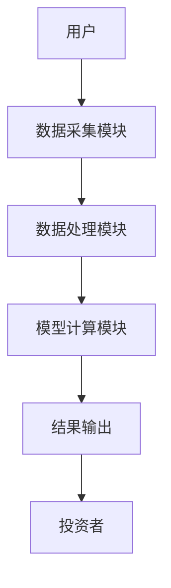
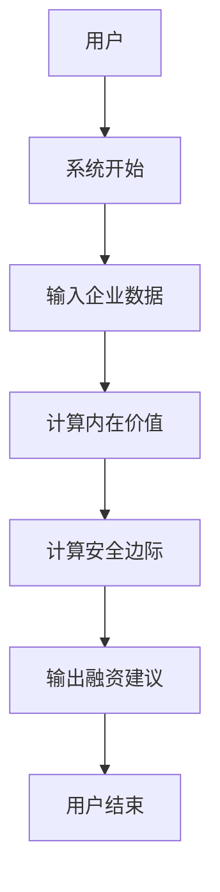

                 


# 格雷厄姆特价股票理论在社会企业融资中的运用

## 关键词：格雷厄姆特价股票理论、社会企业融资、价值投资、内在价值、安全边际、数学模型

## 摘要：本文探讨了格雷厄姆特价股票理论在社会企业融资中的应用，通过分析理论的核心概念、算法原理和数学模型，结合实际案例，展示了如何将价值投资的理念应用于社会企业的融资决策中，提出了一套适用于社会企业的融资模型，并提供了最佳实践建议。

---

# 第一部分: 格雷厄姆特价股票理论与社会企业融资概述

## 第1章: 格雷厄姆特价股票理论的背景与核心概念

### 1.1 格雷厄姆特价股票理论的起源与发展
格雷厄姆特价股票理论是由本杰明·格雷厄姆提出的一种价值投资方法，强调以低于内在价值的价格购买股票。这种方法的核心在于识别市场低估的股票，并通过安全边际来降低投资风险。

#### 1.1.1 价值投资理念的提出
价值投资的理念起源于20世纪初，格雷厄姆通过分析市场的波动性和投资者的心理行为，提出了以内在价值为基础的投资策略。他认为，市场的短期波动为投资者提供了以折扣价买入优质股票的机会。

#### 1.1.2 格雷厄姆投资策略的核心思想
格雷厄姆的投资策略强调安全边际和边际安全原则。他主张投资者应关注企业的基本面，如盈利能力、财务状况和行业地位，而不是市场的短期波动。

#### 1.1.3 特价股票理论的演变与应用
随着时间的推移，格雷厄姆的理论不断完善，成为现代价值投资的基础。许多投资者和机构将其应用于不同类型的资产，包括股票、债券和其他金融工具。

### 1.2 社会企业的定义与特征
社会企业是一种以实现社会目标为核心使命的企业，其盈利部分用于社会公益事业。社会企业的融资需求具有特殊性，需要兼顾经济效益和社会效益。

#### 1.2.1 社会企业的基本定义
社会企业是以社会使命为导向，通过商业活动实现盈利，并将利润用于支持社会目标的企业。

#### 1.2.2 社会企业的核心特征
- **社会使命**：以解决社会问题为核心。
- **财务可持续性**：通过商业活动实现自我造血。
- **透明度**：公开财务和运营信息，接受社会监督。

#### 1.2.3 社会企业融资的需求与挑战
社会企业在融资过程中面临双重挑战：既要满足财务回报的要求，又要实现社会目标。传统的融资模型往往忽视了社会价值，因此需要一种新的融资理论来指导实践。

### 1.3 格雷厄姆特价股票理论在社会企业融资中的应用前景
格雷厄姆的理论为社会企业提供了一种新的融资思路，通过识别具有长期价值的企业，实现社会目标和财务回报的双重优化。

#### 1.3.1 理论与实践的结合点
格雷厄姆理论强调长期价值，与社会企业的可持续发展目标高度契合。

#### 1.3.2 社会企业融资的特殊性与机遇
社会企业的融资需求具有特殊性，但其长期价值和可持续性也为投资者提供了新的机遇。

#### 1.3.3 格雷厄姆理论的适应性分析
格雷厄姆理论的核心理念可以适应社会企业的融资需求，但需要进行适当的调整和创新。

---

## 第2章: 格雷厄姆特价股票理论的核心概念与模型

### 2.1 格雷厄姆投资模型的构成
格雷厄姆的投资模型以内在价值为核心，通过安全边际降低投资风险。

#### 2.1.1 股票内在价值的计算公式
$$ V = \frac{E}{r - g} $$
其中，\( E \) 是企业的预期收益，\( r \) 是期望收益率，\( g \) 是收益增长率。

#### 2.1.2 市场价格与内在价值的关系
市场价格围绕内在价值波动，当市场价格低于内在价值时，股票具有投资价值。

#### 2.1.3 安全边际的概念与作用
安全边际是市场价格与内在价值之间的差额，用于降低投资风险。

### 2.2 社会企业融资模型的构建
社会企业融资模型需要结合社会价值和财务回报，构建一个综合评估体系。

#### 2.2.1 社会企业融资的核心要素
- **社会价值**：企业的社会影响力和贡献。
- **财务回报**：企业的盈利能力和发展潜力。

#### 2.2.2 融资模型的设计思路
通过综合评估企业的社会价值和财务回报，确定其融资价值。

#### 2.2.3 格雷厄姆理论与社会企业融资的结合
将格雷厄姆的内在价值概念应用于社会企业融资，构建一个综合评估模型。

### 2.3 格雷厄姆模型与社会企业融资模型的对比分析
通过对比分析，找出两者在概念和模型上的异同点，为理论创新提供依据。

#### 2.3.1 核心概念的异同点
- **相同点**：都关注内在价值和长期回报。
- **不同点**：社会企业融资模型还需考虑社会价值。

#### 2.3.2 模型适用性的差异
格雷厄姆模型适用于传统企业，而社会企业融资模型具有更强的针对性。

#### 2.3.3 模型优化的方向
结合社会价值评估，优化融资模型。

---

## 第3章: 格雷厄姆特价股票理论的算法原理与数学模型

### 3.1 格雷厄姆投资模型的算法流程
通过算法流程图展示格雷厄姆模型的应用步骤。

#### 3.1.1 数据输入与预处理
收集企业的财务数据和市场数据，进行清洗和标准化。

#### 3.1.2 内在价值计算算法
根据公式计算企业的内在价值，判断是否低于市场价格。

#### 3.1.3 安全边际计算算法
计算安全边际，评估投资风险。

#### 3.1.4 投资决策
根据安全边际和市场情况，决定是否买入或卖出股票。

### 3.2 社会企业融资模型的数学公式
综合评估社会价值和财务回报，构建融资模型。

#### 3.2.1 内在价值计算公式
$$ V = \frac{E}{r - g} $$
其中，\( E \) 是企业的社会价值，\( r \) 是期望收益率，\( g \) 是社会影响力增长。

#### 3.2.2 安全边际计算公式
$$ MS = P \times (1 - \frac{r}{g}) $$

### 3.3 算法流程图


---

## 第4章: 社会企业融资系统的架构设计

### 4.1 系统功能设计
设计一个模块化的融资系统，实现数据采集、处理和计算功能。

#### 4.1.1 数据采集模块
收集企业的财务数据和社会价值数据。

#### 4.1.2 数据处理模块
对数据进行清洗和标准化处理。

#### 4.1.3 模型计算模块
根据公式计算内在价值和安全边际，输出融资建议。

### 4.2 系统架构设计
采用分层架构，实现数据流和功能模块的高效协同。

#### 4.2.1 系统架构图


### 4.3 系统接口设计
定义清晰的接口，实现模块之间的数据交互。

#### 4.3.1 数据接口
- 输入接口：企业数据
- 输出接口：融资建议

#### 4.3.2 计算接口
- 内在价值计算接口
- 安全边际计算接口

### 4.4 系统交互序列图
展示用户与系统的交互流程。

#### 4.4.1 系统交互图


---

## 第5章: 项目实战与案例分析

### 5.1 项目实战: 社会企业融资评估系统
通过实际案例，展示如何应用格雷厄姆理论进行社会企业融资评估。

#### 5.1.1 环境安装
安装必要的开发工具和库，如Python、Pandas、Matplotlib。

#### 5.1.2 核心实现代码
```python
import pandas as pd

def calculate_intrinsic_value(enterprise_data):
    E = enterprise_data['E']
    r = enterprise_data['r']
    g = enterprise_data['g']
    V = E / (r - g)
    return V

def calculate_margin_of_safety(price, V):
    MS = price * (1 - r / g)
    return MS
```

#### 5.1.3 代码应用解读与分析
解释代码的功能和逻辑，展示如何计算内在价值和安全边际。

#### 5.1.4 案例分析
选择一家社会企业，分析其融资价值和潜力。

### 5.2 案例分析: 某社会企业的融资评估
通过具体案例，展示如何应用格雷厄姆理论进行融资决策。

---

## 第6章: 最佳实践与注意事项

### 6.1 最佳实践 tips
- **数据质量**：确保数据的准确性和完整性。
- **模型优化**：根据实际情况调整模型参数。
- **风险控制**：合理控制投资风险。

### 6.2 小结
总结格雷厄姆理论在社会企业融资中的应用，强调理论与实践的结合。

### 6.3 注意事项
- **数据偏差**：注意数据偏差对结果的影响。
- **模型局限性**：认识到模型的局限性，避免过度依赖。

### 6.4 拓展阅读
推荐相关书籍和论文，供读者深入学习。

---

## 结语
格雷厄姆特价股票理论为社会企业融资提供了一种新的思路，通过结合社会价值和财务回报，实现可持续发展。未来的研究可以进一步优化模型，探索更多应用场景。

