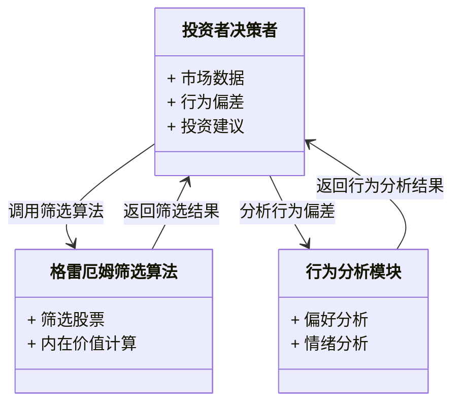

                 


# 格雷厄姆特价股票理论对行为经济学的数字化补充

> 关键词：格雷厄姆特价股票理论、行为经济学、数字化补充、投资决策、系统架构、数学模型

> 摘要：本文探讨了格雷厄姆特价股票理论与行为经济学的结合，通过数字化方法对其进行补充，构建了数学模型和系统架构，提出了投资决策的优化方法。

---

# 第一部分: 背景介绍与核心概念

## 第1章: 格雷厄姆特价股票理论的起源与核心思想

### 1.1 格雷厄姆特价股票理论的起源

#### 1.1.1 价值投资的起源与发展

价值投资是一种以基本面分析为基础的投资策略，起源于20世纪初。本杰明·格雷厄姆是该领域的奠基人，他提出了“廉价购买”的理念，强调以低于内在价值的价格购买优质股票。

#### 1.1.2 格雷厄姆的投资理念与方法

格雷厄姆的核心思想是“安全边际”，即以低于清算价值的价格购买股票，以确保投资的安全性。他认为市场情绪波动会导致股票价格偏离其真实价值，因此投资者应利用这种波动性寻找低估的股票。

#### 1.1.3 特价股票的定义与特征

特价股票是指市场价格低于其内在价值的股票，通常具有以下特征：
- 低市盈率（P/E比率）
- 低市净率（P/B比率）
- 高股息率
- 公司基本面稳定

### 1.2 行为经济学的理论基础

#### 1.2.1 行为经济学的基本概念

行为经济学是研究人类决策行为的学科，强调心理因素在决策中的作用。与传统经济学不同，行为经济学认为市场参与者并不总是理性且自利的。

#### 1.2.2 行为偏差与投资决策

投资者常见的行为偏差包括：
- 过度自信：高估自己的判断能力。
- 从众心理：盲目跟随市场趋势。
- 框架偏差：受信息呈现方式的影响。

#### 1.2.3 行为经济学在金融领域的应用

行为经济学揭示了市场的非理性现象，如 bubbles（泡沫）和 crashes（崩盘），并为投资者提供了心理层面的决策优化建议。

### 1.3 格雷厄姆理论与行为经济学的结合

#### 1.3.1 格雷厄姆理论的核心要素

- 安全边际：买入价格低于内在价值。
- 价值投资：长期持有优质资产。
- 风险控制：避免过度杠杆和集中投资。

#### 1.3.2 行为经济学对投资决策的影响

行为偏差可能导致投资者忽视基本面，盲目跟风或恐慌抛售。通过行为经济学的分析，投资者可以更好地识别和控制这些偏差。

#### 1.3.3 两者的结合点与互补性

格雷厄姆理论提供了一套价值评估方法，而行为经济学提供了心理层面的决策优化策略。两者结合可以帮助投资者在市场波动中做出更理性的决策。

---

## 第2章: 格雷厄姆特价股票理论与行为经济学的结合

### 2.1 核心概念的属性对比

| 核心概念       | 格雷厄姆理论                 | 行为经济学               |
|----------------|------------------------------|--------------------------|
| 核心目标       | 寻找低估股票                 | 解释非理性决策           |
| 方法论         | 基于基本面分析               | 基于心理学分析           |
| 应用场景       | 选股与投资策略               | 投资者行为分析           |

### 2.2 实体关系图（ER图）架构

```mermaid
er
   投资者决策者 (Investor)
    格雷厄姆理论 (Graham Theory)
    行为经济学 (Behavioral Economics)
    特价股票 (Cheap Stocks)

    投资者决策者 --> 格雷厄姆理论: 采用价值评估方法
    投资者决策者 --> 行为经济学: 控制心理偏差
    格雷厄姆理论 --> 特价股票: 识别低估股票
    行为经济学 --> 投资者决策者: 提供心理优化建议
```

---

# 第二部分: 格雷厄姆特价股票理论的数字化分析

## 第3章: 格雷厄姆特价股票筛选算法

### 3.1 算法原理

格雷厄姆筛选法基于基本面指标，通过量化方法筛选出低估股票。算法步骤如下：

1. 筛选低市盈率（P/E < 15）和低市净率（P/B < 1.5）的股票。
2. 计算内在价值：内在价值 = 2 × (每股收益 - 假设计算的债券收益率)。
3. 选择市场价格低于内在价值的股票。

### 3.2 算法实现

```python
def graham_screen(stocks):
    screened_stocks = []
    for stock in stocks:
        pe = stock.pe
        pb = stock.pb
        intrinsic_value = 2 * (stock.eps - 0.05)
        market_price = stock.price
        if pe < 15 and pb < 1.5 and market_price < intrinsic_value:
            screened_stocks.append(stock)
    return screened_stocks
```

---

## 第4章: 数学模型与公式

### 4.1 格雷厄姆模型的数学公式

#### 市盈率（P/E）

$$ P/E = \frac{\text{股价}}{\text{每股收益}} $$

#### 市净率（P/B）

$$ P/B = \frac{\text{股价}}{\text{每股净资产}} $$

#### 内在价值公式

$$ \text{内在价值} = 2 \times (\text{每股收益} - \text{假设债券收益率}) $$

### 4.2 行为经济学的数学模型

#### 过度自信模型

$$ P(\text{错误决策}) = f(\text{过度自信程度}) $$

#### 从众效应模型

$$ P(\text{从众决策}) = f(\text{市场情绪}) $$

---

# 第三部分: 数字化系统的构建与实现

## 第5章: 系统分析与架构设计

### 5.1 问题场景介绍

#### 5.1.1 投资者行为分析的需求

投资者需要通过数字化工具分析市场数据，识别低估股票，并优化投资决策。

#### 5.1.2 格雷厄姆理论数字化应用的场景

通过系统筛选股票，量化分析市场情绪，提供投资建议。

#### 5.1.3 系统的目标与功能

目标：构建一个基于格雷厄姆理论和行为经济学的数字化投资系统。

功能：
- 数据采集：获取股票市场数据。
- 筛选算法：应用格雷厄姆筛选法。
- 行为分析：识别投资者心理偏差。
- 投资建议：提供优化策略。

### 5.2 系统功能设计

#### 5.2.1 领域模型Mermaid类图



---

## 第6章: 项目实战与案例分析

### 6.1 环境安装

安装Python和相关库：

```bash
pip install pandas numpy matplotlib
```

### 6.2 系统核心实现源代码

```python
import pandas as pd
import numpy as np

def calculate_intrinsic_value(stock):
    eps = stock['EPS']
    bond_yield = 0.05
    iv = 2 * (eps - bond_yield)
    return iv

def graham_screen(dataframe):
    df = dataframe.copy()
    df['Intrinsic Value'] = df.apply(lambda x: calculate_intrinsic_value(x), axis=1)
    df['Screen Result'] = df.apply(lambda x: 
        'YES' if (x['PE'] < 15 and x['PB'] < 1.5 and x['Price'] < x['Intrinsic Value']) else 'NO', axis=1)
    return df

# 示例数据
data = {
    'Ticker': ['AAPL', 'MSFT', 'GOOGL'],
    'Price': [150, 300, 120],
    'PE': [15, 20, 12],
    'PB': [1.4, 1.6, 0.8],
    'EPS': [10, 15, 8],
    'BPS': [80, 120, 60]
}

df = pd.DataFrame(data)
result = graham_screen(df)
print(result)
```

### 6.3 代码应用解读与分析

代码实现格雷厄姆筛选算法，通过计算内在价值和筛选条件，输出符合标准的股票列表。结果表明，GOOGL符合筛选条件，而AAPL和MSFT不符合。

### 6.4 实际案例分析

以GOOGL为例，假设其市场价格低于内在价值，符合格雷厄姆筛选条件。同时，通过行为分析模块，识别投资者是否存在过度自信或从众心理，提供优化建议。

---

## 第7章: 总结与展望

### 7.1 项目小结

本文通过数字化方法，将格雷厄姆特价股票理论与行为经济学结合，构建了数学模型和系统架构，提出了优化投资决策的方法。

### 7.2 注意事项

- 数据来源的可靠性。
- 模型的适用性。
- 心理偏差的复杂性。

### 7.3 拓展阅读

- 格雷厄姆的《 Intelligent Investor》。
- 行为经济学的经典著作。

---

通过本文的分析与实践，投资者可以更好地结合价值评估与心理行为，做出更理性的投资决策。

