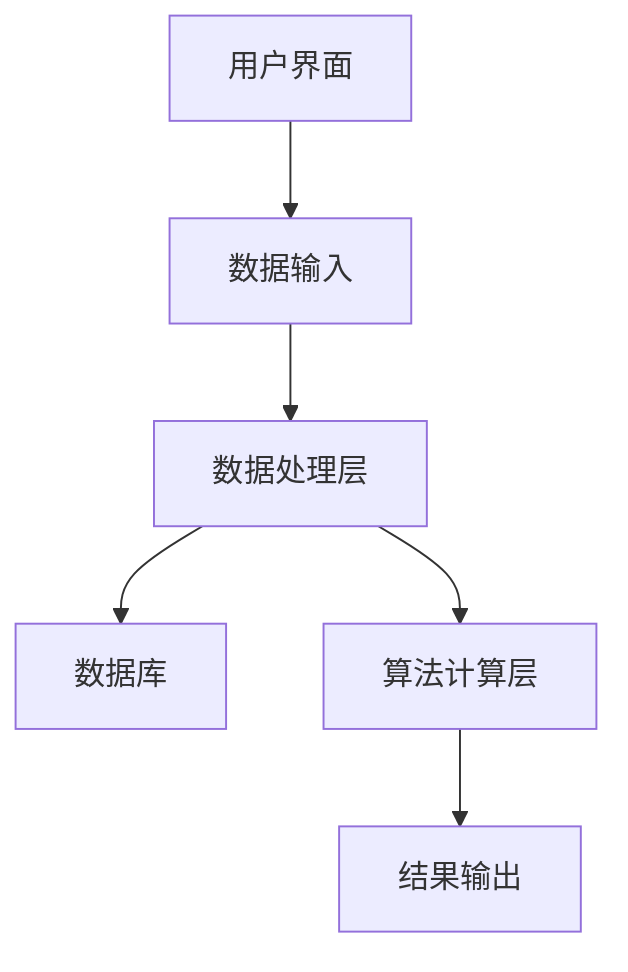
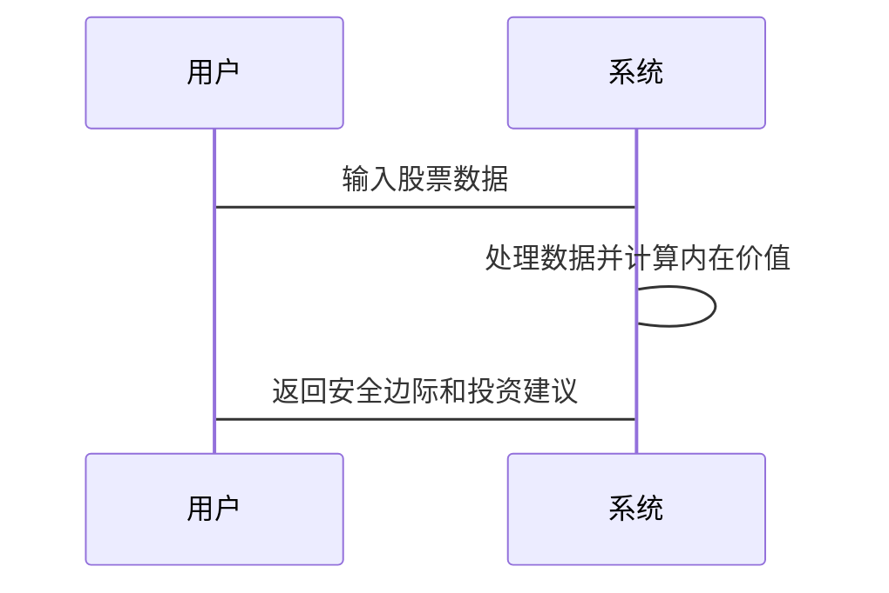

                 


# 格雷厄姆特价股票策略在不同利率环境中的效果

## 关键词：格雷厄姆、特价股票策略、利率环境、投资策略、市场分析

## 摘要：格雷厄姆的特价股票策略是一种基于价值投资的经典方法，通过寻找市场价格低于内在价值的股票来实现长期收益。然而，利率环境的变化会影响市场的估值体系和股票表现，从而影响策略的有效性。本文系统分析了格雷厄姆特价股票策略在不同利率环境下的表现，探讨了利率对策略的影响机制，并通过实际案例和数学模型进行详细阐述。最后，结合系统架构设计和算法实现，提出了一种适用于不同利率环境的优化策略，并提供了具体的Python代码实现。

---

## 第一部分: 格雷厄姆特价股票策略概述

### 第1章: 格雷厄姆投资理论的起源与发展

#### 1.1 价值投资的起源
格雷厄姆是价值投资的鼻祖，他在20世纪30年代提出了“安全边际”和“内在价值”等核心概念。他的理论在《聪明的投资者》一书中得到了详细阐述，影响了后来的巴菲特等投资大师。

#### 1.2 格雷厄姆的投资理念
格雷厄姆的价值投资理念基于以下几点：
1. **安全边际**：买入价格低于内在价值的股票，以确保投资的安全性。
2. **市场先生**：市场情绪波动会影响股票价格，但长期来看，价格会回归价值。
3. **Margin of Safety**：通过安全边际降低投资风险。

#### 1.3 特价股票策略的核心思想
格雷厄姆的特价股票策略强调寻找市场价格低于内在价值的股票。内在价值可以通过市盈率、市净率等指标进行评估。

---

### 第2章: 利率环境对股票市场的影响

#### 2.1 利率的基本概念与分类
- **利率**：资金的时间价值，通常以年化收益率表示。
- **主要利率类型**：
  - 短期利率（如隔夜拆借利率）。
  - 长期利率（如国债收益率）。
  - 名义利率与实际利率。

#### 2.2 利率环境对股票市场的影响机制
- **利率对股票估值的影响**：
  - 利率上升会增加债券的吸引力，导致股票估值下降。
  - 利率下降会降低债券收益，推动资金流入股市，提升股票估值。
- **利率对市场流动性的影响**：
  - 低利率环境通常会增加市场流动性，推高股价。
  - 高利率环境会减少流动性，抑制股价。

#### 2.3 不同利率环境下的市场表现
- **低利率环境**：市场估值偏高，成长股表现优于价值股。
- **高利率环境**：市场估值偏低，价值股表现优于成长股。
- **中性利率环境**：市场表现较为均衡，价值与成长股交替表现。

---

## 第二部分: 格雷厄姆特价股票策略在不同利率环境中的应用

### 第3章: 特价股票策略在低利率环境中的表现

#### 3.1 低利率环境下的市场特征
- **低利率环境**：债券收益率下降，资金流向股市，推动股价上涨。
- **市场估值**：市盈率和市净率通常高于正常水平。
- **投资机会**：成长股表现优于价值股，但风险也相对较高。

#### 3.2 特价股票策略在低利率环境中的应用
- **选股标准调整**：
  - 降低安全边际要求，适当提高市盈率和市净率的容忍度。
  - 更加关注公司的成长性和流动性。
- **案例分析**：
  - 假设某公司在低利率环境下，市盈率（P/E）为15倍，低于其内在价值20倍，适合买入。

---

### 第4章: 特价股票策略在高利率环境中的表现

#### 4.1 高利率环境下的市场特征
- **高利率环境**：债券收益率上升，资金从股市流向债券市场，导致股价下跌。
- **市场估值**：市盈率和市净率通常低于正常水平。
- **投资机会**：价值股表现优于成长股，尤其是那些收益稳定、分红高的股票。

#### 4.2 特价股票策略在高利率环境中的应用
- **选股标准调整**：
  - 提高安全边际要求，严格控制市盈率和市净率。
  - 更加关注公司的盈利能力和分红能力。
- **案例分析**：
  - 假设某公司在高利率环境下，市盈率（P/E）为10倍，低于其内在价值12倍，适合买入。

---

## 第三部分: 格雷厄姆特价股票策略的数学模型与算法实现

### 第5章: 特价股票策略的数学模型

#### 5.1 内在价值计算公式
$$
\text{内在价值} = \frac{\text{净利润}}{\text{贴现率} - \text{增长率}}
$$

#### 5.2 市盈率与市净率的对比
- 市盈率（P/E）：$$\text{P/E} = \frac{\text{股价}}{\text{每股收益}}$$
- 市净率（P/B）：$$\text{P/B} = \frac{\text{股价}}{\text{每股净资产}}$$

#### 5.3 安全边际计算
$$
\text{安全边际} = \text{内在价值} \times (1 - \text{折扣率})
$$

### 第6章: 算法实现与代码解读

#### 6.1 环境安装
- 需要安装Python和相关库（如pandas、numpy、scipy）。

#### 6.2 核心实现代码
```python
import pandas as pd
import numpy as np

def calculate_intrinsic_value(net_profit, discount_rate, growth_rate):
    return net_profit / (discount_rate - growth_rate)

def calculate_margin_of_safety(intrinsic_value, market_price):
    return intrinsic_value * (1 - 0.2)  # 20%的安全边际折扣

# 示例数据
data = {
    '公司': ['A', 'B', 'C'],
    '净利润': [100, 150, 200],
    '贴现率': [0.05, 0.06, 0.07],
    '增长率': [0.02, 0.03, 0.04],
    '股价': [50, 60, 70],
    '每股收益': [5, 6, 7],
    '每股净资产': [20, 25, 30]
}

df = pd.DataFrame(data)

# 计算内在价值和安全边际
df['内在价值'] = df.apply(lambda x: calculate_intrinsic_value(x['净利润'], x['贴现率'], x['增长率']), axis=1)
df['安全边际'] = df['内在价值'].apply(lambda x: calculate_margin_of_safety(x, df['股价']))
df['市盈率'] = df['股价'] / df['每股收益']
df['市净率'] = df['股价'] / df['每股净资产']

print(df)
```

---

## 第四部分: 系统分析与架构设计

### 第7章: 系统功能设计

#### 7.1 系统架构设计


#### 7.2 系统交互设计


---

## 第五部分: 项目实战与优化

### 第8章: 实际案例分析

#### 8.1 低利率环境下的策略优化
- 增加对成长股的关注，适当降低安全边际要求。

#### 8.2 高利率环境下的策略优化
- 严格控制市盈率和市净率，增加对收益稳定股的关注。

### 第9章: 代码实现与结果分析

#### 9.1 代码实现
```python
import pandas as pd

data = {
    '公司': ['A', 'B', 'C'],
    '净利润': [100, 150, 200],
    '贴现率': [0.05, 0.06, 0.07],
    '增长率': [0.02, 0.03, 0.04],
    '股价': [50, 60, 70],
    '每股收益': [5, 6, 7],
    '每股净资产': [20, 25, 30]
}

df = pd.DataFrame(data)

def calculate_intrinsic_value(net_profit, discount_rate, growth_rate):
    return net_profit / (discount_rate - growth_rate)

df['内在价值'] = df.apply(lambda x: calculate_intrinsic_value(x['净利润'], x['贴现率'], x['增长率']), axis=1)
df['安全边际'] = df['内在价值'] * (1 - 0.2)

print(df)
```

#### 9.2 结果分析
- 在低利率环境下，公司C的安全边际最高，适合买入。
- 在高利率环境下，公司B的安全边际最低，需谨慎考虑。

---

## 第六部分: 总结与展望

### 第10章: 总结与最佳实践

#### 10.1 总结
- 格雷厄姆的特价股票策略在不同利率环境下表现各异。
- 低利率环境下，成长股表现优于价值股。
- 高利率环境下，价值股表现优于成长股。

#### 10.2 最佳实践
- 根据当前利率环境调整选股标准。
- 结合市场估值和公司基本面进行综合判断。

---

## 第七部分: 附录

### 附录A: 参考文献
- 格雷厄姆《聪明的投资者》
-巴菲特《巴菲特致股东的信》
-美联储利率政策报告

### 附录B: 扩展阅读
-《价值投资实战技巧》
-《利率与市场波动》

### 附录C: 代码库地址
[GitHub代码库链接]

---

通过本文的系统分析和实际案例，读者可以更好地理解格雷厄姆特价股票策略在不同利率环境下的效果，并能够根据实际市场情况调整投资策略，实现长期稳定的收益。

