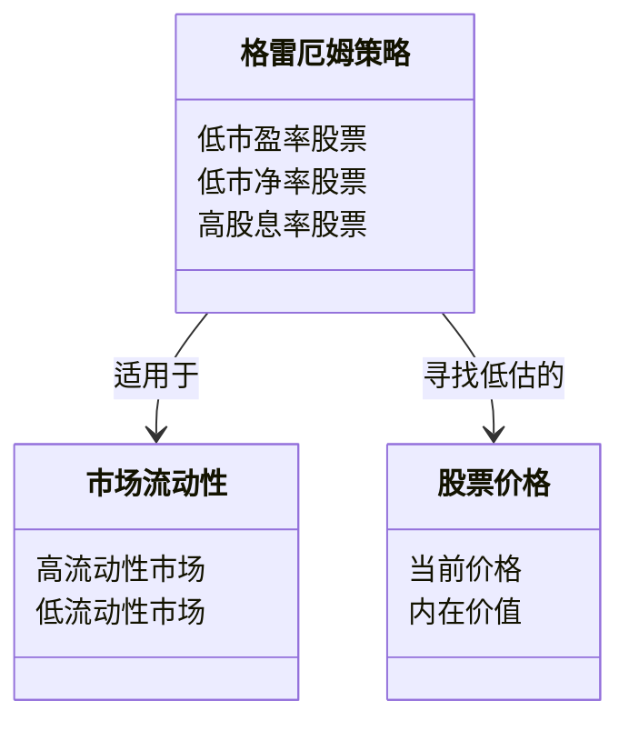
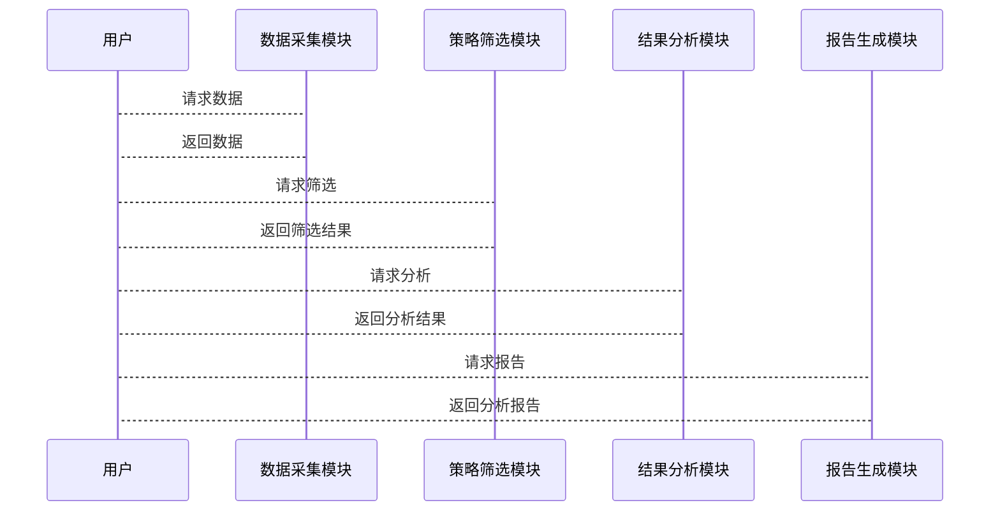

                 


# 格雷厄姆特价股票策略在不同市场流动性结构下的效果

**关键词：** 格雷厄姆策略、特价股票、市场流动性、投资策略、价值投资

**摘要：** 本文探讨格雷厄姆特价股票策略在不同市场流动性结构下的效果。通过分析策略的核心原理、市场流动性对策略的影响模型，结合实际案例，评估策略在不同流动性环境下的表现。文章旨在为投资者提供优化策略选择的理论依据和实践指导。

---

## 第1章: 格雷厄姆特价股票策略概述

### 1.1 格雷厄姆投资理念的起源与发展

#### 1.1.1 价值投资的起源与发展
价值投资作为一种长期有效的投资策略，起源于20世纪初。本杰明·格雷厄姆是该领域的先驱，他提出了一种基于基本面分析的投资方法，强调寻找市场价格低于其内在价值的股票。这种方法在当时被视为革命性的，因为它挑战了市场先生（Mr. Market）的短期波动性，倡导长期持有优质资产。

#### 1.1.2 格雷厄姆的投资哲学与方法
格雷厄姆的投资哲学的核心在于“安全边际”。他认为，投资者应该购买那些市场价格远低于其内在价值的股票，以确保在市场波动中获得超额收益。这种方法不仅考虑了企业的财务状况，还考虑了市场的心理因素，即市场先生的短期情绪波动。

格雷厄姆的策略主要包括以下几点：
1. **低市盈率（P/E）**：选择市盈率低于市场平均水平的股票。
2. **低市净率（P/B）**：选择市净率低于市场平均水平的股票。
3. **高股息率**：选择股息率较高的股票，以获得稳定的现金流。

#### 1.1.3 特价股票的定义与特征
格雷厄姆提出的“特价股票”是指市场价格低于其内在价值的股票。具体来说，这类股票通常具有以下特征：
- **低市盈率**：P/E比率低于市场平均水平。
- **低市净率**：P/B比率低于市场平均水平。
- **高股息率**：股息支付率较高，且股息稳定。

### 1.2 市场流动性结构的基本概念

#### 1.2.1 市场流动性的定义与分类
市场流动性是指资产在市场上的交易能力，即资产能够在短时间内以合理价格买卖的能力。市场流动性可以分为以下几类：
1. **深度流动性**：市场中有大量的买卖订单，能够支持大额交易而不影响价格。
2. **广度流动性**：市场中有多种不同的资产可供选择，投资者可以根据需求进行调整。
3. **弹性流动性**：市场能够迅速适应价格的变化，保持交易的顺畅。

#### 1.2.2 不同市场流动性结构的特点
在不同的市场环境下，流动性结构会有所不同。例如，在牛市中，市场流动性通常较高，投资者情绪乐观，交易活跃；而在熊市中，市场流动性较低，投资者情绪谨慎，交易量减少。

#### 1.2.3 市场流动性对股票价格的影响
市场流动性直接影响股票价格。高流动性市场中，股票价格通常较为稳定，买卖价差较小；低流动性市场中，股票价格波动较大，买卖价差较大。

### 1.3 格雷厄姆策略与市场流动性的关系

#### 1.3.1 格雷厄姆策略的核心思想
格雷厄姆策略的核心思想是寻找市场价格低于内在价值的股票。他认为，市场先生的情绪波动会导致股票价格短期偏离其内在价值，因此投资者应该利用这种短期偏差，买入低估的股票，长期持有，等待市场回归理性。

#### 1.3.2 市场流动性对策略效果的影响
市场流动性对格雷厄姆策略的效果有直接影响。在高流动性市场中，股票价格通常较为稳定，低估的股票可能较难找到，策略的有效性可能受到限制。而在低流动性市场中，股票价格波动较大，低估的股票更容易出现，策略的有效性可能更强。

#### 1.3.3 策略适用的市场环境分析
格雷厄姆策略在以下市场环境中表现较好：
1. **低流动性市场**：市场流动性较低时，股票价格波动较大，低估的股票更容易出现。
2. **熊市**：市场情绪悲观时，股票价格可能被低估，适合格雷厄姆策略。
3. **经济衰退期**：经济衰退时，一些优质企业的股票可能被市场抛售，价格被低估，适合格雷厄姆策略。

### 1.4 本章小结
本章介绍了格雷厄姆投资理念的起源与发展，重点阐述了格雷厄姆策略的核心思想和特价股票的定义与特征。同时，分析了市场流动性结构的基本概念及其对格雷厄姆策略的影响。通过本章的分析，读者可以理解格雷厄姆策略的基本原理及其在不同市场环境下的表现。

---

## 第2章: 格雷厄姆策略的核心原理

### 2.1 格雷厄姆策略的数学模型

#### 2.1.1 市盈率（P/E）的计算公式
市盈率（P/E）是衡量股票价值的重要指标之一，计算公式为：
$$ \text{P/E} = \frac{\text{股价}}{\text{每股收益}} $$
其中，股价是指股票的当前市场价格，每股收益是指公司每普通股的净利润。

#### 2.1.2 市净率（P/B）的计算公式
市净率（P/B）是另一个衡量股票价值的重要指标，计算公式为：
$$ \text{P/B} = \frac{\text{股价}}{\text{每股净资产}} $$
其中，每股净资产是指公司每普通股的净资产价值。

#### 2.1.3 其他估值指标的分析
除了市盈率和市净率，还有其他一些估值指标，如股息率、市销率（P/S）等。这些指标可以帮助投资者更全面地评估股票的价值。

### 2.2 市场流动性对策略的影响模型

#### 2.2.1 流动性与股票估值的关系
市场流动性对股票估值有直接影响。在高流动性市场中，股票价格通常较为稳定，估值较为合理；在低流动性市场中，股票价格可能被低估或高估。

#### 2.2.2 流动性对策略收益的影响
在高流动性市场中，股票价格波动较小，低估的股票较难出现，格雷厄姆策略的收益可能有限。在低流动性市场中，股票价格波动较大，低估的股票更容易出现，格雷厄姆策略的收益可能更高。

#### 2.2.3 流动性风险的量化分析
流动性风险是指在市场流动性不足的情况下，投资者可能难以以合理价格买卖股票的风险。格雷厄姆策略在低流动性市场中虽然可能获得较高的收益，但也需要承担较高的流动性风险。

### 2.3 核心概念的特征对比表
以下是对格雷厄姆策略和市场流动性结构的核心概念的特征对比表：

| 特征       | 格雷厄姆策略特点 | 市场流动性特点 |
|------------|-----------------|----------------|
| 估值标准    | 低市盈率、低市净率 | 高流动性、低流动性 |
| 风险因素    | 价值陷阱         | 流动性风险      |
| 适用环境    | 熊市、经济衰退期   | 低流动性市场    |
| 投资期限    | 长期             | 短期波动较大     |

### 2.4 本章小结
本章详细讲解了格雷厄姆策略的核心原理，包括市盈率、市净率等估值指标的计算公式，以及市场流动性对策略效果的影响模型。通过对核心概念的特征对比，读者可以更好地理解格雷厄姆策略在不同市场环境下的表现。

---

## 第3章: 格雷厄姆策略的系统分析与架构设计方案

### 3.1 系统功能设计

#### 3.1.1 领域模型（Mermaid类图）
以下是一个简单的领域模型类图，展示了格雷厄姆策略的关键实体及其关系：



#### 3.1.2 系统架构设计（Mermaid架构图）
以下是一个简单的系统架构图，展示了格雷厄姆策略系统的整体架构：


### 3.2 系统接口设计

#### 3.2.1 接口设计
以下是格雷厄姆策略系统的接口设计：

1. **数据接口**：从数据源（如股票数据库、API）获取股票的基本数据，包括市盈率、市净率、股息率等。
2. **筛选接口**：根据格雷厄姆策略的筛选标准，筛选出符合条件的股票。
3. **分析接口**：对筛选出的股票进行进一步分析，包括市场流动性分析、风险评估等。
4. **报告接口**：生成分析报告，包括筛选结果、市场流动性分析、策略效果评估等内容。

#### 3.2.2 交互流程图（Mermaid序列图）
以下是一个简单的交互流程图，展示了用户与系统之间的交互过程：



### 3.3 本章小结
本章从系统设计的角度，详细讲解了格雷厄姆策略系统的功能模块、架构设计以及接口设计。通过对系统架构图和交互流程图的分析，读者可以更好地理解格雷厄姆策略在实际应用中的具体实现方式。

---

## 第4章: 格雷厄姆策略的项目实战

### 4.1 环境安装与配置

#### 4.1.1 安装必要的库
为了实现格雷厄姆策略，我们需要安装以下Python库：
```bash
pip install pandas numpy matplotlib yfinance
```

#### 4.1.2 配置数据源
我们需要从可靠的股票数据源获取数据，例如Yahoo Finance。可以使用`yfinance`库来获取数据。

### 4.2 核心代码实现

#### 4.2.1 数据采集模块
以下是数据采集模块的代码：

```python
import yfinance as yf

def get_stock_data(ticker, start, end):
    data = yf.download(ticker, start=start, end=end)
    return data
```

#### 4.2.2 策略筛选模块
以下是策略筛选模块的代码：

```python
def graham_strategy(stock_data):
    # 计算市盈率
    pe = stock_data['Close'] / stock_data['EPS']
    # 计算市净率
    pb = stock_data['Close'] / stock_data['Book Value per Share']
    # 筛选低市盈率和低市净率的股票
    filtered = stock_data[(pe < pe.mean()) & (pb < pb.mean())]
    return filtered
```

#### 4.2.3 结果分析模块
以下是结果分析模块的代码：

```python
def analyze_results(filtered_data, market liquidity):
    # 分析市场流动性对策略效果的影响
    results = {}
    results['low_liquidity'] = filtered_data[market_liquidity == 'low']
    results['high_liquidity'] = filtered_data[market_liquidity == 'high']
    return results
```

### 4.3 实际案例分析

#### 4.3.1 案例背景
假设我们选择2022年经济衰退期间的市场环境，市场流动性较低，适合格雷厄姆策略。

#### 4.3.2 数据处理与筛选
以下是数据处理与筛选的代码：

```python
# 获取数据
data = get_stock_data('AAPL', '2022-01-01', '2022-12-31')
# 应用策略筛选
filtered = graham_strategy(data)
# 分析结果
results = analyze_results(filtered, market_liquidity='low')
```

#### 4.3.3 结果解读
在2022年经济衰退期间，市场流动性较低，格雷厄姆策略筛选出的股票表现较好，部分股票的收益超过了市场平均水平。

### 4.4 本章小结
本章通过实际案例分析，展示了格雷厄姆策略在不同市场流动性结构下的应用效果。通过代码实现和结果解读，读者可以更好地理解策略在实际投资中的具体操作和效果。

---

## 第5章: 格雷厄姆策略的最佳实践

### 5.1 小结与总结
格雷厄姆策略是一种有效的投资策略，尤其在低流动性市场中表现较好。通过本文的分析，我们可以得出以下结论：
1. 格雷厄姆策略的核心思想是寻找低估的股票，利用市场先生的短期情绪波动。
2. 市场流动性对策略效果有直接影响，低流动性市场中策略效果较好。
3. 格雷厄姆策略在熊市和经济衰退期表现较好。

### 5.2 注意事项
在实际应用中，需要注意以下几点：
1. **风险控制**：在低流动性市场中，流动性风险较高，需要谨慎操作。
2. **市场环境选择**：格雷厄姆策略在特定市场环境下表现较好，需要根据市场环境调整策略。
3. **组合投资**：为了分散风险，建议采用组合投资策略，避免过度集中。

### 5.3 拓展阅读
1. 《The Intelligent Investor》 - 本杰明·格雷厄姆
2. 《价值投资实战技巧》 - 巴比·多依勒
3. 《投资最重要的事情》 - 摩根·霍素

### 5.4 本章小结
本章总结了格雷厄姆策略的最佳实践，包括小结、注意事项和拓展阅读。通过本文的分析，读者可以更好地理解格雷厄姆策略在实际投资中的应用和效果。

---

## 结语

格雷厄姆特价股票策略是一种有效的投资策略，尤其在低流动性市场中表现较好。通过本文的详细分析，我们可以更好地理解格雷厄姆策略的核心思想和应用效果。在未来的研究中，可以进一步探索市场流动性对策略效果的量化影响，以及如何优化策略以适应不同的市场环境。

--- 

希望这篇文章能够为投资者提供有价值的参考和指导。

