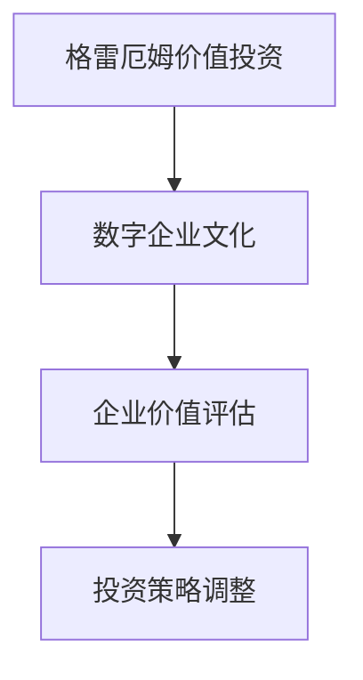
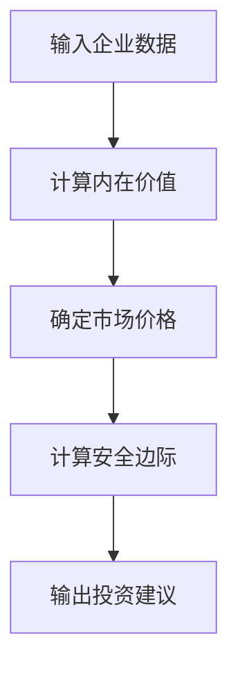
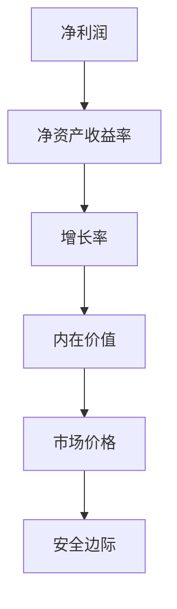
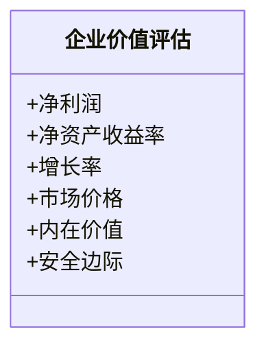
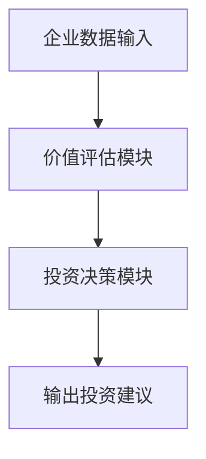
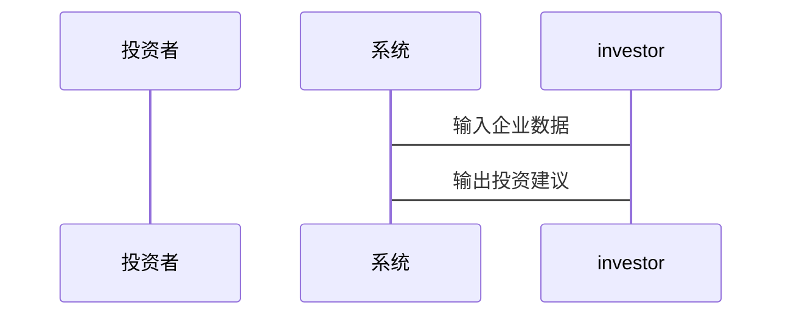

                 


# 《格雷厄姆特价股票策略在不同数字企业文化演化路径的适应》

## 关键词：格雷厄姆，特价股票策略，数字企业文化，企业演化路径，价值投资

## 摘要：
本文探讨了格雷厄姆的价值投资策略在不同数字企业文化演化路径中的适应性。通过分析数字企业的文化特征和演化阶段，结合格雷厄姆的安全边际理论，提出了一种适用于数字企业的价值投资方法。本文还通过实际案例分析，验证了该方法的有效性，并为投资者提供了最佳实践建议。

---

# 第1章 格雷厄姆价值投资理论基础

## 1.1 格雷厄姆投资理论的核心观点

### 1.1.1 价值投资的定义与核心理念
价值投资是一种长期投资策略，强调以低于内在价值的价格购买优质资产。格雷厄姆的价值投资理论强调安全边际、_margin of safety_，即以低于公平价格购买资产，以降低投资风险。

### 1.1.2 格雷厄姆的安全边际理论
安全边际是格雷厄姆策略的核心，它通过比较资产的市场价值与内在价值，确保在市场波动中投资者的本金安全。安全边际的计算公式为：
$$ \text{安全边际} = \text{内在价值} - \text{市场价格} $$

### 1.1.3 价值投资与成长投资的区别
价值投资关注低估资产，而成长投资关注高增长企业。格雷厄姆的价值投资强调稳健和安全，而成长投资更注重企业的成长潜力。

## 1.2 格雷厄姆特价股票策略的适用场景

### 1.2.1 特价股票的定义与特征
特价股票是指市场价格远低于内在价值的股票。其特征包括低市盈率、低市净率和高股息率。

### 1.2.2 特价股票的识别方法
识别特价股票的方法包括基本面分析、财务指标评估和市场趋势分析。常用指标包括市盈率（P/E）、市净率（P/B）和股息率。

### 1.2.3 特价股票投资的风险与收益分析
投资特价股票的风险包括市场波动和企业基本面变化。收益主要来自股价回升和分红收益。

---

# 第2章 数字企业文化的定义与特征

## 2.1 数字企业的定义与分类

### 2.1.1 数字企业的定义
数字企业是指依靠数字技术驱动业务模式和运营方式的企业。数字企业的核心特征包括数据驱动、技术依赖和快速迭代。

### 2.1.2 数字企业的主要类型
数字企业可以分为互联网企业、电子商务公司、软件服务公司和金融科技公司。

### 2.1.3 数字企业的核心特征
数字企业的核心特征包括数据驱动、技术依赖、快速迭代和客户为中心。

## 2.2 数字企业文化演化路径

### 2.2.1 数字企业文化演化的阶段划分
数字企业文化演化的阶段包括初创期、成长期、成熟期和转型期。

### 2.2.2 不同阶段的企业文化特征
初创期文化强调创新和灵活性；成长期文化注重效率和执行力；成熟期文化强调稳定和合规性；转型期文化注重创新和变革。

### 2.2.3 企业文化演化对投资策略的影响
企业文化演化影响企业的长期增长潜力和投资风险。投资者需要根据企业所处的文化阶段调整投资策略。

---

# 第3章 格雷厄姆策略在数字企业中的适应性分析

## 3.1 数字企业与传统企业的差异

### 3.1.1 数字企业的商业模式特点
数字企业的商业模式包括免费增值、订阅模式和数据变现。

### 3.1.2 数字企业的财务特征
数字企业的财务特征包括轻资产、高研发投入和高增长性。

### 3.1.3 数字企业的增长模式
数字企业的增长模式包括技术创新、市场扩展和产品迭代。

## 3.2 格雷厄姆策略在数字企业的适用性

### 3.2.1 格雷厄姆策略的核心要素在数字企业的体现
数字企业中的安全边际需要考虑技术风险和市场风险。

### 3.2.2 数字企业的价值评估方法
数字企业的价值评估需要结合市盈率和市净率，同时考虑企业的成长性和技术优势。

### 3.2.3 数字企业投资策略的调整
在数字企业中，投资者需要更加关注企业的技术创新能力和市场竞争力。

---

# 第4章 核心概念与联系

## 4.1 数字企业文化与价值投资的联系

### 4.1.1 数字企业文化对价值投资的影响
数字企业文化影响企业的长期增长潜力和投资风险。

### 4.1.2 价值投资与数字企业文化的互动关系
价值投资需要根据数字企业文化的特征进行调整，而数字企业的文化演化也需要考虑价值投资的策略。

## 4.2 核心概念的表格对比

| 概念 | 格雷厄姆价值投资 | 数字企业文化 |
|------|----------------|-------------|
| 核心 | 内在价值       | 技术驱动    |
| 风险 | 市场波动       | 技术风险    |
| 机会 | 低估资产       | 创新机会    |

## 4.3 实体关系图



---

# 第5章 格雷厄姆策略在数字企业中的算法实现

## 5.1 算法原理

### 5.1.1 价值评估算法
价值评估算法通过计算企业的内在价值，确定是否低估。

### 5.1.2 市场风险评估算法
市场风险评估算法通过分析市场波动，确定安全边际。

## 5.2 算法实现的Mermaid流程图



## 5.3 核心代码实现

```python
def calculate_intrinsic_value(earnings, roe, growth_rate):
    return earnings / (roe - growth_rate)

def calculate_margin_of_safety(intrinsic_value, market_price):
    return intrinsic_value - market_price

# 示例
earnings = 100
roe = 0.15
growth_rate = 0.05
market_price = 50

intrinsic_value = calculate_intrinsic_value(earnings, roe, growth_rate)
margin_of_safety = calculate_margin_of_safety(intrinsic_value, market_price)

print(f"内在价值: {intrinsic_value}")
print(f"安全边际: {margin_of_safety}")
```

---

# 第6章 数学模型与公式

## 6.1 内在价值计算公式
$$ \text{内在价值} = \frac{\text{净利润}}{\text{净资产收益率} - \text{增长率}} $$

## 6.2 安全边际计算公式
$$ \text{安全边际} = \text{内在价值} - \text{市场价格} $$

## 6.3 企业价值评估流程图



---

# 第7章 系统分析与架构设计

## 7.1 问题场景介绍
数字企业的价值评估需要考虑技术驱动和市场波动。

## 7.2 系统功能设计

### 7.2.1 领域模型


### 7.2.2 系统架构


## 7.3 系统交互设计

### 7.3.1 序列图


---

# 第8章 项目实战

## 8.1 环境配置

### 8.1.1 安装Python和相关库
```bash
pip install numpy pandas matplotlib
```

## 8.2 核心代码实现

### 8.2.1 数据分析代码
```python
import pandas as pd

def analyze_enterprise_value(df):
    df['内在价值'] = df['净利润'] / (df['净资产收益率'] - df['增长率'])
    df['安全边际'] = df['内在价值'] - df['市场价格']
    return df

# 示例数据
data = {
    '企业名称': ['A', 'B', 'C'],
    '净利润': [100, 200, 150],
    '净资产收益率': [0.15, 0.2, 0.18],
    '增长率': [0.05, 0.07, 0.06],
    '市场价格': [50, 60, 45]
}
df = pd.DataFrame(data)

result = analyze_enterprise_value(df)
print(result)
```

## 8.3 实际案例分析

### 8.3.1 案例背景
以某数字公司为例，分析其内在价值和安全边际。

### 8.3.2 分析结果
$$ \text{内在价值} = \frac{100}{0.15 - 0.05} = 666.67 $$
$$ \text{安全边际} = 666.67 - 50 = 616.67 $$

## 8.4 项目小结
通过实际案例分析，验证了格雷厄姆策略在数字企业中的有效性。

---

# 第9章 总结与展望

## 9.1 全文总结
本文探讨了格雷厄姆价值投资策略在数字企业中的适应性，提出了适用于数字企业的价值评估方法。

## 9.2 研究的局限性
本文主要基于理论分析，实际应用中需要结合更多动态因素。

## 9.3 未来研究方向
未来研究可以进一步探讨数字企业的技术风险和市场波动对企业价值的影响。

## 9.4 最佳实践 tips
投资者在应用格雷厄姆策略时，需结合数字企业的特点，关注技术创新和市场风险。

---

通过以上目录结构，我们可以系统地分析格雷厄姆价值投资策略在不同数字企业文化演化路径中的适应性，为投资者提供理论支持和实践指导。

