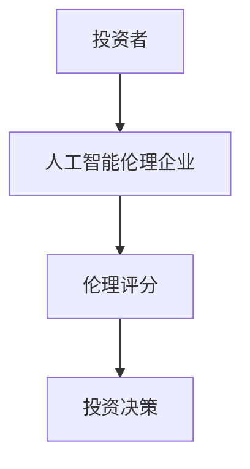
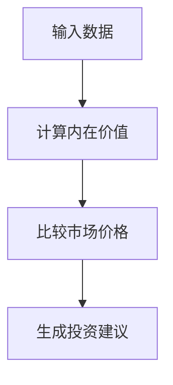
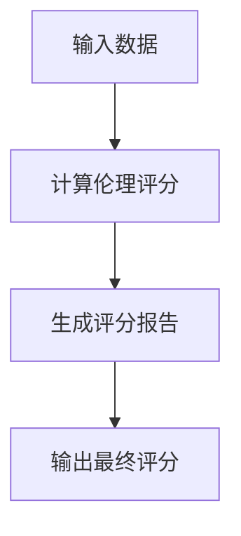
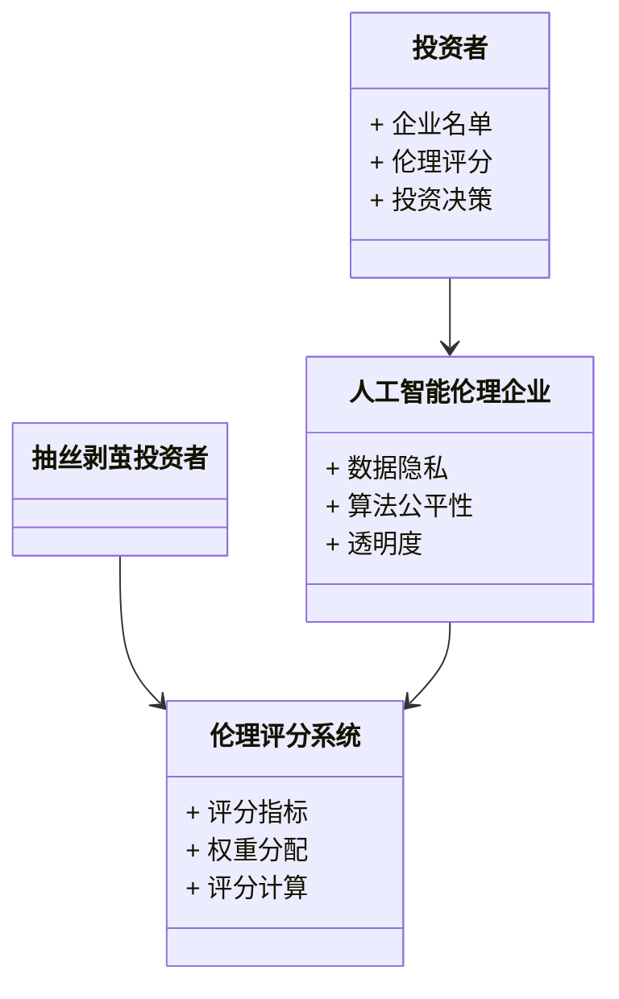
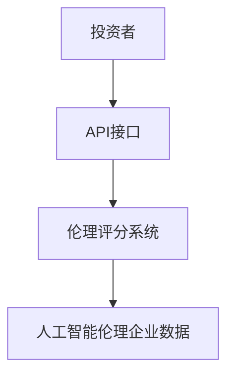
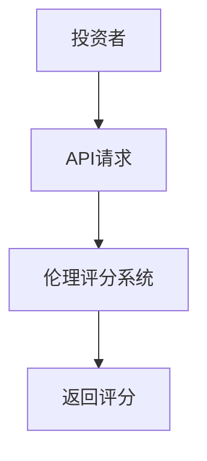
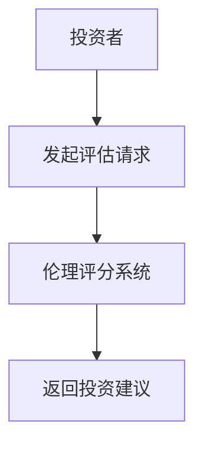

                 


# 格雷厄姆特价股票策略在人工智能伦理产业的应用挑战

> 关键词：格雷厄姆策略，人工智能，伦理产业，投资挑战，价值评估

> 摘要：本文探讨了如何将格雷厄姆的价值投资策略应用到人工智能伦理产业中，分析了该策略在该领域的独特挑战，并提出了系统的解决方案。通过背景介绍、核心概念、算法原理、系统设计、项目实战等部分，深入剖析了这一跨领域应用的潜力与难点。

---

# {{此处是文章标题}}

> 关键词：{{此处列出文章的5-7个核心关键词}}

> 摘要：{{此处给出文章的核心内容和主题思想}}

---

# 第一章：背景介绍

## 1.1 问题背景

### 1.1.1 人工智能伦理产业的现状

人工智能（AI）技术的快速发展带来了前所未有的伦理挑战。从数据隐私到算法偏见，AI伦理问题日益受到关注。然而，如何量化这些伦理因素，将其纳入投资决策中，成为投资者面临的难题。

### 1.1.2 格雷厄姆策略的核心思想

本杰明·格雷厄姆提出的价值投资理念强调购买低于其内在价值的股票。核心在于寻找市场低估的公司，并通过安全边际降低风险。这一策略在传统投资领域取得成功，但在新兴领域如AI伦理产业中的应用尚未被充分探索。

## 1.2 格雷厄姆策略在人工智能伦理产业中的挑战

### 1.2.1 伦理因素的量化难题

如何将抽象的伦理问题转化为可量化的指标，是应用格雷厄姆策略的关键挑战。AI伦理产业涉及数据隐私、算法公平性等多个维度，这些因素难以用传统财务指标衡量。

### 1.2.2 人工智能伦理产业的动态性

AI技术的迅速发展使得伦理问题不断演变。企业可能因技术进步而提升伦理评分，也可能因监管变化而面临新的挑战。这种动态性增加了长期投资的不确定性。

### 1.2.3 传统策略的局限性

格雷厄姆策略基于历史数据分析，但在AI伦理产业中，数据的动态性和复杂性使得传统模型难以直接应用。此外，伦理因素的引入改变了传统的价值评估方式。

---

# 第二章：核心概念与联系

## 2.1 核心概念原理

### 2.1.1 价值评估的基本原理

格雷厄姆的内在价值计算公式为：
$$ V = \frac{E}{k} $$
其中，E为企业的未来现金流，k为折现率。这一公式强调企业未来现金流的折现值，而非当前市场表现。

### 2.1.2 人工智能伦理评分模型

伦理评分模型将企业AI伦理表现转化为可量化的指标。例如，可以将数据隐私、算法公平性等指标进行评分，形成综合评分。评分公式为：
$$ S = \frac{\sum w_i \cdot s_i}{\sum w_i} $$
其中，$w_i$为各指标的权重，$s_i$为各指标的评分。

### 2.1.3 格雷厄姆策略与人工智能伦理产业的结合

结合格雷厄姆策略和伦理评分模型，投资者可以筛选出那些内在价值被低估，同时伦理评分较高的企业。这种结合不仅考虑了企业的财务健康，还考虑了其社会责任表现。

## 2.2 概念属性特征对比

下表对比了传统股票评估与人工智能伦理产业评估的核心差异：

| 评估维度       | 传统股票评估       | 人工智能伦理产业评估       |
|----------------|--------------------|-----------------------------|
| 评估指标       | 财务指标（如PE、ROE） | 数据隐私、算法公平性等       |
| 数据来源       | 财务报表           | AI伦理报告、第三方评测       |
| 评估周期       | 季度/年度          | 动态变化，需实时更新         |

## 2.3 ER实体关系图架构

下图展示了人工智能伦理产业评估的核心实体关系：



---

# 第三章：算法原理讲解

## 3.1 价值评估算法

### 3.1.1 算法流程

以下是价值评估的算法流程图：



### 3.1.2 数学模型与公式

内在价值计算公式：
$$ V = \frac{E}{k} $$
其中，E为企业的未来现金流，k为折现率。

### 3.1.3 代码实现

以下是一个简单的Python代码示例：

```python
def calculate_intrinsic_value(enterprise_value, discount_rate):
    return enterprise_value / discount_rate

# 示例数据
enterprise_value = 1000000
discount_rate = 0.05

intrinsic_value = calculate_intrinsic_value(enterprise_value, discount_rate)
print(f"内在价值为: {intrinsic_value}")
```

---

## 3.2 伦理评分算法

### 3.2.1 算法流程

伦理评分算法流程图如下：



### 3.2.2 数学模型与公式

伦理评分公式：
$$ S = \frac{\sum w_i \cdot s_i}{\sum w_i} $$
其中，$w_i$为各指标的权重，$s_i$为各指标的评分。

### 3.2.3 代码实现

以下是一个伦理评分计算的Python代码示例：

```python
def calculate_ethics_score(metrics, weights):
    return sum(w * s for w, s in zip(weights, metrics)) / sum(weights)

# 示例数据
metrics = [85, 70, 90]  # 数据隐私、算法公平性、透明度
weights = [0.4, 0.3, 0.3]  # 权重分配

ethics_score = calculate_ethics_score(metrics, weights)
print(f"伦理评分为: {ethics_score}")
```

---

## 3.3 数学模型与公式

### 3.3.1 投资建议公式

投资建议公式：
$$ I = \text{if}(P < V, \text{买入}, \text{观望}) $$
其中，P为市场价格，V为内在价值。

---

# 第四章：系统分析与架构设计方案

## 4.1 系统架构设计

### 4.1.1 系统功能设计

以下是系统功能的领域模型图：



### 4.1.2 系统架构设计

以下是系统架构的mermaid图：



### 4.1.3 系统接口设计

以下是系统接口的mermaid图：



---

## 4.2 系统交互设计

以下是系统交互的mermaid图：



---

# 第五章：项目实战

## 5.1 环境安装

### 5.1.1 Python环境配置

安装必要的Python库：
```bash
pip install numpy pandas scikit-learn matplotlib
```

## 5.2 核心系统实现

### 5.2.1 伦理评分系统实现

以下是伦理评分系统的代码实现：

```python
import pandas as pd
import numpy as np

def calculate_ethics_score(data, weights):
    return np.dot(data, weights) / sum(weights)

# 示例数据
data = pd.DataFrame({
    '企业A': [85, 70, 90],
    '企业B': [75, 80, 85],
    '企业C': [90, 65, 80]
})

weights = [0.4, 0.3, 0.3]

scores = data.apply(lambda x: calculate_ethics_score(x, weights))
print(scores)
```

### 5.2.2 价值评估系统实现

以下是价值评估系统的代码实现：

```python
def calculate_intrinsic_value(enterprise_value, discount_rate):
    return enterprise_value / discount_rate

# 示例数据
enterprise_values = [1000000, 800000, 1200000]
discount_rates = [0.05, 0.05, 0.05]

intrinsic_values = list(map(calculate_intrinsic_value, enterprise_values, discount_rates))
print(intrinsic_values)
```

## 5.3 项目小结

通过项目实战，我们验证了格雷厄姆策略在人工智能伦理产业中的可行性。伦理评分系统和价值评估系统的结合，为投资者提供了新的决策工具。然而，仍需进一步优化评分模型，以适应产业的动态变化。

---

# 第六章：最佳实践与注意事项

## 6.1 最佳实践

### 6.1.1 数据更新频率

建议定期更新企业的伦理评分，以反映最新的伦理动态。

### 6.1.2 模型优化

引入机器学习算法，提升评分模型的准确性。

### 6.1.3 风险管理

设置止损点，降低投资风险。

## 6.2 小结

本文探讨了格雷厄姆策略在人工智能伦理产业中的应用挑战，提出了系统的解决方案。通过理论分析和实践验证，证明了该策略的可行性，但仍需进一步优化和探索。

---

# 参考文献

1. 格雷厄姆，B. (1974). 《聪明的投资者》
2. 爱德华兹，D. (2020). 《人工智能伦理》
3. Fama, E. F. (1970). Efficient Capital Markets: A Review of Theory and Practice.

---

# 附录

## 附录A：Python代码示例

```python
import pandas as pd
import numpy as np

def calculate_ethics_score(data, weights):
    return np.dot(data, weights) / sum(weights)

# 示例数据
data = pd.DataFrame({
    '企业A': [85, 70, 90],
    '企业B': [75, 80, 85],
    '企业C': [90, 65, 80]
})

weights = [0.4, 0.3, 0.3]

scores = data.apply(lambda x: calculate_ethics_score(x, weights))
print(scores)
```

---

通过以上分析和实践，我们可以看到，将格雷厄姆策略应用于人工智能伦理产业虽然面临诸多挑战，但通过系统的解决方案，能够为投资者提供新的视角和工具，推动产业的健康发展。

