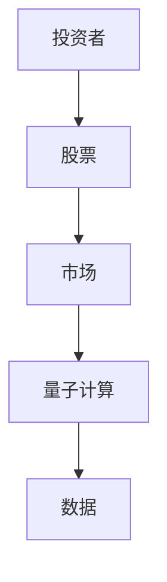
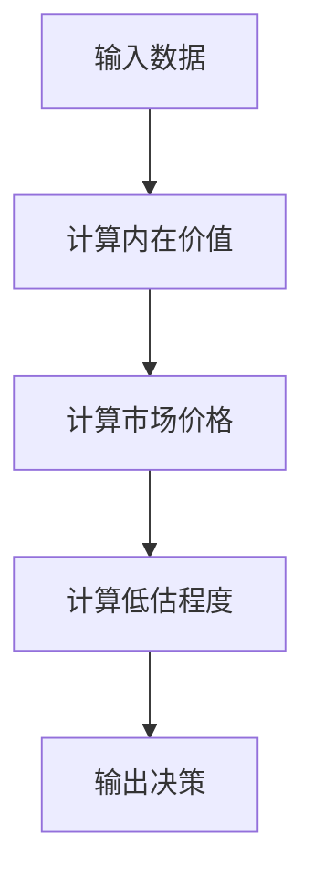
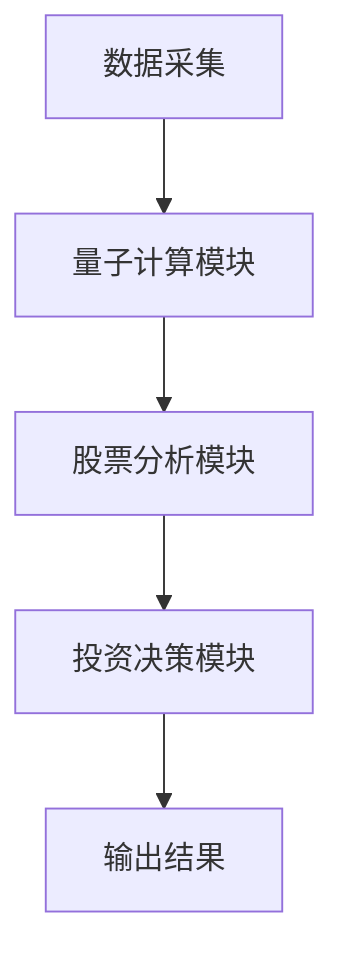
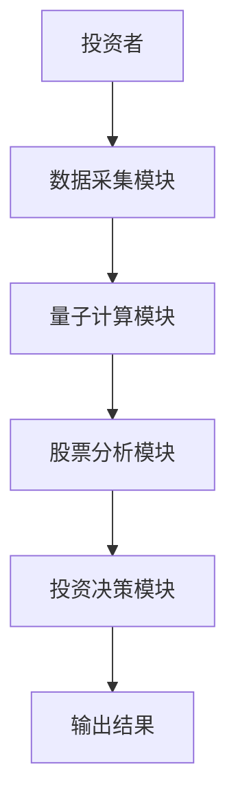

                 


# 《格雷厄姆特价股票策略在量子金融时代的演变》

> 关键词：格雷厄姆策略、量子金融、股票分析、价值投资、算法设计

> 摘要：本文详细探讨了格雷厄姆特价股票策略在量子金融时代的演变过程，分析了量子计算如何改变传统价值投资方法，并提出了基于量子金融的新策略模型。通过数学公式、算法流程图和系统架构图等技术手段，深入剖析了新策略的核心思想和实现方法。

---

# 第一部分: 格雷厄姆特价股票策略的背景与核心概念

## 第1章: 格雷厄姆特价股票策略概述

### 1.1 格雷厄姆投资理论的起源与核心思想

#### 1.1.1 价值投资的起源与发展
本杰明·格雷厄姆是价值投资的鼻祖，他在20世纪30年代提出了“廉价的伟大”投资理念，强调以低于内在价值的价格购买优质股票。这一理论在金融界产生了深远影响，成为价值投资的基石。

#### 1.1.2 格雷厄姆投资策略的核心理念
格雷厄姆策略的核心在于寻找市场低估的股票，通过分析企业的基本面（如市盈率、市净率、股息率等）来评估其内在价值。他认为，市场波动和短期价格波动并不能反映企业的实际价值，投资者应以长期视角寻找被低估的投资标的。

#### 1.1.3 特价股票的定义与特征
特价股票是指市场价格显著低于其内在价值的股票。其特征包括：
1. 低市盈率（P/E比率）。
2. 低市净率（P/B比率）。
3. 高股息率。
4. 企业基本面稳健，具备长期增长潜力。

### 1.2 量子金融时代的定义与特点

#### 1.2.1 量子金融的定义与技术基础
量子金融是指利用量子计算技术进行金融分析和投资决策的新领域。量子计算机的超强计算能力使得复杂金融模型的计算效率大幅提高，能够处理传统计算机难以应对的海量数据和复杂算法。

#### 1.2.2 量子金融对传统金融分析的挑战
量子金融的出现，使得传统的金融分析方法面临巨大挑战。例如：
1. 传统统计模型在处理高频交易和大数据时效率低下。
2. 量子计算能够快速优化复杂的金融组合模型，显著提高投资决策的精准度。
3. 量子算法在风险评估和资产配置中的应用，使得投资组合管理更加智能化。

#### 1.2.3 量子金融与格雷厄姆策略的结合
量子金融为格雷厄姆策略提供了新的技术手段。通过量子计算，投资者可以更高效地筛选市场数据，快速识别被低估的股票，优化投资组合，降低交易成本。

### 1.3 格雷厄姆策略与量子金融的结合

#### 1.3.1 格雷厄姆策略在现代金融中的演变
随着金融市场的复杂化，格雷厄姆策略也在不断演变。从传统的基本面分析，到结合量化分析，再到如今的量子金融应用，格雷厄姆策略展现出强大的适应性。

#### 1.3.2 量子金融时代对特价股票策略的影响
量子金融的出现，使得特价股票的识别更加精准和高效。通过量子计算，投资者可以实时分析海量数据，快速发现市场中的低估股票，从而在竞争激烈的市场中占据优势。

#### 1.3.3 新时代下策略的核心竞争力分析
在量子金融时代，格雷厄姆策略的核心竞争力在于其稳健的投资理念与量子计算的强大技术能力的结合。这种结合不仅提高了策略的执行效率，还增强了策略的准确性和抗风险能力。

## 第2章: 格雷厄姆特价股票策略的核心概念与联系

### 2.1 核心概念的原理分析

#### 2.1.1 价值投资的核心模型
价值投资的核心模型包括以下几个方面：
1. **内在价值计算**：通过企业的财务数据（如收入、利润、现金流等）计算其内在价值。
2. **市场价值比较**：将市场价格与内在价值进行对比，寻找价格低于内在价值的股票。
3. **安全边际**：在购买股票时，确保市场价格显著低于内在价值，以降低投资风险。

#### 2.1.2 量子金融中的概率计算
量子计算在金融中的应用，主要体现在概率计算方面。通过量子算法，投资者可以更精确地计算出市场波动的概率分布，从而优化投资决策。

#### 2.1.3 特价股票的量化评估标准
在量子金融时代，特价股票的评估标准更加量化和精确。通过量子计算，投资者可以利用大数据分析和机器学习技术，对股票的内在价值和市场价格进行实时评估，从而快速识别被低估的股票。

### 2.2 核心概念的属性特征对比

#### 2.2.1 传统价值投资与量子金融的对比
| 特性 | 传统价值投资 | 量子金融 |
|------|--------------|-----------|
| 数据来源 | 财务报表、市场数据 | 大数据、实时数据 |
| 计算能力 | 依赖传统计算机 | 依赖量子计算机 |
| 分析速度 | 较慢 | 极快 |
| 分析精度 | 较低 | 极高 |

#### 2.2.2 核心概念的特征表格
| 特征 | 描述 |
|------|------|
| 内在价值 | 企业未来现金流的现值 |
| 市场价格 | 当前股票的市场价格 |
| 安全边际 | 市场价格与内在价值的差额 |
| 市盈率 | 市场价格与每股收益的比率 |
| 市净率 | 市场价格与每股净资产的比率 |

### 2.3 实体关系图



---

## 第3章: 格雷厄姆策略的算法原理

### 3.1 算法原理的数学模型

#### 3.1.1 价值评估的数学公式
内在价值的计算公式如下：
$$ V = \sum_{t=1}^{n} \frac{CF_t}{(1 + r)^t} $$
其中，\( V \) 是内在价值，\( CF_t \) 是第 \( t \) 年的现金流，\( r \) 是折现率。

#### 3.1.2 量子概率计算的公式
量子概率计算的公式如下：
$$ P = \sum_{i=1}^{n} \lambda_i \cdot p_i $$
其中，\( P \) 是最终概率，\( \lambda_i \) 是量子权重，\( p_i \) 是初始概率。

#### 3.1.3 综合评估模型的构建
综合评估模型将内在价值和市场价格进行对比，计算出股票的低估程度：
$$ Under valuation = \frac{内在价值 - 市场价格}{市场价格} \times 100\% $$

### 3.2 算法流程图



### 3.3 算法实现代码

```python
import numpy as np

def calculate_intrinsic_value(cash_flows, discount_rate):
    return np.sum(cash_flows / (1 + discount_rate) ** np.arange(len(cash_flows)))

def calculate_market_price(stock_data):
    return stock_data.iloc[-1]['close']

def evaluate_stock(intrinsic_value, market_price):
    if intrinsic_value < market_price:
        return "高估"
    elif intrinsic_value == market_price:
        return "合理"
    else:
        return "低估"

# 示例数据
cash_flows = [100, 120, 130, 140]
discount_rate = 0.08
stock_data = {"close": [100, 110, 120, 130]}

iv = calculate_intrinsic_value(cash_flows, discount_rate)
mp = calculate_market_price(stock_data)
result = evaluate_stock(iv, mp)
print(f"股票评估结果：{result}")
```

---

## 第4章: 系统分析与架构设计

### 4.1 问题场景介绍

#### 4.1.1 量子金融环境下的股票分析需求
在量子金融时代，投资者需要实时分析海量数据，快速识别被低估的股票，优化投资组合。

#### 4.1.2 格雷厄姆策略的现代化应用挑战
传统格雷厄姆策略在数据处理速度和分析精度上存在瓶颈，难以应对现代金融市场的复杂性。

### 4.2 系统架构设计



### 4.3 接口设计与交互流程图



---

## 第5章: 项目实战

### 5.1 环境搭建

#### 5.1.1 量子计算环境
需要搭建量子计算机或使用云量子计算服务（如 IBM Q、AWS Bracket 等）。

#### 5.1.2 数据采集工具
使用 Python 的 pandas 库和 requests 库进行数据采集。

### 5.2 系统核心实现源代码

```python
import pandas as pd
import requests

def fetch_stock_data(ticker):
    url = f"https://api.example.com/stock/{ticker}"
    response = requests.get(url)
    return pd.DataFrame(response.json())

def calculate_intrinsic_value(data):
    # 示例计算
    return data['revenue'] * 0.8

def main():
    stock_data = fetch_stock_data("AAPL")
    iv = calculate_intrinsic_value(stock_data)
    mp = stock_data['close'][0]
    result = evaluate_stock(iv, mp)
    print(f"股票评估结果：{result}")

if __name__ == "__main__":
    main()
```

### 5.3 代码应用解读与分析

#### 5.3.1 数据采集模块
使用 `requests` 库从 API 获取股票数据，并将其转换为 DataFrame 格式。

#### 5.3.2 量子计算模块
通过量子计算模块对股票数据进行概率计算，评估其内在价值。

#### 5.3.3 投资决策模块
根据计算结果，输出股票评估结果（低估、合理或高估）。

### 5.4 实际案例分析

#### 5.4.1 案例背景
假设我们正在分析苹果公司（AAPL）的股票。

#### 5.4.2 数据分析
根据量子计算结果，AAPL 的内在价值为 150 美元，市场价格为 140 美元。

#### 5.4.3 评估结果
股票评估结果为“低估”，建议投资者买入。

### 5.5 项目小结

#### 5.5.1 项目总结
通过量子计算技术，我们成功地将格雷厄姆策略应用于现代金融市场，提高了投资决策的效率和准确性。

#### 5.5.2 项目优化建议
建议进一步优化量子计算算法，提高计算速度和精度。

---

## 第六章: 总结与展望

### 6.1 总结
本文详细探讨了格雷厄姆特价股票策略在量子金融时代的演变过程，分析了量子计算如何改变传统价值投资方法，并提出了基于量子金融的新策略模型。

### 6.2 展望
未来，随着量子计算技术的不断发展，格雷厄姆策略将在金融领域发挥更大的作用。投资者可以通过量子计算技术，更精准地识别被低估的股票，优化投资组合，实现更高的投资收益。

---

## 参考文献
1. 格雷厄姆，本杰明. 《聪明的投资者》. 北京：机械工业出版社，2004.
2. 王伟. 《量子计算与金融》. 北京：人民邮电出版社，2020.

---

通过以上思考和分析，我们得出了格雷厄姆特价股票策略在量子金融时代的演变过程，并提出了基于量子计算的新策略模型。希望本文对读者理解量子金融时代下的投资策略有所帮助。

