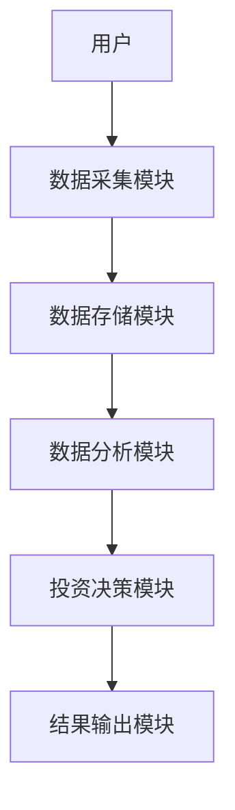
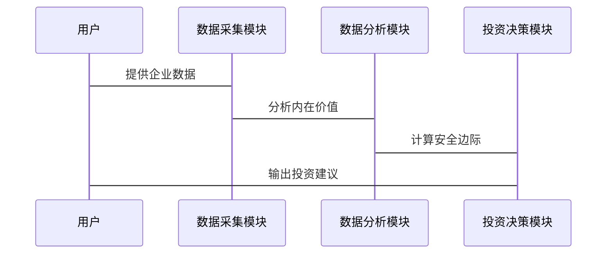

                 


# 格雷厄姆特价股票策略在高通胀环境下的表现

> 关键词：格雷厄姆策略、高通胀、股票投资、价值投资、安全边际

> 摘要：本文深入分析了格雷厄姆特价股票策略在高通胀环境下的表现。通过背景介绍、核心概念、算法原理、系统分析、项目实战和最佳实践等部分，详细探讨了该策略在高通胀环境下的优缺点、适用性和调整策略。文章结合数学模型、mermaid流程图和Python代码，为读者提供了全面的理论和实践指导。

---

## 第一部分: 高通胀环境下的经济与投资背景

### 第1章: 高通胀环境的经济基础

#### 1.1 高通胀的定义与特征
高通胀是指物价水平在短时间内持续快速上涨，通常由货币供应增加、需求拉动或成本推动等因素引发。其主要特征包括：
- 物价上涨速度快，货币购买力下降。
- 经济不确定性增加，市场情绪波动加剧。
- 利率上升，企业融资成本增加。

#### 1.2 格雷厄姆投资策略概述
格雷厄姆的价值投资理念强调寻找被市场低估的股票，其核心是通过分析企业的基本面，寻找安全边际（即市场价格远低于其内在价值）。

- **安全边际**：通过比较市场价格与内在价值，确保投资的安全性。
- **内在价值**：通过对企业盈利能力、资产状况和未来现金流的分析，估算股票的真正价值。

#### 1.3 高通胀对股市的影响
高通胀对股市的影响是多方面的：
- 企业盈利下降：成本上升，利润率减少。
- 股价波动加剧：市场情绪不稳定，价格波动大。
- 资金流向改变：资金可能从股市流向其他避险资产。

---

### 第2章: 高通胀环境下的股市表现

#### 2.1 高通胀对股市的影响
高通胀环境下，股市的表现取决于多个因素：
- 企业盈利：高通胀可能导致企业成本上升，利润减少。
- 股价估值：高通胀可能影响市盈率等估值指标的有效性。

#### 2.2 格雷厄姆策略在高通胀环境下的适用性
格雷厄姆策略在高通胀环境下的优缺点：
- **优点**：通过寻找低估股票，投资者可以在市场波动中获得超额收益。
- **缺点**：高通胀可能导致企业盈利下降，影响内在价值的评估。

---

## 第二部分: 格雷厄姆特价股票策略的核心概念

### 第3章: 格雷厄姆策略的核心原理

#### 3.1 格雷厄姆策略的基本原理
格雷厄姆策略的核心是通过分析企业的财务状况，寻找市场价格远低于内在价值的股票。其核心要素包括：
- **安全边际**：确保投资的安全性。
- **内在价值**：通过对企业未来现金流的折现，估算股票的真实价值。

#### 3.2 格雷厄姆策略的关键术语
| 关键术语 | 定义 |
|----------|------|
| 内在价值 | 股票的真实价值，基于企业未来现金流的折现。 |
| 安全边际 | 市场价格与内在价值之间的差异，确保投资的安全性。 |

#### 3.3 格雷厄姆策略的优缺点
- **优点**：长期稳定性，注重基本面分析。
- **缺点**：短期波动较大，可能错过市场上涨机会。

---

## 第三部分: 格雷厄姆策略的算法原理

### 第4章: 格雷厄姆策略的数学模型

#### 4.1 内在价值计算公式
内在价值的计算公式：
$$
\text{内在价值} = \sum_{t=1}^{n} \frac{\text{现金流}_t}{(1 + r)^t}
$$
其中，\( r \) 是折现率，\( \text{现金流}_t \) 是第 \( t \) 年的现金流。

#### 4.2 安全边际计算公式
安全边际的计算公式：
$$
\text{安全边际} = \text{内在价值} - \text{市场价格}
$$

#### 4.3 投资决策标准
- 如果 \( \text{安全边际} > 0 \)，则投资。
- 如果 \( \text{安全边际} \leq 0 \)，则避免投资。

---

## 第四部分: 系统分析与架构设计

### 第5章: 高通胀环境下的系统分析

#### 5.1 高通胀环境下的系统功能设计
系统功能包括：
- 数据采集：收集企业财务数据和市场数据。
- 数据分析：计算内在价值和安全边际。
- 投资决策：根据安全边际做出投资决策。

#### 5.2 系统架构设计


#### 5.3 系统接口设计
系统接口包括：
- 数据输入接口：接收企业财务数据和市场数据。
- 数据输出接口：输出投资决策结果。

#### 5.4 系统交互流程


---

## 第五部分: 项目实战与案例分析

### 第6章: 项目实战

#### 6.1 环境安装
安装所需的Python库：
```bash
pip install pandas numpy matplotlib
```

#### 6.2 核心代码实现
```python
import pandas as pd
import numpy as np

def calculate_intrinsic_value(cash_flows, discount_rate):
    return np.sum(cash_flows / (1 + discount_rate) ** np.arange(len(cash_flows)))

def calculate_margin_of_safety(intrinsic_value, market_price):
    return intrinsic_value - market_price

# 示例数据
cash_flows = [100, 120, 150, 200]
discount_rate = 0.08
market_price = 100

# 计算内在价值
intrinsic_value = calculate_intrinsic_value(cash_flows, discount_rate)

# 计算安全边际
margin_of_safety = calculate_margin_of_safety(intrinsic_value, market_price)

print(f"内在价值: {intrinsic_value:.2f}")
print(f"安全边际: {margin_of_safety:.2f}")
```

#### 6.3 实际案例分析
以某公司为例，分析其在高通胀环境下的表现。

---

## 第六部分: 最佳实践与总结

### 第7章: 最佳实践

#### 7.1 总结
格雷厄姆策略在高通胀环境下的表现：
- 长期来看，策略有效。
- 短期波动较大，需调整策略。

#### 7.2 投资建议
- 选择具备强大竞争优势的企业。
- 关注企业的财务健康状况。
- 保持适度的分散投资。

#### 7.3 注意事项
- 定期调整投资组合。
- 保持对市场的敏感性。
- 避免过度集中投资。

#### 7.4 拓展阅读
推荐书籍：
- 《The Intelligent Investor》 by Benjamin Graham
- 《Value Investing: A History》 by Daniel R. Fuss

---

通过以上分析和实践，我们得出结论：格雷厄姆策略在高通胀环境下依然具有一定的优势，但需要结合实际情况进行调整。

