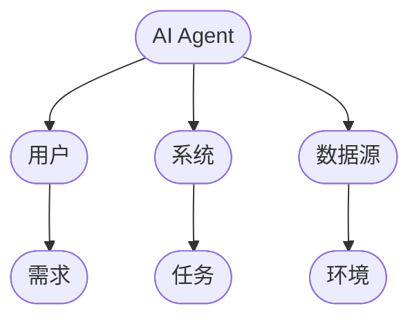
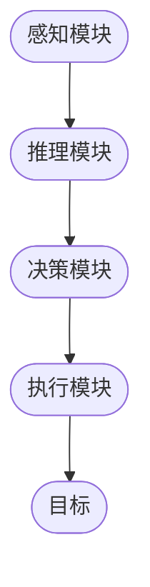
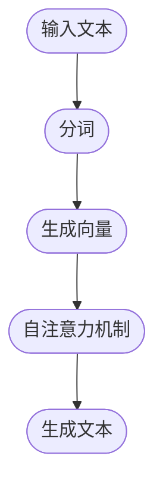
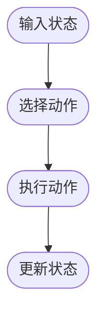
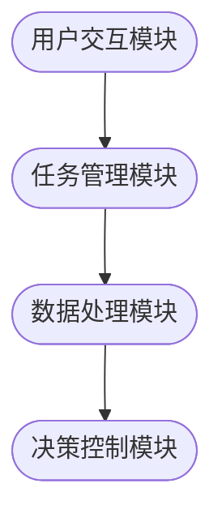
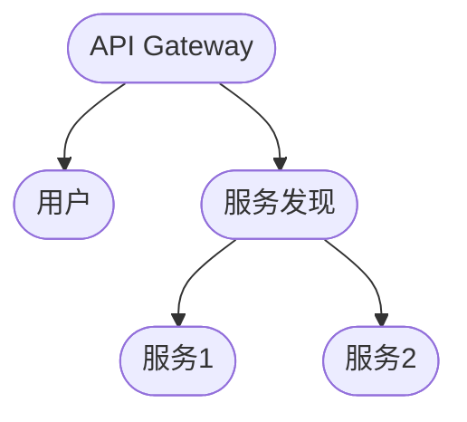

                 


# 案例研究：Fortune 500公司的AI Agent成功应用

**关键词**：AI Agent、Fortune 500公司、案例研究、企业数字化转型、人工智能

**摘要**：本文通过案例研究的方式，深入探讨了Fortune 500公司如何成功应用AI Agent技术，分析了AI Agent的核心概念、技术原理、系统架构以及实际应用中的成功经验。文章结合具体案例，详细解读了AI Agent在企业数字化转型中的作用，为企业领导者和技术从业者提供了宝贵的参考和启示。

---

## 第一部分: AI Agent与Fortune 500公司的背景介绍

### 第1章: AI Agent的基本概念与Fortune 500公司的背景

#### 1.1 AI Agent的定义与核心概念

AI Agent（人工智能代理）是一种能够感知环境、自主决策并执行任务的智能系统。它通过传感器获取信息，利用算法进行分析和推理，最终采取行动以实现预定目标。AI Agent的核心特征包括自主性、反应性、目标导向性和社交能力。与传统自动化系统相比，AI Agent能够处理复杂、动态的环境，并具备学习和适应能力。

**AI Agent的核心概念对比表**：

| 特性 | 自动化系统 | AI Agent |
|------|------------|----------|
| 自主性 | 低 | 高 |
| 反应性 | 低 | 高 |
| 目标导向性 | 低 | 高 |
| 社交能力 | 低 | 高 |

**AI Agent的实体关系图（Mermaid）**：



#### 1.2 Fortune 500公司的概述

Fortune 500公司是指《财富》杂志每年评选的美国最大500家上市公司，这些公司涵盖多个行业，是全球商业领域的标杆。随着数字化转型的加速，Fortune 500公司面临着提升效率、优化决策和增强客户体验的挑战。AI Agent作为一种智能化工具，能够帮助企业实现这些目标。

#### 1.3 AI Agent在Fortune 500公司的应用现状

AI Agent在Fortune 500公司的应用主要集中在以下几个领域：
- **客户支持**：通过自然语言处理技术为客户提供24/7的咨询服务。
- **流程自动化**：优化企业的审批流程、供应链管理和财务报表生成。
- **数据分析**：实时监控市场动态，辅助高层决策。
- **风险管理**：识别潜在的财务和运营风险，制定应对策略。

---

## 第二部分: AI Agent的核心概念与技术原理

### 第2章: AI Agent的核心技术与工作原理

#### 2.1 AI Agent的技术架构

AI Agent的技术架构通常包括以下几个模块：
- **感知模块**：通过传感器或API获取环境数据。
- **推理模块**：利用机器学习算法进行数据分析和推理。
- **决策模块**：基于推理结果制定行动方案。
- **执行模块**：通过API或自动化工具执行任务。

**AI Agent的技术架构图（Mermaid）**：



#### 2.2 AI Agent的核心算法与模型

AI Agent的核心算法包括：
- **自然语言处理模型**：用于理解和生成人类语言。
- **强化学习算法**：用于优化决策策略。
- **规则引擎**：用于处理简单的任务逻辑。

**AI Agent的自然语言处理模型实现（Python代码示例）**：

```python
# 示例代码：基于GPT的文本生成
import openai

def generate_text(prompt):
    client = openai.Client()
    response = client.chat.completions.create(
        model="gpt-3.5-turbo",
        messages=[{"role": "user", "content": prompt}]
    )
    return response.choices[0].message.content
```

**AI Agent的数学模型与公式**

文本生成模型的数学公式：

$$ P(\text{word}_t | \text{history}) = \text{softmax}(W_{\text{context}} \cdot \text{context}_t + W_{\text{word}} \cdot \text{word}_{t-1}) $$

---

## 第三部分: AI Agent的算法原理与数学模型

### 第3章: AI Agent的算法原理与实现

#### 3.1 AI Agent的自然语言处理模型

自然语言处理是AI Agent的核心技术之一。基于GPT的模型通过自注意力机制（Self-Attention）实现文本生成，而基于BERT的模型通过双向Transformer结构实现文本理解。

**AI Agent的自然语言处理流程图（Mermaid）**：



#### 3.2 AI Agent的决策算法

AI Agent的决策算法可以分为基于规则和基于机器学习两种。基于规则的算法适用于简单的场景，而基于强化学习的算法适用于复杂的场景。

**AI Agent的决策算法流程图（Mermaid）**：



**AI Agent的数学模型与公式**

强化学习的损失函数：

$$ \text{损失} = \sum_{t=1}^{n} (r_t - \hat{r}_t)^2 $$

---

## 第四部分: AI Agent的系统分析与架构设计

### 第4章: AI Agent的系统分析与架构设计

#### 4.1 系统功能设计

AI Agent的系统功能设计包括用户交互、任务管理、数据处理和决策控制四个模块。

**AI Agent的系统功能类图（Mermaid）**：



#### 4.2 系统架构设计

AI Agent的系统架构通常采用微服务架构，通过API Gateway对外提供服务。

**AI Agent的系统架构图（Mermaid）**：



---

## 第五部分: 项目实战与案例分析

### 第5章: AI Agent的项目实战

#### 5.1 环境安装

安装Python和必要的库：

```bash
pip install openai transformers
```

#### 5.2 核心代码实现

实现一个简单的AI Agent：

```python
import openai

class AIAssistant:
    def __init__(self, api_key):
        self.client = openai.Client(api_key)
    
    def generate_response(self, prompt):
        response = self.client.chat.completions.create(
            model="gpt-3.5-turbo",
            messages=[{"role": "user", "content": prompt}]
        )
        return response.choices[0].message.content
```

#### 5.3 案例分析

以某Fortune 500公司的客户支持系统为例，分析AI Agent的应用效果：

- **提升效率**：AI Agent能够快速响应客户查询，减少人工客服的工作量。
- **降低成本**：通过自动化处理常见问题，节省了人力资源成本。
- **提高客户满意度**：24/7的在线服务提升了客户的整体体验。

---

## 第六部分: 最佳实践与总结

### 第6章: 最佳实践与总结

#### 6.1 最佳实践

- **明确目标**：在实施AI Agent之前，明确其目标和应用场景。
- **数据质量**：确保数据的准确性和完整性，以提高AI Agent的性能。
- **持续优化**：定期监控和优化AI Agent的算法和模型。

#### 6.2 项目小结

通过案例研究，我们可以看到AI Agent在Fortune 500公司的成功应用不仅提升了企业的效率，还为企业带来了显著的经济利益。未来，随着人工智能技术的不断发展，AI Agent将在更多领域发挥其潜力。

---

**注意事项**：
- AI Agent的实施需要结合企业的实际情况，不能盲目跟风。
- 数据隐私和安全问题是实施AI Agent时需要重点关注的内容。
- AI Agent的模型需要定期更新，以适应环境的变化。

**拓展阅读**：
- 《AI Agent的原理与应用》
- 《企业数字化转型的实践指南》
- 《人工智能在商业领域的创新应用》

通过本文的深入分析，读者可以全面了解AI Agent在Fortune 500公司的成功应用，为企业的数字化转型提供有价值的参考。

