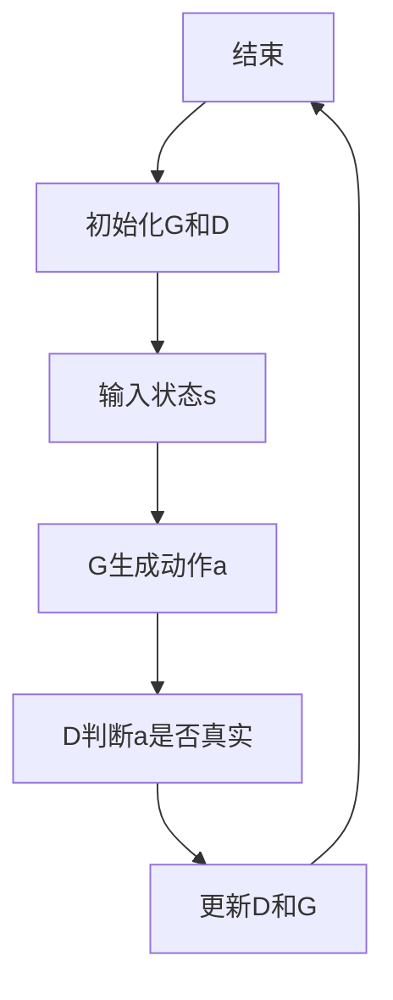
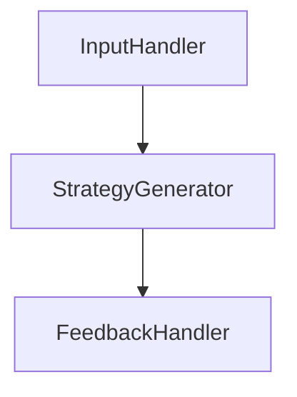
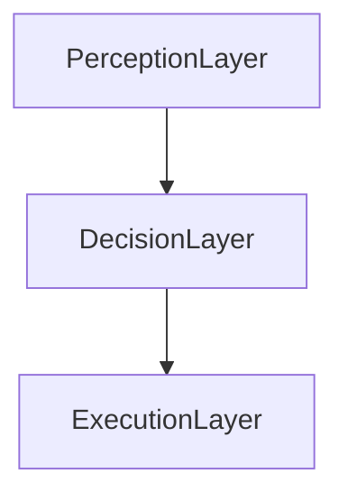

                 


# 模仿学习在AI Agent行为模式中的应用

## 关键词
模仿学习, AI Agent, 行为模式, 强化学习, 对抗学习, 系统架构

## 摘要
模仿学习是一种通过观察和模仿他人行为来学习任务的机器学习方法，而AI Agent则是能够感知环境并采取行动的智能体。本文将探讨模仿学习在AI Agent行为模式中的应用，分析其核心概念、算法原理、系统架构，并通过实际案例展示其在项目中的应用。

---

## 第1章: 模仿学习与AI Agent的基本概念

### 1.1 模仿学习的定义与背景

模仿学习是一种通过观察和模仿他人或智能体的行为来学习任务的方法。与监督学习和强化学习不同，模仿学习直接利用行为示范者的经验，使得学习者能够快速掌握复杂任务。

#### 1.1.1 什么是模仿学习
模仿学习（Imitation Learning）是一种基于观察的学习方法，通过观察他人的行为或结果，学习者能够推断出如何执行类似的任务。例如，机器人通过观察人类整理书籍的动作，学会自己整理书籍。

#### 1.1.2 模仿学习的应用场景
模仿学习广泛应用于多个领域：
- **机器人控制**：机器人通过模仿人类的动作完成特定任务。
- **游戏AI**：游戏AI通过模仿人类玩家的策略提高游戏水平。
- **对话系统**：对话系统通过模仿人类对话模式，提升用户体验。

#### 1.1.3 模仿学习的核心问题
模仿学习的核心问题在于如何从观察到的行为中提取有用的特征，并将其转化为可执行的策略。

### 1.2 AI Agent的行为模式

#### 1.2.1 AI Agent的基本概念
AI Agent是一种能够感知环境并采取行动的智能体。它通过传感器获取环境信息，利用推理和决策机制，采取行动以实现目标。

#### 1.2.2 AI Agent的行为模式分类
AI Agent的行为模式可以分为以下几类：
1. **反应式行为模式**：基于当前感知做出反应，如实时路径规划。
2. **认知式行为模式**：结合内部状态和长期规划，如自动驾驶中的路径选择。
3. **社会式行为模式**：与人类或其他智能体互动，如服务机器人。

#### 1.2.3 AI Agent与模仿学习的关系
模仿学习为AI Agent提供了一种通过观察和模仿人类或其他智能体行为来学习策略的方法，从而减少试错成本，提高学习效率。

---

## 第2章: 模仿学习的核心概念与原理

### 2.1 模仿学习的核心概念

#### 2.1.1 行为模仿
行为模仿是指AI Agent直接模仿人类或其他智能体的行为，如模仿专家医生的诊断过程。

#### 2.1.2 策略学习
策略学习是指AI Agent通过模仿学习，掌握在特定环境下采取最优行动的策略。

#### 2.1.3 强化学习与模仿学习的结合
强化学习通过试错优化策略，而模仿学习通过模仿示范者的行为加速学习过程。两者的结合可以提高学习效率和效果。

### 2.2 模仿学习的原理

#### 2.2.1 基于最大似然的模仿学习
基于最大似然的模仿学习通过最大化示范行为的概率分布，学习最优策略。

公式：
$$ P(\text{action}|\text{state}) = \theta^\top \text{state} + b $$

其中，θ是参数，b是偏置项。

#### 2.2.2 基于对抗的模仿学习
基于对抗的模仿学习通过生成对抗网络（GAN）框架，学习生成与示范行为相似的策略。

公式：
$$ \min_{\theta} \max_{\phi} \mathbb{E}_{s,a}[\log D(s,a)] + \mathbb{E}_{s}[\log (1 - D(s,G(s)))] $$

其中，D是判别器，G是生成器。

---

## 第3章: 模仿学习的算法原理

### 3.1 基于最大似然的模仿学习算法

#### 3.1.1 算法原理
基于最大似然的模仿学习通过最大化示范行为的概率，学习策略参数。

流程图：
```mermaid
graph TD
    A[开始] --> B[初始化参数θ]
    B --> C[输入状态s]
    C --> D[输出动作a]
    D --> E[计算似然P(a|s)]
    E --> F[更新θ以最大化似然]
    F --> A[结束]
```

#### 3.1.2 算法步骤
1. 初始化策略参数θ。
2. 输入当前状态s。
3. 输出动作a。
4. 计算似然P(a|s)。
5. 更新θ以最大化似然。
6. 重复步骤2-5直到收敛。

#### 3.1.3 算法实现
Python代码：
```python
import numpy as np

def imitation_learning(s, theta):
    a = np.dot(s, theta)  # 输出动作
    return a

# 示例
state = np.array([1, 0, 0])
theta = np.array([0.5, 0.3, 0.2])
action = imitation_learning(state, theta)
print("动作:", action)
```

### 3.2 基于对抗的模仿学习算法

#### 3.2.1 算法原理
基于对抗的模仿学习通过生成对抗网络，生成与示范行为相似的策略。

流程图：


#### 3.2.2 算法步骤
1. 初始化生成器G和判别器D。
2. 输入当前状态s。
3. G生成动作a。
4. D判断a是否来自真实数据。
5. 更新D和G参数。
6. 重复步骤2-5直到收敛。

#### 3.2.3 算法实现
Python代码：
```python
import torch

def discriminator(s, params):
    return torch.sigmoid(torch.dot(s, params))

def generator(s, params):
    return torch.sigmoid(torch.dot(s, params))

# 示例
state = torch.tensor([1, 0, 0])
d_params = torch.randn(3, 1)
g_params = torch.randn(3, 1)
d_output = discriminator(state, d_params)
g_output = generator(state, g_params)
print("判别器输出:", d_output.item())
print("生成器输出:", g_output.item())
```

---

## 第4章: 模仿学习的数学模型与公式

### 4.1 最大似然估计

#### 4.1.1 概率密度函数
概率密度函数表示每个动作在给定状态下的概率：
$$ P(a|s) = \sigma(\theta^\top s + b) $$

其中，σ是sigmoid函数。

#### 4.1.2 最大似然估计公式
最大似然估计通过最大化似然函数更新参数：
$$ \theta \leftarrow \theta + \eta \nabla_\theta \log P(a|s) $$

其中，η是学习率。

#### 4.1.3 示例说明
假设状态s = [1, 0, 0]，动作a = 1，计算似然：
$$ P(1|1,0,0) = \sigma(\theta_1) $$

### 4.2 对抗学习模型

#### 4.2.1 生成对抗网络的损失函数
判别器和生成器的损失函数分别为：
$$ \mathcal{L}_D = -\mathbb{E}_{s,a}[ \log D(s,a) ] - \mathbb{E}_s[ \log (1 - D(s,G(s))) ] $$
$$ \mathcal{L}_G = -\mathbb{E}_s[ \log (1 - D(s,G(s))) ] $$

#### 4.2.2 梯度下降算法
通过梯度下降优化判别器和生成器参数：
$$ \theta_D \leftarrow \theta_D - \eta \nabla_\theta \mathcal{L}_D $$
$$ \theta_G \leftarrow \theta_G - \eta \nabla_\theta \mathcal{L}_G $$

---

## 第5章: 系统分析与架构设计

### 5.1 系统功能设计

#### 5.1.1 领域模型设计
领域模型设计包括状态空间、动作空间和奖励函数。

- 状态空间：环境中的所有可能状态。
- 动作空间：AI Agent在每个状态下可执行的动作。
- 奖励函数：定义每个动作的奖励值。

#### 5.1.2 功能模块划分
功能模块包括：
1. **输入处理模块**：接收环境输入。
2. **策略生成模块**：生成动作。
3. **反馈处理模块**：处理奖励信号。

#### 5.1.3 模块之间的关系
模块之间通过共享状态和动作进行交互。

类图：


### 5.2 系统架构设计

#### 5.2.1 分层架构设计
分层架构包括感知层、决策层和执行层。

- 感知层：处理环境输入。
- 决策层：生成策略。
- 执行层：执行动作并返回反馈。

架构图：


#### 5.2.2 系统接口设计
系统接口包括：
1. 输入接口：接收环境状态。
2. 输出接口：发送动作指令。
3. 反馈接口：接收奖励信号。

---

## 第6章: 项目实战

### 6.1 环境安装与配置

#### 6.1.1 环境安装
安装必要的库：
```bash
pip install numpy torch matplotlib
```

#### 6.1.2 环境配置
配置运行环境，如设置随机种子和计算设备。

### 6.2 系统核心实现

#### 6.2.1 模仿学习算法实现
实现基于最大似然和对抗的模仿学习算法。

代码：
```python
import numpy as np
import torch

def imitation_learning_maxlikelihood(state, theta):
    return torch.sigmoid(torch.dot(torch.tensor(state), theta))

def imitation_learning_gan(state, generator_params, discriminator_params):
    gen_action = torch.sigmoid(torch.dot(torch.tensor(state), generator_params))
    dis_output = torch.sigmoid(torch.dot(torch.tensor(state), discriminator_params))
    return dis_output, gen_action

# 示例
state = np.array([1, 0, 0])
theta = torch.randn(3, 1)
ml_action = imitation_learning_maxlikelihood(state, theta)
gan_dis, gan_gen = imitation_learning_gan(state, theta, theta)
print("最大似然动作:", ml_action)
print("判别器输出:", gan_dis.item())
print("生成器输出:", gan_gen.item())
```

#### 6.2.2 功能解读与分析
通过代码实现模仿学习算法，分析其在不同场景下的表现。

### 6.3 案例分析与详细讲解

#### 6.3.1 案例分析
以自动驾驶为例，分析模仿学习在路径规划中的应用。

#### 6.3.2 详细讲解
展示如何通过模仿学习训练自动驾驶模型，实现路径规划任务。

### 6.4 项目小结

#### 6.4.1 项目总结
总结项目实现的关键点和遇到的问题。

#### 6.4.2 经验与教训
分享项目中的经验和教训，如算法选择和参数调整的重要性。

---

## 第7章: 总结与展望

### 7.1 总结
总结模仿学习在AI Agent中的应用，强调其优势和局限性。

### 7.2 未来展望
展望模仿学习与AI Agent的结合，如多智能体协作和人机交互。

---

## 关键技术点

- **模仿学习的核心概念**：通过观察和模仿学习策略。
- **算法原理**：基于最大似然和对抗的模仿学习。
- **系统架构设计**：分层架构和模块化设计。
- **项目实战**：环境安装、算法实现和案例分析。

---

## 最佳实践 tips

- **选择合适的算法**：根据任务需求选择最大似然或对抗模仿学习。
- **数据预处理**：确保示范数据的多样性和质量。
- **参数调整**：合理调整学习率和网络结构，避免过拟合。

---

## 小结

模仿学习为AI Agent提供了一种有效的学习方式，通过观察和模仿，AI Agent能够快速掌握复杂任务。本文详细探讨了模仿学习的核心概念、算法原理和系统架构，并通过实际案例展示了其应用。未来，模仿学习将在更多领域发挥重要作用。

---

## 注意事项

- 确保代码实现的正确性，避免逻辑错误。
- 在实际应用中，考虑环境的不确定性和实时性需求。

---

## 拓展阅读

- **推荐书籍**：《Deep Learning》、《Reinforcement Learning: Theory and Algorithms》。
- **相关论文**：阅读模仿学习和生成对抗网络的经典论文，深入理解其原理。

---

以上就是《模仿学习在AI Agent行为模式中的应用》的技术博客文章大纲。通过系统地分析和详细讲解，希望读者能够全面理解模仿学习在AI Agent中的应用及其实际价值。

