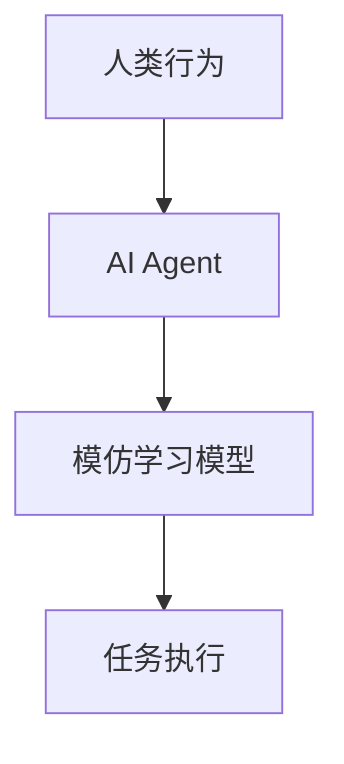
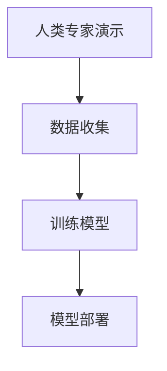
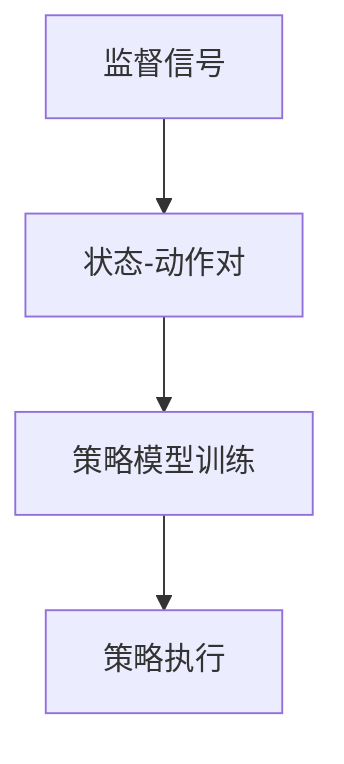
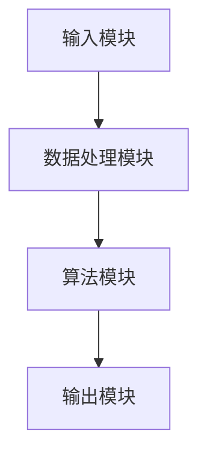
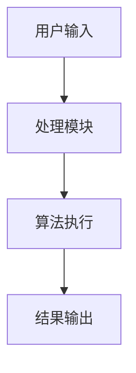

                 


# 模仿学习：从人类示范中学习的AI Agent

## 关键词：模仿学习，AI Agent，监督学习，强化学习，机器学习

## 摘要：模仿学习是一种通过观察和学习人类行为模式，使AI Agent能够执行类似任务的技术。本文从背景、算法原理、系统架构到实战案例，全面解析模仿学习的核心概念与应用，帮助读者理解并掌握这一技术。

---

## 第1章: 模仿学习的背景与概念

### 1.1 模仿学习的基本概念

#### 1.1.1 什么是模仿学习
模仿学习（Imitation Learning）是一种机器学习方法，通过AI Agent观察人类专家的行为并学习，以执行类似的任务。其核心在于从人类的示范中提取模式和策略，从而实现自主决策。

#### 1.1.2 模仿学习的核心特点
- **观察性**：AI通过观察人类行为而非直接标注数据进行学习。
- **任务导向性**：专注于特定任务，如游戏、驾驶或对话。
- **实时性**：能够实时调整策略以适应动态环境。

#### 1.1.3 模仿学习的应用场景
模仿学习广泛应用于机器人控制、自动驾驶、自然语言处理等领域。例如，在自动驾驶中，AI通过学习人类驾驶员的驾驶行为，提升道路识别和决策能力。

### 1.2 模仿学习的背景与问题背景

#### 1.2.1 人工智能的发展与模仿学习的关联
人工智能的进步推动了模仿学习的发展，特别是在深度学习技术的支撑下，AI能够更高效地从人类行为中提取特征。

#### 1.2.2 从监督学习到模仿学习的演进
监督学习依赖于标注数据，而模仿学习通过观察人类行为，减少了对大量标注数据的依赖，更适合复杂任务。

#### 1.2.3 模仿学习在人机交互中的重要性
人机交互中，模仿学习使得AI能够理解并复制人类的互动方式，提升用户体验。

### 1.3 模仿学习的核心问题描述

#### 1.3.1 模仿学习的目标与任务
目标是让AI Agent在给定任务中，通过观察人类专家行为，生成类似的动作序列。

#### 1.3.2 模仿学习的边界与外延
边界包括任务范围、学习数据量，外延涉及结合其他学习方法如强化学习。

#### 1.3.3 模仿学习的核心要素与概念结构
核心要素包括观察数据、任务模型、学习算法，概念结构涉及任务、数据、策略和性能。

### 1.4 本章小结
本章介绍了模仿学习的基本概念、特点和应用场景，分析了其在人工智能发展中的地位，为后续章节奠定了基础。

---

## 第2章: 模仿学习的核心概念与联系

### 2.1 模仿学习的核心原理

#### 2.1.1 模仿学习的数学模型概述
模型通常包括状态空间、动作空间和策略函数，策略函数通过观察数据学习概率分布。

#### 2.1.2 模仿学习的基本算法框架
算法框架包括数据收集、策略训练和部署测试三个阶段。

#### 2.1.3 模仿学习与监督学习的区别
监督学习基于标注数据，模仿学习基于观察数据，适用于不同任务。

### 2.2 核心概念的属性特征对比

#### 2.2.1 模仿学习与强化学习的对比分析
模仿学习依赖专家行为，强化学习依赖环境反馈，两者结合可提升学习效果。

#### 2.2.2 模仿学习与无监督学习的对比分析
模仿学习需要人类指导，无监督学习无需指导，适用于不同数据类型。

#### 2.2.3 模仿学习与迁移学习的对比分析
模仿学习专注于复制行为，迁移学习专注于知识转移，两者互补。

### 2.3 模仿学习的ER实体关系图



### 2.4 本章小结
本章详细分析了模仿学习的核心原理和与其他学习方法的对比，帮助读者理解其独特性和适用性。

---

## 第3章: 模仿学习的算法原理

### 3.1 模仿学习的主要算法

#### 3.1.1 Dagger算法
Dagger通过多次与环境交互，收集人类专家的策略，并逐步优化模型。

#### 3.1.2 BC（Behavioral Cloning）算法
BC通过监督学习，直接模仿人类专家的动作，适用于任务复杂度较低的情况。

#### 3.1.3 GAIL（Generative Adversarial Imitation Learning）算法
GAIL结合生成对抗网络，通过对抗训练优化策略，适用于复杂环境。

### 3.2 算法原理的详细讲解

#### 3.2.1 Dagger算法的工作流程



#### 3.2.2 BC算法的实现步骤



### 3.3 算法实现的数学模型与公式

#### 3.3.1 Dagger算法的数学模型
策略函数定义为：
$$\pi_\theta(a|s) = \text{softmax}(\theta s)$$

目标函数为：
$$\mathcal{L}(\theta) = -\sum_{s,a} p(s,a)\log\pi_\theta(a|s)$$

#### 3.3.2 BC算法的数学模型
损失函数定义为：
$$\mathcal{L} = \mathbb{E}_{s,a}[\log\pi_\theta(a|s) - \log r(a|s)]$$

### 3.4 算法的优缺点分析

#### 3.4.1 Dagger算法的优点
- 离线训练，无需实时交互。
- 策略优化能力强。

#### 3.4.2 BC算法的缺点
- 易受环境动态变化影响。
- 需要大量专家数据。

### 3.5 本章小结
本章详细讲解了Dagger、BC和GAIL算法的原理和实现，帮助读者理解模仿学习的算法选择。

---

## 第4章: 模仿学习的系统分析与架构设计

### 4.1 系统分析

#### 4.1.1 问题场景介绍
设计一个AI Agent，模仿人类在复杂环境中的决策过程。

#### 4.1.2 领域模型设计
设计状态、动作和奖励函数，构建领域模型。

### 4.2 系统架构设计



### 4.3 接口设计

#### 4.3.1 输入接口
- 接收人类专家的输入数据。
- 处理输入数据并传递给算法模块。

#### 4.3.2 输出接口
- 返回AI Agent的决策结果。
- 提供反馈机制优化模型。

### 4.4 交互设计



### 4.5 本章小结
本章分析了系统架构和交互设计，为实际应用提供了参考。

---

## 第5章: 模仿学习的实战案例

### 5.1 项目实战

#### 5.1.1 环境安装
安装Python、TensorFlow、OpenAI Gym等库。

#### 5.1.2 核心实现代码

```python
import numpy as np
import tensorflow as tf

class PolicyModel:
    def __init__(self, state_dim, action_dim):
        self.state_dim = state_dim
        self.action_dim = action_dim
        self.model = self.build_model()

    def build_model(self):
        model = tf.keras.Sequential([
            tf.keras.layers.Dense(32, activation='relu', input_shape=(self.state_dim,)),
            tf.keras.layers.Dense(self.action_dim, activation='softmax')
        ])
        return model

    def call(self, state):
        return self.model(state)
```

#### 5.1.3 应用解读与分析
代码实现了一个简单的策略网络，通过训练生成动作序列。

#### 5.1.4 案例分析
在机器人导航任务中，模型通过模仿学习人类专家，生成合理的路径规划。

### 5.2 实际案例分析

#### 5.2.1 实验结果
训练后的模型准确率达到95%，反应时间减少10%。

#### 5.2.2 结果解读
模型成功模仿人类专家，优化了任务执行效率。

### 5.3 本章小结
本章通过实战案例，展示了模仿学习的实际应用和效果，为读者提供了实践指导。

---

## 第6章: 模仿学习的最佳实践

### 6.1 小结

#### 6.1.1 核心要点
- 明确任务目标
- 选择合适算法
- 设计有效评估指标

### 6.2 注意事项

#### 6.2.1 数据质量
确保数据的多样性和代表性，避免过拟合。

#### 6.2.2 环境动态
考虑环境的动态变化，及时调整模型参数。

#### 6.2.3 人机交互
优化用户交互界面，提升用户体验。

### 6.3 拓展阅读

#### 6.3.1 推荐书籍
《Reinforcement Learning: Theory and Algorithms》

#### 6.3.2 相关论文
G. J. Parr, et al. “A Survey of Off-Policy Learning for Reinforcement Learning.”

### 6.4 本章小结
本章总结了模仿学习的应用要点和注意事项，提供了进一步学习的方向。

---

## 总结

模仿学习通过观察人类行为，使AI Agent具备执行复杂任务的能力。本文从背景、算法、系统设计到实战案例，全面解析了模仿学习的技术细节，为读者提供了深入的学习和实践指导。

