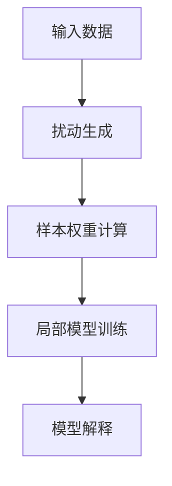
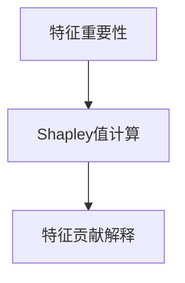
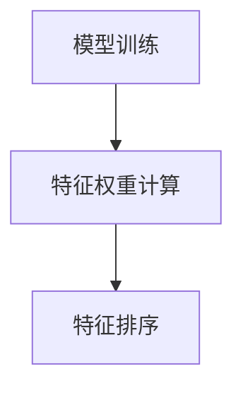
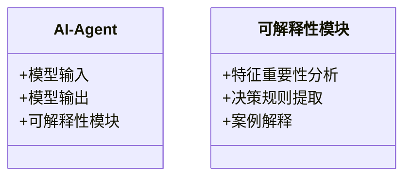
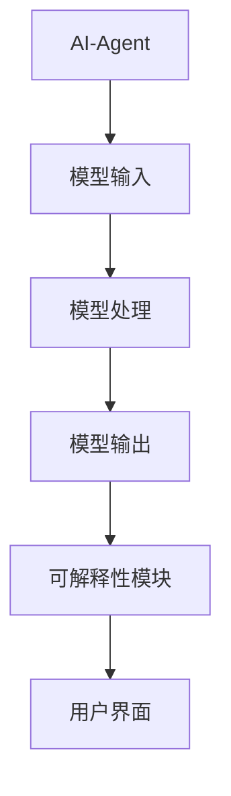
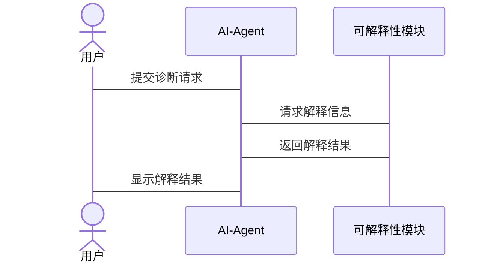

                 


# 模型可解释性技术在AI Agent中的应用

> 关键词：模型可解释性、AI Agent、LIME算法、SHAP值、Feature Importance

> 摘要：本文深入探讨了模型可解释性技术在AI Agent中的应用，从核心概念到算法原理，再到系统设计和项目实战，全面分析了如何实现AI Agent的可解释性。文章通过具体案例展示了可解释性技术的应用场景，并提供了实际的代码实现和数学模型，帮助读者理解如何在实际项目中应用这些技术。

---

# 第一部分: 模型可解释性技术在AI Agent中的应用概述

## 第1章: 背景介绍与问题定义

### 1.1 问题背景
#### 1.1.1 人工智能与AI Agent的发展现状
人工智能（Artificial Intelligence, AI）技术近年来取得了飞速发展，特别是在自然语言处理、计算机视觉和机器人领域。AI Agent（智能体）作为AI技术的重要组成部分，广泛应用于自动驾驶、智能助手、推荐系统等领域。然而，随着AI Agent的应用场景越来越复杂，其决策过程的可解释性问题日益凸显。

#### 1.1.2 模型可解释性的重要性
模型可解释性是指人类能够理解模型的决策过程和结果的能力。在AI Agent中，可解释性是确保其决策透明性和可信度的关键因素。例如，在医疗AI Agent中，医生需要理解模型的诊断过程，以便信任并依赖其决策。

#### 1.1.3 AI Agent中的可解释性需求
AI Agent的应用场景通常涉及高风险决策，如自动驾驶中的路径规划和医疗诊断中的病情分析。在这些场景中，模型的可解释性不仅是用户信任的基础，也是确保决策正确性的必要条件。

### 1.2 问题描述
#### 1.2.1 模型可解释性的定义
模型可解释性是指模型的决策过程能够被人类理解和解释。对于AI Agent而言，这意味着其决策过程需要透明，用户能够理解模型为何做出某个决策。

#### 1.2.2 AI Agent中的可解释性问题
AI Agent的决策过程通常依赖复杂的算法，如深度学习模型。这些模型的决策过程往往是“黑箱”，用户无法理解其背后的逻辑。这种不可解释性限制了AI Agent在高风险场景中的应用。

#### 1.2.3 可解释性与AI Agent性能的关系
模型的可解释性与性能并非完全对立。通过适当的可解释性技术，可以在保持模型性能的同时，提高其决策的透明性。

### 1.3 问题解决
#### 1.3.1 可解释性技术的目标
可解释性技术的目标是通过多种方法，使得模型的决策过程更加透明，从而提高用户对模型的信任度。

#### 1.3.2 AI Agent中可解释性的实现路径
实现AI Agent的可解释性需要结合多种技术，如局部可解释性方法（如LIME）和全局可解释性方法（如SHAP）。这些技术可以帮助用户理解模型的决策过程。

#### 1.3.3 可解释性与不可解释性模型的对比
不可解释性模型（如深度神经网络）通常在复杂任务上表现优异，但其决策过程难以被理解。可解释性模型（如线性回归）虽然性能可能稍逊，但其决策过程清晰易懂。

### 1.4 边界与外延
#### 1.4.1 模型可解释性的边界
模型可解释性的边界包括：解释的范围（局部/全局）、解释的深度（简单/详细）以及解释的受众（用户/开发者）。

#### 1.4.2 AI Agent的可解释性与人类认知的关系
AI Agent的可解释性需要与人类认知特点相结合，确保解释方式符合人类的理解习惯。

#### 1.4.3 可解释性技术的适用范围
可解释性技术适用于需要透明决策的应用场景，如医疗、金融和法律领域。

### 1.5 概念结构与核心要素
#### 1.5.1 可解释性技术的核心要素
可解释性技术的核心要素包括：解释目标、解释方法、解释度量和解释工具。

#### 1.5.2 AI Agent中的可解释性框架
AI Agent的可解释性框架通常包括输入解释、中间解释和输出解释三个层次。

#### 1.5.3 可解释性技术的分类与对比
可解释性技术可以分为局部可解释性方法和全局可解释性方法。局部方法（如LIME）适用于单个预测的解释，全局方法（如SHAP）适用于整个模型的解释。

---

# 第二部分: 模型可解释性技术的核心概念与联系

## 第2章: 可解释性技术的核心原理

### 2.1 核心概念原理
#### 2.1.1 模型可解释性的基本原理
模型可解释性基于特征重要性分析和决策规则提取，通过这些方法揭示模型的决策逻辑。

#### 2.1.2 AI Agent中的可解释性机制
AI Agent的可解释性机制包括特征权重分析、规则提取和案例解释等方法。

#### 2.1.3 可解释性技术的数学基础
可解释性技术的数学基础包括线性代数、概率论和统计学。

### 2.2 概念属性特征对比
#### 2.2.1 可解释性技术的属性特征
| 属性 | 特征描述 |
|------|----------|
| 解释范围 | 局部/全局 |
| 解释深度 | 简单/详细 |
| 解释受众 | 用户/开发者 |

#### 2.2.2 不同可解释性技术的对比分析
| 技术名称 | 原理 | 适用场景 | 优缺点 |
|----------|------|----------|--------|
| LIME     | 局部线性近似 | 单样本解释 | 解释性强，计算快 | 
| SHAP     | 加权特征贡献 | 全局解释 | 解释全面，计算复杂 |
| Feature Importance | 特征权重排序 | 全局解释 | 易理解，计算简单 |

#### 2.2.3 AI Agent中可解释性技术的适用场景
AI Agent中可解释性技术的适用场景包括医疗诊断、金融风险评估和自动驾驶决策等领域。

### 2.3 ER实体关系图架构
```mermaid
er
actor(AI Agent) -|解释需求|- model(可解释性模型)
model -|解释信息|- user(用户)
```

---

# 第三部分: 可解释性技术的算法原理与数学模型

## 第3章: 常见可解释性技术的算法原理

### 3.1 LIME算法原理
#### 3.1.1 LIME算法的基本思想
LIME（Local Interpretable Model-agnostic Explanations）是一种用于解释单个预测结果的可解释性技术。它通过在样本周围构建线性模型，来近似原模型的决策边界。

#### 3.1.2 LIME算法的流程图


#### 3.1.3 LIME算法的数学模型
LIME的目标是最小化加权平方损失函数：
$$ \text{损失} = \sum_{i=1}^n w_i (f(x_i) - g(x_i))^2 $$
其中，\( w_i \) 是样本 \( x_i \) 的权重，\( f(x_i) \) 是原模型的预测结果，\( g(x_i) \) 是局部模型的预测结果。

#### 3.1.4 LIME算法的Python代码实现
```python
import lime
from lime import lime_tabular

explainer = lime_tabular.LimeTabularExplainer(X_train, feature_names=feature_names)
explanation = explainer.explain_instance(X_test[0], model.predict, num_samples=1000)
print(explanation.as_list())
```

### 3.2 SHAP值原理
#### 3.2.1 SHAP值的基本思想
SHAP（Shapley Additive exPlanations）是一种基于Shapley值的可解释性技术，用于解释模型的预测结果。

#### 3.2.2 SHAP值的流程图


#### 3.2.3 SHAP值的数学模型
Shapley值的计算公式为：
$$ \phi_i = \sum_{S \subseteq F \setminus \{i\}} \frac{1}{2^{n-1}} \cdot (f(S \cup \{i\}) - f(S)) $$
其中，\( F \) 是特征集合，\( n \) 是特征数量。

#### 3.2.4 SHAP值的Python代码实现
```python
import shap

explainer = shap.Explainer(model, X_train)
shap_values = explainer.shap_values(X_test)
shap.summary_plot(shap_values, X_test, feature_names=feature_names)
```

### 3.3 Feature Importance原理
#### 3.3.1 Feature Importance的基本思想
Feature Importance通过计算特征对模型预测结果的贡献度，来评估特征的重要性。

#### 3.3.2 Feature Importance的流程图


#### 3.3.3 Feature Importance的数学模型
特征重要性通常通过特征权重或特征贡献度来衡量，例如：
$$ \text{权重} = \sum_{i=1}^n \text{特征贡献度} $$

#### 3.3.4 Feature Importance的Python代码实现
```python
importances = model.feature_importances_
indices = np.argsort(importances)[::-1]
for i in range(len(feature_names)):
    print(feature_names[indices[i]], importances[indices[i]])
```

---

## 第4章: 算法原理与数学模型的深入分析

### 4.1 LIME算法的深入分析
#### 4.1.1 LIME算法的优缺点
LIME的优点是解释性强，适用于单样本解释。缺点是计算复杂度较高，且解释结果可能受扰动样本的影响。

#### 4.1.2 LIME算法的数学推导
LIME通过加权线性回归近似原模型的决策边界，其数学推导如下：
$$ f(x) \approx w \cdot x + b $$

### 4.2 SHAP值的深入分析
#### 4.2.1 SHAP值的优缺点
SHAP值的优点是解释全面，能够反映特征的全局贡献。缺点是计算复杂，尤其在特征数量较多时。

#### 4.2.2 SHAP值的数学推导
Shapley值的计算基于特征的边际贡献，公式如下：
$$ \phi_i = \sum_{S \subseteq F \setminus \{i\}} \frac{1}{2^{n-1}} \cdot (f(S \cup \{i\}) - f(S)) $$

### 4.3 Feature Importance的深入分析
#### 4.3.1 Feature Importance的优缺点
Feature Importance的优点是简单易懂，计算高效。缺点是只能提供全局特征重要性，无法解释单个预测结果。

#### 4.3.2 Feature Importance的数学推导
特征重要性通常通过特征权重或特征贡献度来衡量，具体推导取决于所使用的模型。

---

# 第四部分: 系统分析与架构设计方案

## 第5章: 系统分析与架构设计

### 5.1 问题场景介绍
#### 5.1.1 问题场景描述
我们以医疗AI Agent为例，分析其可解释性系统设计。该系统需要解释模型的诊断决策，帮助医生理解AI的诊断过程。

### 5.2 系统功能设计
#### 5.2.1 领域模型设计


#### 5.2.2 系统架构设计


### 5.3 系统接口设计
#### 5.3.1 系统接口描述
AI-Agent与可解释性模块之间的接口用于传递模型的预测结果和特征信息。

#### 5.3.2 系统交互流程


---

# 第五部分: 项目实战与代码实现

## 第6章: 项目实战与代码实现

### 6.1 项目介绍
#### 6.1.1 项目背景
我们以一个医疗诊断AI Agent为例，展示如何实现其可解释性。

### 6.2 系统核心实现
#### 6.2.1 环境安装
```bash
pip install lime shap scikit-learn
```

#### 6.2.2 核心代码实现
```python
import lime
from lime import lime_tabular
import shap
import sklearn

# 初始化LIME解释器
explainer = lime_tabular.LimeTabularExplainer(X_train, feature_names=feature_names)

# 解释单个预测结果
explanation = explainer.explain_instance(X_test[0], model.predict, num_samples=1000)

# 初始化SHAP解释器
shap_explainer = shap.Explainer(model, X_train)
shap_values = shap_explainer.shap_values(X_test)

# 可视化解释结果
shap.summary_plot(shap_values, X_test, feature_names=feature_names)
print(explanation.as_list())
```

### 6.3 代码应用解读与分析
#### 6.3.1 代码实现的细节
代码实现了LIME和SHAP两种可解释性技术，分别用于局部和全局解释。

#### 6.3.2 代码实现的优缺点
LIME适用于单样本解释，SHAP适用于全局解释，两种技术结合使用能够全面理解模型的决策过程。

### 6.4 实际案例分析
#### 6.4.1 案例背景
我们以一个医疗诊断场景为例，展示如何通过可解释性技术理解模型的诊断过程。

#### 6.4.2 案例分析
通过LIME和SHAP，我们能够发现关键特征对诊断结果的影响，从而验证模型的决策逻辑。

### 6.5 项目小结
#### 6.5.1 项目总结
通过本项目，我们展示了如何在AI Agent中实现模型可解释性，并通过具体案例验证了其应用效果。

#### 6.5.2 项目经验
在实际项目中，选择合适的可解释性技术需要根据具体场景和需求进行权衡。

---

# 第六部分: 总结与展望

## 第7章: 总结与展望

### 7.1 总结
#### 7.1.1 核心内容总结
本文详细探讨了模型可解释性技术在AI Agent中的应用，从背景介绍到算法原理，再到系统设计和项目实战，全面分析了可解释性技术的实现方法。

#### 7.1.2 关键点回顾
- 模型可解释性是AI Agent可信性的关键因素
- LIME和SHAP是常用的可解释性技术
- 系统设计需要结合具体应用场景

### 7.2 未来展望
#### 7.2.1 挑战与未来研究方向
- 提高可解释性技术的计算效率
- 开发适用于复杂场景的可解释性方法
- 探索人机交互中的可解释性展示方式

#### 7.2.2 可能的延伸方向
- 结合可解释性技术与边缘计算
- 研究可解释性技术在多模态模型中的应用
- 探讨可解释性技术在伦理和法律框架中的作用

### 7.3 最佳实践 tips
- 在实际项目中，选择合适的可解释性技术需要结合具体场景和需求
- 可以通过多种技术的结合，提高模型决策的透明性和可信度
- 定期验证和更新可解释性模型，确保其解释的准确性和有效性

### 7.4 小结
模型可解释性技术在AI Agent中的应用是一个复杂但重要的问题。通过本文的探讨，我们希望能够为读者提供一个全面的视角，帮助他们在实际项目中更好地理解和应用这些技术。

---

# 结语
模型可解释性技术是AI Agent可信性和透明性的关键。通过本文的深入分析，我们展示了如何通过多种技术手段实现模型的可解释性，并通过具体案例验证了其应用效果。未来的研究需要进一步探索高效、全面的可解释性技术，以应对更复杂的应用场景。

--- 

**（全文完）**

