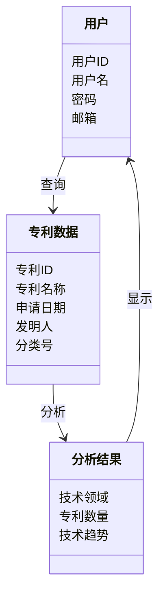

                 


# 气候变化减缓技术的专利分析与投资机会

## 关键词：
气候变化、专利分析、减缓技术、投资机会、可再生能源、碳捕获、能源效率

## 摘要：
气候变化是全球面临的重大挑战，减缓技术在应对这一问题中扮演着关键角色。本文通过专利分析的方法，系统地探讨了气候变化减缓技术的主要领域，包括碳捕获、可再生能源和能源效率提升。基于专利数据的分析，本文揭示了各技术领域的创新趋势、技术布局和投资价值，并提出了相应的投资策略。同时，本文构建了系统分析与架构设计框架，提供了实际的项目实战案例，为投资者和技术开发者提供了科学的决策支持。

---

# 目录

## 第一部分: 气候变化减缓技术的背景与挑战

## 第二部分: 专利分析方法与工具

## 第三部分: 投资机会分析与策略

## 第四部分: 系统分析与架构设计

## 第五部分: 项目实战与案例分析

## 第六部分: 最佳实践与未来展望

---

## 第一部分: 气候变化减缓技术的背景与挑战

### 第1章: 气候变化的背景与影响

#### 1.1 气候变化的定义与核心问题
气候变化是指全球气候系统长期的变化，主要由温室气体排放引起。核心问题是全球变暖导致的极端天气、海平面上升和生态系统破坏。

#### 1.2 气候变化对人类社会的影响
气候变化对农业、水资源、健康和经济发展造成严重影响。例如，极端天气事件增加，农作物减产，传染病传播范围扩大。

#### 1.3 气候变化减缓技术的重要性
减缓技术通过减少温室气体排放或增加碳汇，有效降低气候变化的负面影响。

### 第2章: 气候变化减缓技术的主要领域

#### 2.1 碳捕获与封存技术
碳捕获技术通过化学反应或物理分离捕获二氧化碳，封存技术将其储存在地下或海洋中。

#### 2.2 可再生能源技术
可再生能源如太阳能和风能通过替代化石燃料减少碳排放。

#### 2.3 能源效率提升技术
通过优化设备和系统设计，减少能源浪费，提高能源利用效率。

---

## 第二部分: 专利分析方法与工具

### 第3章: 专利分析的基本方法

#### 3.1 专利检索与分类
使用专利数据库进行关键词检索，根据国际专利分类（IPC）系统对专利进行分类。

#### 3.2 专利分析的指标与方法
包括专利数量、技术领域分布、技术生命周期和专利权属分析。

#### 3.3 专利检索工具的选择
常用的工具包括专利合作条约（PCT）和美国专利商标局（USPTO）数据库。

### 第4章: 专利分析的可视化与趋势

#### 4.1 专利申请趋势分析
通过时间序列图展示专利申请数量变化，识别技术发展的活跃期和衰退期。

#### 4.2 技术领域分布分析
使用饼图或柱状图展示各技术领域的专利数量占比。

#### 4.3 技术生命周期分析
通过专利申请和引用数据，绘制技术生命周期曲线，判断技术成熟度。

---

## 第三部分: 投资机会分析与策略

### 第5章: 投资机会分析

#### 5.1 碳捕获技术的投资潜力
碳捕获技术市场增长迅速，但技术成熟度较低，需关注研发进展。

#### 5.2 可再生能源技术的市场前景
可再生能源技术成熟，市场潜力大，投资回报稳定。

#### 5.3 能源效率提升技术的经济效益
能源效率提升技术成本低，见效快，适合早期投资。

### 第6章: 投资策略与风险管理

#### 6.1 技术选择与投资组合优化
根据技术成熟度和市场潜力，构建多元化投资组合。

#### 6.2 技术风险评估
评估技术的专利布局、市场竞争和政策支持，降低投资风险。

#### 6.3 投资退出与收益实现
关注技术商业化和并购机会，确保投资收益。

---

## 第四部分: 系统分析与架构设计

### 第7章: 系统功能设计

#### 7.1 系统目标
构建一个支持气候变化减缓技术专利分析的在线平台。

#### 7.2 领域模型设计
使用Mermaid类图展示系统核心实体及其关系。



#### 7.3 系统架构设计
采用分层架构，包括数据层、业务逻辑层和用户界面层。

### 第8章: 系统实现

#### 8.1 环境安装
安装Python、Pandas、Matplotlib和Scikit-learn等工具。

#### 8.2 数据处理与分析
使用Python代码清洗和处理专利数据，生成可视化图表。

```python
import pandas as pd
import matplotlib.pyplot as plt

# 读取专利数据
data = pd.read_csv('patent.csv')

# 绘制专利申请趋势图
data['申请日期'].value_counts().sort_index().plot(kind='line', title='专利申请趋势')
plt.show()
```

---

## 第五部分: 项目实战与案例分析

### 第9章: 项目实战

#### 9.1 环境安装
安装所需的开发工具和数据分析库。

#### 9.2 数据收集与处理
从专利数据库获取数据，清洗并预处理。

#### 9.3 分析与可视化
使用Python生成技术趋势图和对比图，分析各技术领域的投资价值。

### 第10章: 案例分析

#### 10.1 可再生能源技术的案例分析
分析某国可再生能源专利申请趋势，判断技术发展热点。

#### 10.2 碳捕获技术的市场潜力
评估碳捕获技术的专利布局和市场应用前景。

---

## 第六部分: 最佳实践与未来展望

### 第11章: 最佳实践

#### 11.1 投资策略建议
根据技术成熟度和市场潜力，制定差异化的投资策略。

#### 11.2 风险管理技巧
关注政策变化和市场竞争，分散投资风险。

#### 11.3 技术跟踪与更新
定期更新专利数据，跟踪技术发展趋势。

### 第12章: 未来展望

#### 12.1 技术创新方向
新兴技术如人工智能在气候变化减缓中的应用。

#### 12.2 投资机会展望
未来可能出现的新技术领域和投资热点。

#### 12.3 行业发展趋势
全球范围内可再生能源和碳捕获技术的持续增长。

---

## 总结

气候变化减缓技术的专利分析为投资者提供了科学决策依据。通过系统分析和实际案例，本文揭示了各技术领域的投资价值和潜力。未来，随着技术进步和政策支持，气候变化减缓技术将继续推动全球可持续发展。

