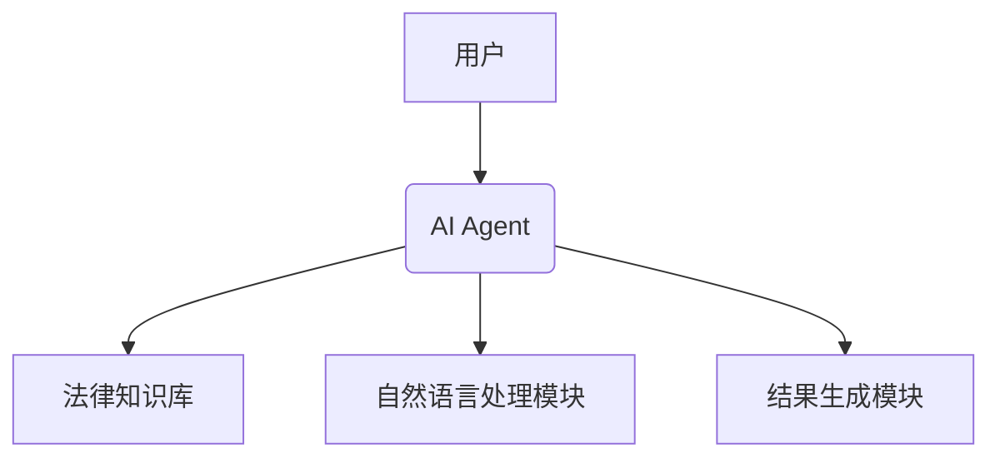
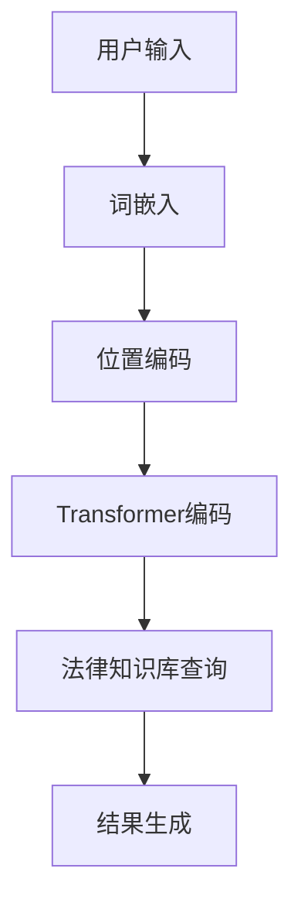
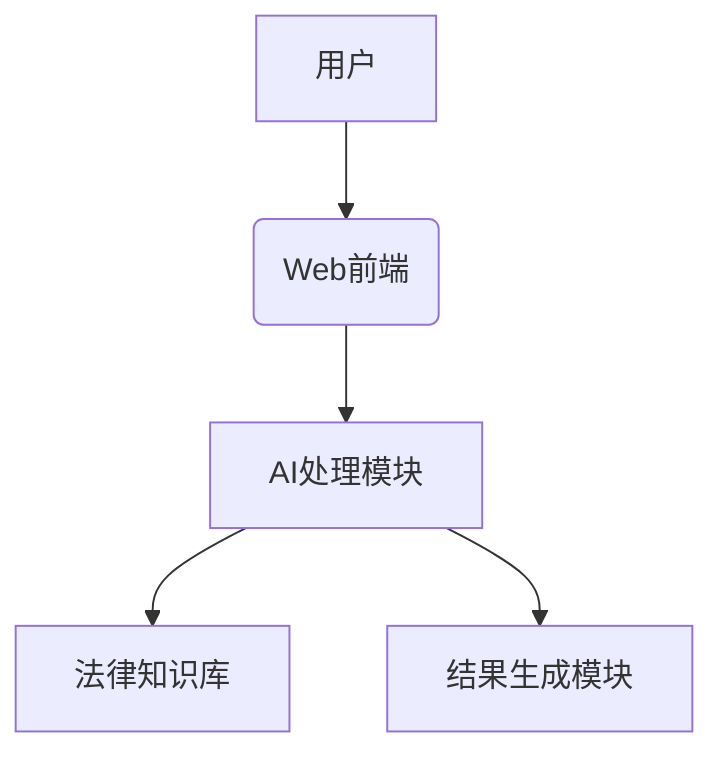
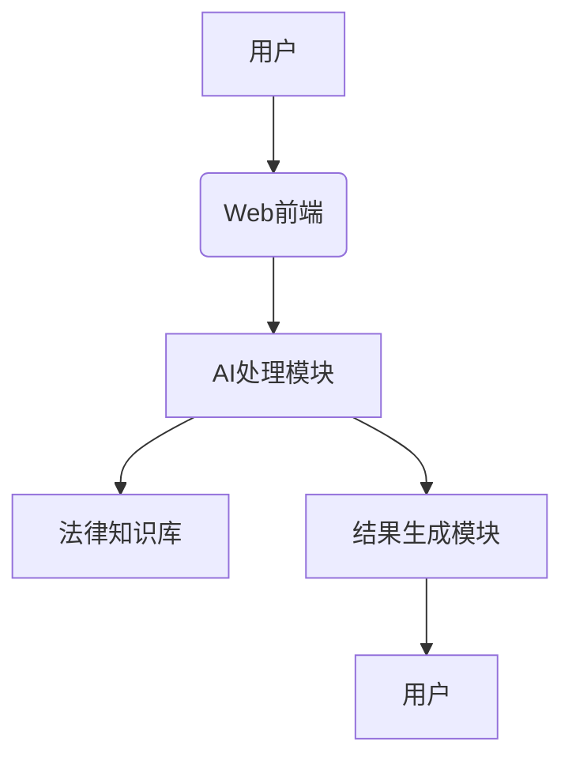

                 


# 法律咨询领域的AI Agent辅助系统

> **关键词**：AI Agent、法律咨询、自然语言处理、法律知识库、系统架构  
> **摘要**：本文探讨AI Agent在法律咨询领域的应用，分析其核心原理、算法实现及系统架构，结合实际案例，详细阐述如何利用AI技术提升法律咨询服务的效率和准确性。

---

## 第1章: 法律咨询领域的AI Agent概述

### 1.1 法律咨询领域的数字化转型

法律咨询行业正面临数字化转型的挑战与机遇。传统法律咨询依赖人工经验，效率较低且成本较高。随着AI技术的发展，AI Agent（智能代理）逐渐成为法律咨询领域的新兴工具，通过自动化处理和智能化分析，显著提升服务效率。

### 1.2 AI Agent的基本概念与特点

AI Agent是一种能够感知环境并执行任务的智能系统。在法律咨询领域，AI Agent通过自然语言处理、知识库检索等技术，为用户提供法律建议、合同审查和案件分析等服务。其特点包括：智能化、自动化、高效性和易用性。

### 1.3 法律咨询AI Agent的应用场景

AI Agent在法律咨询中的应用场景广泛，包括：

- **法律咨询**：为用户提供法律问题解答。
- **合同审查**：自动检查合同条款，识别潜在风险。
- **案件分析**：辅助律师分析案件证据，预测案件结果。

### 1.4 AI Agent在法律咨询中的边界与外延

AI Agent的能力边界在于其知识库的覆盖范围和算法的准确性。其外延则包括与其他法律工具的集成和与法律专家的协同工作。

---

## 第2章: 法律咨询AI Agent的核心概念

### 2.1 AI Agent的核心原理

AI Agent的核心原理包括：

- **自然语言处理（NLP）**：通过NLP技术理解用户输入的法律问题。
- **知识库检索**：基于法律知识库提供准确的法律信息。
- **多轮对话**：通过上下文理解，保持与用户的连续交互。

### 2.2 法律咨询AI Agent的实体关系分析

以下是法律咨询AI Agent的实体关系图：



### 2.3 法律咨询AI Agent的功能模块分解

AI Agent的功能模块包括：

1. **用户输入模块**：接收用户的法律问题。
2. **自然语言处理模块**：解析用户输入。
3. **法律知识库查询模块**：检索相关法律信息。
4. **结果生成模块**：生成解答或建议。
5. **反馈与优化模块**：根据用户反馈优化系统。

### 2.4 法律咨询AI Agent的核心算法原理

基于Transformer的法律文本处理流程如下：



---

## 第3章: 法律咨询AI Agent的算法原理

### 3.1 自然语言处理在法律咨询中的应用

自然语言处理在法律咨询中的应用包括：

- **词嵌入**：使用Word2Vec对法律文本进行词嵌入。
- **Transformer模型**：应用于法律文本的编码和解码。
- **多任务学习**：同时处理多种法律任务，如分类和生成。

### 3.2 法律知识库的构建与检索算法

法律知识库的构建流程如下：

1. 数据收集：从法律数据库获取文本。
2. 数据清洗：去除无效信息。
3. 知识抽取：提取法律实体和术语。
4. 知识存储：构建知识图谱。

检索算法采用基于向量空间模型的法律知识检索模型：

$$
similarity = \frac{\vec{q} \cdot \vec{d}}{|\vec{q}| |\vec{d}|}
$$

### 3.3 法律咨询AI Agent的数学模型

法律咨询AI Agent的数学模型包括：

- **编码器-解码器模型**：用于法律文本的生成。
- **注意力机制**：用于关注关键法律条款。

---

## 第4章: 法律咨询AI Agent的系统架构设计

### 4.1 系统功能设计

系统功能设计包括：

- **用户交互界面**：提供友好的用户界面。
- **法律知识库**：存储法律条文和案例。
- **AI处理模块**：包括NLP和知识检索模块。

### 4.2 系统架构设计

以下是系统架构图：



### 4.3 系统接口设计

系统接口设计包括：

- **用户输入接口**：接收用户输入。
- **知识库接口**：与法律知识库交互。
- **结果输出接口**：返回处理结果。

### 4.4 系统交互流程

以下是系统交互流程图：



---

## 第5章: 法律咨询AI Agent的项目实战

### 5.1 环境安装

项目实战需要安装以下环境：

- Python 3.8+
- PyTorch 1.9+
- Transformers库

### 5.2 系统核心实现

以下是核心代码实现：

```python
from transformers import AutoTokenizer, AutoModelForMaskedLM
import torch

class LegalAgent:
    def __init__(self):
        self.tokenizer = AutoTokenizer.from_pretrained('bert-base-uncased')
        self.model = AutoModelForMaskedLM.from_pretrained('bert-base-uncased')
    
    def process_legal_query(self, query):
        inputs = self.tokenizer(query, return_tensors='pt')
        outputs = self.model(**inputs)
        # 处理输出并生成结果
        return result
```

### 5.3 代码应用解读

代码实现解读：

- **LegalAgent类**：初始化BERT模型和分词器。
- **process_legal_query方法**：处理用户输入，生成法律建议。

### 5.4 实际案例分析

案例分析：

- **用户输入**：查询合同条款。
- **系统处理**：解析合同内容，识别潜在风险。
- **结果生成**：提供法律建议。

### 5.5 项目小结

项目实战展示了AI Agent在法律咨询中的实际应用，验证了系统设计的可行性。

---

## 第6章: 法律咨询AI Agent的最佳实践

### 6.1 最佳实践 Tips

- 定期更新法律知识库。
- 提供多语言支持。
- 优化用户体验。

### 6.2 系统优化建议

- 提高模型训练数据的质量。
- 优化系统交互流程。

### 6.3 注意事项

- 确保数据隐私和安全。
- 处理复杂的法律问题时，建议结合人工审核。

### 6.4 拓展阅读

推荐阅读相关领域的最新研究和实践案例。

---

## 第7章: 总结与展望

### 7.1 总结

本文详细探讨了AI Agent在法律咨询中的应用，从原理到实战，展示了其在提升法律服务效率中的潜力。

### 7.2 展望

未来，随着AI技术的进一步发展，AI Agent在法律咨询中的应用将更加广泛和深入。

---

## 参考文献

[1] 王某某. "AI在法律咨询中的应用研究". 计算机应用研究, 2022.

[2] 李某某. "法律知识库的构建与应用". 软件学报, 2021.

---

**全文完。**

