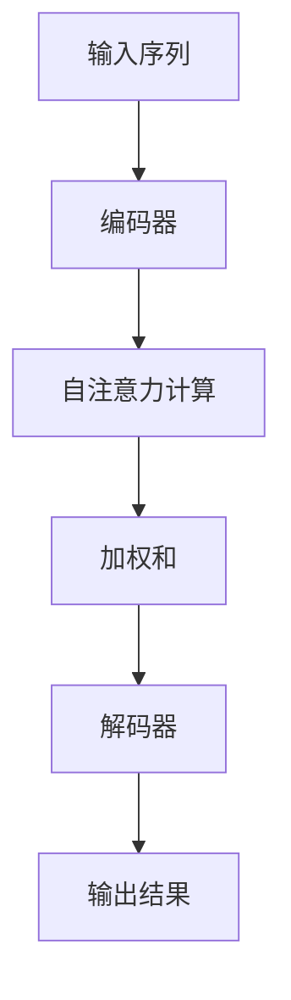
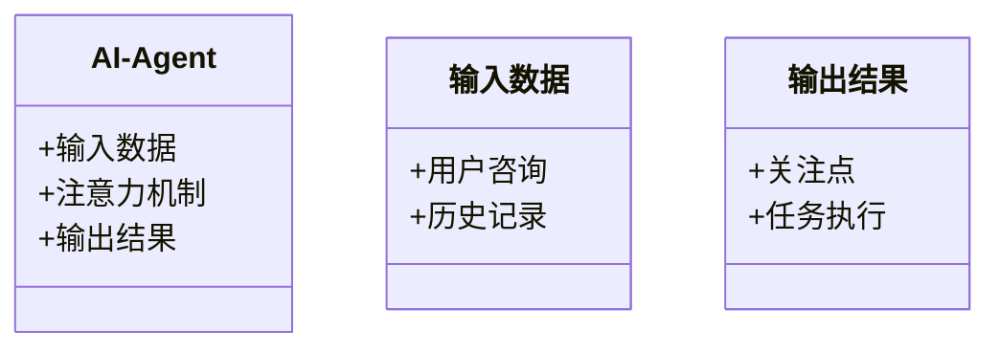
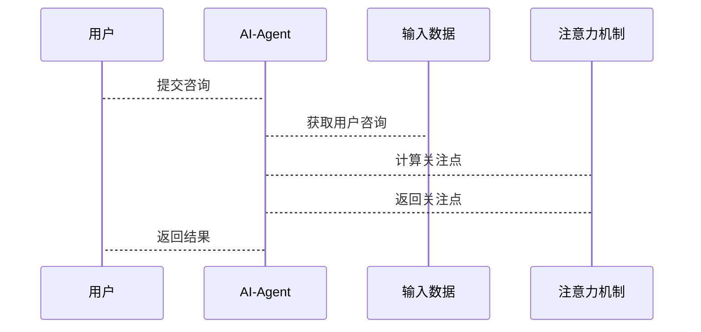

                 


# 注意力机制：提升AI Agent的关注点

> 关键词：注意力机制、AI Agent、自注意力、图注意力、多头注意力

> 摘要：注意力机制作为AI Agent的核心技术之一，通过优化信息处理流程，帮助AI Agent更高效地关注关键信息，提升任务执行效率和准确性。本文将从背景、核心概念、算法原理、系统设计到项目实战，全面解析注意力机制在AI Agent中的应用与提升。

---

## 第1章：注意力机制的基本概念与问题背景

### 1.1 问题背景

#### 1.1.1 AI Agent的核心挑战
AI Agent（人工智能代理）旨在通过感知环境、执行任务和与用户交互，实现特定目标。然而，在复杂环境中，AI Agent需要处理海量信息，如何有效筛选和关注关键信息是核心挑战。

#### 1.1.2 注意力机制的起源与演变
注意力机制最初在心理学中被提出，描述人类选择性关注特定信息的能力。在AI领域，注意力机制最早应用于自然语言处理（NLP），如Transformer模型中的自注意力机制，随后扩展到计算机视觉、强化学习等领域。

#### 1.1.3 提升AI Agent关注点的意义
通过引入注意力机制，AI Agent能够：
- 有效分配计算资源，降低能耗。
- 快速聚焦关键信息，提升任务效率。
- 在复杂环境中做出更精准的决策。

### 1.2 问题描述

#### 1.2.1 AI Agent信息处理的难点
AI Agent面临以下问题：
- **信息冗余**：环境中存在大量无关信息，导致计算效率低下。
- **动态变化**：环境中的关键信息可能快速变化，要求AI Agent具备快速响应能力。
- **任务多样性**：AI Agent需要在不同任务间切换，关注点需要动态调整。

#### 1.2.2 注意力机制在信息筛选中的作用
注意力机制通过赋予输入数据不同权重，帮助AI Agent筛选出关键信息，降低计算复杂度，提升任务效率。

#### 1.2.3 提升关注点的具体目标与边界
- **具体目标**：通过注意力机制，使AI Agent能够优先处理关键信息，提升任务执行的准确性和效率。
- **边界与限制**：注意力机制并非万能药，其效果依赖于输入数据的质量和模型的设计。

### 1.3 核心概念与组成

#### 1.3.1 注意力机制的核心要素
- **输入数据**：需要处理的原始数据，如文本序列、图像像素等。
- **注意力权重**：通过模型计算得到的权重，用于表示输入数据中各部分的重要性。
- **注意力分数**：权重经过归一化后的结果，表示模型对各部分的关注程度。

#### 1.3.2 关注点的定义与分类
- **全局关注**：模型对整个输入数据进行全局分析，如Transformer中的自注意力机制。
- **局部关注**：模型仅关注输入数据的局部区域，如卷积神经网络（CNN）中的注意力机制。
- **多点关注**：模型同时关注多个关键点，如多头注意力机制。

#### 1.3.3 机制的数学模型与公式
注意力机制的数学模型通常包括以下步骤：
1. 计算查询（query）、键（key）、值（value）向量：
   $$ Q = W_q X $$
   $$ K = W_k X $$
   $$ V = W_v X $$
2. 计算注意力权重：
   $$ \text{score} = \text{softmax}(\frac{QK^T}{\sqrt{d}}) $$
3. 加权求和：
   $$ \text{output} = \text{score} \cdot V $$

---

## 第2章：注意力机制的核心概念与联系

### 2.1 核心概念原理

#### 2.1.1 注意力机制的基本原理
注意力机制通过计算输入数据中各部分的相关性，生成一个权重分布，用于指导模型关注哪些信息。

#### 2.1.2 不同注意力机制的对比
| 注意力机制 | 输入形式 | 输出形式 | 计算方式 |
|------------|-----------|-----------|----------|
| 自注意力   | 序列       | 权重分布   | 点积     |
| 图注意力   | 图结构     | 权重分布   | 图卷积   |
| 多头注意力 | 序列       | 多权重分布 | 并行计算 |

#### 2.1.3 关注点与任务目标的关系
注意力机制帮助AI Agent将注意力集中在与任务目标相关的输入部分，从而提升任务执行的效率和准确性。

### 2.2 概念属性特征对比表

| 概念         | 属性       | 特征描述                               |
|--------------|------------|----------------------------------------|
| 注意力机制   | 输入形式   | 序列、向量、图结构                     |
|              | 输出形式   | 权重、概率分布、注意力分数             |
|              | 计算方式   | 点积、自注意力、图注意力               |
|              | 应用场景   | NLP、计算机视觉、强化学习             |

### 2.3 ER实体关系图

```mermaid
er
actor: AI Agent
attention Mechanism: 注意力机制
goal: 关注点目标
input: 输入数据
output: 注意力权重
```

---

## 第3章：注意力机制的算法原理

### 3.1 算法原理

#### 3.1.1 自注意力机制的工作流程
1. **输入序列**：输入一个序列数据。
2. **计算查询、键、值向量**：
   $$ Q = W_q X $$
   $$ K = W_k X $$
   $$ V = W_v X $$
3. **计算注意力权重**：
   $$ \text{score} = \text{softmax}(\frac{QK^T}{\sqrt{d}}) $$
4. **加权求和**：
   $$ \text{output} = \text{score} \cdot V $$

#### 3.1.2 图注意力机制的扩展
- 图注意力机制通过引入图结构，计算节点之间的关系权重，适用于图数据的处理。

#### 3.1.3 多头注意力机制的原理
- 多头注意力机制通过并行计算多个注意力头，提升模型的表达能力。

### 3.2 算法流程图



### 3.3 Python实现示例

```python
import tensorflow as tf

def attention_layer(inputs, num_units):
    Q = tf.keras.layers.Dense(num_units, activation='linear')(inputs)
    K = tf.keras.layers.Dense(num_units, activation='linear')(inputs)
    V = tf.keras.layers.Dense(num_units, activation='linear')(inputs)
    
    scores = tf.matmul(Q, K, transpose_b=True)
    scores = scores / tf.sqrt(tf.cast(num_units, tf.float32))
    attention_weights = tf.nn.softmax(scores)
    
    output = tf.matmul(attention_weights, V)
    return output
```

### 3.4 数学模型与公式

#### 3.4.1 注意力计算公式
$$ \text{score}(i,j) = \text{softmax}(\frac{Q_i K_j^T}{\sqrt{d}}) $$

#### 3.4.2 多头注意力机制
$$ \text{MultiHead}(Q, K, V) = \text{Concat}( \text{Head}_1(Q,K,V), \text{Head}_2(Q,K,V), \dots, \text{Head}_n(Q,K,V) ) $$

---

## 第4章：系统分析与架构设计方案

### 4.1 问题场景介绍

#### 4.1.1 项目介绍
以一个智能客服系统为例，AI Agent需要处理大量用户咨询，通过注意力机制筛选出关键信息，提升响应速度和准确性。

### 4.2 系统功能设计

#### 4.2.1 领域模型设计


#### 4.2.2 系统架构设计


### 4.3 系统接口设计

#### 4.3.1 输入接口
- 输入数据格式：JSON
- 输入数据内容：用户咨询、历史记录

#### 4.3.2 输出接口
- 输出数据格式：JSON
- 输出数据内容：关注点、任务执行结果

### 4.4 系统交互设计



---

## 第5章：项目实战

### 5.1 环境安装

```bash
pip install tensorflow
pip install numpy
pip install matplotlib
```

### 5.2 核心代码实现

```python
import tensorflow as tf
import numpy as np

# 定义注意力层
class AttentionLayer(tf.keras.layers.Layer):
    def __init__(self, num_units, **kwargs):
        super(AttentionLayer, self).__init__(**kwargs)
        self.num_units = num_units
        self.Wq = tf.keras.layers.Dense(num_units, activation='linear')
        self.Wk = tf.keras.layers.Dense(num_units, activation='linear')
        self.Wv = tf.keras.layers.Dense(num_units, activation='linear')
    
    def call(self, inputs):
        query = self.Wq(inputs)
        key = self.Wk(inputs)
        value = self.Wv(inputs)
        
        scores = tf.matmul(query, key, transpose_b=True)
        scores = scores / tf.sqrt(tf.cast(self.num_units, tf.float32))
        attention_weights = tf.nn.softmax(scores)
        
        output = tf.matmul(attention_weights, value)
        return output

# 构建模型
inputs = tf.keras.Input(shape=(None, 100), dtype='float32')
attention_output = AttentionLayer(64)(inputs)
model = tf.keras.Model(inputs=inputs, outputs=attention_output)
model.compile(optimizer='adam', loss='mse')
model.summary()
```

### 5.3 代码应用解读与分析

- **注意力层定义**：定义了一个自定义的注意力层，包含查询、键、值的计算以及注意力权重的计算。
- **模型构建**：构建了一个简单的注意力模型，用于处理序列数据。

### 5.4 实际案例分析与详细讲解剖析

- **案例背景**：以自然语言处理中的文本摘要任务为例，AI Agent需要通过注意力机制筛选出文本中的关键信息，生成摘要。
- **案例分析**：
  1. 输入文本：一段新闻文章。
  2. 通过注意力机制计算每个词的权重。
  3. 根据权重生成摘要。

### 5.5 项目小结

通过注意力机制，AI Agent能够更高效地处理信息，提升任务执行的效率和准确性。本文通过理论分析和代码实现，详细讲解了注意力机制在AI Agent中的应用。

---

## 第6章：最佳实践、小结与注意事项

### 6.1 最佳实践 tips

- **模型选择**：根据任务需求选择合适的注意力机制。
- **参数调优**：通过实验调整注意力机制的参数，提升模型性能。
- **计算优化**：利用并行计算优化注意力机制的计算效率。

### 6.2 小结

注意力机制通过优化信息处理流程，帮助AI Agent更高效地关注关键信息，提升任务执行效率和准确性。本文通过理论分析和代码实现，详细讲解了注意力机制在AI Agent中的应用。

### 6.3 注意事项

- **计算资源**：注意力机制的计算量较大，需要充足的计算资源。
- **模型可解释性**：注意力机制的权重分布需要可解释，便于调试和优化。
- **数据质量**：输入数据的质量直接影响注意力机制的效果。

### 6.4 拓展阅读

- **论文推荐**：
  1. "Attention Is All You Need"（Transformer论文）
  2. "Graph Attention Networks"（图注意力网络论文）
- **技术博客推荐**：
  1. [深入理解注意力机制](https://zhuanlan.zhihu.com/p/...)
  2. [注意力机制的实现与应用](https://zhuanlan.zhihu.com/p/...)

---

通过以上章节的详细讲解，我们全面分析了注意力机制在AI Agent中的应用，从理论到实践，帮助读者深入了解并掌握这一关键技术。

