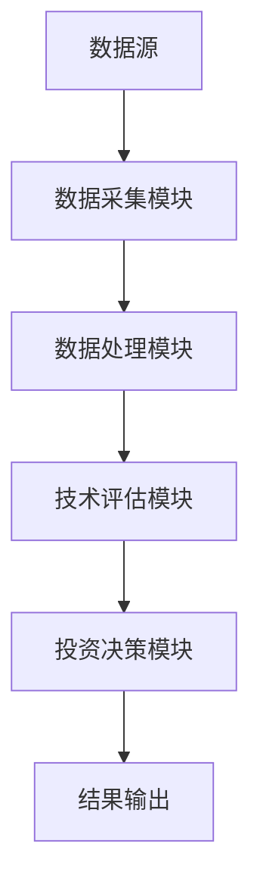

                 

# 海洋塑料污染治理技术的投资价值评估

> 关键词：海洋塑料污染，治理技术，投资价值，技术评估，环境污染

> 摘要：随着海洋塑料污染问题的日益严重，治理技术的投资价值评估成为学术界和产业界关注的焦点。本文从技术原理、系统架构、投资模型等多个维度展开分析，旨在为投资者和研究人员提供全面的技术评估框架和投资决策依据。

---

## 第一部分: 海洋塑料污染治理技术概述

### 第1章: 海洋塑料污染的背景与现状

#### 1.1 海洋塑料污染的背景与现状

##### 1.1.1 海洋塑料污染的定义与问题背景
海洋塑料污染是指海洋环境中塑料制品的累积和扩散对生态系统造成破坏的现象。根据联合国环境规划署（UNEP）的报告，每年有超过800万吨塑料垃圾进入海洋，导致海洋生物死亡、水质下降以及人类健康风险增加。

##### 1.1.2 海洋塑料污染的现状与发展趋势
近年来，海洋塑料污染问题愈演愈烈。据统计，全球约有5万亿塑料碎片漂浮在海洋中，其中80%来自陆地垃圾的排放。未来几十年，塑料垃圾的总量预计将以指数级增长，对海洋生态系统的威胁将进一步加剧。

##### 1.1.3 海洋塑料污染对生态系统的危害
塑料污染对海洋生态系统的影响是多方面的。首先，塑料碎片被海洋生物误食，导致消化系统堵塞甚至死亡。其次，塑料中的有害物质会通过食物链积累，最终威胁人类健康。此外，塑料垃圾还会影响海洋运输和旅游业，造成经济损失。

#### 1.2 海洋塑料污染治理技术的核心概念

##### 1.2.1 治理技术的分类与特点
目前，海洋塑料污染治理技术主要分为两类：预防性技术和修复性技术。预防性技术包括减少塑料使用、推广可降解材料等；修复性技术则包括物理清理、化学降解和生物降解等方法。

##### 1.2.2 治理技术的边界与外延
治理技术的边界主要集中在海洋环境中的塑料污染，而外延则包括塑料回收、垃圾处理和循环利用等多个环节。通过技术的协同作用，可以实现塑料污染的全生命周期管理。

##### 1.2.3 核心要素与概念结构
治理技术的核心要素包括塑料收集、降解、回收和再利用。通过这些要素的有机组合，可以形成完整的治理链条。

---

## 第二部分: 核心概念与联系

### 第2章: 核心概念的关联与对比

#### 2.1 核心概念的原理分析

##### 2.1.1 各类治理技术的原理分析
- **物理清理技术**：通过机械手段将海洋中的塑料垃圾打捞出来。这种方法适用于近海区域的清理，但成本较高且效率有限。
- **化学降解技术**：利用化学试剂将塑料分解为小分子物质。这种方法适用于处理微塑料，但可能对环境造成二次污染。
- **生物降解技术**：利用微生物分解塑料垃圾。这种方法环保且成本较低，但目前技术尚不成熟。

##### 2.1.2 技术之间的关联与协同作用
不同治理技术之间存在协同效应。例如，物理清理可以为化学或生物降解提供干净的环境，而化学降解可以作为生物降解的补充手段。

#### 2.2 核心概念对比分析

##### 2.2.1 不同治理技术的特征对比
| 技术类型      | 优点                         | 缺点                         |
|---------------|------------------------------|------------------------------|
| 物理清理      | 清理效率高                   | 成本高，难以处理远海垃圾     |
| 化学降解      | 可快速降解微塑料             | 可能对环境造成二次污染       |
| 生物降解      | 环保性强，成本低             | 技术不成熟，效率较低         |

##### 2.2.2 投资价值评估的核心要素
- **技术可行性**：技术是否成熟，能否大规模应用。
- **市场需求**：是否有足够的市场需求和商业潜力。
- **成本效益**：技术的成本是否低于收益。

---

## 第三部分: 投资价值评估的算法原理

### 第3章: 投资价值评估模型概述

#### 3.1 模型构建的数学公式
投资价值评估模型可以通过以下公式表示：
$$ \text{投资价值} = f(\text{技术成熟度}, \text{市场需求}, \text{成本效益}) $$

其中，技术成熟度、市场需求和成本效益是影响投资价值的核心因素。

#### 3.2 数据处理与分析
- **数据收集**：收集各类治理技术的市场数据、技术参数和成本数据。
- **数据预处理**：清洗数据，去除异常值和冗余信息。
- **特征提取**：提取关键特征，如技术成本、市场需求和环境效益。

---

## 第四部分: 系统分析与架构设计

### 第4章: 系统架构设计

#### 4.1 系统功能模块划分
- **数据采集模块**：收集海洋塑料污染数据。
- **技术评估模块**：评估各种治理技术的可行性。
- **投资决策模块**：基于评估结果制定投资策略。

#### 4.2 系统架构的mermaid图

---

## 第五部分: 项目实战与总结

### 第5章: 项目实战

#### 5.1 技术应用案例分析
- **案例1**：物理清理技术在欧洲北海的应用。
- **案例2**：生物降解技术在东南亚的试点项目。

#### 5.2 投资评估案例分析
- **案例1**：某化学降解技术的投资回报分析。
- **案例2**：某物理清理技术的市场可行性评估。

---

## 第六部分: 最佳实践与总结

### 第6章: 投资建议与注意事项

#### 6.1 投资建议
- **优先选择技术成熟度高、市场需求大的技术**。
- **注重技术的环保性和成本效益**。

#### 6.2 注意事项
- **技术风险**：部分技术尚未成熟，可能面临失败风险。
- **政策支持**：关注政府政策和行业标准的变化。

#### 6.3 未来展望
随着技术的进步和市场的成熟，海洋塑料污染治理技术的投资价值将不断提升。未来，生物降解技术和智能清理设备将成为研究重点。

---

## 第七部分: 拓展阅读

### 7.1 相关技术与研究领域
- **海洋环境保护**：研究海洋生态系统的保护与修复。
- **塑料循环经济**：推动塑料的回收与再利用。

---

通过以上分析，我们可以得出结论：海洋塑料污染治理技术的投资价值取决于技术的成熟度、市场需求和成本效益。投资者应结合技术特点和市场环境，制定合理的投资策略。

