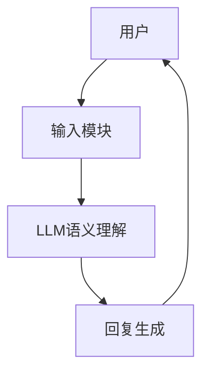

                 


# 深入理解LLM：AI Agent开发的基石

## 关键词：大语言模型，LLM，AI Agent，自然语言处理，生成式AI，智能体开发

## 摘要：  
本文旨在深入探讨大语言模型（LLM）在AI Agent开发中的核心作用。通过对LLM的内部工作机制、算法原理、系统架构以及实际项目案例的详细分析，帮助读者理解如何利用LLM构建高效、智能的AI Agent。文章从LLM的基本概念出发，逐步深入，结合数学公式、流程图和代码示例，全面解析AI Agent开发的关键技术点，并提供实践指导和未来展望。

---

# 第一章: 引言

## 1.1 什么是AI Agent  
AI Agent（人工智能代理）是一种能够感知环境、执行任务并做出决策的智能实体。它可以是一个软件程序，也可以是一个物理设备，通过与用户或环境交互，完成特定目标。AI Agent的核心在于其智能性，它能够理解上下文、推理问题、规划行动并执行任务。

## 1.2 LLM与AI Agent的关系  
大语言模型（LLM）作为AI Agent的重要组成部分，负责处理自然语言理解、生成和推理任务。LLM通过其强大的语言处理能力，为AI Agent提供语义理解、对话生成和知识推理等功能，使其能够更好地与人类交互并完成复杂任务。

## 1.3 本文结构  
本文将从LLM的基本概念出发，逐步深入讲解其内部工作机制、算法原理、系统架构，并结合实际项目案例，详细分析AI Agent的开发过程。最后，我们将总结LLM在AI Agent开发中的重要性，并展望未来的发展趋势。

---

# 第二章: 大语言模型（LLM）概述

## 2.1 LLM的定义与特点  
大语言模型是一种基于深度学习的自然语言处理模型，具有以下特点：  
- **大规模训练数据**：通常使用 billions of parameters，能够捕获语言的复杂模式。  
- **上下文理解**：通过自注意力机制，模型能够理解上下文关系。  
- **生成能力**：能够生成自然流畅的文本，适用于多种NLP任务。  
- **可微调性**：可以通过微调适应特定领域任务。

## 2.2 LLM的核心技术  
### 2.2.1 Transformer模型  
Transformer模型由Google于2018年提出，取代了传统的RNN/LSTM模型，成为现代LLM的主流架构。其核心思想是引入**自注意力机制**，通过并行计算提高效率。

#### 自注意力机制公式  
$$\text{Attention}(Q, K, V) = \text{softmax}\left(\frac{QK^T}{\sqrt{d_k}}\right)V$$  
其中，$Q$、$K$、$V$分别为查询、键、值向量，$d_k$为向量维度。

### 2.2.2 编码器-解码器架构  
编码器负责将输入文本转化为语义向量，解码器根据编码结果生成输出文本。这种架构适用于多种任务，如机器翻译、文本生成等。

### 2.2.3 多模态扩展  
LLM可以通过与视觉、音频等模态的结合，实现多模态理解与生成。

---

# 第三章: LLM的内部工作机制

## 3.1 模型训练过程  
### 3.1.1 预训练任务  
预训练任务通常包括：  
- **掩码语言模型**：随机遮盖部分词，模型预测缺失的词。  
- **下一个词预测**：根据前序词预测下一个词。  

### 3.1.2 优化算法  
常用优化算法包括Adam、AdamW等。以Adam为例，其更新公式为：  
$$\theta_{t+1} = \theta_t - \eta \frac{\rho_1 g_t + \rho_2 g_t^2}{g_t^2 + \epsilon}$$  
其中，$\eta$为学习率，$\rho_1$和$\rho_2$为动量参数，$\epsilon$为防止除零的小量。

### 3.1.3 并行计算  
通过分布式训练和并行计算，可以显著提高训练效率。

## 3.2 模型推理过程  
### 3.2.1 解码策略  
- **贪心搜索**：每次选择概率最高的词。  
- **随机采样**：随机选择生成的词，适用于探索不同的生成结果。  
- **Beam Search**：通过生成多个候选结果，选择最优的输出。

### 3.2.2 注意力机制的可解释性  
通过可视化注意力权重，可以理解模型对输入文本的关注点。

---

# 第四章: AI Agent的系统架构设计

## 4.1 系统组成  
AI Agent通常由以下部分组成：  
- **感知层**：负责接收输入（如用户查询）。  
- **决策层**：通过LLM进行语义理解与推理。  
- **执行层**：根据决策结果执行操作（如生成回复、调用API）。  

## 4.2 案例分析：AI对话机器人  
以一个简单的对话机器人为例，设计其系统架构。

### 4.2.1 系统功能设计  
- 用户输入：接收用户的自然语言查询。  
- 语义理解：通过LLM理解用户意图。  
- 生成回复：基于LLM生成自然语言回复。  

### 4.2.2 系统架构图  


---

# 第五章: AI Agent的开发实战

## 5.1 环境配置  
- 安装Python和必要的库（如TensorFlow、PyTorch）。  
- 下载预训练的LLM模型（如GPT-2、GPT-3）。  

## 5.2 核心代码实现  
```python
import torch
from transformers import GPT2LMHeadModel, GPT2Tokenizer

# 初始化模型和分词器
model_name = 'gpt2'
tokenizer = GPT2Tokenizer.from_pretrained(model_name)
model = GPT2LMHeadModel.from_pretrained(model_name)

# 定义生成函数
def generate_response(prompt, max_length=50):
    inputs = tokenizer.encode(prompt, return_tensors='pt')
    outputs = model.generate(inputs, max_length=max_length, do_sample=True)
    response = tokenizer.decode(outputs[0], skip_special_tokens=True)
    return response

# 测试
print(generate_response("What is AI Agent?"))
```

## 5.3 代码解读与优化  
- **tokenizer.encode**：将输入文本转换为模型可理解的格式。  
- **model.generate**：根据输入生成输出文本。  
- **tokenizer.decode**：将生成的tokens转换回自然语言文本。  

## 5.4 案例分析与总结  
通过实际案例，分析AI Agent开发中的常见问题及解决方案，并总结开发经验。

---

# 第六章: 总结与展望

## 6.1 本文总结  
本文详细探讨了大语言模型在AI Agent开发中的核心作用，从LLM的基本概念到系统架构设计，再到实际项目实战，全面解析了AI Agent的开发过程。

## 6.2 未来展望  
随着LLM技术的不断进步，AI Agent将具有更强大的语义理解和生成能力，应用场景也将更加广泛。未来的研究方向包括：  
- 更高效的模型架构设计。  
- 更强的可解释性与伦理问题的解决。  
- 多模态AI Agent的开发与应用。

---

# 附录: 更多资源与推荐阅读

## 1. 常用工具与库  
- **Hugging Face**：提供丰富的预训练模型和教程。  
- **OpenAI API**：提供GPT系列模型的调用接口。  

## 2. 推荐阅读  
- **《Deep Learning》**：Ian Goodfellow等著。  
- **《Attention Is All You Need》**：Vaswani等著。  

---

通过本文的深入分析，读者可以全面理解大语言模型在AI Agent开发中的重要性，并掌握实际开发的关键技术。希望本文能够为AI Agent的开发提供有价值的参考与启发。

