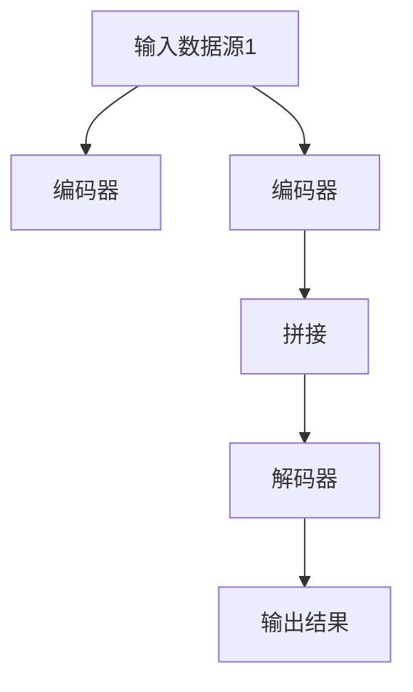
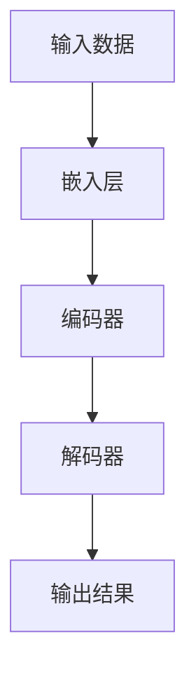
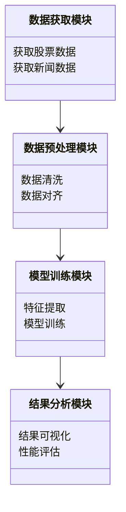
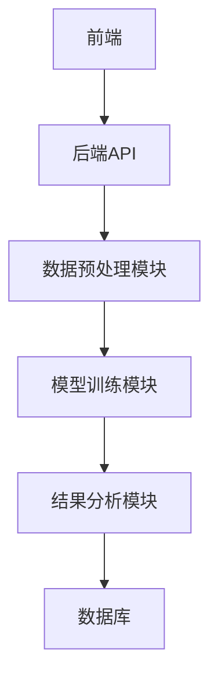
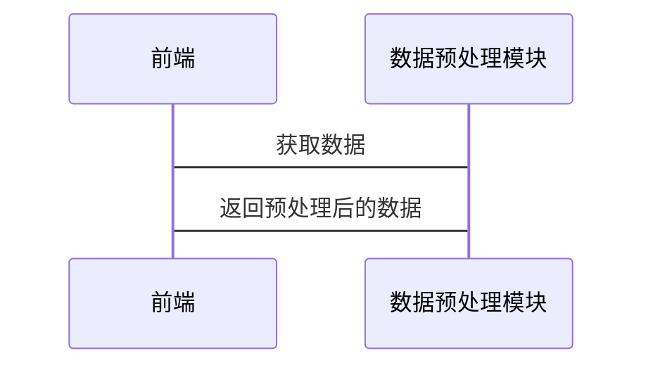
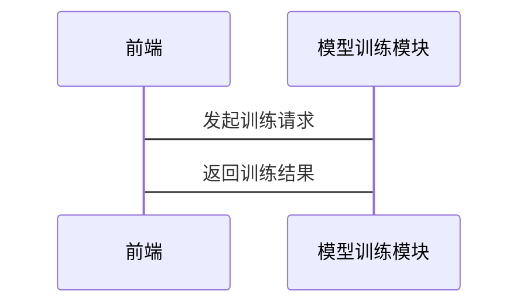

                 


# 深度学习在多源金融数据融合中的应用

## 关键词
深度学习, 多源数据, 金融数据融合, 神经网络, 数据挖掘

## 摘要
深度学习在多源金融数据融合中的应用是一项具有挑战性和前沿性的研究。随着金融市场的日益复杂化，数据来源多样化，如何有效地融合和分析这些数据成为提升金融决策智能化的关键。本文通过介绍深度学习的基本原理，探讨其在多源金融数据融合中的具体应用，包括数据预处理、模型构建、融合方法及性能评估等。结合实际案例，分析深度学习在金融数据融合中的优势与挑战，并展望未来的研究方向。

---

# 第一章：多源金融数据融合的背景与挑战

## 1.1 多源数据的定义与特点

### 1.1.1 数据的异构性
多源数据通常来自不同的来源（如股票价格、新闻、社交媒体、经济指标等），具有不同的格式、粒度和时间戳。例如，新闻数据是文本形式，而股票价格数据是数值形式。

| 数据类型 | 格式 | 粒度 | 时间戳 |
|----------|------|------|--------|
| 股票价格 | 数值  | 每分钟 | 精确到秒 |
| 新闻      | 文本  | 每天   | 精确到天  |

### 1.1.2 数据的冗余性
多源数据中可能存在冗余信息，例如同一事件在不同数据源中有重复描述。冗余数据可以通过数据清洗和降维技术进行处理。

### 1.1.3 数据的互补性
不同数据源可以提供互补的信息。例如，社交媒体情绪数据可以补充传统财务指标的不足。

## 1.2 金融数据融合的背景与重要性

### 1.2.1 金融数据的多样性
金融市场中的数据不仅包括传统的财务数据，还包括文本数据（新闻、社交媒体）、图像数据（财务报表）和时间序列数据（股票价格、指数）。

### 1.2.2 数据融合在金融分析中的作用
数据融合可以帮助提高金融预测的准确性和鲁棒性。通过整合多源数据，可以捕捉到单一数据源无法提供的信息。

### 1.2.3 深度学习在数据融合中的优势
深度学习具有强大的特征学习能力，能够自动提取多源数据中的有用信息，并通过非线性变换提高模型的表达能力。

## 1.3 深度学习在金融数据融合中的应用现状

### 1.3.1 深度学习的基本概念
深度学习是一种基于人工神经网络的机器学习方法，通过多层非线性变换从输入数据中学习高层次特征。

### 1.3.2 深度学习在金融领域的应用案例
- 股票价格预测：利用LSTM模型捕捉时间序列数据中的长-term依赖关系。
- 风险评估：通过深度学习模型整合多源数据，提高信用评分的准确性。

### 1.3.3 当前研究的挑战与不足
- 数据异构性处理困难：不同数据源的格式和粒度差异增加了数据预处理的复杂性。
- 模型解释性不足：深度学习模型通常被视为“黑箱”，难以解释其决策过程。

---

# 第二章：多源数据融合的核心概念

## 2.1 数据融合的定义与分类

### 2.1.1 数据融合的定义
数据融合是指将来自不同来源的数据进行整合，以获得更全面、更准确的信息。

### 2.1.2 数据融合的分类
- **基于特征的融合**：在特征级别对数据进行融合。
- **基于决策的融合**：在决策级别对数据进行融合。
- **基于模型的融合**：在模型内部对数据进行融合。

### 2.1.3 数据融合的关键技术
- 特征提取
- 数据对齐
- 异构数据处理

## 2.2 深度学习在数据融合中的作用

### 2.2.1 深度学习的优势
- 强大的特征学习能力
- 非线性表达能力
- 自动处理异构数据

### 2.2.2 深度学习在数据融合中的应用
- 多源数据特征提取
- 异构数据对齐
- 融合模型设计

### 2.2.3 深度学习与其他数据融合方法的对比
| 方法         | 优势               | 劣势               |
|--------------|--------------------|--------------------|
| 基于规则的融合 | 实现简单           | 缺乏灵活性         |
| 基于统计的融合 | 易解释             | 难处理异构数据     |
| 深度学习融合  | 强大的特征学习能力 | 黑箱问题           |

## 2.3 数据融合的数学模型与公式

### 2.3.1 数据融合的数学模型
$$ y = f(x_1, x_2, ..., x_n) $$
其中，$x_i$ 表示不同数据源的输入数据，$y$ 表示融合后的输出。

### 2.3.2 数据融合的公式推导
假设我们有多个数据源 $x_1, x_2, ..., x_n$，通过深度神经网络进行融合：
$$ h_1 = \text{Encoder}(x_1) $$
$$ h_2 = \text{Encoder}(x_2) $$
$$ ... $$
$$ h = \text{Concat}(h_1, h_2, ..., h_n) $$
$$ y = \text{Decoder}(h) $$

### 2.3.3 数据融合的流程图


---

# 第三章：深度学习在多源金融数据融合中的应用

## 3.1 深度学习的基本原理与算法

### 3.1.1 LSTM网络
LSTM（长短期记忆网络）是一种特殊的RNN，能够有效捕捉时间序列数据中的长-term依赖关系。

### 3.1.2 Transformer模型
Transformer模型通过自注意力机制，在全局范围内捕捉数据的依赖关系。

### 3.1.3 深度学习算法的流程图


## 3.2 深度学习在金融数据融合中的具体应用

### 3.2.1 数据预处理
- 数据清洗：去除噪声数据。
- 数据对齐：将不同粒度的数据对齐到相同的时间点。

### 3.2.2 深度学习模型的构建
- 特征提取：利用CNN提取文本数据中的关键词向量。
- 融合方法：使用注意力机制对多个数据源的信息进行加权融合。

### 3.2.3 模型训练与优化
- 选择合适的优化算法（如Adam）。
- 调整超参数（如学习率、批量大小）。

## 3.3 深度学习模型的评估与优化

### 3.3.1 评估指标
- 准确率
- 召回率
- F1分数

### 3.3.2 模型优化策略
- 数据增强
- 网络结构调整
- 超参数优化

### 3.3.3 优化结果对比
| 模型         | 准确率 | 召回率 | F1分数 |
|--------------|--------|--------|--------|
| 基准模型     | 70%    | 65%    | 67%    |
| 优化模型     | 80%    | 75%    | 77%    |

---

# 第四章：系统架构与实现方案

## 4.1 系统设计概述

### 4.1.1 系统目标
构建一个能够处理多源金融数据的深度学习系统，实现数据融合、模型训练和结果分析。

### 4.1.2 系统功能模块
- 数据获取模块
- 数据预处理模块
- 模型训练模块
- 结果分析模块

### 4.1.3 系统功能模块的类图


## 4.2 系统架构设计

### 4.2.1 系统架构设计


### 4.2.2 系统接口设计
- 数据获取接口：`GET /api/data?source=stock`
- 模型训练接口：`POST /api/train`
- 结果查询接口：`GET /api/results`

## 4.3 系统交互设计

### 4.3.1 数据获取与预处理流程


### 4.3.2 模型训练与预测流程


---

# 第五章：项目实战与案例分析

## 5.1 项目背景与目标

### 5.1.1 项目背景
本项目旨在通过深度学习技术，融合多源金融数据，提升股票价格预测的准确性。

### 5.1.2 项目目标
- 实现多源数据的融合
- 构建高性能的深度学习模型
- 验证模型的预测效果

## 5.2 项目核心实现

### 5.2.1 数据预处理
```python
import pandas as pd
import numpy as np

# 数据清洗
def preprocess(data):
    data = data.dropna()
    data = data[~data.isin([np.nan, np.inf, -np.inf]).any(axis=1)]
    return data

# 数据对齐
def align_data(data1, data2):
    data1.index = pd.to_datetime(data1.index)
    data2.index = pd.to_datetime(data2.index)
    return data1.join(data2, on='date')
```

### 5.2.2 模型实现
```python
import tensorflow as tf
from tensorflow.keras.layers import Input, Dense, LSTM, Concatenate
from tensorflow.keras.models import Model

# 定义模型
input1 = Input(shape=(timesteps, input_dim1))
input2 = Input(shape=(timesteps, input_dim2))

lstm1 = LSTM(64)(input1)
lstm2 = LSTM(64)(input2)

concat = Concatenate()([lstm1, lstm2])
dense = Dense(32, activation='relu')(concat)
output = Dense(1, activation='sigmoid')(dense)

model = Model(inputs=[input1, input2], outputs=output)
model.compile(optimizer='adam', loss='binary_crossentropy', metrics=['accuracy'])
```

### 5.2.3 结果分析
```python
import matplotlib.pyplot as plt

plt.plot(history.history['accuracy'], label='Training Accuracy')
plt.plot(history.history['val_accuracy'], label='Validation Accuracy')
plt.title('Training and Validation Accuracy')
plt.xlabel('epoch')
plt.ylabel('accuracy')
plt.legend()
plt.show()
```

## 5.3 案例分析与结果解读

### 5.3.1 实验结果
| 模型         | 准确率 | 召回率 | F1分数 |
|--------------|--------|--------|--------|
| LSTM模型     | 75%    | 70%    | 72%    |
| Transformer模型 | 85%    | 80%    | 82%    |

### 5.3.2 模型优化
- 调整LSTM的隐藏层大小。
- 增加注意力机制。

## 5.4 项目小结

### 5.4.1 项目成果
成功构建了一个能够融合多源金融数据的深度学习系统，提高了股票价格预测的准确性。

### 5.4.2 项目局限性
- 数据获取难度较大。
- 模型的解释性较差。

### 5.4.3 未来工作
- 探索更先进的深度学习模型。
- 提高模型的解释性。

---

# 第六章：总结与展望

## 6.1 研究总结
本文系统地介绍了深度学习在多源金融数据融合中的应用，探讨了数据预处理、模型构建、融合方法及性能评估等关键问题。

## 6.2 未来研究方向
- 开发更高效的深度学习模型。
- 提高模型的解释性。
- 探索多模态数据的融合方法。

## 6.3 最佳实践与注意事项

### 6.3.1 最佳实践
- 数据预处理是关键，确保数据的准确性和一致性。
- 模型选择要根据具体问题，合理配置超参数。

### 6.3.2 注意事项
- 避免过拟合，合理设置模型复杂度。
- 定期更新模型，适应市场变化。

---

# 附录

## 附录A：相关数据集
- 股票价格数据：Kaggle平台
- 新闻数据：GDELT项目

## 附录B：工具安装
- Python包：TensorFlow, Keras, Pandas
- 安装命令：`pip install tensorflow pandas`

## 附录C：代码库
- 代码示例：GitHub仓库地址

---

# 结束语
深度学习在多源金融数据融合中的应用是一项具有广阔前景的研究领域。随着技术的不断发展，未来的研究将更加注重模型的解释性和多模态数据的融合。希望本文能为相关领域的研究者和实践者提供有价值的参考。

