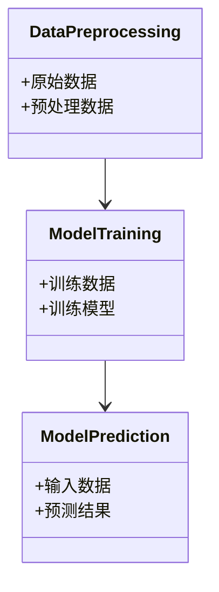
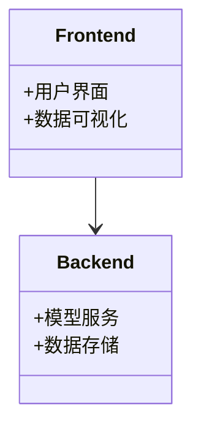
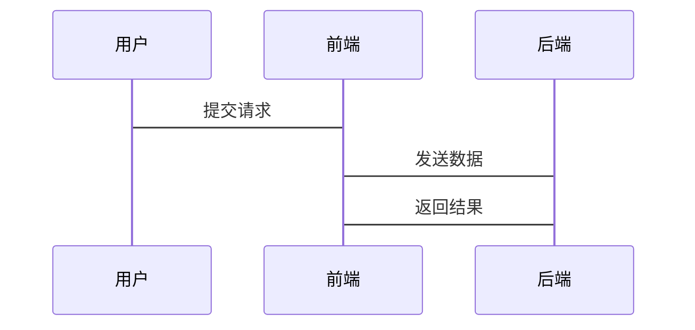

                 


# 深度学习在金融时间序列生成中的应用

> 关键词：深度学习，时间序列，金融，生成模型，神经网络

> 摘要：本文系统地探讨了深度学习在金融时间序列生成中的应用，从基础概念到高级算法，结合实际案例，详细分析了其在金融预测、风险管理和交易中的应用，揭示了深度学习在时间序列生成中的优势与挑战。

---

# 第1章: 深度学习与时间序列概述

## 1.1 深度学习的定义与特点

### 1.1.1 深度学习的定义

深度学习是一种基于人工神经网络的机器学习方法，通过多层非线性变换模拟人脑的神经网络，从数据中学习特征表示。与传统机器学习不同，深度学习能够自动提取数据特征，无需手动特征工程。

### 1.1.2 深度学习的核心特点

- **层次化特征提取**：通过多层网络提取数据的低级到高级特征。
- **非线性变换**：能够捕捉复杂的数据模式。
- **端到端学习**：从输入到输出直接训练模型。
- **大数据处理能力**：适合处理海量数据。

### 1.1.3 深度学习与传统机器学习的区别

| 特性 | 深度学习 | 传统机器学习 |
|------|----------|--------------|
| 特征工程 | 自动提取 | 手动设计     |
| 模型复杂度 | 高 | 低           |
| 数据量需求 | 大 | 中小         |
| 表现能力 | 强大 | 较弱         |

## 1.2 时间序列数据的特点

### 1.2.1 时间序列数据的定义

时间序列数据是按时间顺序排列的数据，通常以等间隔时间收集，如每天、每小时的股票价格。

### 1.2.2 时间序列数据的核心特征

- **时间依赖性**：数据点之间存在依赖关系。
- **趋势性**：数据可能呈现上升或下降趋势。
- **周期性**：数据可能有固定的周期性波动。
- **随机性**：数据中存在不可预测的随机成分。

### 1.2.3 时间序列数据的常见应用场景

- 股票价格预测
- 经济指标预测
- 市场波动分析

## 1.3 金融时间序列的特殊性

### 1.3.1 金融时间序列的核心特点

- **高波动性**：金融数据波动较大。
- **非平稳性**：数据均值和方差可能随时间变化。
- **异质性**：不同资产的行为差异显著。

### 1.3.2 金融时间序列的常见问题

- **过拟合**：模型在训练数据上表现好，但在测试数据上效果差。
- **数据稀疏性**：金融数据可能有限，难以训练复杂的模型。
- **黑箱问题**：金融市场的复杂性使得模型难以解释。

### 1.3.3 金融时间序列的应用场景

- 股票价格预测
- 金融风险评估
- 自动化交易策略

---

# 第2章: 深度学习在金融中的应用

## 2.1 金融领域的常见问题

### 2.1.1 金融预测的核心问题

- **预测准确性**：准确预测市场走势是核心挑战。
- **数据噪声**：金融市场数据通常包含大量噪声。
- **模型鲁棒性**：模型需要在不同市场条件下保持稳定。

### 2.1.2 金融风险的核心问题

- **波动性预测**：准确预测市场波动以管理风险。
- **尾部风险**：防范极端市场事件。
- **相关性变化**：资产之间相关性可能随时间变化。

### 2.1.3 金融交易的核心问题

- **交易时机**：确定最佳买卖时机。
- **策略有效性**：确保交易策略在不同市场条件下有效。
- **执行成本**：降低交易执行成本。

## 2.2 深度学习在金融中的优势

### 2.2.1 深度学习在金融预测中的优势

- **自动特征提取**：深度学习能够自动提取复杂特征。
- **非线性建模**：能够捕捉复杂的非线性关系。
- **处理高维数据**：适合处理多维金融数据。

### 2.2.2 深度学习在金融风险中的优势

- **实时监控**：能够实时监控市场风险。
- **异常检测**：识别潜在的市场异常。
- **情景分析**：生成多种市场情景进行风险评估。

### 2.2.3 深度学习在金融交易中的优势

- **自动化交易**：实现自动化的高频交易。
- **策略优化**：优化交易策略以提高收益。
- **个性化服务**：为不同客户定制个性化投资策略。

## 2.3 深度学习在金融时间序列生成中的应用

### 2.3.1 时间序列生成的核心问题

- **预测未来值**：基于历史数据预测未来的值。
- **模拟市场情景**：生成虚拟市场数据进行策略测试。
- **填补缺失值**：修复数据中的缺失值。

### 2.3.2 深度学习在时间序列生成中的优势

- **长序列建模**：能够处理长序列数据。
- **复杂模式捕捉**：能够捕捉复杂的时序模式。
- **多步预测**：可以进行多步的未来预测。

### 2.3.3 金融时间序列生成的典型应用

- **股票价格预测**：使用深度学习模型预测股票价格。
- **市场波动预测**：预测市场的波动性以管理风险。
- **交易信号生成**：生成交易信号以指导交易决策。

---

# 第3章: 时间序列生成的核心概念

## 3.1 时间序列生成的定义与分类

### 3.1.1 时间序列生成的定义

时间序列生成是根据历史数据生成未来数据的过程，通常用于预测和模拟。

### 3.1.2 时间序列生成的分类

- **基于统计的方法**：如ARIMA、GARCH。
- **基于机器学习的方法**：如支持向量回归、随机森林。
- **基于深度学习的方法**：如RNN、LSTM、Transformer。

### 3.1.3 时间序列生成的核心要素

- **模型选择**：选择合适的模型架构。
- **训练数据**：高质量的训练数据至关重要。
- **评估指标**：如均方误差、平均绝对误差。

## 3.2 时间序列生成的主要方法

### 3.2.1 基于统计的方法

- **ARIMA模型**：通过自回归和移动平均预测未来值。
- **GARCH模型**：用于预测波动性和风险。

### 3.2.2 基于机器学习的方法

- **支持向量回归**：用于回归预测。
- **随机森林**：用于非线性关系建模。

### 3.2.3 基于深度学习的方法

- **RNN**：适合处理序列数据。
- **LSTM**：解决长序列中的长-term依赖问题。
- **Transformer**：基于注意力机制，适合捕捉全局模式。

## 3.3 时间序列生成的核心挑战

### 3.3.1 时间依赖性

数据点之间存在依赖关系，模型需要捕捉这些依赖关系。

### 3.3.2 长期依赖问题

传统的RNN难以捕捉长期依赖关系，LSTM通过门控机制解决。

### 3.3.3 数据稀疏性

金融数据可能有限，模型可能过拟合。

---

# 第4章: 深度学习模型的核心原理

## 4.1 深度学习模型的基本原理

### 4.1.1 神经网络的基本结构

- **输入层**：接收输入数据。
- **隐藏层**：进行特征提取。
- **输出层**：生成预测结果。

### 4.1.2 深度学习模型的训练过程

- **正向传播**：输入数据通过网络生成预测值。
- **计算损失**：计算预测值与真实值的差异。
- **反向传播**：通过梯度下降优化权重。

### 4.1.3 深度学习模型的优化方法

- **随机梯度下降**：常用的优化算法。
- **批量归一化**：加速训练，提高模型稳定性。

## 4.2 常见深度学习模型的比较

### 4.2.1 RNN与LSTM的比较

| 特性 | RNN | LSTM |
|------|-----|------|
| 长期记忆 | 无 | 有   |
| 训练速度 | 较快 | 较慢 |
| 应用场景 | 简单序列 | 复杂序列 |

### 4.2.2 Transformer与LSTM的比较

| 特性 | Transformer | LSTM |
|------|------------|------|
| 注意力机制 | 有 | 无   |
| 并行计算 | 支持 | 部分支持 |
| 应用场景 | 复杂模式 | 长序列 |

### 4.2.3 其他模型的比较

- **GRU**：结合了RNN和LSTM的优势。
- **CNN**：适用于时间序列的局部特征提取。

---

# 第5章: 深度学习在金融时间序列生成中的算法原理

## 5.1 LSTM模型的数学公式

LSTM通过门控机制控制信息流动：

$$
f_t = \sigma(W_f x_t + U_f h_{t-1} + b_f)
$$

$$
i_t = \sigma(W_i x_t + U_i h_{t-1} + b_i)
$$

$$
o_t = \sigma(W_o x_t + U_o h_{t-1} + b_o)
$$

$$
h_t = f_t \cdot c_{t-1} + i_t \cdot tanh(W_c x_t + U_c h_{t-1} + b_c)
$$

$$
c_t = h_t
$$

其中，$f_t$、$i_t$、$o_t$分别是遗忘门、输入门和输出门，$h_t$是隐藏状态，$c_t$是细胞状态。

## 5.2 Transformer模型的数学公式

Transformer基于自注意力机制：

$$
\text{Attention}(Q, K, V) = \text{softmax}\left(\frac{QK^T}{\sqrt{d_k}}\right)V
$$

其中，$Q$是查询向量，$K$是键向量，$V$是值向量，$d_k$是维度。

---

# 第6章: 深度学习在金融时间序列生成中的系统架构

## 6.1 系统功能设计

### 6.1.1 领域模型



### 6.1.2 系统架构



### 6.1.3 系统交互



---

# 第7章: 深度学习在金融时间序列生成中的项目实战

## 7.1 环境安装

```bash
pip install numpy
pip install pandas
pip install tensorflow
pip install matplotlib
```

## 7.2 核心代码实现

### 7.2.1 数据预处理

```python
import numpy as np
import pandas as pd

# 加载数据
data = pd.read_csv('stock_price.csv')

# 标准化处理
from sklearn.preprocessing import StandardScaler
scaler = StandardScaler()
data_scaled = scaler.fit_transform(data)
```

### 7.2.2 模型构建

```python
from tensorflow.keras.models import Sequential
from tensorflow.keras.layers import LSTM, Dense

model = Sequential()
model.add(LSTM(50, input_shape=(timesteps, features)))
model.add(Dense(1))
model.compile(optimizer='adam', loss='mean_squared_error')
```

### 7.2.3 模型训练

```python
model.fit(X_train, y_train, epochs=100, batch_size=32, validation_split=0.2)
```

### 7.2.4 模型预测

```python
y_pred = model.predict(X_test)
```

## 7.3 案例分析

### 7.3.1 股票价格预测

```python
import matplotlib.pyplot as plt

plt.plot(y_test, label='真实值')
plt.plot(y_pred, label='预测值')
plt.legend()
plt.show()
```

### 7.3.2 模型评估

```python
from sklearn.metrics import mean_squared_error, mean_absolute_error

mse = mean_squared_error(y_test, y_pred)
mae = mean_absolute_error(y_test, y_pred)
print(f'MSE: {mse}, MAE: {mae}')
```

## 7.4 项目小结

- **模型选择**：LSTM适合时间序列预测。
- **数据预处理**：标准化处理数据。
- **模型调优**：调整超参数以提高性能。

---

# 第8章: 总结与展望

## 8.1 全文总结

深度学习在金融时间序列生成中展现了强大的能力，尤其在预测和模拟方面表现出色。通过合适的模型和数据预处理，可以显著提高预测准确性。

## 8.2 未来展望

- **多模态数据融合**：结合文本、图像等多模态数据。
- **强化学习应用**：将强化学习应用于交易策略。
- **可解释性提升**：提高模型的可解释性。

---

# 参考文献

- [1] LeCun Y, Bengio Y, Hinton G. Deep learning[M]. Nature, 2015.
- [2] Hochreiter S, Schmidhuber J. Long short-term memory[J]. Neural computation, 1997.
- [3] Vaswani A, et al. Attention is all you need[J]. arXiv preprint arXiv:1706.03798, 2017.

---

通过以上内容，我们系统地探讨了深度学习在金融时间序列生成中的应用，从理论到实践，为读者提供了全面的视角和实用的知识。

