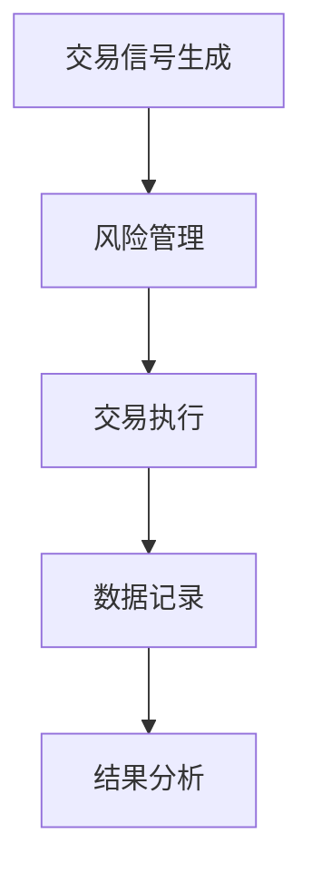

                 

# 深度学习在高频交易策略中的实践

> 关键词：深度学习、高频交易、LSTM、RNN、机器学习、金融建模

> 摘要：本文将详细探讨深度学习在高频交易策略中的应用。从高频交易的背景与特点出发，深入分析深度学习的核心算法及其在高频交易中的优势，结合实际案例，详细讲解深度学习算法的数学模型、系统架构设计、项目实现及风险控制策略。文章最后将总结高频交易中的最佳实践和未来研究方向。

---

# 第一部分: 高频交易与深度学习概述

## 第1章: 高频交易的背景与特点

### 1.1 高频交易的定义与特点

高频交易（High-Frequency Trading, HFT）是一种通过计算机算法在极短时间内进行大量交易的策略。其主要特点包括：

- **高频性**：交易决策在毫秒级甚至微秒级内完成。
- **自动化**：依赖计算机算法自动执行交易。
- **低延迟**：对交易系统的响应速度要求极高。
- **大数据驱动**：依赖大量的市场数据和高频特征进行决策。

### 1.2 高频交易的市场结构

高频交易依赖于复杂的市场结构，包括：

- **电子交易平台**：如纳斯达克、纽约证券交易所等。
- **做市商**：通过算法提供流动性。
- **高频交易商**：通过算法寻找市场机会。

### 1.3 深度学习在高频交易中的优势

深度学习在处理复杂非线性关系、捕捉时间序列特征方面具有显著优势，特别是在高频交易中：

- **非线性特征捕捉**：深度学习能够发现传统统计方法难以捕捉的复杂模式。
- **自动特征提取**：深度学习模型可以自动从原始数据中提取特征，减少人工特征工程的工作量。
- **实时性**：通过优化模型结构，深度学习可以在极短时间内完成交易决策。

---

## 第2章: 深度学习的基本概念

### 2.1 深度学习的定义

深度学习是一种基于人工神经网络的机器学习方法，通过多层非线性变换模拟人类大脑的学习过程。其核心在于通过多层次的特征提取，自动发现数据中的深层规律。

### 2.2 深度学习与传统机器学习的区别

| 对比维度 | 传统机器学习 | 深度学习 |
|----------|--------------|----------|
| 数据量    | 小            | 大        |
| 特征工程  | 需要手动提取   | 自动提取  |
| 模型复杂度 | 较低          | 较高      |
| 计算资源  | 较低          | 较高      |

### 2.3 深度学习的核心算法

- **RNN（循环神经网络）**：适用于时间序列数据，如股票价格预测。
- **LSTM（长短期记忆网络）**：优化的RNN，能够更好地捕捉长期依赖关系。
- **CNN（卷积神经网络）**：适用于图像和局部特征提取，也可用于金融市场数据的特征提取。

---

# 第二部分: 深度学习在高频交易中的核心概念

## 第3章: 高频交易中的数据特征

### 3.1 市场数据特征分析

高频交易依赖于高频市场数据，包括：

- **OHLCV数据**：开盘价、最高价、最低价、收盘价、成交量。
- **订单簿数据**：买价、卖价、买卖深度。
- **高频指标**：如移动平均线、相对强弱指数（RSI）等。

### 3.2 交易数据特征分析

交易数据特征包括：

- **交易频率**：每秒交易次数。
- **成交金额**：每笔交易的金额。
- **市场情绪**：通过高频数据捕捉市场的买卖情绪。

### 3.3 数据特征的提取与处理

- **标准化**：对数据进行归一化处理，消除量纲影响。
- **滑动窗口**：提取滑动窗口内的统计特征，如均值、标准差、最大值等。
- **降维**：使用主成分分析（PCA）等方法降低数据维度。

---

## 第4章: 深度学习算法在高频交易中的应用

### 4.1 RNN在时间序列预测中的应用

RNN适用于时间序列数据，但在处理长序列时存在梯度消失问题。其结构如下：

### 4.2 LSTM在高频交易中的优势

LSTM通过引入记忆单元和遗忘门，解决了RNN的梯度消失问题。其结构如下：

### 4.3 CNN在市场数据处理中的应用

CNN通过卷积操作提取局部特征，适用于高频数据的模式识别。其结构如下：

---

## 第5章: 高频交易中的风险控制

### 5.1 风险控制的定义与重要性

风险控制是指通过策略和工具降低交易中的潜在损失。在高频交易中，风险控制尤为重要，因为高频交易的高杠杆和高交易频率可能带来更大的风险。

### 5.2 深度学习在风险控制中的应用

深度学习可以通过分析历史数据，识别潜在风险因素，如市场崩盘、流动性风险等。

### 5.3 常见风险控制策略

- **头寸限制**：限制每笔交易的最大仓位。
- **止损策略**：设定止损点，避免损失扩大。
- **风险对冲**：通过做空其他资产对冲风险。

---

# 第三部分: 深度学习算法原理与数学模型

## 第6章: 深度学习算法原理

### 6.1 RNN算法原理

#### 6.1.1 RNN的基本结构

RNN的前向传播公式为：

$$
h_t = \sigma(W_{hh}h_{t-1} + W_{xh}x_t + b_h)
$$

其中，$h_t$是当前时刻的隐藏状态，$x_t$是输入，$W_{hh}$和$W_{xh}$是权重矩阵，$b_h$是偏置项，$\sigma$是激活函数。

#### 6.1.2 RNN的前向传播与反向传播

反向传播公式为：

$$
\frac{\partial L}{\partial W_{hh}} = \frac{\partial L}{\partial h_t} \cdot \frac{\partial h_t}{\partial W_{hh}}
$$

---

## 第7章: 数学模型与公式

### 7.1 RNN的数学模型

#### 7.1.1 RNN的前向传播公式

$$
h_t = \sigma(W_{hh}h_{t-1} + W_{xh}x_t + b_h)
$$

#### 7.1.2 RNN的损失函数

$$
L = -\frac{1}{N}\sum_{i=1}^{N} [y_i \log p_i + (1 - y_i)\log (1 - p_i)]
$$

其中，$y_i$是真实标签，$p_i$是模型预测概率。

---

## 第8章: 系统接口设计与交互

### 8.1 系统接口的定义

系统接口包括：

- **数据接口**：获取市场数据。
- **交易接口**：执行交易指令。
- **风险控制接口**：实时监控风险。

### 8.2 系统交互的流程图

---

## 第9章: 项目实战与案例分析

### 9.1 环境配置与数据获取

- **环境配置**：安装Python、TensorFlow、Keras等工具。
- **数据获取**：通过API获取高频市场数据。

### 9.2 特征工程与数据处理

- **特征提取**：提取OHLCV数据、订单簿数据等。
- **数据预处理**：标准化、滑动窗口处理。

### 9.3 模型训练与优化

- **模型选择**：选择LSTM进行时间序列预测。
- **模型训练**：使用历史数据训练模型。
- **模型优化**：调整超参数，如学习率、批量大小等。

### 9.4 模型的回测与评估

- **回测**：在历史数据上验证模型性能。
- **评估指标**：准确率、收益率、最大回撤等。

---

## 第10章: 总结与展望

### 10.1 总结

深度学习在高频交易中的应用具有显著优势，特别是在时间序列预测和风险控制方面。通过深度学习，可以显著提高交易策略的效率和准确性。

### 10.2 展望

未来，随着计算能力的提升和数据量的增加，深度学习在高频交易中的应用将更加广泛。同时，如何优化模型的实时性和可解释性是未来研究的重要方向。

---

# 结语

深度学习为高频交易策略的优化提供了新的思路和方法。通过本文的分析，读者可以深入了解深度学习在高频交易中的应用，掌握从数据特征提取到模型训练的完整流程，并为实际应用提供参考。

