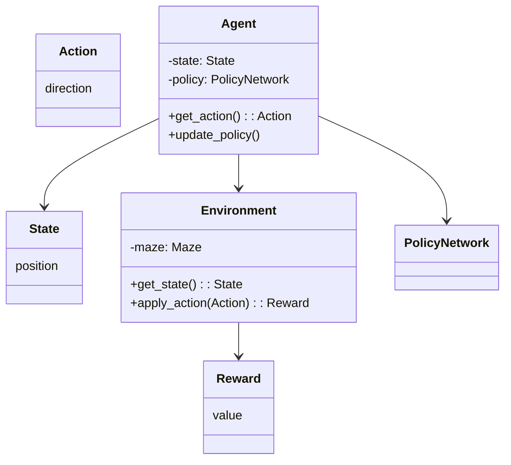

                 


# 深度强化学习在AI Agent控制中的应用

---

## 关键词：
深度强化学习、AI Agent、强化学习、神经网络、马尔可夫决策过程、Q-learning、DQN

---

## 摘要：
本文深入探讨了深度强化学习在AI Agent控制中的应用，从基本概念到核心算法，再到实际项目实战，系统性地分析了深度强化学习的原理、算法实现及其在AI Agent中的应用。文章首先介绍了深度强化学习和AI Agent的基本概念，随后详细讲解了深度强化学习的核心概念与数学基础，接着分析了DQN和策略梯度等算法的原理，并通过Mermaid图展示了系统设计与架构。最后，通过具体项目实战，结合代码实现和案例分析，总结了深度强化学习在AI Agent控制中的最佳实践。

---

# 第一部分：深度强化学习与AI Agent控制概述

## 第1章：深度强化学习与AI Agent概述

### 1.1 深度强化学习的基本概念

#### 1.1.1 强化学习的定义与特点
强化学习（Reinforcement Learning, RL）是一种机器学习范式，通过智能体与环境的交互，智能体通过执行动作并获得奖励或惩罚来学习最优策略。其核心特点包括：
- **自主性**：智能体在没有外部监督的情况下自主决策。
- **试错性**：通过不断尝试和错误来优化策略。
- **延迟反馈**：奖励通常不是即时的，而是延迟的。

#### 1.1.2 深度强化学习的引入
随着计算能力的提升和深度学习的发展，深度强化学习（Deep Reinforcement Learning）应运而生。它通过神经网络来逼近策略或值函数，解决了传统强化学习在处理高维、复杂状态空间时的局限性。

#### 1.1.3 AI Agent的基本概念
AI Agent是一种智能实体，能够感知环境并采取行动以实现目标。AI Agent可以是软件程序（如游戏AI）或物理实体（如自动驾驶汽车）。AI Agent的核心能力包括感知、决策和行动。

### 1.2 深度强化学习与AI Agent的结合
深度强化学习为AI Agent提供了强大的决策能力。通过深度神经网络，AI Agent能够处理复杂的环境信息，学习最优策略，并在动态环境中自适应调整。

---

## 第2章：深度强化学习的数学基础

### 2.1 马尔可夫决策过程（MDP）

#### 2.1.1 状态空间与动作空间
- **状态空间（S）**：环境的所有可能状态集合。
- **动作空间（A）**：智能体在每个状态下可以执行的所有动作集合。

#### 2.1.2 奖励函数与价值函数
- **奖励函数（R）**：定义智能体执行动作后获得的奖励。
- **价值函数（V）**：衡量一个状态的期望奖励。

### 2.2 Q-learning算法

#### 2.2.1 Q-learning的基本原理
Q-learning通过学习动作-状态值函数（Q(s, a)）来逼近最优策略。其更新规则为：
$$ Q(s, a) = Q(s, a) + \alpha [r + \gamma \max Q(s', a) - Q(s, a)] $$
其中，α为学习率，γ为折扣因子。

---

## 第3章：深度强化学习的核心概念与联系

### 3.1 深度强化学习的策略与值函数

#### 3.1.1 策略函数（Policy）
策略函数定义了智能体在给定状态下选择动作的概率分布：
$$ \pi(a|s) = P(\text{选择动作 }a \text{ 在状态 }s) $$

#### 3.1.2 值函数（Value Function）
值函数衡量了策略在状态s下的期望奖励：
$$ V(s) = E[R | s, \pi] $$

### 3.2 神经网络在深度强化学习中的应用

#### 3.2.1 神经网络在策略与值函数中的应用
神经网络用于逼近策略或值函数，常见网络结构包括卷积神经网络（CNN）和长短期记忆网络（LSTM）。

---

# 第二部分：深度强化学习算法原理

## 第4章：深度强化学习算法的核心原理

### 4.1 DQN算法

#### 4.1.1 DQN算法流程
DQN通过经验回放和目标网络来稳定训练：
1. 环境交互，收集经验。
2. 从经验池中采样，训练神经网络。
3. 更新目标网络。

#### 4.1.2 DQN算法的数学模型
目标网络更新：
$$ \theta' = \theta + \epsilon \cdot \nabla_\theta \mathcal{L} $$

### 4.2 策略梯度方法

#### 4.2.1 策略梯度的基本原理
通过梯度上升法优化策略，公式为：
$$ \nabla_\theta J(\theta) = \nabla_\theta E[R] $$

---

## 第5章：系统分析与架构设计

### 5.1 项目介绍与系统功能设计

#### 5.1.1 项目介绍
设计一个AI Agent，用于在迷宫环境中导航，目标是找到出口。

#### 5.1.2 系统功能设计
- 状态感知：接收迷宫状态。
- 动作选择：输出移动方向。
- 奖励机制：定义奖励函数。

#### 5.1.3 领域模型（Mermaid类图）


### 5.2 系统架构设计

#### 5.2.1 系统架构（Mermaid架构图）


---

## 第6章：项目实战与代码实现

### 6.1 环境安装与配置

#### 6.1.1 安装依赖
```bash
pip install gym tensorflow matplotlib
```

#### 6.1.2 环境配置
```python
import gym
env = gym.make('CartPole-v0')
```

### 6.2 核心代码实现

#### 6.2.1 DQN网络实现
```python
import tensorflow as tf
import numpy as np

class DQN:
    def __init__(self, state_dim, action_dim, learning_rate):
        self.state_dim = state_dim
        self.action_dim = action_dim
        self.learning_rate = learning_rate
        self.mainQN = self.build_network()
        self.targetQN = self.build_network()

    def build_network(self):
        model = tf.keras.Sequential([
            tf.keras.layers.Dense(24, activation='relu', input_dim=self.state_dim),
            tf.keras.layers.Dense(24, activation='relu'),
            tf.keras.layers.Dense(self.action_dim, activation='linear')
        ])
        model.compile(optimizer=tf.keras.optimizers.Adam(self.learning_rate), loss='mse')
        return model

    def update_target(self):
        self.targetQN.set_weights(self.mainQN.get_weights())
```

---

## 第7章：最佳实践与总结

### 7.1 实践总结
- 深度强化学习在复杂环境中表现优异。
- 经验回放和目标网络是关键优化技术。

### 7.2 注意事项
- 选择合适的算法和网络结构。
- 调参时注意学习率和折扣因子。

### 7.3 拓展阅读
推荐学习DQN、策略梯度等算法的论文和实现。

---

通过本文的系统讲解，读者可以全面理解深度强化学习在AI Agent控制中的应用，并能够将其应用到实际项目中。

