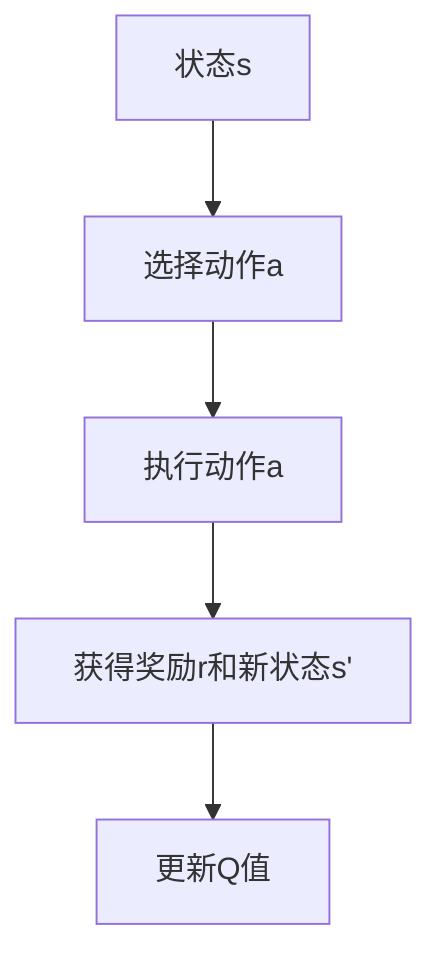
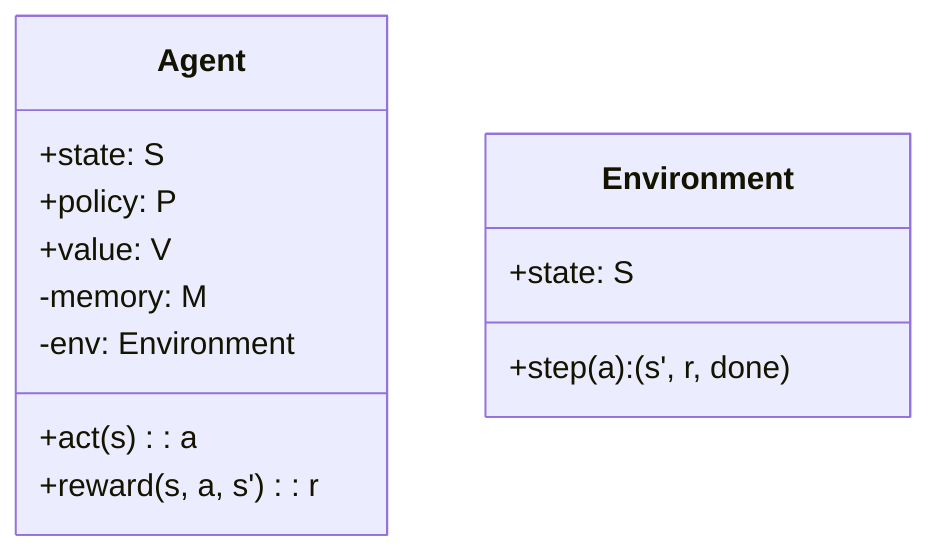

                 


# 深度强化学习在AI Agent策略优化中的应用

> **关键词**：深度强化学习，AI Agent，策略优化，DQN，PPO，算法实现，系统架构

> **摘要**：本文深入探讨了深度强化学习在AI Agent策略优化中的应用，从基本概念到核心算法，再到系统设计和项目实战，全面分析了深度强化学习在策略优化中的优势和实现细节。通过详细讲解DQN、PPO等算法，结合实际案例，展示了如何在复杂环境中优化AI Agent的策略，为实际应用提供了理论支持和实践指导。

---

## 第1章 深度强化学习与AI Agent背景介绍

### 1.1 深度强化学习的基本概念

#### 1.1.1 强化学习的定义与特点
强化学习（Reinforcement Learning, RL）是一种机器学习范式，通过智能体与环境的交互，学习如何做出决策以最大化累计奖励。其特点包括：
- **试错性**：通过与环境交互，逐步探索最优策略。
- **延迟反馈**：奖励信号通常延迟提供，智能体需要长期记忆。
- **复杂性**：适用于高维、非线性问题。

#### 1.1.2 AI Agent的定义与分类
AI Agent是能够感知环境并采取行动以实现目标的智能体。分类如下：
- **反应式Agent**：基于当前感知做出反应。
- **认知式Agent**：具备推理和规划能力。
- **学习型Agent**：通过学习提升性能。

#### 1.1.3 深度强化学习在策略优化中的优势
深度强化学习结合了深度学习的特征提取能力和强化学习的决策优化能力，适用于复杂环境下的策略优化。

### 1.2 AI Agent的策略优化需求
#### 1.2.1 策略优化的基本概念
策略（Policy）是智能体在给定状态下的动作选择概率分布。策略优化的目标是找到最优策略，使期望奖励最大化。

#### 1.2.2 策略优化的核心问题
- **探索与利用**：平衡探索新状态和利用已知策略。
- **无限状态空间**：深度强化学习通过神经网络近似处理高维状态。
- **非平稳环境**：策略需动态适应环境变化。

---

## 第2章 深度强化学习的数学基础

### 2.1 状态空间与动作空间
#### 2.1.1 状态空间
- **定义**：智能体所处环境的所有可能状态的集合。
- **特征**：高维、连续或离散。

#### 2.1.2 动作空间
- **定义**：智能体在每个状态下可执行的动作集合。
- **特征**：动作空间的大小影响策略复杂度。

### 2.2 深度强化学习的数学模型
#### 2.2.1 Q-learning模型
$$ Q(s,a) = r + \gamma \max_{a'} Q(s',a') $$
- **解释**：Q值表示状态-动作对的期望奖励。

#### 2.2.2 DQN模型
$$ Q(s,a) = \theta \cdot \phi(s,a) $$
- **解释**：神经网络参数θ近似Q函数。

### 2.3 核心算法原理
#### 2.3.1 DQN算法流程图


---

## 第3章 深度强化学习的策略优化算法

### 3.1 DQN算法
#### 3.1.1 DQN结构
- **经验回放**：存储历史经验，减少样本依赖。
- **目标网络**：稳定Q值更新。

#### 3.1.2 DQN优缺点
- **优点**：稳定，适合离线学习。
- **缺点**：收敛速度慢，需要大量数据。

### 3.2 PPO算法
#### 3.2.1 PPO基本思想
- **策略梯度**：通过梯度上升优化策略。
- **截断策略**：限制策略更新幅度。

#### 3.2.2 PPO数学模型
$$ L(\theta) = \sum_{t} \min\left(r_t \theta_t, \clip{\theta_t}{1-\epsilon}{1+\epsilon}\right) $$

### 3.3 A2C算法
#### 3.3.1 A2C原理
- **异步更新**：多线程更新策略，提升效率。
- **优势估计**：平衡价值函数和策略梯度。

---

## 第4章 AI Agent的系统架构设计

### 4.1 系统功能设计
- **领域模型**：定义智能体与环境的交互界面。
- **架构设计**：分层架构，包括感知层、决策层和执行层。

#### 4.1.1 领域模型类图


---

## 第5章 深度强化学习在AI Agent中的项目实战

### 5.1 环境搭建
- **工具选择**：使用OpenAI Gym框架。
- **训练环境**：设置虚拟环境，安装依赖。

### 5.2 核心代码实现
#### DQN实现示例
```python
import gym
import numpy as np
import torch
import torch.nn as nn

class DQN(nn.Module):
    def __init__(self, state_dim, action_dim, hidden_dim=64):
        super(DQN, self).__init__()
        self.fc1 = nn.Linear(state_dim, hidden_dim)
        self.fc2 = nn.Linear(hidden_dim, action_dim)

    def forward(self, x):
        x = torch.relu(self.fc1(x))
        x = self.fc2(x)
        return x

# 初始化环境和模型
env = gym.make('CartPole-v0')
state_dim = env.observation_space.shape[0]
action_dim = env.action_space.n
model = DQN(state_dim, action_dim)

# 训练过程
optimizer = torch.optim.Adam(model.parameters(), lr=0.001)
memory = []
max_episodes = 1000
gamma = 0.99

for episode in range(max_episodes):
    state = env.reset()
    while True:
        # 策略选择动作
        with torch.no_grad():
            q_values = model(torch.FloatTensor(state))
            action = np.argmax(q_values.numpy())
        # 执行动作
        next_state, reward, done, _ = env.step(action)
        # 存储经验
        memory.append((state, action, reward, next_state, done))
        # 回放训练
        if len(memory) > 100:
            batch = np.random.choice(len(memory), 64)
            states = torch.FloatTensor([m[0] for m in batch])
            actions = torch.LongTensor([m[1] for m in batch])
            rewards = torch.FloatTensor([m[2] for m in batch])
            next_states = torch.FloatTensor([m[3] for m in batch])
            dones = torch.FloatTensor([m[4] for m in batch])
            # 计算目标Q值
            current_q = model(states).gather(1, actions.unsqueeze(1))
            next_q = model(next_states).max(1)[0].detach()
            target = rewards + gamma * next_q * (1 - dones)
            # 损失计算与优化
            loss = torch.nn.MSELoss()(current_q.squeeze(), target)
            optimizer.zero_grad()
            loss.backward()
            optimizer.step()
        # 结束条件
        if done:
            break
```

### 5.3 实际案例分析
- **案例背景**：在CartPole环境中训练智能体保持平衡。
- **训练过程**：通过经验回放和Q值更新，智能体逐步掌握平衡策略。
- **结果分析**：DQN在训练后期表现出稳定的策略执行能力。

### 5.4 总结
- **代码实现**：展示了DQN算法的核心步骤。
- **实际应用**：证明了深度强化学习在策略优化中的有效性。

---

## 第6章 结论与展望

### 6.1 结论
深度强化学习为AI Agent的策略优化提供了强大的工具，通过神经网络近似和经验回放等技术，有效解决了复杂环境下的决策问题。

### 6.2 未来展望
- **算法改进**：研究更高效的策略优化方法，如结合转移学习和元学习。
- **应用场景扩展**：探索在更多领域（如自动驾驶、游戏AI）中的应用。

---

## 参考文献

- Mnih, V., et al. "Human-level control through deep reinforcement learning." Nature, 2015.
- Schulmann, T., et al. "Proximal Policy Optimization: A Simple and Effective-policy Gradient Method." arXiv, 2017.

---

通过本文的详细分析，读者可以全面理解深度强化学习在AI Agent策略优化中的应用，从理论到实践，为后续的研究和应用提供了坚实的基础。

