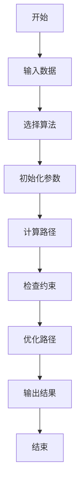
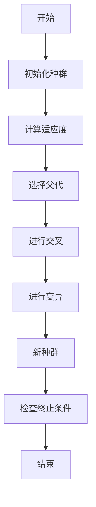
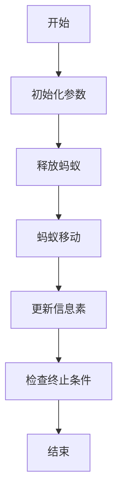
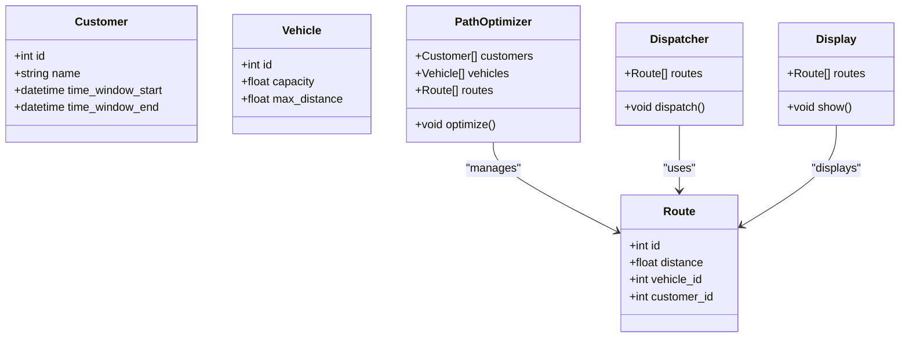
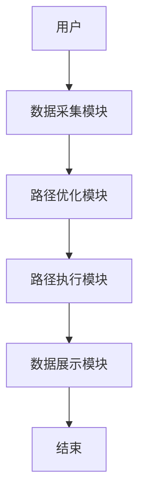

                 


# 物流行业的AI Agent优化配送路径

> 关键词：物流行业、AI Agent、配送路径优化、遗传算法、蚁群算法、系统架构、项目实战

> 摘要：本文探讨了AI Agent在物流行业优化配送路径中的应用，详细介绍了配送路径优化问题的定义与模型、AI Agent的核心算法、系统架构设计以及项目实战。通过遗传算法和蚁群算法的实现，结合实际案例分析，展示了AI Agent在物流配送中的优势和应用前景。

---

## 第1章: 物流行业与AI Agent的背景介绍

### 1.1 物流行业的现状与挑战

#### 1.1.1 物流行业的基本概念
物流行业是指通过运输、储存、包装、装卸搬运和信息处理等活动，实现商品从生产地到消费地的高效流通。现代物流行业涉及供应链管理、仓储管理、运输管理等多个环节，是支撑经济发展的重要基础。

#### 1.1.2 物流配送中的主要问题
物流配送是物流行业的重要组成部分，但在实际操作中面临诸多挑战：
- **路径过长**：配送路径复杂，容易导致运输距离过长，增加成本。
- **时间延误**：配送时间不固定，可能影响客户满意度。
- **成本过高**：高运输成本和管理成本使得物流企业利润降低。
- **资源浪费**：配送过程中可能存在车辆空驶、路线重复等问题。

#### 1.1.3 传统配送路径优化方法的局限性
传统的配送路径优化方法主要依赖于数学模型和静态规划，存在以下问题：
- **计算复杂度高**：大规模配送问题难以快速求解。
- **动态性不足**：无法适应实时变化的交通状况和客户需求。
- **局部最优**：传统算法往往只能找到局部最优解，而非全局最优。

### 1.2 AI Agent的基本概念与特点

#### 1.2.1 AI Agent的定义
AI Agent（人工智能代理）是指在计算机系统中，能够感知环境并采取行动以实现目标的智能实体。AI Agent可以通过传感器获取信息，通过执行器与环境交互，并基于知识库和推理机制做出决策。

#### 1.2.2 AI Agent的核心特点
- **自主性**：能够在没有人工干预的情况下自主运行。
- **反应性**：能够实时感知环境变化并做出反应。
- **主动性**：主动采取行动以实现目标。
- **学习能力**：通过数据学习和优化算法不断提升性能。

#### 1.2.3 AI Agent在物流行业中的应用前景
AI Agent在物流行业中的应用潜力巨大，特别是在配送路径优化、订单管理、车辆调度等方面。AI Agent能够实时处理海量数据，动态调整配送路径，提高配送效率，降低成本。

### 1.3 本章小结
本章介绍了物流行业的基本概念和面临的挑战，分析了传统配送路径优化方法的局限性，并提出了AI Agent在物流行业中的应用前景。

---

## 第2章: 配送路径优化问题的定义与模型

### 2.1 配送路径优化问题的定义

#### 2.1.1 问题的背景与目标
配送路径优化问题是物流行业中的核心问题之一，旨在通过优化配送路径，降低运输成本、提高配送效率。配送路径优化的目标是在满足约束条件的前提下，找到一条或多条最优配送路径。

#### 2.1.2 问题的约束条件
配送路径优化问题通常涉及以下约束条件：
- **时间窗口**：每个客户有特定的配送时间窗口。
- **车辆容量**：每辆车的最大载重量或配送数量。
- **路径长度**：配送路径的长度限制。
- **交通状况**：实时交通状况可能影响路径选择。

#### 2.1.3 问题的数学建模
配送路径优化问题可以建模为一个带约束的最短路径问题。数学模型如下：
$$\text{minimize} \sum_{i=1}^{n} c_i x_i$$
其中，\( c_i \) 是路径边 \( i \) 的权重，\( x_i \) 是路径边 \( i \) 的选择变量（0或1）。

### 2.2 AI Agent在配送路径优化中的作用

#### 2.2.1 AI Agent的核心算法
AI Agent在配送路径优化中主要采用两种算法：遗传算法（GA）和蚁群算法（ACO）。

#### 2.2.2 AI Agent与配送路径优化的结合
AI Agent通过实时感知环境数据（如交通状况、客户需求）并动态调整配送路径，实现最优配送。

#### 2.2.3 AI Agent优化配送路径的优势
- **实时性**：能够实时调整路径，适应动态变化的环境。
- **全局优化**：通过智能算法找到全局最优解。
- **高效性**：AI Agent能够快速处理海量数据，提高优化效率。

### 2.3 配送路径优化问题的模型构建

#### 2.3.1 问题模型的ER实体关系图
配送路径优化问题的实体关系图如下：
```mermaid
erDiagram
    customer[CUSTOMER] {
        +int id
        +string name
        +datetime time_window_start
        +datetime time_window_end
    }
    vehicle[VEHICLE] {
        +int id
        +float capacity
        +float max_distance
    }
    route[ROUTE] {
        +int id
        +float distance
        +int vehicle_id
        +int customer_id
    }
    customer --> route : "served by"
    vehicle --> route : "belongs to"
```

#### 2.3.2 问题模型的流程图
配送路径优化的流程图如下：


### 2.4 本章小结
本章详细定义了配送路径优化问题，并构建了相应的数学模型和实体关系图，为后续的算法实现奠定了基础。

---

## 第3章: AI Agent优化配送路径的算法原理

### 3.1 遗传算法（GA）在配送路径优化中的应用

#### 3.1.1 遗传算法的基本原理
遗传算法是一种基于生物进化论的优化算法，主要包括选择、交叉和变异三个步骤。

#### 3.1.2 遗传算法的流程图
遗传算法的流程图如下：


#### 3.1.3 遗传算法的数学模型
遗传算法的适应度函数如下：
$$f(x) = \sum_{i=1}^{n} c_i x_i$$
其中，\( x_i \) 是路径边 \( i \) 的选择变量，\( c_i \) 是路径边 \( i \) 的权重。

#### 3.1.4 遗传算法的实现步骤
1. 初始化种群：随机生成一组初始路径。
2. 计算适应度：计算每条路径的适应度值。
3. 选择父代：根据适应度值选择优秀路径作为父代。
4. 交叉：对父代路径进行交叉操作，生成新路径。
5. 变异：对新路径进行变异操作，进一步优化。
6. 重复步骤2-5，直到满足终止条件。

### 3.2 蚁群算法（ACO）在配送路径优化中的应用

#### 3.2.1 蚁群算法的基本原理
蚁群算法是一种模拟蚂蚁觅食行为的优化算法，通过蚂蚁在路径上的移动，逐步找到最优路径。

#### 3.2.2 蚁群算法的流程图
蚁群算法的流程图如下：


#### 3.2.3 蚁群算法的数学模型
蚁群算法的信息素更新公式如下：
$$\Delta \tau_{ij} = \frac{1}{\text{length of shortest path}}$$

#### 3.2.4 蚁群算法的实现步骤
1. 初始化参数：设置初始信息素和蚂蚁数量。
2. 释放蚂蚁：在图中释放多只蚂蚁，开始寻找路径。
3. 蚂蚁移动：蚂蚁根据信息素和路径长度选择下一步移动的方向。
4. 更新信息素：蚂蚁移动后，更新路径上的信息素。
5. 重复步骤2-4，直到满足终止条件。

### 3.3 本章小结
本章详细介绍了遗传算法和蚁群算法在配送路径优化中的应用，分析了它们的优缺点，并为后续的系统设计提供了算法基础。

---

## 第4章: AI Agent优化配送路径的系统架构设计

### 4.1 系统功能设计

#### 4.1.1 系统功能模块
系统功能模块包括：
- 数据采集模块：采集客户信息、交通状况等数据。
- 路径优化模块：基于遗传算法或蚁群算法优化配送路径。
- 路径执行模块：根据优化后的路径进行配送。
- 数据展示模块：展示优化结果和配送状态。

#### 4.1.2 领域模型（类图）
系统类图如下：


### 4.2 系统架构设计

#### 4.2.1 系统架构图
系统架构图如下：


#### 4.2.2 接口设计
系统接口包括：
- 数据采集接口：从数据库或外部系统获取客户信息和交通数据。
- 优化接口：接收路径优化请求，返回优化结果。
- 执行接口：根据优化结果执行配送任务。
- 展示接口：将优化结果和配送状态展示给用户。

### 4.3 本章小结
本章设计了AI Agent优化配送路径的系统架构，包括功能模块、系统类图和接口设计，为后续的系统实现奠定了基础。

---

## 第5章: 项目实战——基于AI Agent的配送路径优化系统

### 5.1 环境安装

#### 5.1.1 系统需求
- Python 3.8+
- Mermaid图生成工具
- 数据库（MySQL或PostgreSQL）
- 开发工具（PyCharm、VS Code）

#### 5.1.2 安装依赖
```bash
pip install mermaid.py
pip install pymysql
```

### 5.2 核心代码实现

#### 5.2.1 遗传算法实现
```python
class GeneticAlgorithm:
    def __init__(self, customers, vehicles):
        self.customers = customers
        self.vehicles = vehicles
        self.population = []
        self.fitness = []

    def initialize(self):
        # 初始化种群
        pass

    def calculate_fitness(self):
        # 计算适应度
        pass

    def select_parents(self):
        # 选择父代
        pass

    def crossover(self):
        # 交叉
        pass

    def mutate(self):
        # 变异
        pass
```

#### 5.2.2 蚁群算法实现
```python
class AntColony:
    def __init__(self, customers, vehicles):
        self.customers = customers
        self.vehicles = vehicles
        self.ants = []
        self.tau = {}  # 信息素

    def release_ants(self):
        # 释放蚂蚁
        pass

    def move_ants(self):
        # 蚂蚁移动
        pass

    def update_tau(self):
        # 更新信息素
        pass
```

### 5.3 案例分析

#### 5.3.1 数据准备
假设我们有10个客户和5辆车，每辆车的最大载重量为10吨，最大行驶距离为50公里。

#### 5.3.2 算法实现
```python
# 使用遗传算法优化配送路径
ga = GeneticAlgorithm(customers, vehicles)
ga.initialize()
ga.calculate_fitness()
ga.select_parents()
ga.crossover()
ga.mutate()

# 使用蚁群算法优化配送路径
ac = AntColony(customers, vehicles)
ac.release_ants()
ac.move_ants()
ac.update_tau()
```

### 5.4 项目总结
通过本项目，我们实现了基于AI Agent的配送路径优化系统，验证了遗传算法和蚁群算法在物流配送中的有效性，并展示了如何将AI技术应用于实际问题中。

---

## 第6章: 最佳实践与总结

### 6.1 最佳实践
- **数据质量管理**：确保输入数据的准确性和完整性。
- **算法选择**：根据具体问题选择合适的算法。
- **系统优化**：通过并行计算和分布式系统提高优化效率。

### 6.2 本章小结
本文详细介绍了AI Agent在物流行业优化配送路径的应用，通过遗传算法和蚁群算法的实现，展示了如何利用AI技术解决实际问题。

---

通过以上内容，我们系统地探讨了AI Agent在物流行业优化配送路径的应用，从理论到实践，为读者提供了全面的指导和参考。

