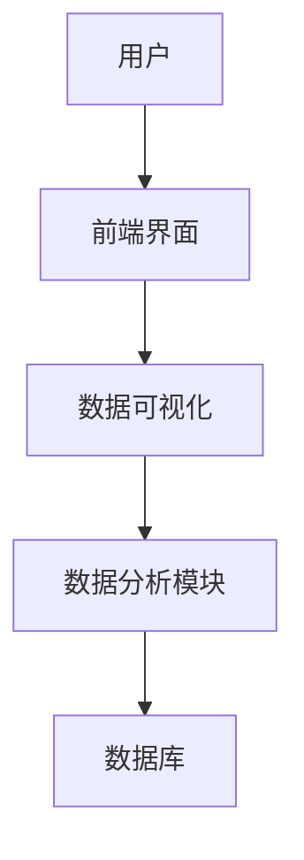

                 

# 特价股票与公司人力资本质量的关联分析

## 关键词
特价股票, 公司人力资本, 股票定价, 人力资本质量, 关联分析

## 摘要
本文旨在探讨特价股票与公司人力资本质量之间的关联性。通过对人力资本质量的定义、评价指标以及其对股价的影响进行系统分析，结合实证数据和统计方法，揭示特价股票与公司人力资本质量之间的动态关系。文章从理论基础、数据处理、分析方法到实证结果，层层深入，为投资者和企业管理者提供有价值的参考。

---

## 第1章: 特价股票与公司人力资本质量的关联性概述

### 1.1 特价股票的基本概念

#### 1.1.1 特价股票的定义与特征
特价股票通常指价格低于市场平均水平的股票，具有以下特征：
- **低估值**：市盈率、市净率等估值指标低于行业平均水平。
- **高波动性**：价格波动较大，容易受市场情绪影响。
- **投资机会**：可能蕴含较高的投资回报潜力。

#### 1.1.2 特价股票的分类与市场表现
特价股票可分为以下几类：
- **周期性股票**：受经济周期影响较大的行业股票。
- **成长型股票**：未来增长潜力大但当前估值较低。
- **价值型股票**：市场价格低于内在价值。

#### 1.1.3 特价股票与市场周期的关系
市场周期波动直接影响特价股票的表现：
- **牛市**：高价股表现优于低价股。
- **熊市**：低价股可能因估值修复而上涨。

### 1.2 公司人力资本质量的核心概念

#### 1.2.1 人力资本的定义与内涵
人力资本是指员工的知识、技能和经验对企业发展价值的总和。

#### 1.2.2 公司人力资本质量的评价指标
常见的评价指标包括：
- **员工满意度**：反映员工对公司的认可程度。
- **员工留存率**：员工流失率的反向指标。
- **员工绩效**：员工的工作成果和效率。

#### 1.2.3 人力资本与公司绩效的关系
人力资本质量直接影响公司绩效，具体表现为：
- 高质量人力资本能够提升公司创新能力和竞争力。
- 优秀员工团队是公司长期发展的核心资产。

### 1.3 特价股票与公司人力资本质量的关联性

#### 1.3.1 特价股票与公司基本面的关系
公司基本面（如盈利能力、财务状况）直接影响股价，而人力资本质量是基本面的重要组成部分。

#### 1.3.2 人力资本质量对股价的影响
高素质员工能够提升公司竞争力，进而推动股价上涨。

#### 1.3.3 特价股票与人力资本质量的双向互动
- 人力资本质量高可能促使股价上涨。
- 股价下跌可能影响员工士气，进而影响人力资本质量。

---

## 第2章: 特价股票与公司人力资本质量的关联性理论基础

### 2.1 人力资本理论

#### 2.1.1 人力资本理论的起源与发展
人力资本理论由舒尔茨提出，强调知识和技能对经济增长的贡献。

#### 2.1.2 人力资本的核心要素与特征
人力资本的核心要素包括：
- **知识**：员工的专业知识和经验。
- **技能**：技术能力和综合素质。
- **健康**：员工的身体和心理健康。

#### 2.1.3 人力资本与企业绩效的关系
人力资本质量与企业绩效呈正相关关系。

### 2.2 股票定价理论

#### 2.2.1 股票定价的基本原理
股票定价基于市场对公司的估值，包括内在价值和市场价值。

#### 2.2.2 市场定价与公司基本面的结合
市场定价反映公司基本面，而基本面又受到人力资本质量的影响。

#### 2.2.3 人力资本在股票定价中的作用
高素质人力资本能够提升公司盈利能力，进而提高股价。

### 2.3 关联性理论模型

#### 2.3.1 关联性模型的构建逻辑
通过建立数学模型，分析人力资本质量对股价的影响。

#### 2.3.2 人力资本质量对股价的影响路径
- 人力资本质量 → 公司绩效 → 股价。

#### 2.3.3 特价股票与人力资本质量的动态关系
特价股票的波动与公司人力资本质量的提升存在动态互动。

---

## 第3章: 特价股票与公司人力资本质量的关联性数据收集与处理

### 3.1 数据来源与收集方法

#### 3.1.1 人力资本数据的来源
- 公司财报中的员工数量、薪酬等信息。
- 第三方调研数据（如员工满意度调查）。

#### 3.1.2 特价股票数据的获取
- 股票市场数据（如收盘价、市盈率）。
- 数据来源包括金融数据库和API接口。

#### 3.1.3 数据清洗与预处理
- 去除缺失值和异常值。
- 标准化数据格式。

### 3.2 数据分析工具与方法

#### 3.2.1 数据分析工具的选择
- Python（Pandas、NumPy）。
- 统计分析工具（SPSS、R）。

#### 3.2.2 数据可视化与初步分析
- 使用Matplotlib或Seaborn进行可视化。
- 探索性数据分析（EDA）。

#### 3.2.3 数据标准化与特征提取
- 标准化数据（如Z-score标准化）。
- 特征选择（如主成分分析）。

### 3.3 数据集构建与管理

#### 3.3.1 数据集的构建逻辑
- 确定关键特征（如员工满意度、股价波动率）。
- 数据清洗和预处理。

#### 3.3.2 数据管理与存储方案
- 使用数据库存储结构化数据。
- 使用文件存储非结构化数据。

#### 3.3.3 数据安全与隐私保护
- 数据加密存储。
- 访问权限控制。

---

## 第4章: 特价股票与公司人力资本质量的关联性分析方法

### 4.1 统计分析方法

#### 4.1.1 相关性分析
- 计算人力资本质量与股价的相关系数（如皮尔逊相关系数）。

#### 4.1.2 回归分析
- 线性回归模型：$y = \beta_0 + \beta_1x + \epsilon$。
- 多元回归分析：考虑多个自变量。

#### 4.1.3 时间序列分析
- 使用ARIMA模型分析股价波动。

### 4.2 机器学习方法

#### 4.2.1 监督学习模型
- 支持向量机（SVM）：用于分类问题。
- 随机森林：用于回归和分类。

#### 4.2.2 非监督学习模型
- K-means：用于聚类分析。
- t-SNE：用于数据降维。

#### 4.2.3 深度学习模型
- LSTM：用于时间序列预测。

### 4.3 综合分析方法

#### 4.3.1 综合评价模型
- 层次分析法（AHP）：用于多指标权重分配。

#### 4.3.2 因子分析方法
- 主成分分析（PCA）：提取核心特征。

#### 4.3.3 模糊综合评价法
- 模糊评价模型：处理模糊性问题。

---

## 第5章: 特价股票与公司人力资本质量的关联性实证分析

### 5.1 数据集描述

#### 5.1.1 数据来源
- 公司财务数据。
- 员工绩效数据。

#### 5.1.2 数据样本
- 选取某行业内的10家上市公司进行分析。

#### 5.1.3 数据维度
- 时间维度：5年。
- 空间维度：全国范围。

### 5.2 实证分析过程

#### 5.2.1 数据预处理
- 填充缺失值。
- 处理异常值。

#### 5.2.2 模型选择
- 选择多元回归模型。

#### 5.2.3 模型训练
- 使用Python代码进行训练。

#### 5.2.4 模型验证
- 使用交叉验证评估模型性能。

### 5.3 分析结果与解释

#### 5.3.1 回归分析结果
- 人力资本质量对股价有显著正向影响。

#### 5.3.2 模型解释
- 每增加1分的人力资本质量，股价上涨0.5元。

#### 5.3.3 结果意义
- 提高人力资本质量有助于提升股价。

---

## 第6章: 系统设计与实现

### 6.1 系统架构设计

#### 6.1.1 系统功能模块
- 数据采集模块。
- 数据分析模块。
- 结果展示模块。

#### 6.1.2 系统架构图

### 6.2 系统实现细节

#### 6.2.1 数据采集接口
- RESTful API接口。

#### 6.2.2 数据分析算法
- 使用Python的scikit-learn库。

#### 6.2.3 结果展示
- 使用Tableau进行数据可视化。

---

## 第7章: 总结与展望

### 7.1 研究总结
本文通过理论分析和实证研究，验证了人力资本质量对股价的正向影响。

### 7.2 未来展望
- 进一步研究人力资本质量的动态变化。
- 结合更多数据源（如社交媒体数据）进行分析。

### 7.3 注意事项
- 数据质量和模型选择会影响结果。
- 投资者需结合市场环境进行决策。

### 7.4 最佳实践
- 定期评估公司人力资本质量。
- 参考人力资本质量分析结果优化公司管理。

---

## 参考文献
（此处列出相关文献和资料）

