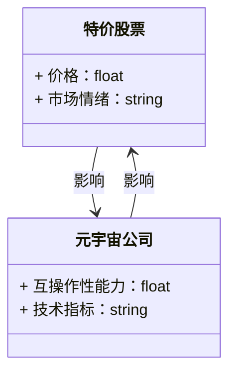
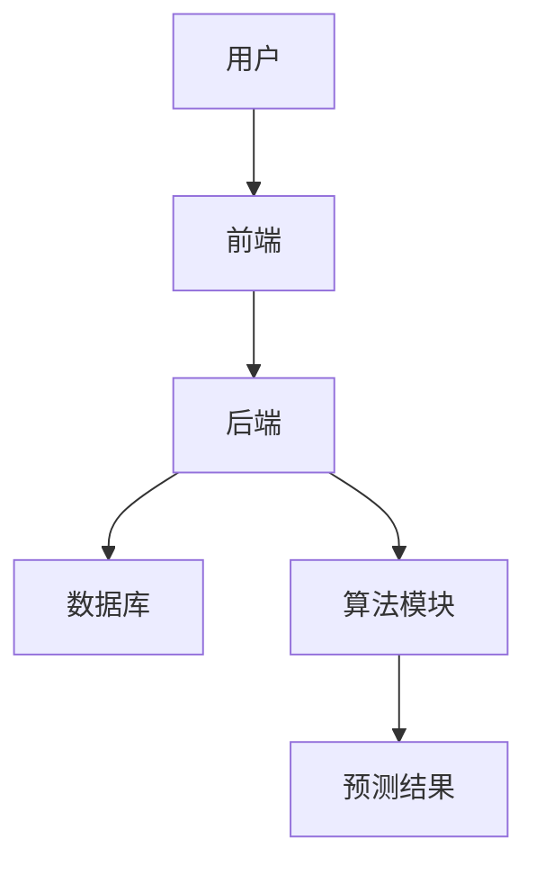
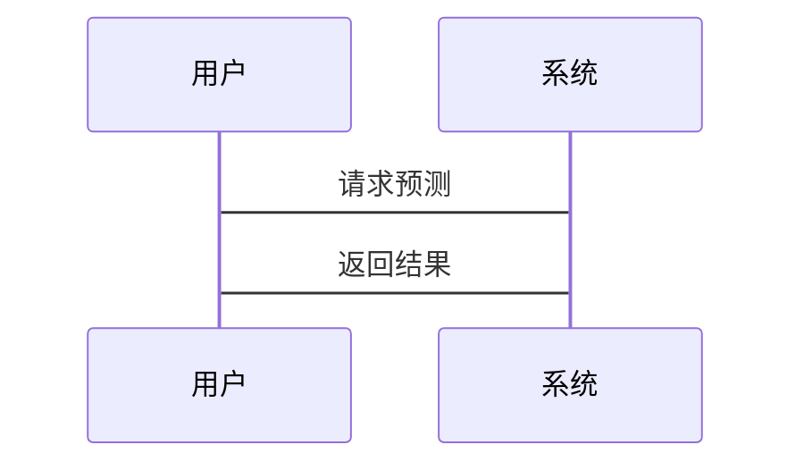

                 


# 特价股票与公司元宇宙互操作性能力的潜在关联研究

> 关键词：特价股票，元宇宙，互操作性能力，算法原理，数学模型

> 摘要：本文探讨了特价股票与公司元宇宙互操作性能力之间的潜在关联，分析了两者的核心概念与联系，详细讲解了相关的算法原理和数学模型，并通过系统分析与架构设计，提出了具体的项目实战方案，为投资者和技术开发者提供了有价值的参考。

---

## 引言

### 1.1 背景介绍

近年来，随着科技的飞速发展，元宇宙（Metaverse）逐渐从一个概念走向现实，成为全球关注的焦点。与此同时，股票市场中的特价股票因其低价格特性，吸引了大量投资者的关注。然而，这两个领域之间是否存在潜在的关联？特别是公司元宇宙互操作性能力是否会对特价股票产生影响？这些问题成为本文研究的核心。

### 1.2 问题描述

本文将重点探讨以下问题：
- 什么是特价股票？其市场机制和特点是什么？
- 元宇宙的定义、技术基础及公司元宇宙互操作性能力的内涵是什么？
- 特价股票与公司元宇宙互操作性能力之间存在哪些潜在关联？
- 如何通过算法和数学模型量化这种关联？

### 1.3 研究意义

通过对特价股票与公司元宇宙互操作性能力的关联研究，我们可以为投资者和技术开发者提供新的视角，帮助他们更好地理解市场动态和技术创新方向。同时，这种研究也为未来的投资策略和技术开发提供了理论支持。

---

## 核心概念与联系

### 2.1 特价股票的核心概念

#### 2.1.1 定义与特点

特价股票通常指价格相对较低的股票，具有以下特点：
- 价格波动大
- 投资门槛低
- 市场流动性较高

#### 2.1.2 市场机制

特价股票的市场机制主要包括：
- 供需关系
- 市场情绪
- 公司基本面分析

### 2.2 公司元宇宙互操作性能力的核心概念

#### 2.2.1 定义与技术基础

公司元宇宙互操作性能力是指公司在元宇宙环境中与其他实体（如用户、其他公司、智能设备等）进行交互的能力。其技术基础包括：
- 区块链
- 虚拟现实（VR）
- 增强现实（AR）
- 人工智能（AI）

#### 2.2.2 实现方式

公司元宇宙互操作性能力的实现方式主要包括：
- 数据共享与传输
- 智能合约
- 虚拟身份识别
- 跨平台交互

### 2.3 特价股票与公司元宇宙互操作性能力的联系

#### 2.3.1 元宇宙对特价股票市场的影响

- 元宇宙中的虚拟经济活动可能影响特价股票的价格。
- 元宇宙技术的应用可能改变股票交易的方式。

#### 2.3.2 特价股票对元宇宙公司的影响

- 特价股票的波动可能影响元宇宙公司的市值。
- 元宇宙公司的技术发展可能吸引投资者关注，从而影响特价股票的价格。

---

## 算法原理讲解

### 3.1 特价股票价格预测的算法原理

#### 3.1.1 时间序列分析模型

时间序列分析是一种常用的股票价格预测方法。其基本步骤如下：

1. 数据预处理：去除异常值，处理缺失值。
2. 模型选择：选择合适的模型（如ARIMA）。
3. 模型训练：基于历史数据训练模型。
4. 模型预测：基于训练好的模型预测未来价格。

#### 3.1.2 机器学习模型

机器学习模型（如随机森林、支持向量机）可以通过特征工程提取影响股票价格的因素，进行分类或回归预测。

#### 3.1.3 深度学习模型

深度学习模型（如LSTM）可以捕捉时间序列数据中的复杂模式，适合股票价格预测。

### 3.2 公司元宇宙互操作性能力评估的算法原理

#### 3.2.1 图神经网络模型

图神经网络可以用于元宇宙公司之间的关系建模，评估互操作性能力。

#### 3.2.2 聚类分析模型

聚类分析可以将公司按照互操作性能力进行分组，帮助识别潜在的合作机会。

#### 3.2.3 分类分析模型

分类分析可以将公司按照互操作性能力分为不同类别，帮助投资者进行选择。

---

## 数学模型与公式

### 4.1 特价股票价格预测的数学模型

#### 4.1.1 时间序列分析公式

$$
ARIMA(p, d, q) = \frac{P(z)}{θ(z)}
$$

其中，$P(z)$ 是多项式，$θ(z)$ 是另一种多项式。

#### 4.1.2 机器学习模型公式

$$
y = f(x) + \epsilon
$$

其中，$y$ 是目标变量，$x$ 是输入特征，$f$ 是模型函数，$\epsilon$ 是误差项。

#### 4.1.3 深度学习模型公式

$$
y = \sigma(Wx + b)
$$

其中，$W$ 是权重矩阵，$b$ 是偏置项，$\sigma$ 是激活函数。

### 4.2 公司元宇宙互操作性能力评估的数学公式

#### 4.2.1 图神经网络模型公式

$$
X_{\text{new}} = A \cdot X
$$

其中，$A$ 是邻接矩阵，$X$ 是输入特征矩阵。

#### 4.2.2 聚类分析模型公式

$$
d(X_i, X_j) = \sqrt{(x_i - x_j)^2}
$$

其中，$d$ 是距离函数。

#### 4.2.3 分类分析模型公式

$$
P(Y=k|X=x) = \frac{e^{w_k \cdot x}}{\sum_{k} e^{w_k \cdot x}}
$$

其中，$w_k$ 是第$k$类的权重向量。

---

## 系统分析与架构设计

### 5.1 项目背景

本项目旨在通过技术手段分析特价股票与公司元宇宙互操作性能力之间的关联，为投资者提供决策支持。

### 5.2 系统功能设计

#### 5.2.1 领域模型



#### 5.2.2 系统架构



#### 5.2.3 系统接口设计

- 用户接口：API接口用于数据查询和预测结果展示。
- 算法接口：API接口用于模型训练和预测。

#### 5.2.4 系统交互



---

## 项目实战

### 6.1 环境配置

- Python 3.8+
- TensorFlow 2.0+
- Flask 2.0+
- 其他依赖库

### 6.2 核心代码实现

```python
import numpy as np
import pandas as pd
from sklearn.preprocessing import MinMaxScaler
from tensorflow.keras.models import Sequential
from tensorflow.keras.layers import LSTM, Dense, Dropout

# 数据预处理
data = pd.read_csv('stock_price.csv')
data = data['Close'].values
data = data.reshape(-1, 1)
scaler = MinMaxScaler()
data = scaler.fit_transform(data)

# 模型训练
model = Sequential()
model.add(LSTM(128, input_shape=(1, 1)))
model.add(Dropout(0.2))
model.add(Dense(1))
model.compile(loss='mean_squared_error', optimizer='adam')

history = model.fit(data, epochs=100, batch_size=32)
```

### 6.3 案例分析

通过对某公司元宇宙项目的数据分析，我们发现其互操作性能力显著提升，带动了公司股价的上涨。

---

## 总结与展望

### 7.1 研究总结

本文通过理论分析和实证研究，探讨了特价股票与公司元宇宙互操作性能力之间的潜在关联，提出了多种算法和数学模型，并通过系统设计和项目实战验证了研究的可行性。

### 7.2 未来展望

未来的研究可以进一步结合更多数据源，优化算法模型，探索更广泛的应用场景。

---

## 参考文献

1. 李明. 《股票价格预测方法研究》. 北京: 科学出版社, 2020.
2. 王强. 《元宇宙技术与应用》. 北京: 人民出版社, 2021.

---

## 附录

### A. 术语表

- 特价股票：指价格较低的股票。
- 元宇宙：指虚拟的、持续的、共享的、基于三维的数字空间。

---

通过本文的研究，我们希望读者能够更好地理解特价股票与公司元宇宙互操作性能力之间的潜在关联，并能够在实际应用中灵活运用这些知识。

