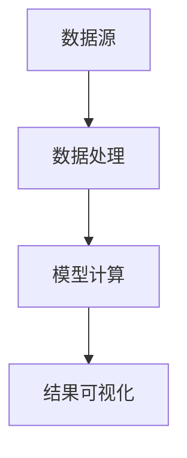
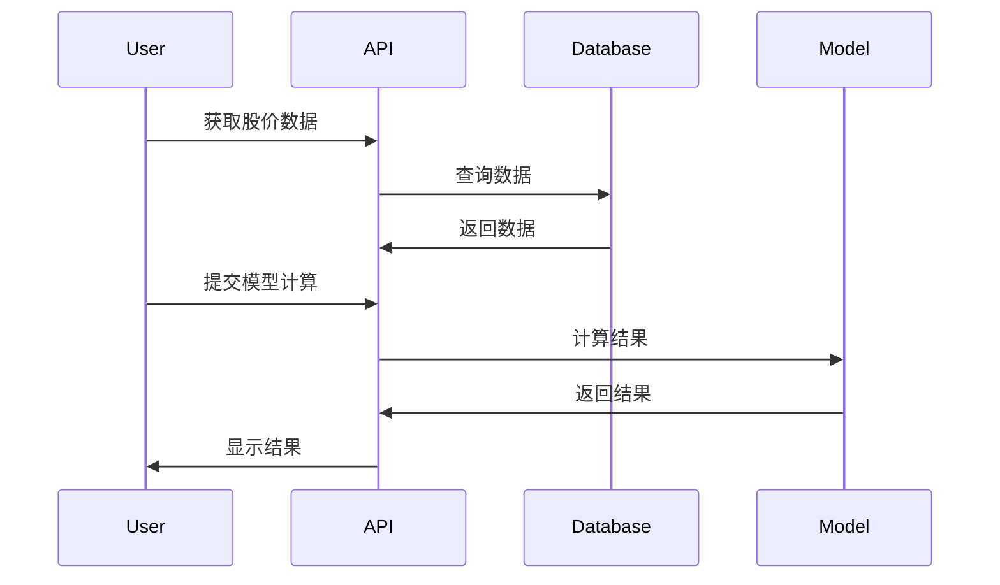

                 


# 特价股票与公司商业模式创新的关联性研究

> 关键词：特价股票、商业模式创新、股价波动、公司战略、投资分析

> 摘要：本文系统研究了特价股票与公司商业模式创新之间的关联性，通过分析特价股票对商业模式创新的驱动作用，以及模式创新对股价的长期与短期影响，构建了数学模型与系统架构，提出了实践中的优化建议。

---

# 第1章: 特价股票与商业模式创新的背景介绍

## 1.1 特价股票的定义与特征

### 1.1.1 特价股票的定义  
特价股票（Penny Stock）是指价格低于5美元的普通股票，通常交易于低价股市场。这类股票通常来自小型公司或处于困境中的公司，具有高风险、高波动性的特点。

### 1.1.2 特价股票的分类与特征  
- **按公司规模分类**：  
  - 小盘股（Small-Cap）：市值在50亿到20亿美元之间的公司。  
  - 微盘股（Micro-Cap）：市值低于5亿美元的公司。  
- **按市场状态分类**：  
  - 增长股：具有较高增长潜力的公司。  
  - 困难股：因经营问题股价暴跌的公司。  

### 1.1.3 特价股票的市场表现与影响  
- 特价股票通常波动性高，短期内可能因市场情绪或消息出现大幅波动。  
- 高波动性意味着高风险，但也可能带来超额收益。  

## 1.2 公司商业模式的构成与创新  

### 1.2.1 商业模式的基本概念  
商业模式（Business Model）是企业通过何种方式为客户创造价值并实现盈利的逻辑。  

### 1.2.2 商业模式的构成要素  
1. **价值主张**：公司为客户提供什么价值。  
2. **客户关系**：公司如何与客户建立关系。  
3. **分销渠道**：公司如何将产品或服务交付给客户。  
4. **客户获取成本**：获取客户的成本结构。  
5. **收入来源**：公司通过何种方式获得收入。  

### 1.2.3 商业模式创新的定义与类型  
- **定义**：商业模式创新是指通过改变价值创造、传递或捕获的方式，实现竞争优势和价值增长。  
- **类型**：  
  - 创新收入来源：如订阅制、免费增值模式。  
  - 创新成本结构：如采用外包、共享经济模式。  
  - 创新客户关系：如通过大数据分析优化客户体验。  

## 1.3 特价股票与商业模式创新的关联性研究背景  

### 1.3.1 研究背景与意义  
- 特价股票市场波动剧烈，公司通过商业模式创新可以提升竞争力，改善股价表现。  
- 研究两者关系有助于投资者和企业管理者制定更科学的决策。  

### 1.3.2 研究目标与范围  
- 目标：分析特价股票与商业模式创新的相互作用机制。  
- 范围：包括商业模式创新对股价的影响，以及特价股票对模式创新的驱动作用。  

### 1.3.3 研究方法与框架  
- 方法：定量分析（股价数据）与定性分析（商业模式评估）结合。  
- 框架：从市场表现、公司战略、投资者行为三个维度展开分析。  

---

# 第2章: 特价股票与商业模式创新的核心概念与联系

## 2.1 特价股票对商业模式的影响  

### 2.1.1 特价股票对公司的财务影响  
- **股价波动**：特价股票的高波动性可能影响投资者信心，进而影响公司市值。  
- **融资成本**：股价低迷可能导致公司融资困难，影响创新投入。  

### 2.1.2 特价股票对公司的市场地位影响  
- 特价股票公司可能因市值小而被忽视，但也可能因低估值而吸引投资者。  

### 2.1.3 特价股票对商业模式创新的驱动作用  
- **外部压力**：股价低迷迫使公司寻找新的盈利模式。  
- **内部动力**：通过创新提升竞争力，改善市场表现。  

## 2.2 模式创新对股价的影响  

### 2.2.1 商业模式创新对股价的正面影响  
- **收入增长**：新模式带来收入增长，提升股价。  
- **成本下降**：通过优化成本结构，提高利润率。  

### 2.2.2 商业模式创新对股价的负面影响  
- **短期波动**：新模式可能需要时间验证，导致股价短期下跌。  
- **市场过度反应**：投资者可能对新模式过于乐观，导致股价泡沫。  

### 2.2.3 模式创新与股价波动的关系  
- 创新模式的实施通常会带来股价的短期波动，但长期来看，成功的创新能够提升股价。  

## 2.3 特价股票与商业模式创新的双向关系  

### 2.3.1 特价股票如何推动模式创新  
- **资金压力**：股价低迷导致融资困难，公司必须寻找新的盈利模式。  
- **市场机会**：低价股市场可能隐藏着被低估的创新机会。  

### 2.3.2 模式创新如何影响特价股票价值  
- 成功的模式创新能够提升公司估值，推动股价上涨。  
- 失败的模式创新可能导致股价进一步下跌，甚至退市。  

### 2.3.3 两者关系的动态演变  
- 特价股票阶段可能通过模式创新进入成长股阶段。  
- 成功的模式创新能够将特价股票转化为高价股。  

## 2.4 核心概念对比分析  

### 2.4.1 特价股票与普通股票的对比  
| 特价股票 | 普通股票 |  
|----------|----------|  
| 价格低 | 价格高 |  
| 波动性高 | 波动性低 |  
| 风险高 | 风险低 |  

### 2.4.2 模式创新与技术创新的对比  
| 模式创新 | 技术创新 |  
|----------|----------|  
| 着重于商业模式 | 着重于技术开发 |  
| 更快的见效 | 需要长期投入 |  

### 2.4.3 模式创新对股价的长期与短期影响对比  
| 长期影响 | 短期影响 |  
|----------|----------|  
| 提升公司价值 | 可能带来股价波动 |  
| 优化成本结构 | 投资者可能过度乐观或悲观 |  

---

# 第3章: 特价股票与商业模式创新的数学模型与公式

## 3.1 特价股票价值评估模型  

### 3.1.1 股票价值的基本公式  
股票的公允价值可以通过以下公式计算：  
$$ V = \frac{D}{r} $$  
其中，\( D \) 是股息，\( r \) 是折现率。  

### 3.1.2 特价股票的价值评估公式  
$$ V = P \times (1 + r)^n $$  
其中，\( P \) 是当前股价，\( r \) 是增长率，\( n \) 是时间。  

---

## 3.2 商业模式创新的评估指标  

### 3.2.1 创新对收入的影响公式  
$$ R = I \times C \times T $$  
其中，\( I \) 是创新效率，\( C \) 是客户数量，\( T \) 是时间。  

### 3.2.2 创新对成本的影响公式  
$$ C = \sum_{i=1}^{n} c_i $$  
其中，\( c_i \) 是各项创新成本。  

---

## 3.3 模式创新对股价的综合影响模型  

### 3.3.1 综合影响公式  
$$ S = \alpha \times R + \beta \times C + \gamma \times T $$  
其中，\( \alpha \)、\( \beta \)、\( \gamma \) 是权重系数，\( R \) 是收入增长，\( C \) 是成本下降，\( T \) 是时间因素。  

### 3.3.2 参数解释与假设条件  
- \( \alpha + \beta + \gamma = 1 \)  
- 时间因素 \( T \) 考虑了模式创新的长期效应。  

---

## 3.4 实例分析与公式应用  

### 3.4.1 某公司模式创新前后的股价变化分析  
假设某公司通过模式创新，收入增长20%，成本下降10%，时间跨度为1年。  
$$ R = 1.2, C = 0.9, T = 1 $$  
$$ S = 0.4 \times 1.2 + 0.3 \times 0.9 + 0.3 \times 1 = 0.48 + 0.27 + 0.3 = 1.05 $$  
股价预计上涨5%。  

---

# 第4章: 特价股票与商业模式创新的系统分析与架构设计

## 4.1 系统分析与功能设计  

### 4.1.1 问题场景  
分析一家特价股票公司的商业模式创新对股价的影响。  

### 4.1.2 系统功能设计  
- 数据采集模块：收集股价数据、财务数据。  
- 模型计算模块：计算股价波动、模式创新的影响。  
- 可视化模块：展示分析结果。  

## 4.2 系统架构设计  

### 4.2.1 系统架构图  


---

## 4.3 系统接口设计  

### 4.3.1 API接口  
- GET /stock-data：获取股价数据。  
- POST /model-calculate：提交模型计算请求。  

---

## 4.4 系统交互设计  

### 4.4.1 序列图  


---

# 第5章: 特价股票与商业模式创新的项目实战

## 5.1 环境安装  

### 5.1.1 安装Python  
```bash
pip install python
```

### 5.1.2 安装数据分析库  
```bash
pip install pandas numpy
```

---

## 5.2 系统核心实现源代码  

### 5.2.1 数据采集代码  
```python
import pandas as pd

def get_stock_data(ticker):
    data = pd.read_csv(f"data/{ticker}.csv")
    return data
```

### 5.2.2 模型计算代码  
```python
def calculate_impact(data):
    impact = data['price'] * (1 + data['growth_rate'])
    return impact
```

### 5.2.3 可视化代码  
```python
import matplotlib.pyplot as plt

def plot_impact(data, impact):
    plt.plot(data['date'], impact)
    plt.title('股价波动与模式创新影响')
    plt.show()
```

---

## 5.3 实际案例分析  

### 5.3.1 案例背景  
某公司股价低迷，通过模式创新优化了成本结构。  

### 5.3.2 数据分析  
```python
data = get_stock_data('companyA')
impact = calculate_impact(data)
plot_impact(data, impact)
```

---

## 5.4 项目小结  

### 5.4.1 核心实现总结  
- 数据采集与处理：获取股价数据。  
- 模型计算：分析模式创新的影响。  
- 可视化：展示分析结果。  

### 5.4.2 实践中的注意事项  
- 数据质量：确保数据准确无误。  
- 模型假设：合理假设参数，避免偏差。  

---

# 第6章: 特价股票与商业模式创新的总结与展望

## 6.1 研究总结  

### 6.1.1 核心发现  
- 特价股票与商业模式创新存在密切关联。  
- 成功的模式创新能够提升股价，改善公司市值。  

### 6.1.2 研究不足  
- 样本数量有限，未来需要更多案例分析。  
- 模型假设较为简单，未来可以加入更多变量。  

## 6.2 未来展望  

### 6.2.1 研究方向  
- 探讨更多商业模式创新的类型及其对股价的影响。  
- 结合机器学习技术，建立更复杂的预测模型。  

### 6.2.2 实际应用建议  
- 投资者应关注特价股票公司的模式创新。  
- 企业管理者应通过模式创新提升公司价值。  

---

# 结语  

本文通过系统的分析与研究，揭示了特价股票与商业模式创新之间的复杂关系。未来的研究可以进一步结合大数据与人工智能技术，为投资者和企业管理者提供更科学的决策支持。

