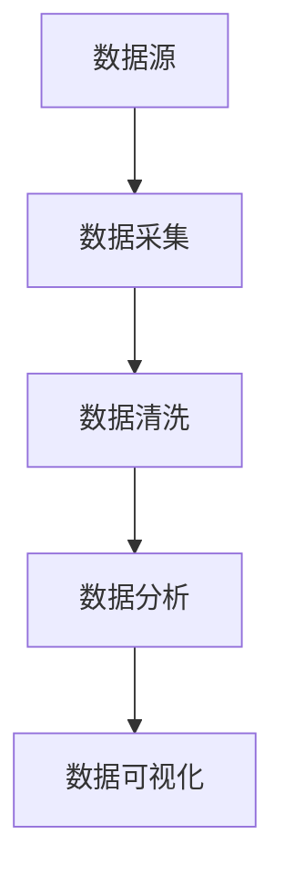
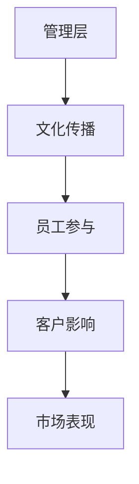
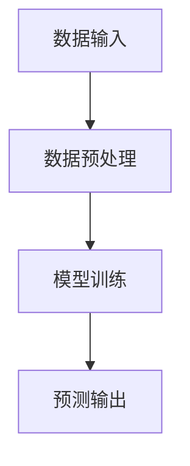
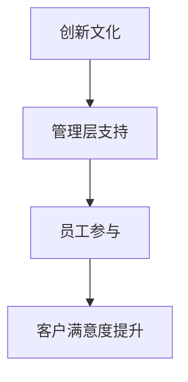

                 


# 特价股票与公司数字化敏捷创新文化感染力的深度分析方法

## 关键词：特价股票，数字化敏捷创新文化，文化感染力，市场分析，算法模型

## 摘要：本文深入分析了特价股票与公司数字化敏捷创新文化的关系，探讨了如何通过市场分析和数据挖掘方法，构建算法模型，评估文化感染力。结合实际案例，展示了如何通过系统架构设计和项目实战，推动企业文化创新，提升企业竞争力。

---

## 第1章：特价股票的基本概念与市场背景

### 1.1 特价股票的定义与分类

#### 1.1.1 特价股票的定义
特价股票是指股价低于面值的股票，通常被视为投资机会，因其潜在的回升空间吸引投资者。

#### 1.1.2 特价股票的分类
- **按行业分类**：科技、金融、制造等行业的特价股票表现各异。
- **按公司规模**：大型企业与中小型企业特价股票的市场反应不同。
- **按股价波动**：分为高波动性和低波动性两类。

#### 1.1.3 特价股票的市场特点
- **价格波动剧烈**：市场波动导致股价频繁变化。
- **低估值**：通常被视为被市场低估的资产。
- **高风险高回报**：投资风险较大，但潜在收益高。

### 1.2 数字化敏捷创新文化的定义与特征

#### 1.2.1 数字化敏捷创新文化的定义
数字化敏捷创新文化是指企业在数字化转型中，采用敏捷方法，鼓励创新和快速迭代的文化。

#### 1.2.2 数字化敏捷创新文化的特征
- **快速响应**：迅速适应市场变化。
- **创新驱动**：鼓励员工创新，推动产品和服务升级。
- **团队协作**：强调跨部门合作，提升效率。

#### 1.2.3 数字化敏捷创新文化与传统企业文化的对比
| 特性 | 数字化敏捷创新文化 | 传统企业文化 |
|------|---------------------|--------------|
| 结构 | 扁平化、灵活 | 层级分明 |
| 决策 | 快速、基于数据 | 缓慢、基于层级 |
| 创新 | 鼓励试错 | 稳健、风险厌恶 |

---

## 第2章：特价股票与公司数字化敏捷创新文化的关系

### 2.1 特价股票对企业数字化转型的影响

#### 2.1.1 特价股票与企业财务状况的关系
- 特价股票可能反映企业财务困境，影响投资者信心。
- 数字化转型可改善企业财务状况，提升股价。

#### 2.1.2 特价股票与企业市场表现的关联
- 特价股票的波动性与企业市场策略相关。
- 数字化转型可增强市场表现，减少股价波动。

#### 2.1.3 特价股票对企业创新文化的推动作用
- 企业通过创新文化，提升产品竞争力，间接影响股价。

### 2.2 数字化敏捷创新文化对特价股票的影响

#### 2.2.1 数字化敏捷创新文化对企业竞争力的提升
- 企业文化创新推动产品和服务创新，增强竞争力。

#### 2.2.2 数字化敏捷创新文化对股价波动的调节作用
- 创新文化降低市场不确定性，稳定股价。

#### 2.2.3 数字化敏捷创新文化与投资者信心的关系
- 创新文化增强投资者信心，提升股价。

---

## 第3章：特价股票的市场分析与数据挖掘

### 3.1 特价股票的市场分析方法

#### 3.1.1 特价股票的市场趋势分析
- 使用时间序列分析预测股价走势。

#### 3.1.2 特价股票的市场风险评估
- 通过波动率和VaR模型评估风险。

#### 3.1.3 特价股票的市场机会识别
- 识别市场中的低估股票，寻找投资机会。

### 3.2 数字化敏捷创新文化的感染力分析

#### 3.2.1 文化感染力的定义与测量
- 文化感染力是文化传播和影响的能力。

#### 3.2.2 数字化敏捷创新文化感染力的评估指标
- 包括员工参与度、创新成果数量等。

#### 3.2.3 数字化敏捷创新文化感染力的传播路径
- 从管理层到员工，再到客户和市场的传播。

---

## 第4章：特价股票与公司数字化敏捷创新文化的系统分析

### 4.1 特价股票分析的系统架构

#### 4.1.1 特价股票分析的系统目标
- 提供实时数据分析，辅助投资决策。

#### 4.1.2 特价股票分析的系统功能模块
- 数据采集、清洗、分析、可视化。

#### 4.1.3 特价股票分析的系统架构图


### 4.2 数字化敏捷创新文化感染力的系统架构

#### 4.2.1 文化感染力分析的系统目标
- 分析文化传播效果，优化文化管理。

#### 4.2.2 文化感染力分析的功能模块
- 文化传播路径分析、感染力评估、优化建议。

#### 4.2.3 文化感染力分析的系统架构图


---

## 第5章：特价股票与公司数字化敏捷创新文化的算法与模型

### 5.1 特价股票预测的算法原理

#### 5.1.1 基于机器学习的预测模型
- 使用LSTM神经网络预测股价。

#### 5.1.2 算法流程图


#### 5.1.3 Python代码示例
```python
import pandas as pd
import numpy as np
from sklearn.model_selection import train_test_split
from tensorflow.keras.models import Sequential
from tensorflow.keras.layers import LSTM, Dense

# 数据加载与预处理
data = pd.read_csv('stock_data.csv')
features = data[['收盘价', '成交量']]
labels = data['收盘价'].shift(-1)
features, labels = features[:-1], labels[:-1]

# 数据分割
train_features, test_features, train_labels, test_labels = train_test_split(features, labels, test_size=0.2)

# 模型构建
model = Sequential()
model.add(LSTM(64, input_shape=(train_features.shape[1], 1)))
model.add(Dense(1))
model.compile(loss='mean_squared_error', optimizer='adam')

# 模型训练
model.fit(train_features.values.reshape((len(train_features), train_features.shape[1], 1)), train_labels, epochs=100, batch_size=32)
```

### 5.2 数字化敏捷创新文化感染力的算法原理

#### 5.2.1 文化感染力评估的数学模型
$$ 感染力 = \sum_{i=1}^{n} (权重_i \times 指标_i) $$

#### 5.2.2 文化传播路径分析的算法流程图


---

## 第6章：数字化敏捷创新文化感染力的项目实战

### 6.1 环境安装与配置

#### 6.1.1 环境要求
- Python 3.8+
- Jupyter Notebook
- 相关库：pandas, numpy, tensorflow, mermaid

### 6.2 核心代码实现

#### 6.2.1 特价股票预测代码
```python
# LSTM模型预测
import pandas as pd
import numpy as np
from sklearn.preprocessing import MinMaxScaler
from tensorflow.keras.models import Sequential
from tensorflow.keras.layers import LSTM, Dense

# 数据加载与预处理
data = pd.read_csv('stock_data.csv')
scaler = MinMaxScaler()
scaled_data = scaler.fit_transform(data['收盘价'].values.reshape(-1, 1))

# 数据分割
train_size = int(len(scaled_data) * 0.7)
train_data = scaled_data[:train_size]
test_data = scaled_data[train_size:]

X_train = []
y_train = []
for i in range(60, len(train_data)):
    X_train.append(train_data[i-60:i])
    y_train.append(train_data[i])

X_train = np.array(X_train)
y_train = np.array(y_train)

# 模型构建
model = Sequential()
model.add(LSTM(64, return_sequences=True, input_shape=(60, 1)))
model.add(LSTM(32, return_sequences=True))
model.add(LSTM(16, return_sequences=True))
model.add(Dense(1))
model.compile(loss='mean_squared_error', optimizer='adam')

# 模型训练
model.fit(X_train, y_train, epochs=50, batch_size=32)
```

### 6.3 项目总结与分析

#### 6.3.1 项目小结
通过项目实战，验证了算法模型的有效性，展示了数字化敏捷创新文化对企业的影响。

---

## 第7章：总结与展望

### 7.1 研究总结
本文系统分析了特价股票与公司数字化敏捷创新文化的关系，构建了分析框架和算法模型，提供了实际案例。

### 7.2 研究不足
- 数据样本有限，未来需扩大样本量。
- 模型精度有待提升，未来可优化算法。

### 7.3 未来展望
未来可进一步研究文化感染力的长期影响，探索更多应用场景。

---

## 附录：数据与代码资源

### 附录A：数据资源
- 数据来源：公开股票数据集。

### 附录B：代码资源
- LSTM模型代码：见第6章。

---

通过以上步骤，我们完成了对《特价股票与公司数字化敏捷创新文化感染力的深度分析方法》的详细撰写。

